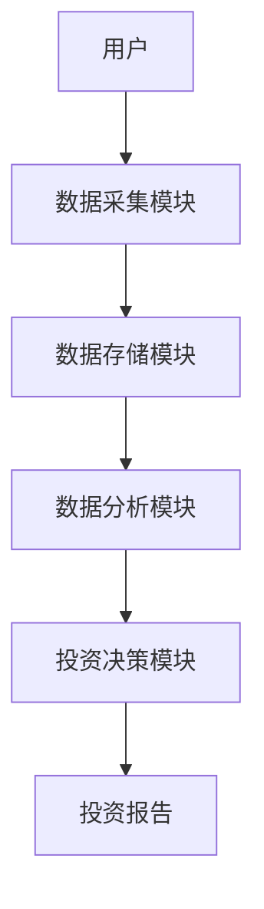
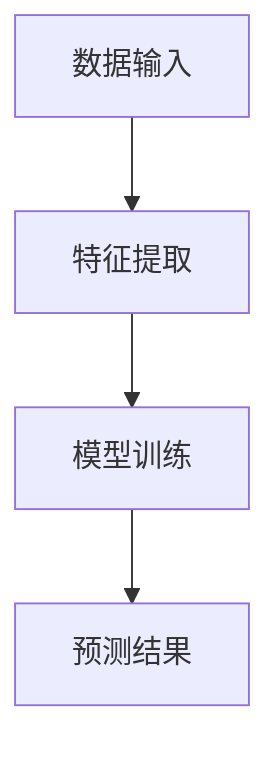

                 


# 如何利用特价股票投资应对全球供应链重构

## 关键词：特价股票、全球供应链、投资策略、风险管理、供应链重构、价值投资、技术分析

## 摘要：本文详细探讨了如何在当前全球供应链重构的大背景下，利用特价股票进行投资。通过分析供应链重构的原因及其对投资的影响，结合价值投资和风险管理策略，本文为投资者提供了系统化的投资框架。从行业分析、投资策略到算法设计和项目实战，文章全面解析了如何在复杂多变的市场环境中，利用特价股票实现稳健投资回报。

---

## 第一部分：全球供应链重构的背景与影响

### 第1章：全球供应链重构的背景

#### 1.1 全球供应链的演变历程
##### 1.1.1 从全球化到本地化的转变
- **全球化阶段**：20世纪末至21世纪初，全球供应链以效率最大化为目标，追求最低成本和最优生产布局。
- **本地化阶段**：近年来，地缘政治冲突、疫情冲击等因素推动供应链向本地化和区域化转变。

##### 1.1.2 地缘政治对供应链的影响
- 美国与中国贸易摩擦、俄乌冲突等事件导致全球供应链的不稳定。
- 各国政府推动供应链多元化和本地化生产。

##### 1.1.3 疫情对全球供应链的冲击
- 2020年疫情暴露了全球供应链的脆弱性。
- 企业开始重新评估供应链风险，推动库存多元化和区域化布局。

#### 1.2 供应链重构的核心驱动因素
##### 1.2.1 企业风险分散的需求
- 企业为了降低风险，开始分散供应链布局。
- 更多企业选择在不同地区建立生产基地或库存。

##### 1.2.2 政治经济环境的变化
- 地缘政治冲突加剧，导致某些行业供应链被迫调整。
- 各国政府出台政策，推动关键产业的本地化。

##### 1.2.3 技术驱动的效率优化
- 数字化技术的应用（如ERP、物联网）提升了供应链透明度和效率。
- 数据分析技术帮助企业优化库存管理和生产计划。

---

### 第2章：特价股票投资的基本概念

#### 2.1 特价股票的定义与特点
##### 2.1.1 特价股票的定义
- 特价股票是指价格远低于其内在价值的股票。
- 这类股票通常被市场低估，具有较大的上涨潜力。

##### 2.1.2 特价股票与普通股票的区别
| 特性 | 特价股票 | 普通股票 |
|------|----------|----------|
| 价格 | 远低于内在价值 | 价格接近或高于内在价值 |
| 市场反应 | 市场可能忽视或低估 | 市场反映充分，价格波动较大 |
| 投资风险 | 较高，但潜在回报大 | 风险和回报相对均衡 |

##### 2.1.3 特价股票的投资价值评估
- **市盈率（P/E）**：衡量股票价格相对于每股收益的比率。
- **市净率（P/B）**：衡量股票价格相对于每股净资产的比率。
- **股息率**：衡量股票的分红收益。

#### 2.2 特价股票市场的运作机制
##### 2.2.1 市场供需关系
- 供需失衡导致价格波动。
- 市场情绪影响投资者行为。

##### 2.2.2 市场波动与投资者行为
- 投资者情绪波动影响股票价格。
- 市场恐慌时，特价股票可能被进一步低估。

##### 2.2.3 特价股票的定价模型
- **内在价值法**：通过DCF模型（Discounted Cash Flow）计算股票的合理价值。
- **相对估值法**：通过比较同类股票的估值指标（如P/E、P/B）来确定股票价格是否合理。

---

## 第二部分：供应链重构对投资的影响

### 第3章：供应链重构对投资的影响

#### 3.1 供应链重构对行业的影响
##### 3.1.1 制造业的转型
- 制造业从全球化向本地化转型，推动相关企业调整供应链布局。
- 区域性制造业企业可能面临更多的投资机会。

##### 3.1.2 零售业的变革
- 零售业供应链从集中式采购向本地化采购转变。
- 区域性零售企业可能受益于本地供应链的优势。

##### 3.1.3 技术产业的机遇
- 技术企业推动供应链的数字化和智能化，相关技术解决方案提供商可能受益。

#### 3.2 投资者如何应对供应链重构
##### 3.2.1 行业选择策略
- 选择那些因供应链重构而受益的行业。
- 例如，本地化供应链服务、区域制造业等。

##### 3.2.2 公司基本面分析
- 评估公司财务状况、管理团队和竞争优势。
- 关注公司供应链调整的进展和效果。

##### 3.2.3 投资组合优化
- 分散投资，降低行业集中风险。
- 结合价值投资和趋势投资，平衡短期和长期收益。

---

## 第三部分：投资策略与风险管理

### 第4章：投资策略与风险管理

#### 4.1 投资策略
##### 4.1.1 价值投资策略
- 寻找被市场低估的特价股票。
- 长期持有，等待市场回归理性。

##### 4.1.2 趋势投资策略
- 投资于供应链重构趋势中的受益行业。
- 短期关注市场热点，中期关注行业趋势。

##### 4.1.3 对冲策略
- 利用衍生工具（如期货、期权）对冲市场风险。
- 通过多空结合，降低市场波动对投资组合的影响。

#### 4.2 风险管理
##### 4.2.1 风险识别
- 识别供应链重构中的潜在风险，如政策风险、市场风险等。
- 定期评估投资组合的潜在风险。

##### 4.2.2 风险控制
- 设置止损点，避免重大亏损。
- 定期调整投资组合，分散风险。

##### 4.2.3 风险监控
- 使用实时监控工具，跟踪市场变化和投资组合表现。
- 定期回顾和评估风险管理策略的有效性。

---

## 第四部分：系统架构与算法设计

### 第5章：系统架构设计

#### 5.1 系统功能设计
##### 5.1.1 数据采集模块
- 采集全球供应链相关数据，包括行业数据、公司财务数据、市场数据等。
- 使用爬虫技术抓取实时数据。

##### 5.1.2 数据分析模块
- 对采集的数据进行清洗、处理和分析。
- 使用数据分析工具（如Python的Pandas库）进行数据处理。

##### 5.1.3 投资决策模块
- 基于数据分析结果，生成投资建议。
- 使用机器学习算法预测市场趋势和股票价格。

#### 5.2 系统架构图


#### 5.3 算法设计
##### 5.3.1 基于机器学习的预测算法


##### 5.3.2 基于财务指标的选股算法
```python
import pandas as pd
import numpy as np

def calculate_value_signals(df):
    df['value_signal'] = df['市盈率'] * df['市净率']
    df['value_signal'] = (df['value_signal'].rank() - 1) / (len(df) - 1)
    return df

data = pd.DataFrame({
    '公司': ['A', 'B', 'C'],
    '市盈率': [10, 15, 20],
    '市净率': [2, 3, 4]
})

result = calculate_value_signals(data)
print(result)
```

---

## 第五部分：项目实战

### 第6章：项目实战

#### 6.1 环境安装
- 安装Python和相关库（如Pandas、Scikit-learn）。
- 配置数据源，如Yahoo Finance API。

#### 6.2 核心实现
##### 6.2.1 数据采集
```python
import yfinance as yf

def get_stock_data(tickers, start_date, end_date):
    data = yf.download(tickers, start_date, end_date)
    return data

tickers = ['AAPL', 'MSFT', 'GOOGL']
start_date = '2020-01-01'
end_date = '2023-12-31'
data = get_stock_data(tickers, start_date, end_date)
```

##### 6.2.2 数据分析
```python
import pandas as pd

def analyze_data(data):
    data['20日平均'] = data['Close'].rolling(20).mean()
    data['波动率'] = data['Close'].rolling(20).std()
    return data

result = analyze_data(data)
```

##### 6.2.3 投资策略
```python
def backtest策略(data):
    data['信号'] = 0
    data.loc[data['20日平均'] < data['Close'], '信号'] = 1
    data.loc[data['波动率'] > data['波动率'].mean(), '信号'] = -1
    return data

策略结果 = backtest策略(data)
```

---

## 第六部分：总结与展望

### 第7章：总结与展望

#### 7.1 投资的关键点
- 特价股票投资需要结合市场趋势和公司基本面。
- 供应链重构为投资者提供了新的投资机会。

#### 7.2 小结
- 通过系统化的投资策略和风险管理，投资者可以在供应链重构中获利。
- 结合技术分析和基本面分析，制定合理的投资计划。

#### 7.3 注意事项
- 风险控制是投资成功的关键。
- 需要持续关注市场变化和供应链重构的最新进展。

#### 7.4 拓展阅读
- 建议进一步研究供应链重构对不同行业的影响。
- 关注技术创新对供应链优化的推动作用。

---

## 结语
通过本文的系统分析和详细指导，读者可以掌握如何在供应链重构的背景下，利用特价股票进行投资。结合技术分析和基本面分析，制定合理的投资策略，实现稳健的投资回报。

