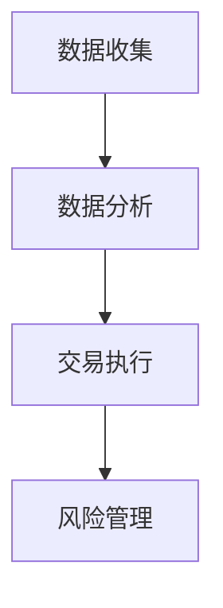

                 


# 如何利用特价股票投资应对全球经济不确定性

## 关键词
- 特价股票
- 全球经济不确定性
- 投资策略
- 风险管理
- 价值投资
- 市场分析
- 投资心态

## 摘要
在全球经济不确定性增加的背景下，投资特价股票成为一种有效的策略。本文将深入探讨特价股票的核心概念、市场分析、投资策略、风险管理以及心理因素，帮助投资者在波动的市场中抓住机会、规避风险。

---

## 第一部分：引言

### 第1章：引言

#### 1.1 全球经济不确定性与投资策略
##### 1.1.1 全球经济不确定性概述
全球经济的不确定性主要源于经济周期波动、地缘政治冲突、疫情冲击、通货膨胀等多重因素。这些因素导致市场波动加剧，投资者面临更大的挑战。

##### 1.1.2 投资在经济不确定性中的重要性
在经济不确定性下，投资者需要灵活调整策略，寻找能够抵御风险的投资标的。特价股票作为一种高潜力、低估值的投资工具，成为许多投资者的首选。

##### 1.1.3 特价股票投资的定义与目标
特价股票是指价格低于其内在价值的股票，通常具有较高的上涨潜力。投资目标是通过捕捉市场低估的机会，实现超额收益。

---

#### 1.2 本书的目标读者与方法论
##### 1.2.1 目标读者
本书适合对股票投资感兴趣、希望在不确定市场中寻找机会的投资者，尤其是那些希望利用特价股票进行投资的人群。

##### 1.2.2 本书的方法论
本书采用理论与实践相结合的方式，通过分析市场、策略、案例等方式，帮助读者掌握特价股票投资的核心方法。

##### 1.2.3 本书的结构安排
本书分为引言、核心概念、市场分析、投资策略、风险管理、心理因素、系统设计、项目实战和总结展望等部分，结构清晰，内容全面。

---

## 第二部分：特价股票的核心概念

### 第2章：特价股票的核心概念
#### 2.1 特价股票的定义与特点
##### 2.1.1 特价股票的定义
特价股票是指市场价格低于其内在价值的股票，通常具有较高的上涨潜力。

##### 2.1.2 特价股票的特点
- **低估值**：市场价格低于行业平均水平或历史平均水平。
- **高潜力**：公司基本面良好，未来增长潜力大。
- **波动性**：价格波动较大，短期内可能被市场忽视。

##### 2.1.3 特价股票与传统股票的对比
| 特性       | 特价股票               | 传统股票               |
|------------|------------------------|------------------------|
| 估值       | 低于行业平均水平       | 接近或高于行业平均水平 |
| 波动性      | 较高                   | 较低                   |
| 上涨潜力    | 较高                   | 较低                   |

---

#### 2.2 特价股票的核心要素
##### 2.2.1 公司基本面分析
- **财务状况**：关注公司盈利能力、资产负债率、现金流等指标。
- **行业地位**：公司是否为行业龙头或具有竞争优势。

##### 2.2.2 市场情绪分析
- **市场关注度**：通过新闻、社交媒体等渠道，分析市场对公司的关注度。
- **投资者情绪**：通过成交量、资金流向等指标，判断市场情绪。

##### 2.2.3 技术分析
- **价格走势**：通过K线图、均线等技术指标，判断股票的买卖信号。
- **成交量分析**：成交量是价格走势的确认指标。

---

#### 2.3 选择特价股票的策略
##### 2.3.1 价值投资策略
- **寻找低估公司**：通过市盈率、市净率等指标，寻找价格低于内在价值的公司。
- **长期持有**：买入后长期持有，等待市场回归理性。

##### 2.3.2 趋势投资策略
- **顺势而为**：通过技术分析，寻找价格处于上升趋势的股票。
- **顺势介入**：在价格突破关键阻力位时买入。

##### 2.3.3 套利机会
- **市场套利**：利用不同市场或时间的价格差异，进行套利操作。
- **跨市场套利**：在不同市场之间寻找价格差异，进行低买高卖。

---

## 第三部分：市场分析与经济周期

### 第3章：市场分析与经济周期
#### 3.1 全球经济周期对股票市场的影响
##### 3.1.1 经济周期的定义
经济周期包括复苏、繁荣、衰退和萧条四个阶段。

##### 3.1.2 经济周期对股票市场的影响
- **复苏阶段**：市场逐渐复苏，股票价格逐渐回升。
- **繁荣阶段**：市场 overheating，股票价格可能过高。
- **衰退阶段**：市场下跌，股票价格大幅波动。
- **萧条阶段**：市场底部，股票价格可能达到最低点。

##### 3.1.3 经济指标分析
| 指标       | 定义                     | 影响                   |
|------------|--------------------------|------------------------|
| GDP        | 国民生产总值             | 经济增长的核心指标     |
| 失业率      | 失业人口比例             | 经济健康的重要指标     |
| 消费者价格指数（CPI） | 通胀水平指标           | 影响货币政策和市场情绪 |

---

#### 3.2 市场周期判断
##### 3.2.1 市场周期判断方法
- **技术分析**：通过K线图、均线等技术指标判断市场周期。
- **基本面分析**：通过经济指标、行业趋势等判断市场周期。

##### 3.2.2 判断市场周期的重要性
- **投资决策**：判断市场周期有助于制定投资策略。
- **风险管理**：在不同市场周期中，风险水平不同，需调整投资组合。

---

## 第四部分：投资策略

### 第4章：投资策略
#### 4.1 价值投资策略
##### 4.1.1 价值投资的定义
价值投资是指寻找市场价格低于内在价值的股票，长期持有，等待市场回归理性。

##### 4.1.2 价值投资的实施步骤
1. **基本面分析**：分析公司的财务状况、行业地位等。
2. **估值指标计算**：计算市盈率、市净率等指标。
3. **买入并持有**：买入低估股票，长期持有。

##### 4.1.3 价值投资的优缺点
- **优点**：风险较低，收益稳定。
- **缺点**：需要较长的持有时间，期间可能面临市场波动。

---

#### 4.2 趋势投资策略
##### 4.2.1 趋势投资的定义
趋势投资是指通过技术分析，寻找价格处于上升趋势的股票，顺势介入。

##### 4.2.2 趋势投资的实施步骤
1. **技术分析**：分析K线图、均线等技术指标。
2. **寻找趋势股票**：找到价格处于上升趋势的股票。
3. **顺势介入**：在价格突破关键阻力位时买入。

##### 4.2.3 趋势投资的优缺点
- **优点**：收益较高，操作灵活。
- **缺点**：风险较高，需要较强的市场敏感性。

---

#### 4.3 套利机会
##### 4.3.1 套利机会的定义
套利是指利用不同市场或时间的价格差异，进行低买高卖，赚取无风险利润。

##### 4.3.2 套利机会的实施步骤
1. **寻找价格差异**：通过不同市场或时间的价格差异，找到套利机会。
2. **实施套利操作**：在低价市场买入，高价市场卖出。

##### 4.3.3 套利机会的优缺点
- **优点**：收益无风险或低风险。
- **缺点**：操作复杂，需要较高的市场敏感性。

---

## 第五部分：风险管理

### 第5章：风险管理
#### 5.1 风险评估与管理
##### 5.1.1 风险评估方法
- **VaR模型**：Value at Risk，计算投资组合的最大损失。
- **波动率分析**：通过波动率判断市场的风险水平。

##### 5.1.2 风险管理策略
- **分散投资**：通过投资不同行业、不同市场的股票，分散风险。
- **止损策略**：设置止损点，避免重大损失。

---

#### 5.2 心理风险管理
##### 5.2.1 投资者心理分析
- **贪婪与恐惧**：投资者在市场上涨时容易贪婪，市场下跌时容易恐惧。
- **情绪控制**：通过心理调节，克服贪婪与恐惧。

##### 5.2.2 投资心态的培养
- **理性决策**：避免情绪化决策，坚持逻辑分析。
- **耐心与纪律**：严格执行投资计划，避免盲目操作。

---

## 第六部分：心理因素与投资心态

### 第6章：心理因素与投资心态
#### 6.1 投资者心理分析
##### 6.1.1 心理偏差
- **确认偏差**：投资者倾向于寻找支持自己观点的信息，忽视相反信息。
- **损失厌恶**：投资者对损失的厌恶程度高于对收益的追求。

##### 6.1.2 心理偏差对投资决策的影响
- **过度自信**：投资者可能高估自己的能力，导致决策失误。
- **从众心理**：投资者可能盲目跟随市场潮流，导致决策错误。

---

#### 6.2 投资心态的培养
##### 6.2.1 理性决策
- **逻辑分析**：通过逻辑分析，避免情绪化决策。
- **数据驱动**：通过数据驱动决策，减少主观判断。

##### 6.2.2 耐心与纪律
- **耐心等待**：等待市场回归理性，避免盲目操作。
- **纪律执行**：严格执行投资计划，避免偏离目标。

---

## 第七部分：系统设计与量化分析

### 第7章：系统设计与量化分析
#### 7.1 投资系统设计
##### 7.1.1 系统架构
- **数据收集**：收集市场数据，包括价格、成交量等。
- **数据分析**：通过算法分析数据，寻找投资机会。
- **交易执行**：根据分析结果，执行交易。

##### 7.1.2 系统设计图


---

#### 7.2 量化分析
##### 7.2.1 量化分析的定义
量化分析是指通过数学模型和算法，分析市场数据，寻找投资机会。

##### 7.2.2 量化分析的实现步骤
1. **数据收集**：收集市场数据，包括价格、成交量等。
2. **模型构建**：构建数学模型，分析数据。
3. **策略制定**：根据模型分析结果，制定投资策略。

##### 7.2.3 量化分析的数学模型
- **回归分析**：通过回归分析，寻找变量之间的关系。
- **时间序列分析**：通过时间序列分析，预测未来价格走势。

---

## 第八部分：项目实战

### 第8章：项目实战
#### 8.1 案例分析
##### 8.1.1 案例背景
假设当前全球经济处于衰退阶段，寻找具有低估价值的股票。

##### 8.1.2 数据收集与分析
收集某公司过去5年的财务数据、行业地位、市场情绪等信息。

##### 8.1.3 策略制定
通过价值投资策略，买入该公司的股票，长期持有。

##### 8.1.4 风险管理
设置止损点，分散投资，降低风险。

---

#### 8.2 数据可视化与分析
##### 8.2.1 数据可视化
使用图表展示公司财务数据、市场趋势等信息。

##### 8.2.2 代码实现
```python
import pandas as pd
import matplotlib.pyplot as plt

# 数据加载
data = pd.read_csv('stock_data.csv')

# 数据可视化
plt.plot(data['日期'], data['价格'])
plt.title('股票价格走势')
plt.xlabel('日期')
plt.ylabel('价格')
plt.show()
```

---

## 第九部分：总结与展望

### 第9章：总结与展望
#### 9.1 全书总结
- **核心内容**：特价股票的核心概念、市场分析、投资策略、风险管理、心理因素等。
- **关键点**：通过合理分析和策略制定，投资者可以在全球经济不确定性中抓住机会，规避风险。

#### 9.2 未来展望
- **技术进步**：随着人工智能和大数据技术的发展，量化分析和系统交易将更加普及。
- **市场变化**：全球经济不确定性可能进一步加剧，投资者需要不断调整策略，适应市场变化。

---

## 结语
通过本文的详细讲解，读者可以全面了解如何利用特价股票投资应对全球经济不确定性。无论是从核心概念、市场分析，还是投资策略、风险管理，都可以为投资者提供实用的指导。希望本文能够帮助读者在不确定的市场中找到成功的投资策略。

---

# 结束语
感谢您的阅读！如果对本文内容有疑问或需要进一步探讨，请随时联系我。

