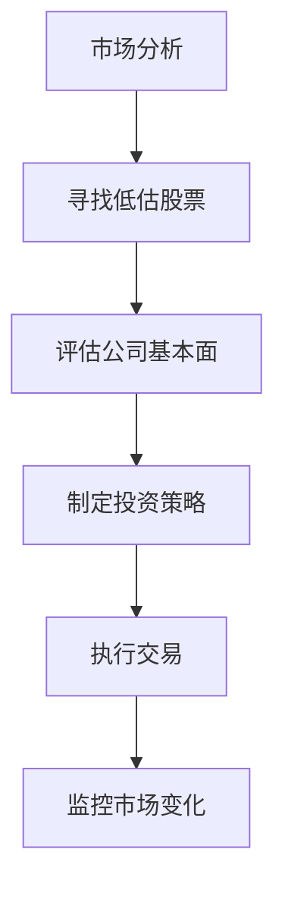
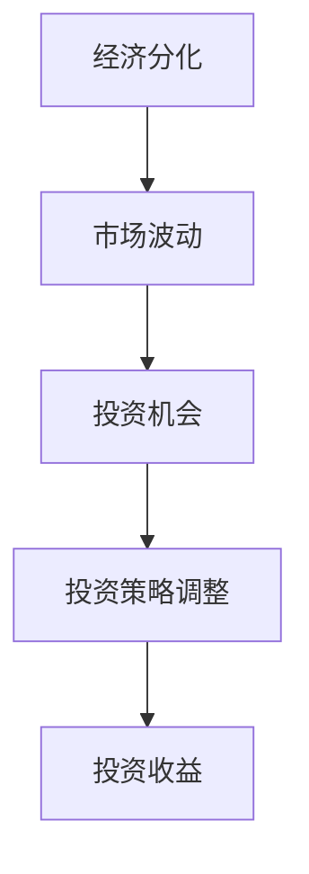
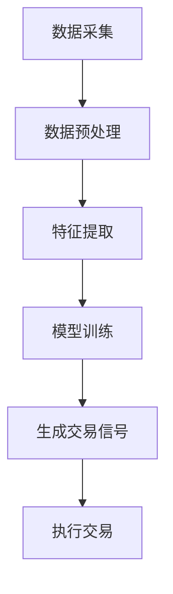
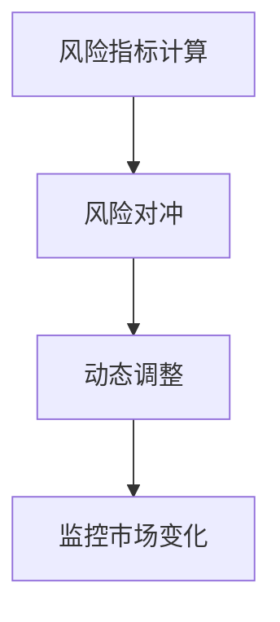
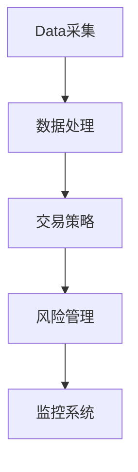
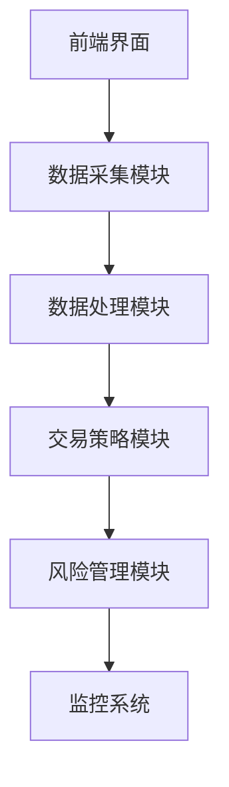

                 


# 如何利用特价股票投资应对全球经济数字化分化

## 关键词：特价股票、投资策略、全球经济分化、数字化转型、风险管理

## 摘要：  
在全球经济数字化转型的背景下，数字化分化现象日益显著，不同国家、行业和企业的数字化进程差异加大，导致市场波动加剧。本文探讨如何利用特价股票投资应对这种分化，分析特价股票的特点、投资策略、风险管理及算法实现，通过系统架构设计和实战案例，帮助投资者制定有效的投资方案。

---

# 第1章 全球经济数字化分化的背景

## 1.1 经济数字化分化的背景与趋势

### 1.1.1 数字化转型的全球趋势  
随着信息技术的发展，全球经济正经历一场深刻的变化，数字技术（如人工智能、大数据、区块链）正在重塑传统产业的商业模式和价值链条。数字化转型不仅改变了企业的运营方式，也加剧了经济结构的分化。

### 1.1.2 经济全球化与区域分化的矛盾  
尽管全球化促进了资源的全球配置，但技术差距、政策差异和疫情冲击等因素导致经济分化加剧。发达国家和发展中国家之间的数字鸿沟扩大，区域经济差异进一步显现。

### 1.1.3 数字化对全球经济结构的影响  
数字化推动了新兴产业的崛起（如数字经济、共享经济），但也导致传统产业的衰退，加剧了经济的“马太效应”。企业之间的分化更加明显，部分企业因数字化转型而崛起，另一部分则因未能适应而被淘汰。

---

## 1.2 特价股票投资的基本概念

### 1.2.1 特价股票的定义与特点  
特价股票是指价格远低于其内在价值的股票，通常出现在市场恐慌、行业低迷或公司短期困境时期。其特点是价格波动大、潜在收益高、风险也较高。

| 特价股票特点 | 描述 |
|----------------|------|
| 低估值 | P/E、P/B等估值指标远低于行业平均水平 |
| 高波动性 | 市场情绪变化导致股价波动剧烈 |
| 周期性 | 通常出现在经济周期的低谷阶段 |

### 1.2.2 特价股票与普通股票的区别  
- **波动性**：特价股票价格波动更大，普通股票相对稳定。
- **投资门槛**：特价股票对投资者的专业知识和市场敏感性要求更高。
- **风险收益比**：特价股票的风险更高，但潜在收益也更大。

### 1.2.3 投资者如何选择特价股票  
- 关注公司基本面：选择具有强大核心竞争力、暂时被市场低估的公司。
- 把握市场周期：在经济低谷期寻找被市场错杀的股票。
- 分散投资：避免将所有资金投入单一股票，降低风险。

---

## 1.3 特价股票与经济数字化分化的关联

### 1.3.1 数字化分化加剧市场波动  
数字化转型导致部分行业迅速崛起，另一部分行业逐步衰退。这种分化使得市场波动加剧，投资者需要在波动中寻找机会。

### 1.3.2 特价股票的投资机会  
在经济数字化分化的过程中，一些传统行业可能因技术落后而被市场抛弃，但其股票价格可能被低估，为投资者提供低价买入的机会。

### 1.3.3 投资策略的调整  
投资者需要根据经济数字化分化的趋势，调整投资策略，选择那些能够抵御数字化冲击或在数字化转型中受益的公司。

---

# 第2章 特价股票投资的核心概念与联系

## 2.1 经济数字化分化的机制

### 2.1.1 数字化对传统产业的冲击  
- 传统制造业：智能化生产降低了劳动力成本，提高了效率，但部分传统企业因无法转型而被淘汰。
- 零售业：线上零售的崛起对实体零售造成巨大冲击。

### 2.1.2 数字化驱动的新经济模式  
- 共享经济：如滴滴出行、Airbnb，通过数字化平台重新分配资源。
- 新商业模式：如订阅制、会员制，通过数字化手段提升客户粘性。

### 2.1.3 数字化对经济结构的影响  
- 产业集中度提高：数字化使得头部企业更具竞争优势。
- 新兴产业崛起：如人工智能、大数据、云计算等领域快速成长。

---

## 2.2 特价股票的市场定位

### 2.2.1 特价股票的市场周期性  
- 特价股票通常出现在市场低谷期，投资者需要判断市场是否触底。

### 2.2.2 特价股票与市场波动的关系  
- 市场恐慌时，特价股票价格被低估，为投资者提供抄底机会。
- 市场回暖时，特价股票价格迅速反弹，带来丰厚收益。

### 2.2.3 特价股票与经济周期的互动  
- 在经济衰退期，投资者更倾向于寻找特价股票。
- 在经济复苏期，特价股票价格回升，投资者获利了结。

---

## 2.3 经济分化与投资策略的关联

### 2.3.1 经济分化对投资组合的影响  
- 分散投资：将资金分配到不同行业、不同地区的资产，降低风险。
- 选择抗跌资产：在经济分化加剧时，选择那些受数字化冲击较小的行业。

### 2.3.2 特价股票在投资组合中的作用  
- 投资者可以通过持有特价股票，抓住市场低估的机会。
- 特价股票的高波动性可以为投资组合提供超额收益。

### 2.3.3 经济分化下的风险与机会  
- 风险：经济分化可能导致市场波动加剧，投资者可能面临更大的亏损。
- 机会：在经济分化中，某些行业或公司可能被市场低估，投资者可以逢低买入。

---

## 2.4 核心概念关系图

### 2.4.1 经济数字化分化的ER实体关系图  
```mermaid
erd
  entity 经济数字化分化 {
    <经济全球化>
    <技术差距>
    <政策差异>
  }
  entity 特价股票投资 {
    <市场低估>
    <高波动性>
    <周期性>
  }
  经济数字化分化 --|> 特价股票投资
```

### 2.4.2 特价股票投资的流程图  


### 2.4.3 经济分化与投资策略的关联图  


---

## 2.5 本章小结  
本章分析了经济数字化分化的背景和机制，探讨了特价股票的特点及其在投资中的作用。通过核心概念关系图，展示了经济分化与特价股票投资之间的联系，为后续章节的分析奠定了基础。

---

# 第3章 特价股票投资的算法原理

## 3.1 量化投资策略

### 3.1.1 量化投资的基本原理  
量化投资是通过数学模型和算法来进行投资决策，其核心在于利用数据和算法捕捉市场中的套利机会或趋势。

### 3.1.2 数据驱动的投资决策  
- 数据来源：历史价格、财务报表、市场情绪等。
- 数据处理：清洗、特征提取、建模。
- 决策依据：通过算法生成买卖信号。

### 3.1.3 算法交易的实现步骤  
1. 数据采集：获取历史价格数据和市场指标。
2. 数据预处理：清洗数据，处理缺失值。
3. 模型训练：使用机器学习算法（如随机森林、神经网络）进行预测。
4. 交易策略：根据模型输出生成交易信号。
5. 系统实现：编写代码实现算法交易。

---

## 3.2 风险管理模型

### 3.2.1 风险评估的基本方法  
- 方差-协方差矩阵：衡量资产之间的相关性。
- VaR（Value at Risk）：估计投资组合在一定置信水平下的潜在损失。

### 3.2.2 风险调整后的收益计算  
- Sharpe比率：衡量投资组合的风险调整后收益。
- Sortino比率：专门针对下行风险的衡量。

### 3.2.3 算法风险管理的实现  
1. 风险指标计算：计算VaR、Sharpe比率等。
2. 风险对冲：通过期货、期权等工具对冲市场风险。
3. 动态调整：根据市场变化动态调整投资组合。

---

## 3.3 算法流程图

### 3.3.1 量化投资策略的流程图  


### 3.3.2 风险管理模型的流程图  


---

## 3.4 数学模型与公式

### 3.4.1 Sharpe比率公式  
$$ Sharpe\ Ratio = \frac{E[r_p - r_f]}{\sigma_p} $$  
其中，\( E[r_p - r_f] \)是投资组合的超额收益期望值，\( \sigma_p \)是投资组合的收益标准差。

### 3.4.2 VaR公式  
$$ VaR = \mu + z \cdot \sigma $$  
其中，\( \mu \)是平均收益，\( z \)是标准正态分布的分位数，\( \sigma \)是收益的标准差。

### 3.4.3 算法交易中的数学模型  
例如，使用线性回归模型预测股票价格：
$$ y = \beta_0 + \beta_1 x_1 + \beta_2 x_2 + \epsilon $$  
其中，\( y \)是目标变量（股票价格），\( x_1, x_2 \)是自变量（如市场指数、行业指数），\( \beta_0, \beta_1, \beta_2 \)是回归系数，\( \epsilon \)是误差项。

---

## 3.5 本章小结  
本章详细介绍了量化投资策略和风险管理模型，通过算法流程图和数学公式，展示了如何利用算法进行特价股票投资。这些方法为投资者提供了科学的决策依据。

---

# 第4章 特价股票投资的系统分析与架构设计

## 4.1 投资系统的功能设计

### 4.1.1 系统功能模块划分  
- 数据采集模块：负责采集股票价格、市场指标等数据。
- 数据处理模块：对数据进行清洗、特征提取和建模。
- 交易策略模块：根据模型生成交易信号。
- 风险管理模块：对投资组合进行风险评估和对冲。

### 4.1.2 功能模块之间的关系  


---

## 4.2 系统架构设计

### 4.2.1 系统架构图  


### 4.2.2 系统接口设计  
- 数据接口：与数据源（如股票交易所）对接。
- 交易接口：与交易系统对接，执行买卖指令。
- 风险管理接口：与风险对冲工具对接。

### 4.2.3 系统交互流程图  
```mermaid
sequenceDiagram
    actor 投资者
    节点 系统
    投资者 -> 系统: 发出投资指令
    系统 -> 数据采集模块: 采集数据
    数据采集模块 -> 数据处理模块: 数据预处理
    数据处理模块 -> 交易策略模块: 生成交易信号
    交易策略模块 -> 风险管理模块: 风险评估
    风险管理模块 -> 监控系统: 实时监控
    监控系统 -> 投资者: 反馈结果
```

---

## 4.3 本章小结  
本章通过系统架构设计，展示了如何构建一个完整的特价股票投资系统。通过功能模块划分和系统架构图，明确了各部分的职责和交互关系。

---

# 第5章 特价股票投资的项目实战

## 5.1 环境安装与配置

### 5.1.1 系统环境  
- 操作系统：Windows/Mac/Linux
- 开发工具：Python、Jupyter Notebook
- 数据库：MySQL/SQLite
- 交易接口：模拟交易平台或真实交易接口

### 5.1.2 Python环境配置  
安装必要的库：
```bash
pip install pandas numpy matplotlib scikit-learn
```

---

## 5.2 核心代码实现

### 5.2.1 数据采集模块  
```python
import pandas as pd
import requests

def get_stock_data(ticker):
    url = f"https://api.example.com/stock/{ticker}"
    response = requests.get(url)
    data = response.json()
    return pd.DataFrame(data)
```

### 5.2.2 交易策略模块  
```python
from sklearn.linear_model import LinearRegression

def predict_stock_price(X_train, y_train, X_test):
    model = LinearRegression()
    model.fit(X_train, y_train)
    return model.predict(X_test)
```

### 5.2.3 风险管理模块  
```python
def calculate VaR(returns, confidence_level=0.95):
    import numpy as np
    sorted_returns = np.sort(returns)
    index = int(len(sorted_returns) * (1 - confidence_level))
    VaR = -sorted_returns[index]
    return VaR
```

---

## 5.3 案例分析与解读

### 5.3.1 案例背景  
假设当前市场处于低谷期，某公司因行业低迷导致股价被低估。

### 5.3.2 数据分析  
通过数据采集和建模，发现该股票的价格与行业指数高度相关，预测其股价将反弹。

### 5.3.3 投资决策  
基于模型预测，决定在股价达到某个阈值时买入，设置止损点和止盈点。

---

## 5.4 项目小结  
本章通过实际案例，展示了如何在实战中应用前面的理论知识。通过代码实现和案例分析，投资者可以更好地理解如何利用特价股票投资应对全球经济数字化分化。

---

# 第6章 特价股票投资的最佳实践

## 6.1 投资策略 tips

### 6.1.1 分散投资  
不要将所有资金投入单一股票，分散投资可以降低风险。

### 6.1.2 长期持有  
特价股票通常需要较长的时间才能反弹，投资者需要耐心持有。

### 6.1.3 定期调整  
根据市场变化，定期评估投资组合，及时调整策略。

---

## 6.2 风险管理 tips

### 6.2.1 设置止损  
在买入股票时，设定一个止损点，避免亏损过大。

### 6.2.2 多元化投资  
通过投资不同行业、不同地区的股票，降低市场风险。

### 6.2.3 监控市场  
实时监控市场变化，及时应对突发事件。

---

## 6.3 本章小结  
本章总结了特价股票投资的最佳实践，为投资者提供了实用的建议，帮助他们更好地应对全球经济数字化分化带来的挑战。

---

# 第7章 总结与展望

## 7.1 总结  
本文从全球经济数字化分化的背景出发，探讨了特价股票投资的核心概念、算法原理和系统设计。通过实战案例和最佳实践，为投资者提供了科学的投资方法。

## 7.2 展望  
随着数字化转型的深入，经济分化现象将更加显著。未来，投资者需要更加灵活地调整策略，利用新技术和新工具，抓住市场机会。

---

# 参考文献  
（此处列出相关文献和资料）

---

通过以上分析和步骤，您可以撰写一篇结构清晰、内容详实的技术博客文章，帮助读者更好地理解如何利用特价股票投资应对全球经济数字化分化。

