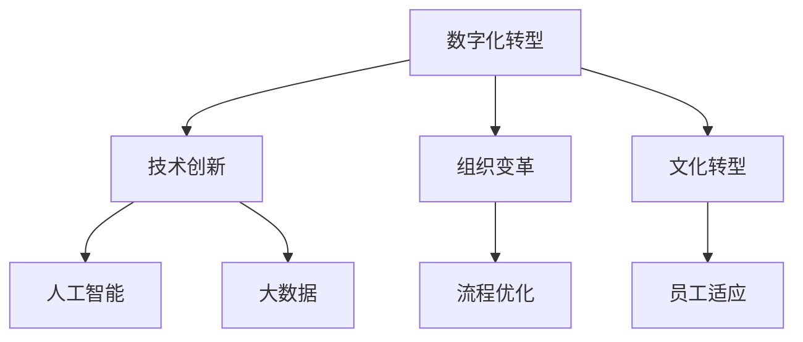

                 


```markdown
# 如何利用特价股票投资应对全球经济数字化转型

> 关键词：特价股票，投资策略，数字化转型，经济影响，技术分析

> 摘要：本文详细分析了在全球经济数字化转型的背景下，如何利用特价股票进行投资。通过探讨数字化转型对全球经济的影响，特价股票的特点和投资价值，技术分析方法，系统架构设计，以及项目实战案例，为投资者提供了一套科学的投资策略。

---

## 第一部分: 全球经济数字化转型的背景与影响

### 第1章: 全球经济数字化转型的背景与挑战

#### 1.1 数字化转型的定义与核心特征

数字化转型是指企业利用数字技术（如人工智能、大数据、云计算等）来改变其业务模式、流程、文化、战略和组织方式，以实现业务创新和效率提升。其核心特征包括数据驱动、智能化、自动化和网络化。

- **核心概念术语说明**：
  - 数字化转型：通过数字技术改变商业模式和运营方式。
  - 数据驱动：依赖数据进行决策。
  - 智能化：利用AI和机器学习提升效率。

- **问题背景**：
  - 全球经济正经历从传统模式向数字模式的转变，数字化转型成为企业和国家竞争力的关键。

- **问题描述**：
  - 传统产业面临数字化转型的压力，投资者需调整策略以抓住新机遇。

- **问题解决**：
  - 通过技术分析和投资策略调整，投资者可以更好地应对数字化转型带来的变化。

- **边界与外延**：
  - 数字化转型不包括传统行业的简单自动化，而是深度业务模式变革。

- **概念结构与核心要素**：
  - 核心要素包括技术创新、组织变革和文化转型。



#### 1.2 全球经济数字化转型的驱动因素

- **技术驱动**：人工智能、大数据、云计算等技术推动了数字化转型。
- **产业驱动**：传统产业为保持竞争力，纷纷进行数字化升级。
- **政策驱动**：政府通过政策引导和资金支持，推动数字化转型。

#### 1.3 数字化转型对投资策略的影响

- **投资机会**：
  - 科技创新企业的崛起带来投资机会。
  - 传统产业数字化升级提供新的投资方向。

- **传统策略的局限性**：
  - 传统投资方法难以适应快速变化的市场环境。

- **投资者的挑战**：
  - 需要快速学习和调整策略，识别新的投资机会。

---

### 第2章: 特价股票投资的基础知识

#### 2.1 特价股票的定义与类型

- **定义**：特价股票是指价格相对较低，具有投资潜力的股票。
- **类型**：
  - 垃圾股：基本面差但有翻身可能。
  - 独特股：具有独特竞争优势的股票。
  - 周期股：受经济周期影响较大的股票。

- **特点**：
  - 价格波动大，风险较高。
  - 投资价值可能被市场低估。

#### 2.2 特价股票的投资价值

- **市场定位**：通常处于低估状态，具有反弹潜力。
- **估值方法**：市盈率、市净率等指标评估其价值。
- **投资风险**：高波动性和高风险。

#### 2.3 特价股票投资的基本策略

- **基本面分析**：关注公司财务状况、行业地位。
- **技术分析**：通过K线图、趋势线等工具判断价格走势。
- **风险管理**：设置止损点，分散投资组合。

---

### 第3章: 全球经济数字化转型下的投资机会

#### 3.1 数字化转型带来的投资机会

- **科技创新企业的投资机会**：
  - 人工智能、大数据等领域的公司具有高增长潜力。

- **传统产业数字化升级的投资机会**：
  - 制造业、零售业等行业的数字化转型带来投资机会。

#### 3.2 投资策略的调整

- **资产配置**：
  - 增加科技股的配置比例。
  - 适当减少传统行业的投资比例。

- **风险管理**：
  - 定期评估投资组合的风险敞口。
  - 使用期权等工具进行风险对冲。

---

### 第4章: 技术分析方法

#### 4.1 技术分析的基本方法

- **K线图**：显示股票价格的波动情况。
- **趋势线**：识别价格走势的方向。
- **成交量分析**：判断市场参与度和趋势强度。

#### 4.2 技术分析的数学模型

- **移动平均线（MA）**：
  - 计算公式：$MA_n = \frac{1}{n} \sum_{i=1}^{n} P_i$
  - 示例：30天移动平均线用于判断短期趋势。

- **相对强弱指数（RSI）**：
  - 计算公式：$RSI = \frac{100}{1 + \frac{S}{N}}$
  - 用于判断超买超卖状态。

---

### 第5章: 系统架构设计

#### 5.1 系统功能设计

- **领域模型**：
  ```mermaid
  classDiagram
      class 投资者
          姓名
          资产
      class 股票
          股票代码
          价格
      class 技术分析工具
          K线图
          趋势线
  ```

- **系统架构设计**：
  ```mermaid
  architecture
      前端 --> 后端
      后端 --> 数据库
      技术分析工具 --> 后端
  ```

---

### 第6章: 项目实战

#### 6.1 环境安装

- **工具安装**：安装Python和相关库（如Pandas、Matplotlib）。
- **数据获取**：通过API获取股票数据。

#### 6.2 核心实现

- **代码实现**：
  ```python
  import pandas as pd
  import matplotlib.pyplot as plt

  # 获取股票数据
  data = pd.read_csv('stock.csv')
  # 计算移动平均线
  ma_20 = data['Close'].rolling(20).mean()
  plt.plot(data['Close'], label='Close Price')
  plt.plot(ma_20, label='20-Day MA')
  plt.legend()
  plt.show()
  ```

#### 6.3 实际案例分析

- **案例分析**：分析某科技股的技术指标，判断投资机会。
- **结果解读**：结合技术分析结果，制定投资策略。

---

### 第7章: 最佳实践与小结

#### 7.1 小结

- 数字化转型为投资带来了新的机遇和挑战。
- 特价股票投资需要结合技术分析和基本面分析。

#### 7.2 注意事项

- 风险管理是投资成功的关键。
- 投资者需持续学习，适应市场变化。

#### 7.3 拓展阅读

- 推荐阅读《股票投资实战》和《数字化转型》相关书籍。

---

通过以上结构，投资者可以系统地了解如何利用特价股票投资应对全球经济数字化转型，从理论到实践，逐步掌握投资技巧和策略。
```

