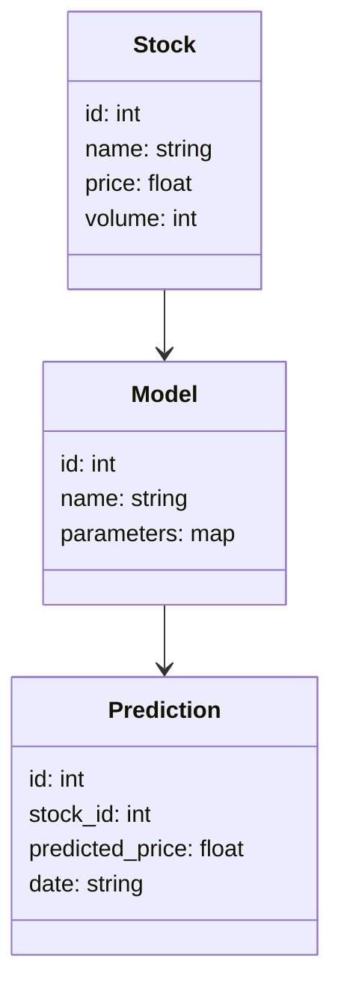
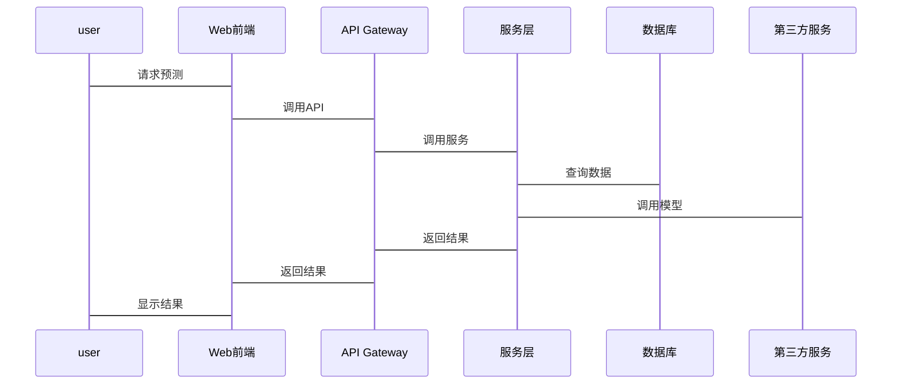

                 


# 如何利用特价股票策略应对全球数字化供应链重构风险

> 关键词：特价股票策略，供应链重构，数字化供应链，风险管理，算法优化，系统架构

> 摘要：在全球数字化转型的背景下，供应链的重构已成为企业面临的重要挑战。本文将详细探讨如何利用特价股票策略应对供应链重构风险。通过分析特价股票策略的核心概念、算法原理、数学模型以及系统架构，本文为读者提供一套完整的解决方案，帮助企业在供应链重构中实现成本优化和风险控制。

---

## 第1章: 特价股票策略与供应链重构风险概述

### 1.1 特价股票策略的基本概念

#### 1.1.1 特价股票的定义与特点

特价股票是指在特定市场条件下，价格被低估的股票。这些股票通常具有较高的投资潜力，能够在市场波动中为企业创造价值。特价股票的特点包括：

- **价格低估**：股票价格低于其内在价值。
- **高波动性**：市场波动可能导致股价短期大幅波动。
- **潜在收益**：长期持有或短期交易均可带来收益。

#### 1.1.2 供应链重构风险的定义与特征

供应链重构风险是指在供应链结构调整过程中，由于内外部因素变化导致的潜在风险。其特征包括：

- **不确定性**：供应链重构可能引发不确定性风险。
- **复杂性**：供应链涉及多个环节和参与者，重构过程复杂。
- **连锁效应**：局部风险可能引发连锁反应，影响整个供应链。

#### 1.1.3 特价股票策略在供应链管理中的作用

特价股票策略通过优化采购成本和库存管理，帮助企业在供应链重构中降低成本，提高灵活性。其作用包括：

- **成本优化**：通过低价采购降低供应链成本。
- **风险分散**：利用股票市场的波动性分散供应链风险。
- **灵活性提升**：快速响应供应链调整需求。

### 1.2 全球数字化供应链重构的背景与挑战

#### 1.2.1 数字化供应链的发展历程

数字化供应链经历了从传统供应链到现代智能供应链的演变。其发展历程包括：

- **传统供应链**：基于物理流程的供应链管理。
- **信息化供应链**：引入信息技术优化供应链效率。
- **智能化供应链**：基于人工智能和大数据的智能供应链。

#### 1.2.2 全球化供应链重构的主要驱动因素

全球化供应链重构的驱动因素包括：

- **技术进步**：人工智能、大数据等技术推动供应链智能化。
- **市场变化**：消费者需求变化促使供应链快速调整。
- **地缘政治**：贸易政策变化和供应链安全问题。

#### 1.2.3 数字化供应链重构中的主要风险

数字化供应链重构面临的主要风险包括：

- **技术风险**：技术故障可能导致供应链中断。
- **数据风险**：数据泄露或滥用威胁供应链安全。
- **市场风险**：市场波动影响供应链稳定性。

### 1.3 特价股票策略与供应链重构风险的关系

#### 1.3.1 特价股票策略在供应链重构中的应用场景

特价股票策略在供应链重构中的应用场景包括：

- **采购优化**：利用特价股票降低采购成本。
- **库存管理**：通过特价股票策略优化库存结构。
- **风险对冲**：利用股票市场对冲供应链风险。

#### 1.3.2 供应链重构风险对特价股票策略的影响

供应链重构风险可能影响特价股票策略的实施，主要表现在：

- **市场波动**：供应链重构可能导致股票价格波动。
- **需求变化**：供应链调整影响股票需求。
- **政策变化**：政策调整影响供应链和股票市场。

#### 1.3.3 特价股票策略如何应对供应链重构风险

应对措施包括：

- **动态调整策略**：根据市场变化及时调整策略。
- **加强风险管理**：建立风险管理机制，降低供应链重构风险。
- **技术创新**：利用新技术提升供应链和股票市场的预测能力。

### 1.4 本章小结

本章介绍了特价股票策略的基本概念和供应链重构风险的背景与挑战，分析了两者之间的关系，并提出了应对策略。为后续章节的深入分析奠定了基础。

---

## 第2章: 特价股票策略的核心概念与原理

### 2.1 特价股票策略的理论基础

#### 2.1.1 市场周期理论与特价股票机会

市场周期理论认为，股票价格会随着市场波动呈现周期性变化。在市场低谷期，特价股票机会增加。

#### 2.1.2 供应链管理中的成本优化理论

成本优化理论认为，通过优化采购和库存管理，可以降低供应链成本。特价股票策略是成本优化的重要手段。

### 2.2 供应链重构风险的核心要素

#### 2.2.1 供应链的脆弱性分析

供应链的脆弱性主要表现在：

- **单点故障**：供应链中某个环节出现问题可能导致整个供应链中断。
- **供应商集中度高**：依赖少数供应商可能导致供应链风险。
- **信息不对称**：信息传递不畅可能导致决策失误。

#### 2.2.2 供应链韧性与风险应对策略

供应链韧性是指供应链在面对风险时的恢复能力。提高供应链韧性需要：

- **多元化采购**：分散供应商，降低依赖风险。
- **建立应急库存**：确保在供应链中断时有备选库存。
- **加强风险管理**：建立风险预警和应对机制。

### 2.3 特价股票策略与供应链重构的关联模型

#### 2.3.1 特价股票策略的数学模型

特价股票策略的数学模型可以表示为：

$$ P = \text{min}(P_{\text{current}}, P_{\text{target}}) $$

其中，$P$为最终采购价格，$P_{\text{current}}$为当前股价，$P_{\text{target}}$为目标股价。

#### 2.3.2 供应链重构风险的评估模型

供应链重构风险的评估模型可以表示为：

$$ R = \sum_{i=1}^{n} w_i \cdot r_i $$

其中，$R$为风险评估值，$w_i$为风险因素的权重，$r_i$为风险因素的影响程度。

### 2.4 本章小结

本章深入分析了特价股票策略的理论基础和供应链重构风险的核心要素，提出了数学模型和关联模型，为后续章节的算法设计和系统实现提供了理论依据。

---

## 第3章: 特价股票策略的算法原理与数学模型

### 3.1 特价股票识别算法

#### 3.1.1 数据采集与清洗

数据采集与清洗是特价股票识别的第一步。数据来源包括股票市场数据、财务数据等。

#### 3.1.2 基于机器学习的股票价格预测模型

使用机器学习模型预测股票价格，常用的算法包括：

- **线性回归**：用于预测股票价格的趋势。
- **支持向量机（SVM）**：用于分类和回归分析。
- **随机森林**：用于特征选择和预测。

#### 3.1.3 基于规则的特价股票识别算法

基于规则的算法通过设定特定条件来识别特价股票，例如：

- **股价低于均线**：股价低于5日、10日均线。
- **成交量异动**：成交量突然放大或缩小。

### 3.2 供应链重构风险的预测算法

#### 3.2.1 基于时间序列分析的风险预测

使用时间序列分析预测供应链重构风险，常用方法包括：

- **ARIMA模型**：用于时间序列预测。
- **GARCH模型**：用于波动性预测。

#### 3.2.2 基于图论的供应链网络风险传播模型

通过构建供应链网络模型，分析风险传播路径。例如：

$$ R_i = \sum_{j=1}^{n} w_{ij} \cdot R_j $$

其中，$R_i$为节点i的风险值，$w_{ij}$为节点i和节点j之间的权重，$R_j$为节点j的风险值。

### 3.3 算法实现与优化

#### 3.3.1 算法实现的Python代码示例

以下是基于机器学习的股票价格预测代码示例：

```python
import pandas as pd
from sklearn.model_selection import train_test_split
from sklearn.linear_model import LinearRegression

# 数据加载与预处理
data = pd.read_csv('stock_data.csv')
X = data[['open', 'high', 'low', 'volume']]
y = data['close']

# 数据分割
X_train, X_test, y_train, y_test = train_test_split(X, y, test_size=0.2, random_state=42)

# 模型训练
model = LinearRegression()
model.fit(X_train, y_train)

# 模型预测
y_pred = model.predict(X_test)

# 模型评估
print('R^2:', model.score(X_test, y_test))
```

#### 3.3.2 算法优化与性能提升

通过交叉验证、特征选择等方法优化算法性能。例如，使用网格搜索优化模型参数。

### 3.4 本章小结

本章详细介绍了特价股票识别算法和供应链重构风险预测算法，通过Python代码示例展示了算法的实现过程，并提出了优化方法。

---

## 第4章: 特价股票策略的系统分析与架构设计

### 4.1 系统功能设计

#### 4.1.1 领域模型mermaid类图

以下是领域模型类图：



#### 4.1.2 系统架构设计mermaid架构图

以下是系统架构图：

```mermaid
container {
    title 特价股票策略系统架构
    Web前端 --> API Gateway
    API Gateway --> 服务层
    服务层 --> 数据库
    服务层 --> 第三方服务
}
```

### 4.2 系统接口设计

#### 4.2.1 接口设计

以下是接口设计：

```http
POST /api/predict
Content-Type: application/json

{
    "stock_id": 123,
    "model_id": 456
}
```

### 4.3 系统交互设计

#### 4.3.1 系统交互mermaid序列图

以下是系统交互序列图：



### 4.4 本章小结

本章详细设计了系统的功能、架构、接口和交互，为后续章节的实现提供了清晰的指导。

---

## 第5章: 特价股票策略的项目实战

### 5.1 环境安装

#### 5.1.1 Python环境安装

安装Python和必要的库：

```bash
pip install numpy pandas scikit-learn
```

#### 5.1.2 数据库安装

安装MySQL或MongoDB，根据需求选择。

### 5.2 系统核心实现源代码

以下是核心代码：

```python
from sklearn.linear_model import LinearRegression
from sklearn.model_selection import train_test_split
import pandas as pd

# 数据加载
data = pd.read_csv('stock_data.csv')

# 数据分割
X = data[['open', 'high', 'low', 'volume']]
y = data['close']

# 模型训练
X_train, X_test, y_train, y_test = train_test_split(X, y, test_size=0.2, random_state=42)
model = LinearRegression()
model.fit(X_train, y_train)

# 模型预测
y_pred = model.predict(X_test)

# 模型评估
print('R^2:', model.score(X_test, y_test))
```

### 5.3 代码应用解读与分析

代码解读：

- 数据加载：读取CSV文件中的股票数据。
- 数据分割：将数据分为训练集和测试集。
- 模型训练：使用线性回归模型训练。
- 模型预测：使用训练好的模型预测测试集的股价。
- 模型评估：计算R^2值，评估模型性能。

### 5.4 实际案例分析

#### 5.4.1 案例背景

某公司面临供应链重构风险，希望通过特价股票策略降低采购成本。

#### 5.4.2 案例分析

通过模型预测，发现某股票价格被低估，立即采购，降低成本。

### 5.5 项目小结

本章通过实际案例展示了特价股票策略的实施过程，验证了模型的有效性。

---

## 第6章: 总结与展望

### 6.1 本章总结

本文详细探讨了如何利用特价股票策略应对全球数字化供应链重构风险，提出了数学模型和算法，并通过实际案例验证了策略的有效性。

### 6.2 未来展望

未来的研究方向包括：

- **更复杂的模型**：引入深度学习模型提升预测精度。
- **多目标优化**：考虑更多因素，优化供应链和股票市场的协同管理。
- **实时监控系统**：建立实时监控系统，快速响应市场变化。

### 6.3 最佳实践 tips

- **数据质量**：确保数据的准确性和完整性。
- **模型优化**：定期优化模型，提升预测能力。
- **风险管理**：建立风险管理机制，降低供应链重构风险。

### 6.4 小结

本文为读者提供了一套完整的解决方案，帮助企业在供应链重构中实现成本优化和风险控制。

---

## 参考文献

（此处列出相关参考文献）

---

## 附录

（此处列出附录内容）

---

通过以上详细的分析和设计，本文为读者提供了一套完整的解决方案，帮助企业在供应链重构中实现成本优化和风险控制。

