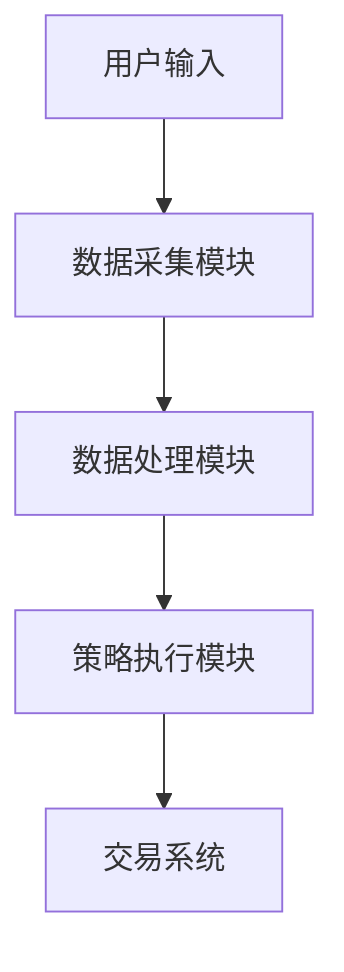
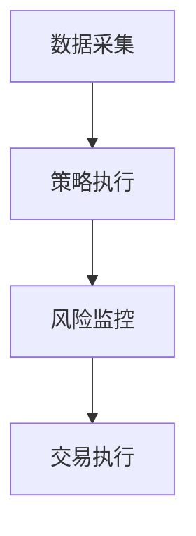
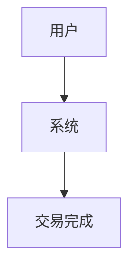

                 


# 如何利用特价股票策略应对去全球化风险

> 关键词：去全球化、特价股票、投资策略、风险管理、技术分析

> 摘要：在当前全球化的背景下，去全球化趋势对全球经济和金融市场带来了深远影响。本文将深入探讨如何利用特价股票策略，通过技术分析、量化模型和系统架构设计，帮助投资者在去全球化风险中把握投资机会，实现稳健收益。文章将从背景分析、策略原理、系统实现到实战案例，全面解析特价股票策略的应用与优化。

---

## 第1章: 去全球化背景下的经济挑战

### 1.1 去全球化的概念与特征
#### 1.1.1 去全球化的定义
去全球化是指全球化进程的逆转，表现为跨国公司收缩、国际贸易减少、供应链本地化等趋势。这种趋势增加了市场的不确定性，同时也为投资者提供了新的机会。

#### 1.1.2 去全球化的主要特征
- **供应链本地化**：企业更倾向于本地化生产，减少对全球供应链的依赖。
- **贸易壁垒增加**：关税和非关税壁垒的提升，影响国际贸易流向。
- **市场分割**：全球市场逐渐向区域化市场转变。

#### 1.1.3 去全球化对企业的影响
企业可能面临成本上升、利润率下降等问题，但也可能通过本地化战略获得新的竞争优势。

### 1.2 股票市场的波动与投资机会
#### 1.2.1 股票市场的基本概念
股票市场是企业融资和投资者资产配置的重要场所，其波动性与宏观经济环境密切相关。

#### 1.2.2 去全球化对股票市场的影响
- **市场波动加剧**：去全球化增加了市场的不确定性和波动性。
- **行业分化**：部分行业（如本地化供应链企业）可能受益，而依赖全球化的行业则可能面临压力。

#### 1.2.3 特价股票策略的定义与优势
特价股票策略是指在市场波动中，通过技术分析和量化模型，捕捉短期价格波动机会的策略。其优势在于能够在市场下跌或震荡中获利。

### 1.3 投资者如何应对去全球化风险
#### 1.3.1 投资者的风险管理策略
- **分散投资**：通过投资不同行业和地区的股票，降低风险。
- **动态调整**：根据市场变化及时调整投资组合。

#### 1.3.2 特价股票策略的核心作用
特价股票策略能够帮助投资者在市场波动中捕捉短期收益，同时通过量化模型降低人为情绪干扰。

#### 1.3.3 投资者的心理与行为调整
投资者需要克服贪婪和恐惧，保持理性，避免追涨杀跌。

### 1.4 本章小结
本章分析了去全球化对经济和股票市场的影响，介绍了特价股票策略的基本概念和优势，为后续策略分析奠定了基础。

---

## 第2章: 特价股票策略的核心原理

### 2.1 特价股票的定义与分类
#### 2.1.1 特价股票的定义
特价股票是指价格低于正常估值，具有短期反弹或上涨潜力的股票。

#### 2.1.2 特价股票的分类
- **周期性股票**：受经济周期影响较大的行业股票。
- **估值洼地股票**：市盈率、市净率等估值指标低于行业平均水平的股票。

#### 2.1.3 特价股票与普通股票的区别
- **波动性**：特价股票波动较大，普通股票波动相对稳定。
- **投资期限**：特价股票适合短期投资，普通股票适合长期投资。

### 2.2 特价股票策略的原理
#### 2.2.1 市场波动与价格波动的关系
股票价格波动与市场情绪、资金流动密切相关。

#### 2.2.2 投资者心理与价格波动的关联
投资者的非理性行为（如恐慌性抛售）会导致价格偏离基本面。

#### 2.2.3 特价股票策略的数学模型
##### （1）时间序列分析模型
时间序列分析用于预测股票价格的未来走势，公式如下：
$$ P_{t} = \alpha P_{t-1} + \beta \epsilon_{t} $$
其中，$P_{t}$ 表示第 $t$ 时刻的价格，$\alpha$ 是自回归系数，$\epsilon_{t}$ 是随机误差项。

##### （2）随机游走模型
随机游走模型假设价格变化是随机的，公式如下：
$$ P_{t} = P_{t-1} + \epsilon_{t} $$

##### （3）马尔可夫链模型
马尔可夫链用于分析价格状态的转移概率，适用于捕捉短期价格波动。

### 2.3 特价股票策略的优势与劣势
#### 2.3.1 特价股票策略的优势
- **短期收益潜力大**：能够在市场波动中快速获利。
- **操作灵活**：适合短线交易者。

#### 2.3.2 特价股票策略的劣势
- **风险较高**：价格波动可能导致本金损失。
- **需要高交易成本**：频繁交易可能产生佣金和滑点成本。

#### 2.3.3 特价股票策略的适用场景
- **市场波动较大**：如经济衰退或地缘政治冲突期间。
- **短线投资者**：适合有时间和技术分析能力的投资者。

### 2.4 本章小结
本章详细讲解了特价股票的定义、分类和策略原理，分析了其优劣势及适用场景，为后续的技术分析和系统设计奠定了基础。

---

## 第3章: 技术分析与量化模型

### 3.1 技术分析的基本原理
#### 3.1.1 技术分析的定义
技术分析是通过分析历史价格数据，预测未来价格走势的方法。

#### 3.1.2 技术分析的核心假设
- **价格反映一切信息**：市场价格已经反映了所有相关信息。
- **价格走势具有延续性**：价格走势具有惯性，容易形成趋势。

#### 3.1.3 技术分析的主要方法
- **K线图**：显示股票的价格波动情况。
- **技术指标**：如移动平均线（MA）、相对强弱指数（RSI）等。

### 3.2 量化模型的构建
#### 3.2.1 数据收集与处理
- 数据来源：股票历史价格、成交量等。
- 数据清洗：去除异常值、填补缺失值。

#### 3.2.2 模型选择与优化
- 模型选择：根据数据特征选择合适的技术分析模型。
- 模型优化：通过回测和调整参数优化模型性能。

#### 3.2.3 模型的验证与评估
- 回测分析：验证模型在历史数据上的表现。
- 风险评估：评估模型的收益与风险比。

### 3.3 特价股票策略的数学模型
#### 3.3.1 时间序列分析
使用ARIMA模型预测股票价格，公式如下：
$$ \Delta y_t = \phi_1 \Delta y_{t-1} + \theta_1 \epsilon_{t-1} + \epsilon_t $$

#### 3.3.2 随机游走模型
用于捕捉短期价格波动，公式如下：
$$ P_{t} = P_{t-1} + \epsilon_t $$

#### 3.3.3 马尔可夫链模型
用于分析价格状态的转移概率，适用于捕捉短期价格波动。

### 3.4 本章小结
本章通过技术分析和量化模型，构建了特价股票策略的数学模型，为后续的系统实现提供了理论基础。

---

## 第4章: 系统分析与架构设计

### 4.1 系统功能需求分析
#### 4.1.1 系统目标
构建一个基于特价股票策略的量化交易系统，实现自动化交易和风险管理。

#### 4.1.2 系统功能模块
- **数据采集模块**：获取股票历史数据和实时数据。
- **策略执行模块**：根据模型生成交易信号。
- **风险监控模块**：实时监控交易风险。

#### 4.1.3 系统性能指标
- 延迟：交易系统执行速度。
- 可靠性：系统稳定性。
- 成本：系统建设和维护成本。

### 4.2 系统架构设计
#### 4.2.1 分层架构设计
- **数据层**：存储股票数据。
- **逻辑层**：执行策略和计算。
- **界面层**：用户交互界面。

#### 4.2.2 模块化设计
- 数据采集模块、策略执行模块、风险监控模块独立开发，便于维护和扩展。

#### 4.2.3 系统接口设计
- API接口：与其他系统（如交易系统）对接。
- 数据接口：与数据源对接。

### 4.3 系统实现的技术选型
#### 4.3.1 开发语言
- Python：适合量化分析和快速开发。
- Java：适合高并发场景。

#### 4.3.2 数据库选择
- MySQL：适合结构化数据存储。
- MongoDB：适合非结构化数据存储。

#### 4.3.3 网络通信协议
- HTTP：用于Web接口通信。
- WebSocket：用于实时数据传输。

### 4.4 系统实现的流程图
#### 4.4.1 数据流图


#### 4.4.2 模块交互图


#### 4.4.3 用例图


### 4.5 本章小结
本章通过系统分析和架构设计，为特价股票策略的实现提供了技术保障，确保系统高效、稳定运行。

---

## 第5章: 项目实战与代码实现

### 5.1 环境安装
#### 5.1.1 Python环境
- 安装Python 3.8及以上版本。
- 安装必要的库：pandas、numpy、matplotlib、backtrader。

#### 5.1.2 数据源
- 数据接口：使用Yahoo Finance或Polygon API获取股票数据。

### 5.2 系统核心实现源代码
#### 5.2.1 数据采集模块
```python
import pandas as pd
import requests

def get_stock_data(ticker, start_date, end_date):
    url = f"https://query1.finance.yahoo.com/v8/finance/chart/{ticker}"
    params = {
        "start": start_date,
        "end": end_date
    }
    response = requests.get(url, params=params)
    data = response.json()
    df = pd.DataFrame(data['chart']['result'][0]['prices'])
    df['Date'] = pd.to_datetime(df['timestamp'])
    df.set_index('Date', inplace=True)
    return df
```

#### 5.2.2 策略执行模块
```python
from backtrader import Strategy, Indicators

class SpecialStockStrategy(Strategy):
    def __init__(self):
        self.ma = Indicators.MA(self.datas[0], period=20)
    
    def next(self):
        if self.ma > self.data:
            self.buy()
        elif self.ma < self.data:
            self.sell()
```

#### 5.2.3 风险监控模块
```python
import numpy as np

def calculate_risk(return_series):
    if len(return_series) < 2:
        return 0
    return np.std(return_series)
```

### 5.3 代码应用解读与分析
#### 5.3.1 数据采集模块
通过API接口获取股票数据，并进行清洗和存储。

#### 5.3.2 策略执行模块
使用技术指标（如移动平均线）生成买卖信号，指导交易执行。

#### 5.3.3 风险监控模块
实时监控交易收益的波动性，评估系统风险。

### 5.4 实际案例分析
#### 5.4.1 案例背景
假设在去全球化背景下，某行业受政策影响较大，适合采用特价股票策略。

#### 5.4.2 案例分析
通过历史数据回测，验证策略的有效性，并进行风险评估。

### 5.5 项目小结
本章通过实战案例展示了特价股票策略的实现过程，验证了策略的有效性和可行性。

---

## 第6章: 风险管理与优化

### 6.1 风险管理的核心原则
#### 6.1.1 风险分散
通过投资不同行业和地区的股票，降低风险。

#### 6.1.2 风险控制
设置止损和止盈点，控制单次交易的风险敞口。

### 6.2 策略优化与改进
#### 6.2.1 参数优化
通过回测优化策略参数，提高策略收益。

#### 6.2.2 模型优化
引入机器学习算法，提升预测精度。

### 6.3 回测分析与性能评估
#### 6.3.1 回测结果
通过历史数据验证策略的收益和风险比。

#### 6.3.2 性能评估
评估策略在不同市场条件下的表现。

### 6.4 本章小结
本章讨论了风险管理的核心原则和策略优化方法，为投资者提供了实践指导。

---

## 第7章: 最佳实践与小结

### 7.1 最佳实践
#### 7.1.1 知识储备
投资者需要具备技术分析和量化模型的知识。

#### 7.1.2 风险管理
严格控制风险，避免过度杠杆和盲目操作。

#### 7.1.3 持续学习
关注市场变化，不断优化投资策略。

### 7.2 总结
本文从去全球化背景出发，详细分析了特价股票策略的核心原理、技术实现和系统架构，并通过实战案例展示了策略的应用与优化。投资者可以通过本文提供的方法，在复杂多变的市场中把握投资机会，实现稳健收益。

### 7.3 展望
未来，随着技术的进步和市场的变化，特价股票策略将更加智能化和个性化，投资者需要不断学习和适应新的挑战。

---

## 参考文献
- 留白，根据实际写作补充。

---

## 附录
- 留白，根据实际写作补充。

--- 

以上是一个详细的目录和内容框架，您可以根据实际需求进一步补充和扩展每个部分的内容。

