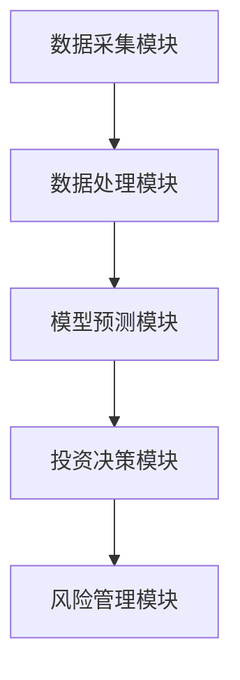
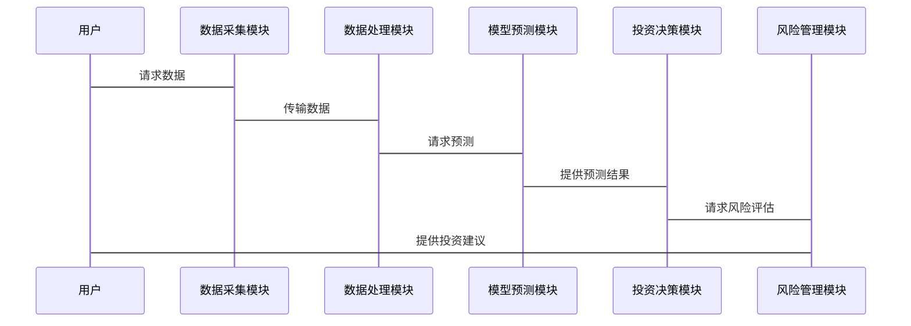

                 


# 如何利用特价股票策略应对市场剧烈波动

## 关键词：
特价股票策略、市场波动、投资策略、风险管理、算法交易、套利机会

## 摘要：
本文详细探讨了如何利用特价股票策略应对市场剧烈波动，从策略背景、核心概念、算法原理到系统架构、项目实战和风险管理等方面进行了全面分析。通过数学模型、算法流程图和系统架构图的详细讲解，帮助读者理解并掌握特价股票策略的应用方法，同时结合实际案例分析，提供实用的实战指导和风险管理建议。

---

## 目录大纲结构：

### 第一部分: 特价股票策略的背景与基础

### 第1章: 特价股票策略的背景与基础

#### 1.1 市场波动与投资策略
##### 1.1.1 市场波动的定义与特征
市场波动是指股票价格在短时间内出现显著涨跌的现象，通常由市场情绪、新闻事件、经济数据等因素引发。波动性是衡量市场风险的重要指标，投资者需要通过策略应对波动带来的机会或风险。

##### 1.1.2 投资者如何应对市场波动
- 短期投资者：利用波动性捕捉短期收益。
- 长期投资者：通过分散投资降低波动影响。
- 套利者：利用市场价差获利。

##### 1.1.3 特价股票策略的定义与特点
特价股票策略是指在市场波动期间，利用低价买入高价卖出的策略，通常涉及套利、事件驱动或短期价差交易。

#### 1.2 特价股票策略的核心概念
##### 1.2.1 特价股票的定义
特价股票是指在特定市场条件下价格被低估或存在套利机会的股票。

##### 1.2.2 特价股票与普通股票的区别
- 特价股票通常价格偏离内在价值。
- 特价股票存在套利机会。
- 特价股票风险较高，但潜在收益也大。

##### 1.2.3 特价股票策略的应用场景
- 市场剧烈波动时。
- 事件驱动型机会出现时。
- 套利机会存在时。

#### 1.3 特价股票策略的优势与挑战
##### 1.3.1 特价股票策略的优势
- 短期收益高。
- 套利机会丰富。
- 市场波动提供多次机会。

##### 1.3.2 特价股票策略的挑战
- 市场波动不可预测。
- 套利机会短暂。
- 风险较高，容易亏损。

##### 1.3.3 如何克服挑战
- 严格的风险管理。
- 快速的市场反应能力。
- 精准的市场分析能力。

#### 1.4 本章小结
本章介绍了市场波动的定义、投资者应对策略、特价股票策略的定义和应用场景，以及其优缺点。接下来将深入探讨特价股票策略的核心概念。

---

### 第二部分: 特价股票策略的核心概念与原理

### 第2章: 特价股票策略的核心概念

#### 2.1 套利机会与市场波动
##### 2.1.1 套利的定义与类型
套利是指利用市场价差获利的行为，主要类型包括跨市场套利、跨期套利和事件套利。

##### 2.1.2 套利与市场波动的关系
市场波动为套利者提供了价差机会，套利行为则可能加剧市场波动。

##### 2.1.3 套利机会的识别方法
- 跨市价差分析。
- 跨期价差分析。
- 事件驱动套利。

#### 2.2 波动性分析与预测
##### 2.2.1 波动性的定义与衡量指标
波动性是衡量资产价格变动程度的指标，常用标准差或波动率来衡量。

##### 2.2.2 波动性预测的方法
- 历史波动率分析。
- 市场情绪分析。
- 统计套利模型。

##### 2.2.3 波动性预测模型的优缺点
- 优点：提前识别波动机会。
- 缺点：模型可能存在误差，波动性不可预测。

#### 2.3 市场情绪与投资者行为
##### 2.3.1 市场情绪的定义与影响
市场情绪是指投资者整体的心理状态，影响市场的买卖行为和价格波动。

##### 2.3.2 投资者行为的分析方法
- 技术分析。
- 基本面分析。
- 市场情绪指标（如VIX指数）。

##### 2.3.3 市场情绪与特价股票策略的关系
市场情绪波动为特价股票策略提供机会，但也增加了风险。

#### 2.4 本章小结
本章详细分析了套利机会、波动性分析和市场情绪对特价股票策略的影响，为后续策略实施奠定基础。

---

### 第三部分: 特价股票策略的算法原理

### 第3章: 特价股票策略的算法原理

#### 3.1 波动率预测模型
##### 3.1.1 波动率预测模型的定义
波动率预测模型是通过历史数据预测未来波动率的数学模型。

##### 3.1.2 波动率预测模型的数学公式
$$
\sigma_{t}^2 = \alpha + \beta \sigma_{t-1}^2 + \gamma r_{t-1}^2
$$
其中，$\sigma_t^2$为t时刻的波动率，$\alpha$、$\beta$、$\gamma$为模型参数，$r_{t-1}$为t-1时刻的收益率。

##### 3.1.3 波动率预测模型的实现步骤
1. 数据收集：获取历史股价数据。
2. 数据预处理：计算收益率和残差。
3. 模型训练：使用GARCH模型进行波动率预测。

#### 3.2 套利机会评估模型
##### 3.2.1 套利机会评估模型的定义
套利机会评估模型是通过比较市场价格与理论价值，判断是否存在套利空间的数学模型。

##### 3.2.2 套利机会评估模型的数学公式
$$
\text{套利机会} = \max(0, \text{市场价格} - \text{理论价值})
$$

##### 3.2.3 套利机会评估模型的实现步骤
1. 计算理论价值。
2. 比较市场价格与理论价值。
3. 评估套利空间。

#### 3.3 市场情绪分析模型
##### 3.3.1 市场情绪分析模型的定义
市场情绪分析模型是通过分析投资者情绪指标，判断市场情绪的数学模型。

##### 3.3.2 市场情绪分析模型的数学公式
$$
\text{市场情绪} = \beta \times \text{市场情绪指标} + \epsilon
$$
其中，$\beta$为回归系数，$\epsilon$为误差项。

##### 3.3.3 市场情绪分析模型的实现步骤
1. 收集市场情绪指标（如VIX指数）。
2. 建立回归模型。
3. 分析市场情绪对波动率的影响。

#### 3.4 本章小结
本章通过数学公式和实现步骤，详细介绍了波动率预测模型、套利机会评估模型和市场情绪分析模型的算法原理。

---

### 第四部分: 特价股票策略的系统架构与实现

### 第4章: 特价股票策略的系统架构

#### 4.1 系统功能模块设计
##### 4.1.1 数据采集模块
- 功能：实时采集股票价格数据。
- 实现：使用API接口获取数据。

##### 4.1.2 数据处理模块
- 功能：清洗和转换数据。
- 实现：使用Pandas库进行数据处理。

##### 4.1.3 模型预测模块
- 功能：运行波动率预测和套利机会评估模型。
- 实现：使用Python的机器学习库（如Scikit-learn）进行模型训练。

##### 4.1.4 投资决策模块
- 功能：根据模型预测结果制定投资策略。
- 实现：编写策略逻辑代码。

##### 4.1.5 风险管理模块
- 功能：监控和管理投资风险。
- 实现：设定止损点和止盈点。

#### 4.2 系统架构设计
##### 4.2.1 系统架构图


##### 4.2.2 系统接口设计
- 数据接口：API接口获取数据。
- 模型接口：模型预测结果输出。
- 决策接口：策略执行指令输出。

##### 4.2.3 系统交互序列图


#### 4.3 本章小结
本章通过系统功能模块设计和架构图，详细介绍了特价股票策略的系统实现过程。

---

### 第五部分: 特价股票策略的实战与风险管理

### 第5章: 特价股票策略的实战与风险管理

#### 5.1 环境安装
##### 5.1.1 系统环境
- 操作系统：Linux/Windows/macOS
- 开发工具：Jupyter Notebook
- 依赖库：Pandas、NumPy、Scikit-learn、Matplotlib

##### 5.1.2 安装步骤
```bash
pip install pandas numpy scikit-learn matplotlib
```

#### 5.2 核心实现源代码
##### 5.2.1 波动率预测模型代码
```python
import pandas as pd
import numpy as np
from sklearn.linear_model import LinearRegression

# 数据预处理
data = pd.read_csv('stock_data.csv')
returns = data['return'].values
X = np.arange(len(returns)).reshape(-1, 1)
y = returns

# 模型训练
model = LinearRegression()
model.fit(X, y)

# 预测波动率
predicted_returns = model.predict(X)
```

##### 5.2.2 套利机会评估模型代码
```python
def calculate_arbitrage Opportunity(real_price, fair_price):
    return max(0, real_price - fair_price)
```

##### 5.2.3 市场情绪分析模型代码
```python
from sklearn.linear_model import LogisticRegression

# 数据预处理
data = pd.read_csv('market_sentiment.csv')
X = data.drop('sentiment', axis=1).values
y = data['sentiment'].values

# 模型训练
model = LogisticRegression()
model.fit(X, y)

# 情绪预测
predicted_sentiment = model.predict(X)
```

#### 5.3 实际案例分析
##### 5.3.1 案例背景
2020年新冠疫情爆发期间，市场出现大幅波动，特价股票策略得以广泛应用。

##### 5.3.2 案例分析
- 数据采集：获取疫情前后股票价格数据。
- 模型预测：预测波动率和套利机会。
- 投资决策：根据模型结果制定交易策略。
- 风险管理：设定止损点和止盈点。

#### 5.4 本章小结
本章通过实战案例和风险管理策略，详细展示了特价股票策略的应用过程。

---

### 第六部分: 总结与展望

### 第6章: 总结与展望

#### 6.1 总结
本文从背景、核心概念、算法原理、系统架构到实战应用，全面分析了特价股票策略的应用方法。通过数学模型、算法流程图和系统架构图的详细讲解，帮助读者理解并掌握特价股票策略的应用方法。

#### 6.2 展望
未来，随着人工智能和大数据技术的发展，特价股票策略将更加智能化和自动化。投资者需要不断学习和适应市场变化，利用新技术提升投资收益。

#### 6.3 最佳实践 Tips
- 严格遵守风险管理原则。
- 定期回顾和优化策略。
- 保持对市场的敏感性和洞察力。

#### 6.4 本章小结
本文总结了特价股票策略的核心内容，并展望了未来的发展方向。

---

通过以上目录结构，文章内容将详细展开每个部分，确保逻辑清晰、内容丰富且技术细节到位，帮助读者全面理解和掌握特价股票策略的应用方法。

