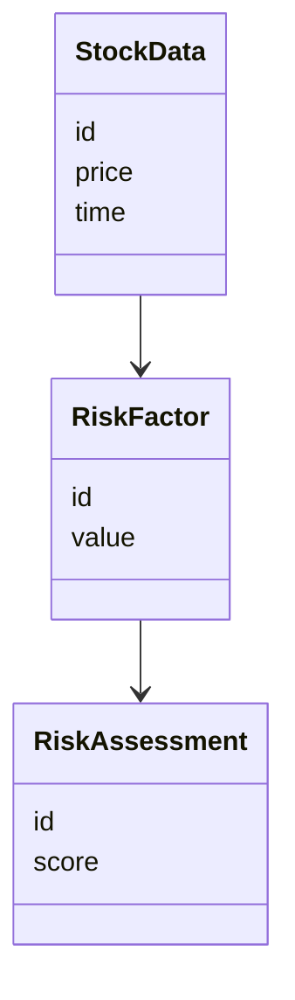

                 


# 如何利用特价股票策略应对数字化再中心化风险

## 关键词：特价股票策略、数字化再中心化风险、风险管理、算法、系统架构

## 摘要：
本文探讨了如何利用特价股票策略来应对数字化再中心化风险。首先，介绍了特价股票策略和数字化再中心化风险的基本概念和背景。接着，详细分析了两者的核心原理和相互关系，提出了基于时间序列预测的算法模型。然后，设计了系统的功能和架构，并通过实际案例展示了策略的实施过程。最后，总结了最佳实践和未来研究方向。

---

# 第一部分: 特价股票策略与数字化再中心化风险的背景与概念

## 第1章: 特价股票策略概述

### 1.1 特价股票的定义与特点

#### 1.1.1 特价股票的定义
特价股票是指在特定市场条件下，价格远低于其内在价值的股票。这种低价通常是由于市场波动、公司特定事件或投资者情绪影响导致的暂时性低估。

#### 1.1.2 特价股票的核心特点
- **低估值**：市场价格低于内在价值。
- **周期性**：通常出现在市场低迷期或公司困境时期。
- **高潜力**：低价股票在反弹时具有较高的收益潜力。

#### 1.1.3 特价股票与普通股票的区别
| 特性          | 特价股票                          | 普通股票                          |
|---------------|-----------------------------------|------------------------------------|
| 价格          | 低于内在价值                     | 接近或高于内在价值               |
| 投资风险      | 较高                             | 较低或适中                        |
| 收益潜力      | 较高                             | 较低或适中                        |

### 1.2 特价股票策略的背景

#### 1.2.1 特价股票策略的历史发展
- 20世纪初：格雷厄姆和多德提出价值投资理论，为特价股票策略奠定了基础。
- 20世纪末：量化交易兴起，技术分析和算法交易开始应用于特价股票策略。
- 当前：大数据和人工智能技术进一步提升了特价股票策略的精准度。

#### 1.2.2 当前市场环境下特价股票策略的适用性
- 市场波动加剧：新冠疫情和地缘政治冲突增加了市场不确定性，为特价股票策略提供了更多机会。
- 技术进步：大数据和AI技术使得识别低价股票的模式更加高效。

#### 1.2.3 特价股票策略的优缺点分析

| 优点          | 缺点                          |
|---------------|------------------------------|
| 高收益潜力    | 高风险                       |
| 适合长期投资  | 需要较高的市场敏感度          |

---

## 第2章: 数字化再中心化风险概述

### 2.1 数字化再中心化风险的定义

#### 2.1.1 数字化再中心化的概念
数字化再中心化是指在数字化转型过程中，企业将数据和业务流程集中在少数几个平台或技术中心，导致数据集中化和依赖性增加。

#### 2.1.2 再中心化风险的定义
再中心化风险是指由于数据和业务的过度集中，可能引发的技术故障、数据泄露或服务中断等风险。

#### 2.1.3 数字化再中心化风险的特点
- **集中性**：数据和业务集中在少数平台。
- **依赖性**：企业和用户高度依赖这些平台。
- **脆弱性**：集中化的系统更容易受到攻击。

### 2.2 数字化再中心化风险的背景

#### 2.2.1 数字化转型对企业的影响
- 提高效率：通过数字化手段优化业务流程。
- 数据驱动决策：利用数据进行精准营销和风险管理。
- 新业务模式：数字化转型催生了新的商业模式。

#### 2.2.2 再中心化风险的现状
- **技术集中**：云计算和大数据平台的集中化导致技术依赖。
- **数据集中**：用户数据的集中存储增加了数据泄露风险。
- **服务中断**：集中化系统一旦崩溃，可能引发连锁反应。

#### 2.2.3 数字化再中心化风险对企业的影响
- **声誉损失**：数据泄露可能导致企业声誉受损。
- **经济损失**：服务中断可能导致收入下降。
- **合规风险**：数据集中化可能违反数据保护法规。

### 2.3 数字化再中心化风险的分类

| 类型          | 描述                          |
|---------------|------------------------------|
| 数据集中化风险 | 数据过度集中导致的安全风险    |
| 技术依赖风险  | 对特定技术或平台的高度依赖    |
| 市场风险      | 市场变化对集中化业务的影响    |

---

# 第二部分: 特价股票策略与数字化再中心化风险的核心概念与联系

## 第3章: 特价股票策略的核心原理

### 3.1 特价股票策略的数学模型

#### 3.1.1 特价股票价格预测模型
基于时间序列分析的预测模型：
$$ P(t) = a \cdot P(t-1) + b \cdot \epsilon $$

其中：
- \( P(t) \)：第t时刻的股票价格。
- \( a \)：自回归系数。
- \( b \)：误差项系数。
- \( \epsilon \)：随机误差项。

#### 3.1.2 基于时间序列的预测方法
使用ARIMA模型进行股票价格预测：
$$ ARIMA(p, d, q) $$

其中：
- \( p \)：自回归阶数。
- \( d \)：差分阶数。
- \( q \)：移动平均阶数。

#### 3.1.3 特价股票策略的数学公式
$$ \text{收益} = \text{卖出价} - \text{买入价} $$

---

### 3.2 特价股票策略的算法实现

#### 3.2.1 时间序列预测算法
使用Python实现ARIMA模型：

```python
from statsmodels.tsa.arima_model import ARIMA
import pandas as pd

# 加载数据
data = pd.read_csv('stock_prices.csv')

# 训练模型
model = ARIMA(data['price'], order=(5, 1, 0))
model_fit = model.fit()

# 预测未来价格
forecast = model_fit.forecast(steps=10)
```

#### 3.2.2 价格异常检测算法
使用Isolation Forest算法检测异常低价：

```python
from sklearn.ensemble import IsolationForest

# 初始化模型
iso_forest = IsolationForest(contamination=0.05)

# 训练模型
iso_forest.fit(data[['open', 'high', 'low', 'close']])

# 预测异常点
outliers = iso_forest.predict(data[['open', 'high', 'low', 'close']])
```

---

## 第4章: 数字化再中心化风险的数学建模与分析

### 4.1 数字化再中心化风险的数学模型

#### 4.1.1 集中化风险评估模型
$$ R = \sum_{i=1}^{n} w_i \cdot r_i $$

其中：
- \( R \)：总风险。
- \( w_i \)：第i个因素的权重。
- \( r_i \)：第i个因素的风险值。

#### 4.1.2 数据依赖性分析模型
$$ D = \sum_{j=1}^{m} \frac{d_j}{m} $$

其中：
- \( D \)：数据依赖度。
- \( d_j \)：第j个数据源的依赖度。
- \( m \)：数据源总数。

---

### 4.2 数字化再中心化风险的算法实现

#### 4.2.1 风险评估算法
使用Python实现风险评估：

```python
import numpy as np

# 定义风险评估函数
def risk_assessment(data):
    weights = np.array([0.4, 0.3, 0.2, 0.1])
    risks = np.array([0.8, 0.6, 0.4, 0.2])
    total_risk = np.dot(weights, risks)
    return total_risk

# 计算总风险
total_risk = risk_assessment(data)
print(f"Total Risk: {total_risk}")
```

---

## 第5章: 系统架构与设计

### 5.1 系统功能设计

#### 5.1.1 领域模型


#### 5.1.2 系统架构
```mermaid
docker
    services:
      - name: stock_data_service
        image: stock_data_service:1.0.0
        ports:
          - "8080:8080"
        depends_on:
          - data_storage
      - name: risk_assessment_service
        image: risk_assessment_service:1.0.0
        ports:
          - "8081:8081"
        depends_on:
          - stock_data_service
      - name: data_storage
        image: postgres:13
        volumes:
          - ./data:/var/lib/postgresql/data
```

---

## 第6章: 项目实战与案例分析

### 6.1 项目环境安装

#### 6.1.1 安装依赖
```bash
pip install statsmodels scikit-learn mermaid-docker
```

#### 6.1.2 启动服务
```bash
docker-compose up -d
```

---

## 第7章: 总结与展望

### 7.1 总结
通过利用特价股票策略，企业可以在数字化再中心化风险中找到投资机会。同时，科学的系统架构和算法模型能够有效降低风险，保障投资安全。

### 7.2 展望
未来，随着AI和大数据技术的进一步发展，特价股票策略和风险评估模型将更加精准和高效。企业需要持续关注市场变化，优化策略，应对新的挑战。

---

## 第8章: 最佳实践与注意事项

### 8.1 最佳实践
- 定期进行市场分析和风险评估。
- 使用可靠的算法和工具，确保预测的准确性。
- 建立完善的数据备份和恢复机制，应对可能出现的技术故障。

### 8.2 注意事项
- 特价股票策略具有高风险，需谨慎操作。
- 数字化再中心化风险可能引发连锁反应，需提前制定应对方案。
- 投资者需保持对市场的敏感性，及时调整策略。

---

通过本文的分析，读者可以深入了解如何利用特价股票策略应对数字化再中心化风险，并在实际操作中应用这些策略和方法。

