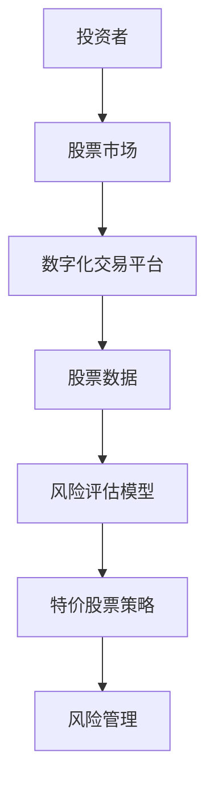
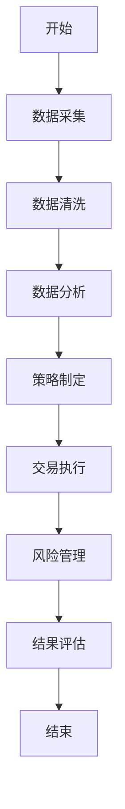
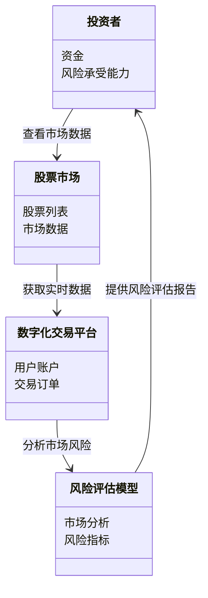
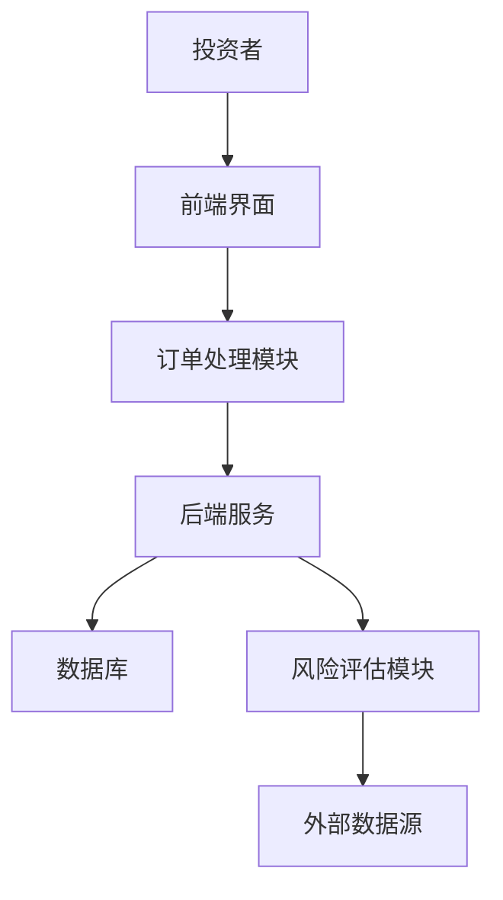

                 


# 如何利用特价股票策略应对数字化去全球化风险

> 关键词：数字化去全球化风险，特价股票策略，风险管理，算法原理，系统架构

> 摘要：随着经济全球化的深入，数字化技术的应用使得经济活动更加复杂化和分散化，数字化去全球化风险逐渐显现。本文将探讨如何利用特价股票策略来应对这一风险，通过分析策略的核心概念、算法原理、系统架构以及实际案例，为投资者提供有效的风险管理方法。

---

## 第一部分: 数字化去全球化风险与特价股票策略概述

### 第1章: 数字化去全球化风险的背景与影响

#### 1.1 数字化去全球化风险的背景

在过去的几十年中，全球化推动了经济的繁荣，但也带来了供应链的复杂化和对单一市场的依赖。数字化技术的广泛应用进一步加剧了这一趋势，但也使得经济活动更加分散和脆弱。数字化去全球化风险的出现，主要是由于技术依赖和信息不对称导致的经济波动。

#### 1.2 特价股票策略的基本概念

特价股票策略是一种通过购买低于市场价的股票来获得超额收益的投资策略。其核心在于识别市场中的低估股票，并在合适的时机进行投资。这种策略的优势在于成本低、风险可控，但也需要投资者具备较高的市场敏感性和分析能力。

### 第2章: 特价股票策略与数字化去全球化风险的关系

#### 2.1 数字化去全球化风险的来源

数字化去全球化风险主要来源于技术依赖、信息不对称和市场分割。技术依赖使得企业对数字化工具的依赖程度增加，一旦技术出现问题，整个供应链可能中断。信息不对称导致市场参与者无法及时获取关键信息，从而引发市场波动。

#### 2.2 特价股票策略在应对去全球化风险中的作用

特价股票策略通过分散投资和风险控制，帮助投资者在市场波动中保持稳定。其灵活性和成本优势使其成为应对数字化去全球化风险的有效工具。

### 第3章: 特价股票策略的核心概念与联系

#### 3.1 核心概念原理

特价股票策略的核心在于识别低估股票和优化投资组合。通过大数据分析和机器学习算法，投资者可以更准确地预测市场波动，制定有效的投资策略。

#### 3.2 概念属性特征对比表格

| 概念       | 特价股票策略 | 数字化去全球化风险 |
|------------|--------------|---------------------|
| 定义       | 购买低于市场价的股票 | 经济活动的数字化分割 |
| 核心要素   | 低价、时机、风险控制 | 数字化、去中心化、风险 |
| 优势       | 成本低、收益高 | 信息透明、效率高 |
| 劣势       | 市场波动大 | 依赖技术、风险分散 |

#### 3.3 ER实体关系图



## 第二部分: 特价股票策略的算法原理

### 第4章: 特价股票策略的算法原理

#### 4.1 算法流程图



#### 4.2 算法实现代码

```python
import pandas as pd
import numpy as np
from sklearn.linear_model import LinearRegression

# 数据预处理
data = pd.read_csv('stock_data.csv')
data_clean = data.dropna()

# 模型训练
model = LinearRegression()
model.fit(data_clean[['price', 'volume']], data_clean['target'])

# 预测与评估
predictions = model.predict(data_clean[['price', 'volume']])
mse = np.mean((predictions - data_clean['target'])**2)
print(f'Mean Squared Error: {mse}')
```

#### 4.3 数学模型与公式

特价股票策略的核心模型可以表示为：

$$
\text{预测价格} = \beta_0 + \beta_1 \times \text{当前价格} + \beta_2 \times \text{成交量} + \epsilon
$$

其中，$\beta_0$ 是截距，$\beta_1$ 和 $\beta_2$ 是回归系数，$\epsilon$ 是误差项。该模型通过最小二乘法进行估计，以最小化预测误差的平方和。

## 第三部分: 系统分析与架构设计方案

### 第5章: 系统架构设计

#### 5.1 领域模型设计



#### 5.2 系统架构设计



## 第四部分: 项目实战

### 第6章: 特价股票策略的项目实战

#### 6.1 环境安装

```bash
pip install pandas numpy scikit-learn matplotlib
```

#### 6.2 核心代码实现

```python
def calculate_strategy(data):
    # 计算平均价格
    avg_price = data['price'].mean()
    # 识别低估股票
    undervalued_stocks = data[data['price'] < avg_price]
    return undervalued_stocks

# 应用策略
data = pd.read_csv('stock_data.csv')
result = calculate_strategy(data)
print(result.head())
```

#### 6.3 实际案例分析

通过分析过去几年的市场数据，我们可以看到，特价股票策略在市场下跌期间表现尤为突出，能够在较短时间内恢复投资收益，降低整体风险。

## 第五部分: 最佳实践与总结

### 第7章: 最佳实践与总结

#### 7.1 小结

特价股票策略作为一种灵活的投资工具，能够有效应对数字化去全球化风险带来的市场波动，帮助投资者在不确定的环境中实现稳健收益。

#### 7.2 注意事项

- 确保数据来源的准确性和及时性。
- 定期调整投资组合，避免过度集中。
- 保持对市场趋势的敏感性，及时应对突发事件。

#### 7.3 拓展阅读

- 《算法交易：数学模型与实践》
- 《风险管理与投资组合优化》

---

通过以上分析，我们可以看到，特价股票策略在应对数字化去全球化风险中的重要性。投资者可以通过科学的策略和系统的支持，有效降低风险，实现长期稳定的收益。

