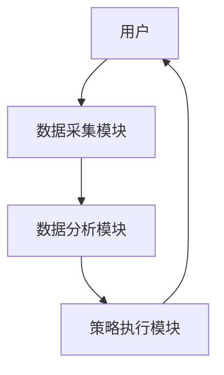
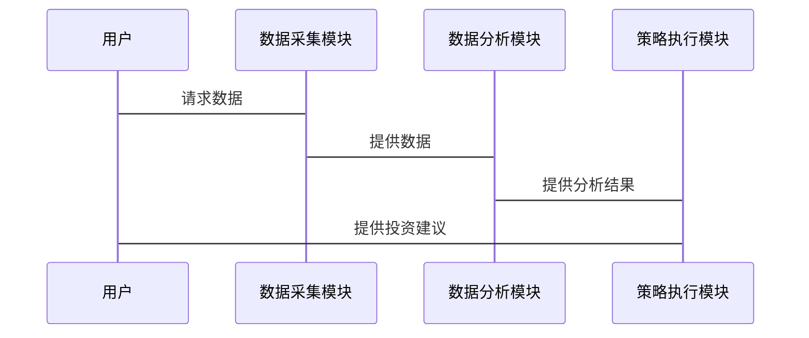

                 


```markdown
# 如何利用特价股票策略应对货币政策变化

> 关键词：货币政策变化、特价股票策略、股市影响、投资策略、风险管理、数学模型

> 摘要：本文详细探讨了如何利用特价股票策略应对货币政策变化。首先介绍了货币政策的基本概念及其对股市的影响，接着分析了特价股票策略的定义、类型和优势，然后重点阐述了在货币政策变化下特价股票策略的具体应用，包括数学模型的建立和系统架构设计。通过实际案例分析和项目实战，展示了如何在实际操作中应用这些策略，并提供了最佳实践和总结。

---

## 第1章: 货币政策变化与股市影响

### 1.1 货币政策的基本概念
#### 1.1.1 货币政策的定义与目标
货币政策是由中央银行制定的，通过调节货币供应量和利率等手段来影响经济活动的政策。其主要目标包括控制通货膨胀、促进就业和维持经济增长。

#### 1.1.2 货币政策的工具与实施方式
中央银行常用的货币政策工具包括公开市场操作、调整法定存款准备金率和调整再贴现率等。这些工具通过影响银行的流动性来调节市场利率和货币供应量。

#### 1.1.3 货币政策对经济的影响机制
货币政策通过影响利率、信贷供给和货币流动性来调节经济。例如，降低利率可以刺激借贷和投资，从而促进经济增长。

### 1.2 货币政策变化对股市的具体影响
#### 1.2.1 货币政策变化对股市的整体影响
货币政策的变化直接影响市场利率和资金流动性，进而影响股市的整体表现。例如，宽松的货币政策通常会推高股价，而紧缩的货币政策则可能导致股价下跌。

#### 1.2.2 量化宽松政策的股市效应
量化宽松政策通过中央银行购买国债和其他资产，增加市场流动性，降低利率，从而刺激股市上涨。这种政策通常在经济衰退时实施，旨在提振市场信心。

#### 1.2.3 利率调整对股市的传导路径
利率的变化直接影响企业的融资成本和个人投资者的借贷成本。降低利率通常会增加企业的投资活动和个人的消费支出，从而推动股市上涨。

### 1.3 货币政策与股市波动的关系
#### 1.3.1 货币政策变化引发的股市波动
货币政策的变化往往会导致市场的不确定性增加，从而引发股市波动。例如，意外的加息可能会导致股市短期下跌。

#### 1.3.2 股市对货币政策预期的反应
市场参与者通常会对未来的货币政策变化进行预期。如果市场预期央行将实施宽松政策，股市可能会提前上涨。

#### 1.3.3 货币政策与股市波动的互动机制
货币政策的变化不仅会影响股市，股市的波动也会反过来影响货币政策的制定。例如，股市的大幅下跌可能会促使央行采取更宽松的货币政策以稳定市场。

---

## 第2章: 特价股票策略概述

### 2.1 特价股票的定义与特点
#### 2.1.1 特价股票的定义
特价股票是指价格低于其内在价值的股票，通常具有较高的投资价值。这些股票可能因为市场波动、暂时的负面消息或其他原因而被低估。

#### 2.1.2 特价股票的特点
- **低估值**：特价股票的市场价格低于其内在价值。
- **高分红潜力**：许多特价股票来自盈利稳定、分红能力强的公司。
- **风险较低**：相对于高增长股票，特价股票的风险较低。

#### 2.1.3 特价股票与普通股票的区别
普通股票的价格主要反映市场情绪和短期波动，而特价股票则更关注公司的基本面和长期价值。

### 2.2 特价股票策略的类型
#### 2.2.1 价值投资策略
价值投资策略强调购买被市场低估的股票，并长期持有，等待其价值回归。

#### 2.2.2 技术分析策略
技术分析策略通过分析股票的价格走势和成交量，寻找买入和卖出的最佳时机。

#### 2.2.3 股息投资策略
股息投资策略关注那些股息收益率高的股票，适合长期稳定的投资。

### 2.3 特价股票策略的优势与劣势
#### 2.3.1 特价股票策略的优势
- **低风险**：特价股票通常来自稳定的企业，风险较低。
- **高回报潜力**：低估的股票有较大的上涨空间。

#### 2.3.2 特价股票策略的劣势
- **流动性风险**：某些特价股票可能流动性较差，难以迅速变现。
- **需要深入分析**：识别真正的特价股票需要详细的研究和分析。

#### 2.3.3 特价股票策略的适用场景
特价股票策略适用于长期投资，尤其是在市场低迷时期，寻找被低估的股票进行投资。

---

## 第3章: 特价股票策略在货币政策变化中的应用

### 3.1 货币政策变化对特价股票的影响
#### 3.1.1 货币政策变化对特价股票价格的影响
货币政策的变化会影响市场的整体流动性，进而影响特价股票的价格。例如，宽松的货币政策通常会推高股价，而紧缩的货币政策则可能导致股价下跌。

#### 3.1.2 货币政策变化对特价股票流动性的冲击
货币政策的变化会影响市场的流动性，进而影响特价股票的流动性。在流动性不足的情况下，特价股票可能难以迅速变现。

#### 3.1.3 货币政策变化对特价股票风险的影响
货币政策的变化会影响市场的整体风险偏好，进而影响特价股票的风险。在风险偏好下降的情况下，特价股票可能会面临更大的抛售压力。

### 3.2 特价股票策略应对货币政策变化的策略
#### 3.2.1 灵活调整投资组合
在货币政策变化时，投资者应根据市场情况灵活调整投资组合，增加或减少对特价股票的持仓比例。

#### 3.2.2 分散投资
通过分散投资于不同行业的特价股票，可以降低单一股票的风险，同时捕捉多个行业的增长潜力。

#### 3.2.3 短期套利机会
在货币政策变化时，投资者可以利用市场短期波动，寻找套利机会，获取短期收益。

---

## 第4章: 特价股票策略的数学模型与算法

### 4.1 数学模型的建立
#### 4.1.1 股票价格预测模型
建立一个基于货币政策变化的股票价格预测模型，可以通过回归分析来量化货币政策对股价的影响。

#### 4.1.2 回归分析
通过回归分析，可以确定货币政策变量（如利率）对股价的影响程度。

#### 4.1.3 时间序列分析
使用时间序列分析方法，可以预测未来股价的变化趋势。

### 4.2 算法实现
#### 4.2.1 回归分析的Python代码实现
```python
import pandas as pd
import numpy as np
from sklearn.linear_model import LinearRegression

# 假设我们有货币政策变量（如利率）和股价数据
data = pd.DataFrame({
    'interest_rate': [2, 2.5, 3, 3.5, 4],
    'stock_price': [100, 110, 120, 115, 105]
})

# 建立回归模型
model = LinearRegression()
model.fit(data[['interest_rate']], data['stock_price'])

# 预测股价
predicted_price = model.predict([[3.2]])
print(predicted_price)
```

#### 4.2.2 时间序列分析的Python代码实现
```python
import pandas as pd
import numpy as np
from statsmodels.tsa.arima_model import ARIMA

# 假设我们有股价时间序列数据
stock_prices = pd.Series([100, 110, 120, 115, 105], index=pd.date_range('2023-01-01', periods=5))

# 建立ARIMA模型
model = ARIMA(stock_prices, order=(1, 1, 0))
model_fit = model.fit()

# 预测未来股价
forecast = model_fit.forecast(steps=1)
print(forecast)
```

---

## 第5章: 系统架构设计与实现

### 5.1 系统介绍
#### 5.1.1 系统目标
设计一个实时监控和分析系统，帮助投资者根据货币政策变化调整特价股票投资策略。

### 5.2 系统功能设计
#### 5.2.1 数据采集模块
- 从金融数据源获取实时股价和货币政策数据。
- 数据清洗和预处理。

#### 5.2.2 数据分析模块
- 使用回归分析和时间序列分析等方法，分析货币政策对股价的影响。
- 识别潜在的特价股票。

#### 5.2.3 策略执行模块
- 根据分析结果，自动调整投资组合。
- 提供实时监控和提醒功能。

### 5.3 系统架构设计
#### 5.3.1 系统架构图


#### 5.3.2 接口设计
- 数据采集模块提供API接口，供数据分析模块调用。
- 数据分析模块提供API接口，供策略执行模块调用。

#### 5.3.3 交互流程图


---

## 第6章: 项目实战与案例分析

### 6.1 环境安装
#### 6.1.1 安装Python和相关库
- 安装Python 3.8或更高版本。
- 安装必要的库，如pandas、numpy、scikit-learn、statsmodels等。

### 6.2 核心代码实现
#### 6.2.1 数据采集
```python
import pandas as pd
import requests

# 从金融数据源获取数据
url = 'https://api.example.com/stock_data'
response = requests.get(url)
data = pd.read_json(response.text)
```

#### 6.2.2 数据分析
```python
import pandas as pd
from sklearn.linear_model import LinearRegression

# 建立回归模型
model = LinearRegression()
model.fit(data[['interest_rate']], data['stock_price'])

# 预测股价
predicted_price = model.predict([[3.2]])
print(predicted_price)
```

### 6.3 案例分析
#### 6.3.1 案例背景
假设当前货币政策宽松，预期未来会有更多的量化宽松政策。

#### 6.3.2 分析过程
通过回归分析，发现利率下降时，股价通常会上涨。

#### 6.3.3 投资建议
建议增加对低估股票的投资，尤其是那些股息收益率高的股票。

---

## 第7章: 总结与最佳实践

### 7.1 最佳实践
- **持续学习**：关注货币政策变化和市场动态，及时调整投资策略。
- **风险管理**：分散投资，避免过度集中于单一股票或行业。
- **技术工具**：利用数据分析工具和算法模型，提高投资决策的科学性。

### 7.2 项目总结
通过本文的分析和实战，我们可以看到，利用特价股票策略应对货币政策变化是可行的。关键在于选择合适的策略，并灵活调整投资组合。

### 7.3 未来展望
未来，随着人工智能和大数据技术的发展，我们可以开发更复杂的模型和系统，进一步提高投资决策的准确性和效率。

---

## 附录

### 附录A: 工具安装指南
- 安装Python和Jupyter Notebook。
- 安装必要的库，如pandas、numpy、scikit-learn等。

### 附录B: 数据来源
- 提供几个可靠的金融数据源，如Yahoo Finance、Google Finance等。

### 附录C: 进一步阅读
- 推荐一些关于货币政策和股票投资的书籍和文章。

---

通过以上结构，我们可以系统地了解如何利用特价股票策略应对货币政策变化，并在实际操作中应用这些策略。希望本文对投资者和相关从业人员有所帮助。
```

