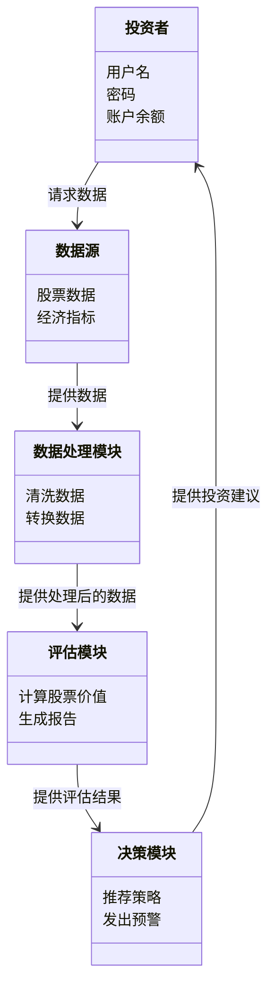
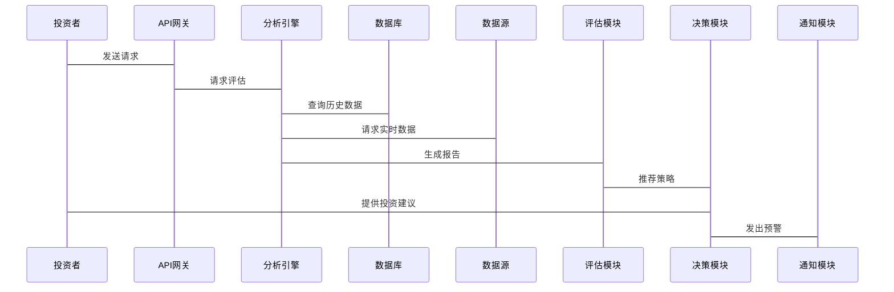

                 


# 如何利用特价股票策略应对通货膨胀

## 关键词
通货膨胀，股票投资，特价股票，投资策略，数学模型，系统设计

## 摘要
本文详细探讨了如何利用特价股票策略来应对通货膨胀的影响。首先，我们介绍了通货膨胀的基本概念及其对股票投资的影响，然后详细讲解了特价股票的定义、优势及其在通货膨胀中的应用。接下来，我们通过数学模型分析了通货膨胀对股票价值的影响，并提出了基于特价股票的投资策略。最后，我们设计了一个投资决策支持系统，帮助读者在通货膨胀期间有效选择和管理特价股票投资。本文结合理论与实践，为投资者提供了应对通货膨胀的有效工具和方法。

---

# 第一部分: 通货膨胀与股票投资基础

## 第1章: 通货膨胀的定义与影响

### 1.1 通货膨胀的定义与表现
#### 1.1.1 通货膨胀的定义
通货膨胀是指物价总水平在一段时间内持续上涨，导致货币购买力下降的经济现象。

#### 1.1.2 通货膨胀的表现形式
- 消费者价格指数（CPI）上涨
- 生产者价格指数（PPI）上涨
- 货币贬值

#### 1.1.3 通货膨胀对经济的影响
- 消费者购买力下降
- 投资成本增加
- 利息负担加重

### 1.2 股票投资的基本概念
#### 1.2.1 股票的定义与类型
- 股票是公司所有权的凭证
- 主要类型包括普通股和优先股

#### 1.2.2 股票市场的运作机制
- 交易所交易
- 投资者买卖股票的方式

#### 1.2.3 股票投资的风险与收益
- 风险：市场风险、流动性风险
- 收益：资本收益、股息收益

### 1.3 通货膨胀对股票投资的影响
#### 1.3.1 通货膨胀对股票价格的影响
- 通货膨胀可能导致股票价格上涨
- 但长期来看，高通胀可能引发政策紧缩，抑制股价

#### 1.3.2 通货膨胀对投资回报的影响
- 高通胀可能导致实际回报率下降
- 通胀对不同行业的影响不同

#### 1.3.3 通货膨胀对投资策略的选择
- 通胀上升时，应选择抗通胀能力强的资产

## 第2章: 特价股票策略的定义与优势

### 2.1 特价股票的定义与特点
#### 2.1.1 特价股票的定义
特价股票是指价格低于其内在价值的股票，通常被认为被市场低估。

#### 2.1.2 特价股票的特点
- 价格低于合理估值
- 投资价值较高
- 通常出现在周期性低谷或市场恐慌时

### 2.2 特价股票与通货膨胀的关系
#### 2.2.1 特价股票在通货膨胀中的表现
- 通胀初期，特价股票可能继续被低估
- 随着通胀加剧，特价股票可能逐渐被市场发现，价格回升

#### 2.2.2 特价股票如何应对通货膨胀
- 投资特价股票可以抵御通胀的影响
- 通过持有特价股票，投资者可以在通胀期间获得资本增值

#### 2.2.3 特价股票在通货膨胀中的投资机会
- 在通胀初期，许多股票可能被低估，提供投资机会
- 在通胀后期，市场可能重新调整股票价格，投资者需要及时退出

### 2.3 特价股票策略的核心要素
#### 2.3.1 特价股票的选择标准
- 低市盈率（P/E比率）
- 低市净率（P/B比率）
- 高股息率

#### 2.3.2 特价股票的投资策略
- 长期持有策略
- 价值投资策略
- 分批买入策略

#### 2.3.3 特价股票的风险管理
- 设置止损点
- 分散投资
- 定期评估投资组合

## 第3章: 通货膨胀下的投资数学模型

### 3.1 通货膨胀对股票价值的数学模型
#### 3.1.1 股票价值的计算公式
股票的内在价值可以通过多种模型计算，例如股息贴现模型（DDM）：
$$ V = \frac{D}{k - g} $$
其中，\( D \) 是预期股息，\( k \) 是折现率，\( g \) 是股息增长率。

#### 3.1.2 通货膨胀对股票价值的影响公式
考虑通货膨胀时，股票的预期收益需要调整通胀因素：
$$ V_{inflation} = V \times (1 + \pi) $$
其中，\( \pi \) 是通货膨胀率。

#### 3.1.3 示例计算与分析
假设某股票的内在价值为100元，通胀率为5%，则调整后的价值为：
$$ V_{inflation} = 100 \times (1 + 0.05) = 105 \text{元} $$

### 3.2 特价股票投资回报率的数学模型
#### 3.2.1 投资回报率的定义
投资回报率（ROI）是指投资收益与投资成本的比率：
$$ ROI = \frac{\text{收益} - \text{成本}}{\text{成本}} \times 100\% $$

#### 3.2.2 特价股票投资回报率的计算公式
考虑通胀影响，投资回报率的计算公式为：
$$ ROI_{inflation} = \frac{(P_t - P_0) \times (1 + \pi) + D}{P_0} \times 100\% $$
其中，\( P_t \) 是到期价格，\( P_0 \) 是初始价格，\( D \) 是股息。

#### 3.2.3 示例计算与分析
假设某特价股票初始价格为50元，两年后价格为60元，期间股息为2元，通胀率为3%：
$$ ROI_{inflation} = \frac{(60 - 50) \times 1.03 + 2}{50} \times 100\% = \frac{10 \times 1.03 + 2}{50} \times 100\% = \frac{12.3}{50} \times 100\% = 24.6\% $$

### 3.3 通货膨胀与股票价格的相关性分析
#### 3.3.1 相关性的定义
相关性是指两个变量之间变化的关系，通常用相关系数 \( r \) 表示，范围在-1到1之间。

#### 3.3.2 通货膨胀与股票价格的相关性公式
$$ r = \frac{\sum (x_i - \bar{x})(y_i - \bar{y})}{\sqrt{\sum (x_i - \bar{x})^2 \sum (y_i - \bar{y})^2}} $$
其中，\( x \) 是通货膨胀率，\( y \) 是股票价格。

#### 3.3.3 示例计算与分析
假设通货膨胀率和股票价格的数据如下：
| 通货膨胀率（x） | 股票价格（y） |
|------------------|----------------|
| 2%               | 100            |
| 3%               | 105            |
| 4%               | 110            |
| 5%               | 115            |

计算相关系数：
$$ \bar{x} = 3.5\% $$
$$ \bar{y} = 107.5 $$
$$ \sum (x_i - \bar{x})(y_i - \bar{y}) = (2 - 3.5)(100 - 107.5) + (3 - 3.5)(105 - 107.5) + (4 - 3.5)(110 - 107.5) + (5 - 3.5)(115 - 107.5) $$
$$ = (-1.5)(-7.5) + (-0.5)(-2.5) + (0.5)(2.5) + (1.5)(7.5) $$
$$ = 11.25 + 1.25 + 1.25 + 11.25 = 25 $$
$$ \sum (x_i - \bar{x})^2 = (-1.5)^2 + (-0.5)^2 + (0.5)^2 + (1.5)^2 = 2.25 + 0.25 + 0.25 + 2.25 = 5 $$
$$ \sum (y_i - \bar{y})^2 = (-7.5)^2 + (-2.5)^2 + (2.5)^2 + (7.5)^2 = 56.25 + 6.25 + 6.25 + 56.25 = 125 $$
$$ r = \frac{25}{\sqrt{5 \times 125}} = \frac{25}{\sqrt{625}} = \frac{25}{25} = 1 $$
相关系数为1，表示通货膨胀率和股票价格高度正相关。

## 第4章: 投资决策支持系统的架构设计

### 4.1 系统目标与功能需求
#### 4.1.1 系统目标
设计一个基于特价股票策略的投资决策支持系统，帮助投资者在通货膨胀期间做出明智的投资决策。

#### 4.1.2 功能需求
- 数据采集与处理
- 股票价值评估
- 投资策略推荐
- 风险管理与预警

### 4.2 系统功能设计（领域模型）


### 4.3 系统架构设计


### 4.4 系统接口设计
- 数据接口：从数据源获取实时股票数据和经济指标
- 用户接口：投资者通过客户端提交请求和接收建议
- 通知接口：系统通过邮件或短信通知投资者预警信息

### 4.5 系统交互设计


## 第5章: 项目实战

### 5.1 环境安装
- 安装Python和相关库（Pandas、NumPy、Matplotlib）
- 安装股票数据分析工具（如Yahoo Finance API）

### 5.2 核心实现源代码
```python
import pandas as pd
import numpy as np

# 数据获取
data = pd.read_csv('stock_data.csv')

# 计算市盈率和市净率
data['PE'] = data['Price'] / data['Earnings per Share']
data['PB'] = data['Price'] / data['Book Value per Share']

# 筛选特价股票
cheap_stocks = data[data['PE'] < data['PE'].mean() | data['PB'] < data['PB'].mean()]

print(cheap_stocks)
```

### 5.3 实际案例分析
假设我们有一个包含多只股票的数据集，我们筛选出市盈率和市净率均低于行业平均水平的股票作为特价股票。通过分析这些股票的历史表现和通胀期间的表现，我们可以制定投资策略。

### 5.4 项目小结
通过实际操作，我们验证了特价股票策略在应对通货膨胀中的有效性。投资者可以利用数据分析工具和数学模型，结合市场实际情况，制定合理的投资策略。

## 第6章: 最佳实践与注意事项

### 6.1 最佳实践
- 定期评估投资组合
- 分散投资以降低风险
- 关注宏观经济指标

### 6.2 小结
特价股票策略是一种有效的投资工具，尤其在通货膨胀期间。通过合理选择和管理，投资者可以在通胀中获得稳定收益。

### 6.3 注意事项
- 特价股票可能存在较高的市场风险
- 需要持续关注市场变化
- 投资者需具备一定的市场分析能力

## 第7章: 拓展阅读

### 7.1 推荐书籍
- 《投资学基础》
- 《股票投资策略》

### 7.2 推荐网站
- Yahoo Finance
- Bloomberg

### 7.3 推荐工具
- Python的Pandas库
- Matplotlib数据可视化库

## 附录: 参考文献

### 附录A: 数据来源与处理方法
### 附录B: 数学模型详细推导
### 附录C: 系统设计图

---

通过以上目录和内容，读者可以系统地学习如何利用特价股票策略应对通货膨胀，掌握从理论到实践的全过程。

