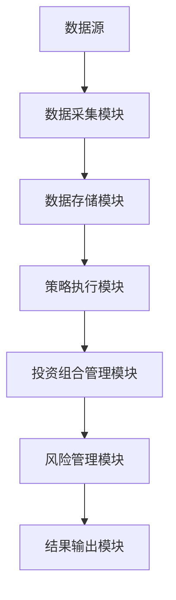

                 


# 如何利用特价股票策略应对通货膨胀风险

> 关键词：特价股票、通货膨胀、投资策略、风险管理、股票市场

> 摘要：本文将深入探讨如何利用特价股票策略来应对通货膨胀风险。首先，我们将介绍通货膨胀的定义及其对股票市场的潜在影响。接着，我们将详细讲解特价股票的定义、特点及其在通货膨胀周期中的优势。通过构建数学模型和算法，我们还将分析如何利用这些工具进行通货膨胀预测和投资决策。最后，我们将通过实际案例展示如何设计和实现一个基于特价股票策略的投资管理系统，并讨论其风险管理与优化策略。

---

# 第一部分: 特价股票策略与通货膨胀风险概述

## 第1章: 通货膨胀的定义与影响

### 1.1 通货膨胀的定义与特征

#### 1.1.1 通货膨胀的基本概念

通货膨胀是指物价总水平在一段时间内持续上涨的经济现象。通常，通货膨胀可以用消费者价格指数（CPI）或生产者价格指数（PPI）来衡量。通货膨胀对经济有双重影响：适度的通货膨胀可以刺激经济增长，而过高的通货膨胀则可能导致货币购买力下降，经济不稳定。

#### 1.1.2 通货膨胀的度量方法

通货膨胀通常通过CPI和PPI来衡量。CPI反映了消费者购买商品和服务的价格变化，而PPI则反映了生产环节的价格变化。计算通货膨胀率的公式如下：

$$ \text{通货膨胀率} = \frac{\text{当期价格指数} - \text{基期价格指数}}{\text{基期价格指数}} \times 100\% $$

#### 1.1.3 通货膨胀对企业与个人的影响

通货膨胀对企业的影响包括成本上升、利润下降，但适度的通货膨胀也可能刺激销售和投资。对个人来说，通货膨胀可能导致实际收入下降，但如果投资收益跑赢通胀，个人财富仍可能增长。

### 1.2 投资在通货膨胀环境中的作用

#### 1.2.1 投资作为对抗通货膨胀的工具

在通货膨胀期间，货币的购买力下降，因此通过投资实物资产（如股票、房地产）或通胀对冲工具（如黄金）可以保护财富不被侵蚀。

#### 1.2.2 通货膨胀对资产价格的影响

通货膨胀可能导致股票价格波动。某些行业（如能源、原材料）可能在通胀期间表现较好，而防御性行业（如公用事业）可能表现稳定。

#### 1.2.3 投资者在通货膨胀周期中的角色

投资者需要在通货膨胀周期中调整投资组合，选择能够抵御通胀影响的资产。通过分散投资和风险对冲，投资者可以在通胀环境下实现资产保值和增值。

## 第2章: 特价股票策略的定义与特点

### 2.1 特价股票的定义与分类

#### 2.1.1 特价股票的基本概念

特价股票是指市场价格低于其内在价值的股票。这类股票通常被市场低估，具有较高的安全边际，适合长期投资者。

#### 2.1.2 特价股票的分类与特点

特价股票可以分为以下几类：
- **低估值股票**：市盈率、市净率等估值指标低于行业平均水平。
- **高股息股票**：股息收益率较高，能够为投资者提供稳定的现金流。
- **价值回归股票**：市场价格远低于其内在价值，具有较大的上涨潜力。

#### 2.1.3 特价股票与普通股票的区别

| 属性 | 特价股票 | 普通股票 |
|------|----------|----------|
| 估值 | 低于行业平均水平 | 与行业平均水平持平或高于 |
| 股息收益率 | 高 | 中等或低 |
| 风险 | 较低（价值回归） | 较高（市场波动） |

### 2.2 特价股票策略的核心要素

#### 2.2.1 低估值与高安全边际

低估值股票通常具有较高的安全边际，即市场价格远低于其内在价值。这种股票在市场波动时具有较强的抗跌性。

#### 2.2.2 高股息率与稳定收益

高股息率的股票能够为投资者提供稳定的现金流，尤其是在通货膨胀期间，股息收益可以部分抵消通胀的影响。

#### 2.2.3 长期持有与价值回归理论

价值投资理论认为，市场价格最终会回归其内在价值。通过长期持有特价股票，投资者可以等待价值回归，实现资本增值。

## 第3章: 特价股票策略在通货膨胀中的作用

### 3.1 通货膨胀对股票市场的影响

#### 3.1.1 通货膨胀周期中的股票价格波动

通货膨胀可能导致股票市场出现波动。在通胀初期，企业成本上升，利润可能下降，但通胀后期，企业可能通过提价转移成本压力，股价可能上涨。

#### 3.1.2 通货膨胀对行业与板块的影响

不同行业在通胀周期中的表现差异显著。例如，能源和原材料行业可能受益于价格上涨，而消费者必需品行业可能面临利润率压缩。

#### 3.1.3 通货膨胀对投资者心理的影响

通货膨胀可能导致投资者情绪波动，进而影响市场走势。投资者需要保持冷静，避免盲目跟风。

### 3.2 特价股票策略在通货膨胀中的优势

#### 3.2.1 低估值股票的抗跌性

在通货膨胀初期，低估值股票可能表现不佳，但在通胀后期，随着市场逐步消化成本压力，这些股票可能迎来价值重估。

#### 3.2.2 高股息股票的收益稳定性

高股息股票能够为投资者提供稳定的现金流，尤其是在通胀期间，股息收益可以部分抵消通胀影响。

#### 3.2.3 价值回归的长期性

通过长期持有特价股票，投资者可以等待市场回归理性，实现价值重估。这种策略在通胀周期中尤为重要，因为短期波动可能掩盖长期价值。

---

# 第二部分: 特价股票策略的数学模型与算法

## 第4章: 通货膨胀预测的数学模型

### 4.1 通货膨胀预测的基本原理

通货膨胀预测可以通过时间序列分析、回归分析等方法实现。本文将重点介绍基于ARIMA（自回归积分滑动平均）模型的通货膨胀预测方法。

#### 4.1.1 ARIMA模型的定义

ARIMA模型是一种常用的时间序列分析方法，适用于线性、平稳的时间序列数据。ARIMA模型由自回归（AR）部分和滑动平均（MA）部分组成，通常表示为ARIMA(p, d, q)，其中：
- p：自回归阶数
- d：差分阶数
- q：滑动平均阶数

#### 4.1.2 ARIMA模型的假设条件

- 数据必须是线性且平稳的。
- 数据必须可加，即变量之间的关系是线性的。
- 数据必须具有一定的相关性。

#### 4.1.3 通货膨胀预测的步骤

1. **数据收集**：收集历史CPI数据。
2. **数据预处理**：检查数据的平稳性，必要时进行差分处理。
3. **模型选择**：通过AIC或BIC准则选择最佳的ARIMA模型。
4. **模型训练**：使用训练数据拟合ARIMA模型。
5. **模型验证**：通过残差检验验证模型的准确性。
6. **未来预测**：基于训练好的模型，预测未来的通货膨胀率。

#### 4.1.4 通货膨胀预测的数学公式

ARIMA模型的数学公式如下：

$$ \phi(B)(1 - B)^d X_t = \theta(B) Z_t $$

其中：
- $\phi(B)$ 是自回归多项式
- $(1 - B)^d$ 是差分多项式
- $\theta(B)$ 是滑动平均多项式
- $X_t$ 是观测值
- $Z_t$ 是白噪声

### 4.2 通货膨胀预测的Python实现

#### 4.2.1 环境安装

需要安装以下Python库：
- `pandas`：数据处理
- `numpy`：数值计算
- `statsmodels`：时间序列分析

#### 4.2.2 数据预处理

```python
import pandas as pd
import numpy as np
from statsmodels.tsa.arima_model import ARIMA
import matplotlib.pyplot as plt

# 数据加载
cpi_data = pd.read_csv('cpi.csv')
cpi_data['日期'] = pd.to_datetime(cpi_data['日期'])
cpi_data.set_index('日期', inplace=True)
```

#### 4.2.3 模型训练与预测

```python
# 数据平稳性检验
from statsmodels.tsa.stattools import adfuller
result = adfuller(cpi_data['CPI'])
print('ADF统计量:', result[0])
print('p值:', result[1])

# 差分处理
diff = cpi_data['CPI'].diff().dropna()

# 模型选择
aic = []
for p in range(1, 5):
    for q in range(0, 3):
        try:
            model = ARIMA(diff, order=(p, 0, q))
            model_fit = model.fit(disp=0)
            aic.append((p, q, model_fit.aic))
        except:
            continue

# 选择最优模型
min_aic = min([x[2] for x in aic])
best_pq = [x[0], x[1]] for x in aic if x[2] == min_aic]

model = ARIMA(diff, order=(best_pq[0], 0, best_pq[1]))
model_fit = model.fit(disp=0)

# 预测未来值
forecast = model_fit.forecast(steps=12)
```

#### 4.2.4 模型验证

```python
# 残差检验
residuals = model_fit.resid
import statsmodels.api as sm
sm.qqplot(residuals, line='s')
plt.show()

# 模型准确性检验
from sklearn.metrics import mean_squared_error
train_pred = model_fit.predict()
test_pred = forecast
mse = mean_squared_error(test_pred, diff[-12:])
print('均方误差:', mse)
```

---

## 第5章: 特价股票筛选算法

### 5.1 特价股票筛选的核心指标

#### 5.1.1 市盈率（P/E）

市盈率是股票价格与每股收益的比率，用于衡量股票的估值水平。市盈率越低，可能意味着股票越被低估。

$$ \text{市盈率} = \frac{\text{股价}}{\text{每股收益}} $$

#### 5.1.2 市净率（P/B）

市净率是股票价格与每股净资产的比率，用于衡量股票的估值水平。市净率越低，可能意味着股票越被低估。

$$ \text{市净率} = \frac{\text{股价}}{\text{每股净资产}} $$

#### 5.1.3 股息率（Dividend Yield）

股息率是股息与股价的比率，用于衡量股票的分红能力。

$$ \text{股息率} = \frac{\text{股息}}{\text{股价}} \times 100\% $$

### 5.2 特价股票筛选算法

#### 5.2.1 算法步骤

1. **数据收集**：收集目标股票的基本数据，包括市盈率、市净率、股息率等。
2. **筛选条件**：设定筛选条件，例如市盈率低于行业平均水平，股息率高于行业平均水平。
3. **排序与选择**：根据筛选条件对股票进行排序，选择符合条件的股票作为投资标的。

#### 5.2.2 算法实现

```python
import pandas as pd

# 数据加载
stock_data = pd.read_csv('stock.csv')

# 筛选条件
mask = (stock_data['市盈率'] < stock_data['行业市盈率']) & \
       (stock_data['股息率'] > stock_data['行业股息率'])

# 符合条件的股票
selected_stocks = stock_data[mask]

print(selected_stocks.head())
```

---

## 第6章: 投资组合优化与风险管理

### 6.1 投资组合优化的核心理念

#### 6.1.1 风险与收益的平衡

通过分散投资，投资者可以降低特定股票或行业的风险，同时获得稳定的收益。

#### 6.1.2 现金流管理

在通货膨胀期间，投资者需要关注现金流的安全性，确保能够应对市场波动。

### 6.2 风险管理策略

#### 6.2.1 设置止损点

通过设定止损点，投资者可以在市场出现大幅波动时及时退出，避免更大的损失。

#### 6.2.2 定期再平衡

定期调整投资组合，确保其符合预定的投资目标和风险承受能力。

#### 6.2.3 使用对冲工具

通过使用期货、期权等衍生工具，投资者可以对冲市场风险，降低通货膨胀的影响。

---

# 第三部分: 项目实战与系统架构设计

## 第7章: 投资管理系统设计

### 7.1 系统功能设计

#### 7.1.1 数据采集模块

负责收集股票市场数据、经济指标数据等。

#### 7.1.2 策略执行模块

负责根据预设策略筛选特价股票，生成投资组合。

#### 7.1.3 风险管理模块

负责实时监控投资组合的风险，执行止损和再平衡操作。

### 7.2 系统架构设计

#### 7.2.1 系统架构图



---

## 第8章: 总结与展望

### 8.1 总结

通过利用特价股票策略，投资者可以在通货膨胀期间有效应对风险，实现资产保值和增值。

### 8.2 展望

随着人工智能和大数据技术的发展，未来投资策略将更加智能化和个性化。投资者需要不断学习和适应，以应对复杂的市场环境。

---

# 结语

应对通货膨胀风险是一项长期而复杂的任务，但通过科学的投资策略和有效的风险管理，投资者可以在这场经济博弈中占据优势。希望本文能够为您提供有价值的思路和方法，帮助您在通货膨胀周期中实现投资目标。

