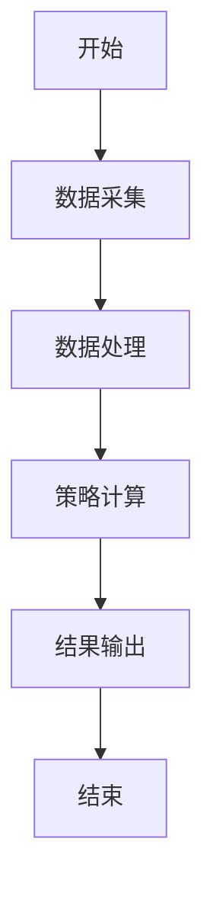
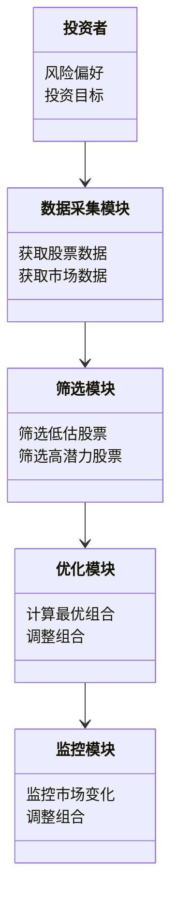

                 


# 如何利用特价股票策略构建全天候投资组合

## 关键词：特价股票、投资组合、风险管理、数学模型、系统架构、项目实战、全天候投资

## 摘要：本文将详细介绍如何利用特价股票策略构建一个全天候的投资组合。通过分析特价股票的定义、特点，结合数学模型和算法，构建最优投资组合，并通过系统架构设计和项目实战，实现稳健的投资收益。

---

## 第1章: 特价股票策略概述

### 1.1 特价股票的定义与特点

#### 1.1.1 特价股票的定义
特价股票是指在特定时间以低于市场价或内在价值出售的股票。这些股票通常具有较高的上涨潜力，但由于市场波动或其他因素，价格被暂时压低。

#### 1.1.2 特价股票的核心特点
- **价格低估**：股票价格低于其内在价值。
- **高潜力**：具有较高的上涨潜力。
- **市场波动性**：受市场情绪影响较大。
- **风险与回报平衡**：相比高价股，风险较低，回报潜力高。

#### 1.1.3 特价股票与普通股票的区别
| 特性 | 特价股票 | 普通股票 |
|------|-----------|----------|
| 价格 | 低于市场价 | 市场价附近 |
| 潜力 | 高 | 中等 |
| 风险 | 中等 | 较高 |
| 时机 | 特定市场周期 | 持续性 |

### 1.2 特价股票策略的背景与重要性

#### 1.2.1 特价股票策略的背景
在市场波动中，投资者寻找低价但有潜力的股票，以期在市场反弹时获得收益。

#### 1.2.2 特价股票策略在投资组合中的重要性
- **分散风险**：通过多样化投资降低风险。
- **提升收益**：利用低价股票的上涨潜力提高整体收益。
- **灵活调整**：根据市场变化及时调整投资组合。

#### 1.2.3 特价股票策略的优势与局限性
- **优势**：风险较低，回报潜力高。
- **局限性**：需要精准识别低估股票，市场波动可能导致短期亏损。

### 1.3 本书的核心目标与结构安排

#### 1.3.1 本书的核心目标
帮助读者掌握特价股票策略，构建稳健的投资组合。

#### 1.3.2 本书的结构安排
- 引言
- 特价股票策略概述
- 数学模型与算法
- 系统架构设计
- 项目实战
- 风险管理
- 进阶内容
- 总结
- 附录

#### 1.3.3 本书的适用读者
适合对股票投资感兴趣，希望利用特价股票策略构建投资组合的投资者。

---

## 第2章: 特价股票策略的核心概念

### 2.1 特价股票策略的基本原理

#### 2.1.1 特价股票策略的基本原理
通过分析股票价格与市场价值的差异，寻找被低估的股票进行投资。

#### 2.1.2 特价股票策略的核心要素
- **市场分析**：研究市场趋势和周期。
- **股票筛选**：识别低估股票。
- **投资组合构建**：根据风险承受能力构建组合。

#### 2.1.3 特价股票策略的实现机制
1. 数据采集：获取股票价格、财务数据等。
2. 筛选模型：应用算法筛选低估股票。
3. 组合优化：根据风险偏好优化组合。

### 2.2 特价股票策略的关键属性

#### 2.2.1 特价股票策略的收益属性
- 高回报潜力
- 中低风险

#### 2.2.2 特价股票策略的风险属性
- 市场波动风险
- 选股错误风险

#### 2.2.3 特价股票策略的时间属性
- 中长期持有
- 短期波动

### 2.3 特价股票策略的实体关系图


---

## 第3章: 特价股票策略的数学模型与算法

### 3.1 特价股票策略的数学模型

#### 3.1.1 特价股票策略的数学模型
使用均值-方差模型优化投资组合。

#### 3.1.2 特价股票策略的数学公式
$$ \text{收益} = \sum_{i=1}^{n} w_i r_i $$
$$ \text{风险} = \sqrt{\sum_{i=1}^{n} w_i^2 \sigma_i^2} $$

#### 3.1.3 特价股票策略的数学模型应用
1. 计算各股票的预期收益和风险。
2. 应用优化算法选择最优组合。

### 3.2 特价股票策略的算法原理

#### 3.2.1 特价股票策略的算法原理
蒙特卡洛模拟用于评估投资组合的潜在风险和收益。

#### 3.2.2 特价股票策略的算法流程
1. 生成随机投资组合。
2. 计算每个组合的收益和风险。
3. 找出最优组合。

#### 3.2.3 特价股票策略的算法实现

```python
import numpy as np

def monte_carlo_simulation(stocks, num_simulations=1000):
    returns = np.mean(stocks, axis=0)
    cov_matrix = np.cov(stocks)
    simulations = np.random.multivariate_normal(returns, cov_matrix, num_simulations)
    returns_simulation = simulations.mean(axis=1)
    risks_simulation = simulations.std(axis=1)
    return returns_simulation, risks_simulation
```

### 3.3 特价股票策略的算法流程图



---

## 第4章: 特价股票策略的系统架构设计

### 4.1 特价股票策略的系统架构

#### 4.1.1 特价股票策略的系统架构
模块化设计，包括数据采集、筛选、优化和监控。

#### 4.1.2 特价股票策略的系统模块
- 数据采集模块
- 筛选模块
- 优化模块
- 监控模块

#### 4.1.3 特价股票策略的系统交互


### 4.2 特价股票策略的系统功能设计

#### 4.2.1 特价股票策的领域模型



---

## 第5章: 特价股票策略的项目实战

### 5.1 特价股票策略的环境安装

#### 5.1.1 安装Python环境
使用Anaconda安装Python和相关库。

#### 5.1.2 安装必要的库
- pandas
- numpy
- matplotlib
- scikit-learn

### 5.2 特价股票策略的核心实现

#### 5.2.1 数据采集模块实现

```python
import pandas as pd
import requests

def get_stock_data(tickers):
    data = []
    for ticker in tickers:
        url = f'https://api.example.com/stock/{ticker}'
        response = requests.get(url)
        data.append(response.json())
    return pd.DataFrame(data)
```

#### 5.2.2 筛选模块实现

```python
def screen_stocks(data):
    # 筛选低估股票
    data['PE'] = data['市盈率']
    data = data[data['PE'] < data['PE'].quantile(0.25)]
    return data
```

#### 5.2.3 优化模块实现

```python
def optimize_portfolio(stocks):
    # 使用均值-方差模型优化
    returns = stocks.mean()
    cov_matrix = stocks.cov()
    inv_cov = np.linalg.inv(cov_matrix)
    weights = inv_cov.dot(np.ones(len(inv_cov)))
    weights = weights / weights.sum()
    return weights
```

### 5.3 特价股票策略的案例分析

#### 5.3.1 数据分析与处理
1. 获取股票数据。
2. 清洗数据，处理缺失值。
3. 计算技术指标。

#### 5.3.2 投资组合优化
1. 应用均值-方差模型。
2. 计算权重并分配资金。

#### 5.3.3 投资组合监控
1. 设置监控指标。
2. 定期调整组合。

### 5.4 特价股票策略的项目小结

#### 5.4.1 核心代码实现
- 数据采集
- 股票筛选
- 投资组合优化

#### 5.4.2 实战案例总结
通过实战案例，验证特价股票策略的有效性，优化投资组合。

---

## 第6章: 特价股票策略的风险管理

### 6.1 特价股票策略的风险管理策略

#### 6.1.1 风险管理策略
- 分散投资
- 定期调整
- 设置止损

#### 6.1.2 风险管理模型
使用VaR模型评估潜在损失。

### 6.2 特价股票策略的风险管理实施

#### 6.2.1 风险管理实施步骤
1. 定义风险容忍度。
2. 应用VaR模型。
3. 监控和调整。

#### 6.2.2 风险管理代码实现

```python
def calculate VaR(data, confidence_level=0.95):
    returns = data['收益'].sort_values()
    VaR = returns[int(len(returns) * (1 - confidence_level))]
    return VaR
```

### 6.3 特价股票策略的风险管理案例分析

#### 6.3.1 风险管理案例
分析市场波动对投资组合的影响，调整策略。

#### 6.3.2 风险管理小结
通过风险管理，降低投资组合的整体风险。

---

## 第7章: 特价股票策略的进阶内容

### 7.1 特价股票策略的高级主题

#### 7.1.1 人工智能在特价股票策略中的应用
使用机器学习模型预测股票价格。

#### 7.1.2 大数据分析在特价股票策略中的应用
利用大数据分析市场趋势。

### 7.2 特价股票策略的前沿动态

#### 7.2.1 新的算法与模型
如强化学习在投资组合优化中的应用。

#### 7.2.2 特价股票策略的未来趋势
智能化、个性化投资组合构建。

---

## 第8章: 总结与展望

### 8.1 特价股票策略的核心总结
- 特价股票策略是构建投资组合的重要工具。
- 需要结合数学模型和系统架构进行优化。

### 8.2 特价股票策略的未来展望
- 结合人工智能技术，优化投资组合。
- 更加个性化和智能化的投资策略。

---

## 第9章: 附录

### 9.1 特价股票策略的代码汇总
- 数据采集代码
- 股票筛选代码
- 投资组合优化代码
- 风险管理代码

### 9.2 特价股票策略的工具列表
- Python
- pandas
- numpy
- matplotlib
- scikit-learn

---

通过以上详细的结构和内容安排，本文系统地介绍了如何利用特价股票策略构建全天候投资组合。从基础概念到实战案例，再到风险管理，帮助读者全面掌握相关知识，实现稳健的投资收益。

