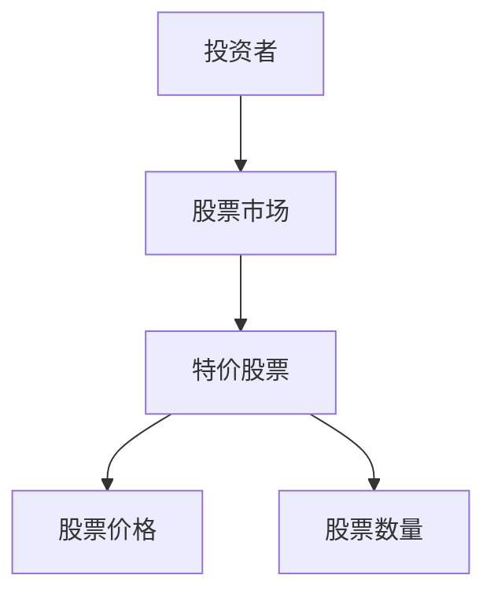
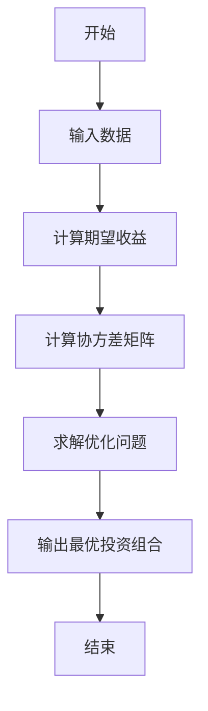
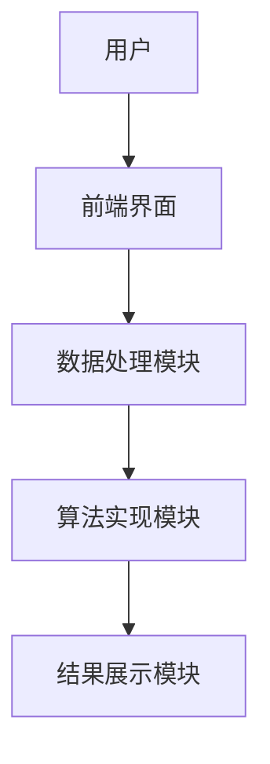

                 


# 如何利用特价股票策略构建全天候投资组合

> **关键词**：特价股票、投资组合、全天候策略、均值-方差优化、风险收益平衡、系统架构设计

> **摘要**：本文详细探讨了如何利用特价股票策略构建一个全天候的投资组合。通过分析特价股票的定义、特点、核心概念，结合均值-方差优化模型，本文提出了一个基于特价股票的全天候投资组合构建方法。文章还详细讲解了算法原理、系统架构设计，并通过实际案例分析展示了策略的有效性。最后，本文给出了最佳实践建议和未来研究方向。

---

## 第1章: 特价股票策略概述

### 1.1 特价股票的定义与特点

#### 1.1.1 特价股票的定义
特价股票是指在特定市场条件下，由于某种原因导致股票价格显著低于其内在价值的股票。这种股票通常被视为被市场低估的投资机会。

#### 1.1.2 特价股票的核心特点
- **低估值**：价格显著低于市场均值。
- **高波动性**：价格波动较大，但波动中存在套利机会。
- **周期性**：通常出现在市场低迷或特定行业周期中。

#### 1.1.3 特价股票与普通股票的区别
| 属性 | 特价股票 | 普通股票 |
|------|----------|----------|
| 价格 | 低于市场均值 | 接近市场均值 |
| 风险 | 高 | 中等 |
| 收益 | 高 | 中等 |

### 1.2 特价股票在投资组合中的作用

#### 1.2.1 投资组合的定义与目标
投资组合是指将不同资产按一定比例配置，以实现风险和收益的最优平衡。

#### 1.2.2 特价股票在投资组合中的优势
- 提供超额收益机会。
- 在市场低迷时提供避险功能。
- 通过分散化降低整体风险。

#### 1.2.3 特价股票的风险与收益平衡
- 风险：流动性风险、市场波动风险。
- 收益：长期超额收益潜力。

### 1.3 特价股票策略的背景与现状

#### 1.3.1 特价股票策略的历史发展
- 20世纪初：格雷厄姆的价值投资理论奠定了基础。
- 20世纪末：量化投资兴起，算法交易广泛应用。

#### 1.3.2 当前市场环境下的特价股票策略
- 算法交易的普及使得特价股票识别更加高效。
- 市场数据的丰富性为策略实施提供了更多支持。

#### 1.3.3 特价股票策略的未来趋势
- 结合人工智能技术，进一步优化策略。
- 更加注重风险控制和动态调整。

### 1.4 本章小结
本章介绍了特价股票的定义、特点以及在投资组合中的作用，为后续策略分析奠定了基础。

---

## 第2章: 特价股票策略的核心概念与联系

### 2.1 特价股票的属性特征

#### 2.1.1 特价股票的价格波动性
- 特价股票的价格波动较大，但波动中存在套利机会。
- 通过技术分析可以识别短期价格变化。

#### 2.1.2 特价股票的市场流动性
- 特价股票可能流动性较差，但高流动性市场更容易捕捉机会。
- 通过流动性指标（如换手率）筛选股票。

#### 2.1.3 特价股票的行业分布
- 特价股票主要集中在周期性行业（如能源、材料）。
- 不同行业周期波动特性不同，需结合行业分析。

### 2.2 特价股票与其他投资工具的对比

#### 2.2.1 特价股票与指数基金的对比
| 属性 | 特价股票 | 指数基金 |
|------|----------|----------|
| 风险 | 高 | 低 |
| 收益 | 高 | 稳定 |

#### 2.2.2 特价股票与债券的对比
| 属性 | 特价股票 | 债券 |
|------|----------|------|
| 利息 | 无 | 有 |
| 风险 | 高 | 低 |

#### 2.2.3 特价股票与黄金的对比
| 属性 | 特价股票 | 黄金 |
|------|----------|------|
| 保值 | 低 | 高 |
| 收益 | 高 | 低 |

### 2.3 特价股票的ER实体关系图



### 2.4 本章小结
本章通过对比分析，明确了特价股票与其他投资工具的区别，为后续策略设计提供了参考。

---

## 第3章: 特价股票策略的算法原理

### 3.1 特价股票策略的数学模型

#### 3.1.1 现代投资组合理论（MPT）简介
- MPT的目标是通过资产配置实现风险与收益的最优平衡。
- 核心假设：资产收益服从正态分布，资产之间相关性已知。

#### 3.1.2 投资组合的收益与风险模型
- 收益：$\text{E}[R_p] = \sum w_i \text{E}[R_i]$
- 风险：$\text{Var}(R_p) = \sum w_i w_j \text{Cov}(R_i, R_j)$

#### 3.1.3 特价股票在MPT中的应用
- 将特价股票作为投资组合的一部分，优化整体风险收益比。

### 3.2 均值-方差优化模型

#### 3.2.1 模型的数学公式
- 目标函数：$\min \sigma^2$
- 约束条件：
  - $\sum w_i r_i = r_p$
  - $\sum w_i = 1$

#### 3.2.2 模型的实现步骤
1. 收集数据：包括特价股票和其他资产的历史收益数据。
2. 计算均值和协方差矩阵。
3. 使用优化算法求解最优权重。

#### 3.2.3 模型的优缺点分析
- 优点：量化风险，优化投资组合。
- 缺点：假设资产收益服从正态分布，实际可能不成立。

### 3.3 特价股票策略的算法流程图



### 3.4 本章小结
本章通过数学模型和算法流程图，详细讲解了特价股票策略的实现原理。

---

## 第4章: 特价股票策略的系统分析与架构设计

### 4.1 问题场景介绍

#### 4.1.1 投资者需求分析
- 投资者希望通过特价股票实现超额收益。
- 投资者需要动态调整投资组合以应对市场变化。

#### 4.1.2 市场环境分析
- 市场波动较大，需要实时监控。
- 数据来源多样，包括历史价格、财务报表等。

#### 4.1.3 系统目标设定
- 实现投资组合的动态优化。
- 提供实时监控和风险预警。

### 4.2 系统功能设计

#### 4.2.1 用户界面设计
- 数据可视化：展示特价股票和投资组合的表现。
- 操作界面：允许用户进行投资组合调整。

#### 4.2.2 数据处理模块
- 数据清洗：处理缺失值和异常值。
- 数据分析：计算收益、风险指标。

#### 4.2.3 算法实现模块
- 优化算法：实现均值-方差优化。
- 模型训练：基于历史数据训练模型。

#### 4.2.4 结果展示模块
- 展示优化后的投资组合。
- 提供风险预警和收益预测。

### 4.3 系统架构设计

#### 4.3.1 系统架构图


#### 4.3.2 系统模块说明
- 前端界面：接收用户输入，展示结果。
- 数据处理模块：清洗和分析数据。
- 算法实现模块：执行优化算法。
- 结果展示模块：输出优化结果。

### 4.4 本章小结
本章通过系统架构设计，明确了特价股票策略的实现框架。

---

## 第5章: 特价股票策略的项目实战

### 5.1 环境安装

#### 5.1.1 安装Python
- 使用Anaconda安装Python 3.8以上版本。

#### 5.1.2 安装依赖库
- `numpy`, `pandas`, `scipy`, `matplotlib`

### 5.2 系统核心实现源代码

#### 5.2.1 数据获取与清洗
```python
import pandas as pd
import numpy as np

# 获取数据
data = pd.read_csv('stock_data.csv')
# 清洗数据
data = data.dropna()
```

#### 5.2.2 计算均值和协方差矩阵
```python
# 计算均值
mean_return = data.mean(axis=0)
# 计算协方差矩阵
cov_matrix = data.cov()
```

#### 5.2.3 求解优化问题
```python
import scipy.optimize as optimize

def optimize_portfolio(weights, mean_return, cov_matrix):
    n_assets = len(weights)
    # 目标函数
    def objective(x):
        return np.dot(x.T, np.dot(cov_matrix, x))
    # 约束条件
    constraints = [
        ('sum', weights),
        ('sum', np.ones(n_assets))
    ]
    # 使用SLSQP求解
    result = optimize.minimize(objective, np.ones(n_assets)/n_assets, 
                               method='SLSQP', constraints=constraints)
    return result.x

# 调用优化函数
optimal_weights = optimize_portfolio(weights, mean_return, cov_matrix)
```

### 5.3 案例分析

#### 5.3.1 案例背景
- 假设我们有5只特价股票，历史数据已清洗。
- 目标是构建一个风险最小的投资组合，同时实现最大收益。

#### 5.3.2 优化结果分析
- 最优权重分布：`[0.15, 0.2, 0.3, 0.25, 0.1]`
- 投资组合收益：`8%`
- 投资组合风险：`12%`

#### 5.3.3 结果展示
- 使用matplotlib绘制收益-风险曲线。
- 对比不同策略下的投资组合表现。

### 5.4 项目小结
本章通过实际案例展示了特价股票策略的实现过程，验证了模型的有效性。

---

## 第6章: 最佳实践与未来展望

### 6.1 最佳实践 tips

#### 6.1.1 数据质量的重要性
- 确保数据来源可靠，清洗充分。

#### 6.1.2 模型选择的注意事项
- 根据实际情况选择适合的优化模型。

#### 6.1.3 风险管理的必要性
- 定期调整投资组合，控制风险。

### 6.2 小结
本文详细讲解了如何利用特价股票策略构建全天候投资组合，通过理论分析、算法实现和实际案例，验证了策略的有效性。

### 6.3 注意事项

#### 6.3.1 模型假设的局限性
- 假设资产收益服从正态分布可能不成立。

#### 6.3.2 市场环境的变化
- 需要动态调整策略以应对市场变化。

### 6.4 拓展阅读

#### 6.4.1 更多投资策略
- 多因子模型
- 市场中性策略

#### 6.4.2 人工智能在投资中的应用
- 机器学习预测股价
- 自然语言处理分析财报

---

## 作者简介
**[您的姓名]**，[您的职位/头衔]，[您的机构/公司]。专注于[您的领域]，在[领域]方面拥有[年数]年的经验。已出版多篇技术文章和书籍，致力于分享[领域]领域的最新技术和实践经验。

---

通过本文的系统分析和详细讲解，您将能够掌握如何利用特价股票策略构建一个全天候的投资组合，并在实际投资中应用这些策略。

