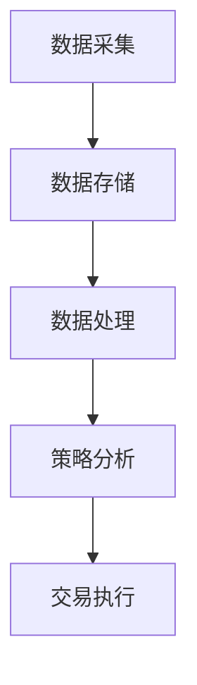

                 


# 如何利用特价股票策略构建养老金投资组合

## 关键词：特价股票，养老金投资，投资策略，风险管理，股票选择，系统设计

## 摘要：本文详细探讨如何利用特价股票策略构建有效的养老金投资组合，涵盖市场分析、策略选择、系统设计和风险控制等关键环节，帮助投资者在确保收益的同时，实现长期稳定的养老金增长。

---

# 第1章: 特价股票的定义与特性

## 1.1 什么是特价股票
- 特价股票是指价格低于市场平均值，具有较高价值的股票。
- 具体表现：低估值、高股息率、潜在上涨空间。

## 1.2 特价股票的市场定位
- 通常出现在周期性行业，如能源、材料等。
- 投资者可以通过分析市盈率、市净率等指标识别特价股票。

## 1.3 特价股票与普通股票的区别
| 特性 | 特价股票 | 普通股票 |
|------|----------|----------|
| 估值 | 低       | 市场价    |
| 风险 | 较低     | 较高     |
| 收益 | 高       | 稳定     |

---

# 第2章: 养老金投资的基本概念

## 2.1 养老金的定义与目标
- 养老金是为了保障退休后的生活质量，确保资金安全和稳定增长。
- 投资目标：保值、增值，注重长期收益。

## 2.2 养老金投资的原则
- 分散投资：避免过度集中风险。
- 长期视角：耐心持有，避免短期波动影响。

## 2.3 养老金投资的常见策略
- 值股策略：投资低估股票，长期持有。
- 定期定额投资：分散风险，平滑波动。

---

# 第3章: 特价股票策略在养老金投资中的应用

## 3.1 特价股票策略的优势
- 低估值：潜在上涨空间大。
- 高股息率：稳定收益。

## 3.2 投资组合构建的关键因素
- 股票选择：根据基本面和技术分析筛选。
- 分散投资：避免单一股票风险。

## 3.3 风险与控制
- 市场波动：通过多样化和定期调整降低风险。
- 行业风险：分散投资不同行业。

---

# 第4章: 特价股票的市场分析与选择

## 4.1 市场趋势分析
- 使用技术指标（如RSI、MACD）判断市场趋势。

## 4.2 公司基本面分析
- 关键指标：市盈率（P/E）、市净率（P/B）、股息率。

## 4.3 技术分析方法
- 策略选择：结合趋势线、支撑位等技术指标。

---

# 第5章: 投资组合的构建与优化

## 5.1 投资目标与比例分配
- 根据风险承受能力分配资产比例。

## 5.2 定期调整策略
- 定期评估组合表现，进行调整。

## 5.3 风险管理
- 设置止损点，控制最大损失比例。

---

# 第6章: 系统分析与架构设计

## 6.1 系统功能设计
- 系统包括数据采集、分析、交易执行模块。

## 6.2 系统架构图


## 6.3 接口设计
- 数据接口：从API获取实时数据。
- 交易接口：连接 brokerage API。

---

# 第7章: 项目实战与案例分析

## 7.1 案例背景
- 选择特定行业的特价股票，构建投资组合。

## 7.2 实战代码示例
```python
import pandas as pd

# 数据获取与预处理
data = pd.read_csv('stock_data.csv')
data['SMA'] = data['price'].rolling(20).mean()
```

## 7.3 结果解读
- 分析回测结果，评估策略的有效性。

---

# 第8章: 风险管理与控制

## 8.1 风险识别
- 市场风险、流动性风险等。

## 8.2 风险控制措施
- 使用止损订单，设置最大回撤比例。

---

# 第9章: 高级策略与最佳实践

## 9.1 套利策略
- 利用市场价差获利。

## 9.2 对冲策略
- 通过做多和做空对冲市场风险。

## 9.3 最佳实践
- 定期回顾投资组合，持续优化。

---

# 第10章: 总结与展望

## 10.1 总结
- 特价股票策略适合长期稳健的养老金投资。
- 通过系统设计和风险控制，实现收益最大化。

## 10.2 展望
- 结合人工智能技术优化投资策略，提升收益。

---

# 结语

通过本文的系统分析和实战指导，投资者可以有效利用特价股票策略构建稳健的养老金投资组合，实现长期财富增长目标。

