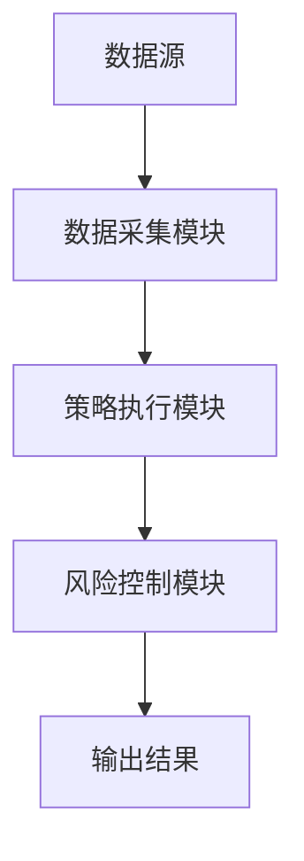

                 


# 如何利用特价股票策略构建多元化对冲基金

## 关键词：
- 特价股票策略
- 对冲基金
- 多元化投资
- 量化交易
- 风险管理

## 摘要：
本文详细探讨了如何利用特价股票策略构建一个多元化对冲基金。通过分析特价股票策略的核心原理、算法实现、系统架构以及实际案例，本文为读者提供了从理论到实践的全面指导。结合量化交易和风险管理的策略，本文帮助投资者在复杂多变的市场中实现稳健收益。

---

# 第一部分：特价股票策略概述

## 第1章：特价股票策略的定义与重要性

### 1.1 特价股票的定义
- 1.1.1 特价股票的定义：特价股票是指价格低于其内在价值的股票，通常具有较高的上涨潜力。
- 1.1.2 特价股票的特点：低估值、高潜力、市场关注度低。
- 1.1.3 特价股票的投资价值：潜在收益高，风险相对可控。

### 1.2 对冲基金的基本概念
- 1.2.1 对冲基金的定义：一种通过多空头同时投资以对冲市场风险的基金。
- 1.2.2 对冲基金的运作模式：通过杠杆、空头头寸等多种策略实现收益。
- 1.2.3 对冲基金的风险与收益：高风险高收益，注重绝对收益。

### 1.3 特价股票策略在对冲基金中的重要性
- 1.3.1 特价股票策略的优势：低估值、高回报潜力。
- 1.3.2 特价股票策略的风险管理：通过多元化降低个股风险。
- 1.3.3 特价股票策略与其他投资策略的对比：比较价值投资、成长投资等策略的优劣。

---

## 第2章：构建多元化对冲基金的必要性

### 2.1 多元化投资的基本原理
- 2.1.1 多元化投资的定义：通过投资不同资产或策略降低风险。
- 2.1.2 多元化投资的优势：分散风险，提高稳定性。
- 2.1.3 多元化投资的风险分散：通过不同资产的相关性降低整体风险。

### 2.2 对冲基金中的多元化策略
- 2.2.1 多元化策略的类型：股票、债券、商品等多种资产配置。
- 2.2.2 多元化策略的应用场景：应对市场波动，捕捉不同机会。
- 2.2.3 多元化策略的实施步骤：资产配置、策略选择、动态调整。

### 2.3 特价股票策略在多元化中的作用
- 2.3.1 特价股票策略在多元化中的地位：作为对冲基金的重要组成部分。
- 2.3.2 特价股票策略与其他策略的结合：与趋势跟踪、套利等策略互补。
- 2.3.3 特价股票策略的风险控制：通过筛选和监控降低投资风险。

---

# 第二部分：特价股票策略的核心算法

## 第3章：特价股票筛选算法

### 3.1 数据预处理
- 3.1.1 数据清洗：处理缺失值、异常值。
- 3.1.2 数据标准化：归一化处理，确保不同数据可比。
- 3.1.3 数据特征提取：选择影响股价的关键指标。

### 3.2 特价股票识别算法
- 3.2.1 基于市盈率的筛选：低市盈率股票的识别。
- 3.2.2 基于市净率的筛选：低市净率股票的识别。
- 3.2.3 综合指标筛选：结合市盈率、市净率等多指标筛选。

### 3.3 算法实现
- 3.3.1 代码实现：Python代码示例，展示如何筛选特价股票。
- 3.3.2 算法优化：改进筛选指标，提高准确性。

## 第4章：风险评估与优化

### 4.1 风险评估模型
- 4.1.1 风险评估指标：VaR、波动率、最大回撤。
- 4.1.2 风险评估算法：蒙特卡洛模拟、历史模拟法。

### 4.2 策略优化
- 4.2.1 参数优化：调整筛选指标权重。
- 4.2.2 策略回测：历史数据验证策略的有效性。
- 4.2.3 动态调整：根据市场变化实时优化策略。

---

# 第三部分：系统架构与实现

## 第5章：系统架构设计

### 5.1 系统功能模块
- 5.1.1 数据采集模块：实时获取股票数据。
- 5.1.2 策略执行模块：根据算法筛选股票并执行交易。
- 5.1.3 风险控制模块：监控并控制投资风险。

### 5.2 系统架构图


### 5.3 系统接口设计
- 5.3.1 数据接口：API接口获取股票数据。
- 5.3.2 策略接口：调用筛选算法接口。
- 5.3.3 风险接口：实时风险监控接口。

---

## 第6章：项目实战

### 6.1 环境安装
- 6.1.1 安装Python：安装Anaconda或Miniconda。
- 6.1.2 安装依赖库：pandas、numpy、matplotlib、alpaca等。

### 6.2 核心代码实现
```python
import pandas as pd
import numpy as np

# 数据获取
def get_data(tickers):
    # 获取股票数据（示例）
    pass

# 特价股票筛选
def screen_stocks(data, threshold):
    return data[data['市盈率'] < threshold]

# 策略执行
def execute_strategy(stocks):
    # 执行交易策略
    pass

# 风险控制
def manage_risk(positions):
    # 风险监控与控制
    pass
```

### 6.3 实际案例分析
- 6.3.1 案例背景：选择特定时间段和市场环境。
- 6.3.2 数据分析：筛选特价股票并进行回测。
- 6.3.3 结果展示：展示回测结果和策略表现。

---

## 第7章：最佳实践与总结

### 7.1 最佳实践
- 7.1.1 风险管理：定期调整投资组合。
- 7.1.2 持续优化：根据市场变化优化筛选算法。
- 7.1.3 市场监控：实时跟踪市场动态。

### 7.2 总结
本文详细介绍了如何利用特价股票策略构建多元化对冲基金，从理论到实践，为投资者提供了全面的指导。通过量化分析和系统设计，投资者可以在复杂市场中实现稳健收益。

### 7.3 拓展阅读
- 进一步学习量化交易和风险管理的相关知识。
- 探索更多股票筛选算法和优化方法。

---

# 结语

通过本文的指导，读者可以系统地了解如何利用特价股票策略构建对冲基金，并在实际操作中应用这些策略。希望本文能为投资者提供有价值的参考，帮助他们在金融市场中取得成功。

