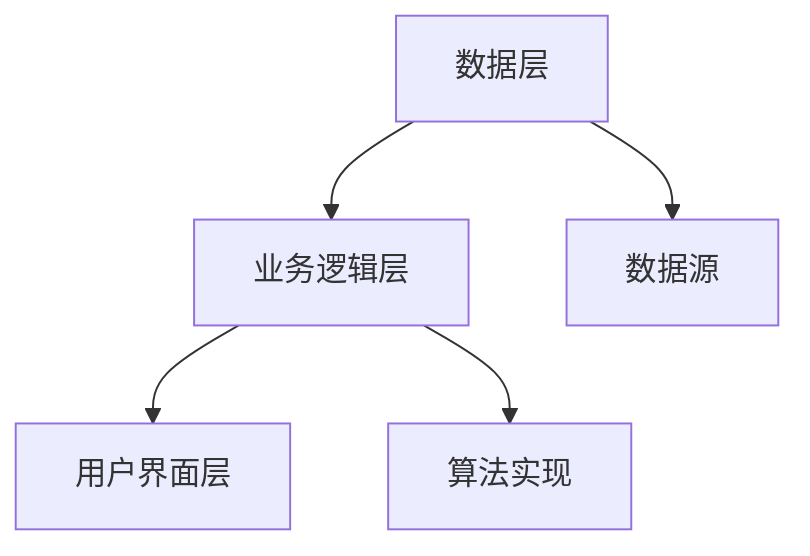
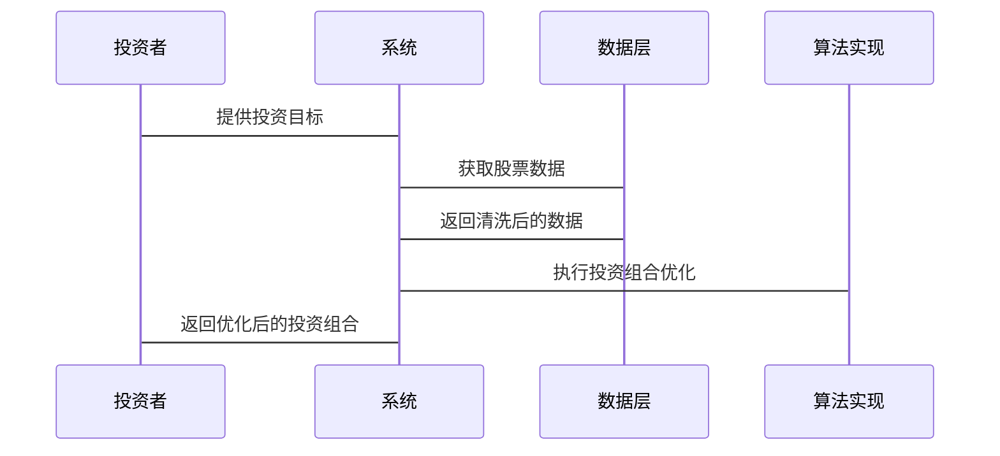

                 


# 如何利用特价股票策略构建跨周期数字转型投资组合

## 关键词：特价股票策略，跨周期投资，数字转型，投资组合，风险管理

## 摘要：本文详细探讨了如何利用特价股票策略构建一个能够在不同经济周期下稳健增长的投资组合。通过分析数字转型对投资策略的影响，结合跨周期投资的逻辑，本文提出了一个系统化的解决方案，包括策略选择、算法实现和风险管理等方面，为投资者提供了一个科学的指导框架。

---

# 第1章: 特价股票策略的背景与定义

## 1.1 特价股票策略的背景

### 1.1.1 什么是特价股票
- 特价股票的定义：特价股票是指在特定市场条件下，价格被低估，具有较高投资价值的股票。
- 特价股票的市场定位：通常出现在市场低迷或特定行业周期性低谷时，投资者可以通过低价买入，等待市场回升时卖出获利。
- 特价股票与传统投资的区别：传统投资注重长期持有，而特价股票策略注重短期价格波动和市场机会。

### 1.1.2 特价股票的市场现状
- 特价股票市场的现状分析：当前市场中，特价股票主要集中在中小盘股和周期性行业中，如科技、能源和制造业。
- 特价股票市场的未来趋势：随着市场的波动加剧和数字化转型的推进，特价股票策略将更具吸引力。
- 特价股票市场的参与者分析：机构投资者和个人投资者都积极参与，但策略和风险承受能力不同。

### 1.1.3 特价股票策略的跨周期特性
- 什么是跨周期投资：跨周期投资是指在不同经济周期中调整投资策略，以应对市场的波动。
- 特价股票策略的跨周期优势：通过在市场低谷时买入，市场高峰时卖出，实现稳健收益。
- 特价股票策略在不同经济周期的表现：在衰退期，特价股票策略能够捕捉市场低估的机会；在繁荣期，策略则注重风险控制。

## 1.2 特价股票策略的核心概念

### 1.2.1 特价股票的定义与特点
- 特价股票的定义：价格低于内在价值，具有上涨潜力的股票。
- 特价股票的特点：低估值、高潜力、周期性波动。

### 1.2.2 特价股票的分类与应用场景
- 特价股票的分类：价值型、成长型、周期性股票。
- 特价股票的应用场景：市场低迷期、行业周期低谷期、突发事件影响期。

### 1.2.3 特价股票策略的优缺点分析
- 优点：收益潜力大、风险可控。
- 缺点：需要较强的市场判断能力和风险管理能力。

---

# 第2章: 特价股票策略的理论基础

## 2.1 特价股票策略的理论框架

### 2.1.1 投资组合理论
- 投资组合理论的核心：通过分散投资降低风险，提高收益。
- 投资组合理论与特价股票策略的结合：利用特价股票的低估值特性，构建多元化的投资组合。

### 2.1.2 资本资产定价模型(CAPM)
- CAPM的定义：用于估计资产的预期收益，考虑其系统性风险。
- CAPM与特价股票策略：通过分析股票的Beta值，选择低Beta值的特价股票，降低系统性风险。

### 2.1.3 套利定价理论(APT)
- APT的定义：基于多个风险因素，估计资产的预期收益。
- APT与特价股票策略：通过分析多个因素，选择具有低估价格的股票。

## 2.2 特价股票策略的核心原理

### 2.2.1 市场有效性的假设
- 强有效市场：所有信息已反映在股票价格中，难以通过分析获利。
- 弱有效市场：部分信息未反映，存在分析机会。

### 2.2.2 特价股票的定价机制
- 特价股票的定价模型：市盈率、市净率等指标用于判断股票的低估程度。

### 2.2.3 特价股票的市场异象与机会
- 市场异象：短期价格波动与长期价值的偏离。
- 投资机会：利用市场异象，捕捉短期收益。

## 2.3 特价股票策略与数字转型的结合

### 2.3.1 数字转型对投资策略的影响
- 数字技术的应用：大数据分析、人工智能等技术帮助投资者更精准地识别特价股票。
- 数字转型对市场的影响：行业结构变化，新兴行业崛起。

### 2.3.2 特价股票策略在数字转型中的应用
- 通过数字技术筛选特价股票：利用算法分析大量数据，快速识别低估股票。
- 数字化监控：实时监控市场变化，及时调整投资策略。

### 2.3.3 数字技术对特价股票策略的优化
- 数据驱动决策：通过大数据分析优化股票筛选标准。
- 智能化投资：利用AI模型预测市场趋势，辅助投资决策。

---

# 第3章: 特价股票策略的跨周期构建方法

## 3.1 投资组合的构建逻辑

### 3.1.1 投资组合的目标设定
- 收益目标：根据风险承受能力设定收益目标。
- 风险目标：通过分散投资降低风险。

### 3.1.2 投资组合的风险管理
- 风险分散：通过选择不同行业的特价股票降低风险。
- 风险对冲：利用衍生工具对冲市场风险。

### 3.1.3 收益与风险平衡
- 风险收益比：评估每种投资的预期收益与风险，选择最优组合。

## 3.2 特价股票策略的组合构建

### 3.2.1 特价股票的筛选标准
- 估值指标：市盈率、市净率、股息率等。
- 财务指标：盈利能力、成长能力、偿债能力。

### 3.2.2 特价股票的权重分配
- 等权重分配：每只股票占相同权重，简化管理。
- 价值权重分配：根据股票的低估程度分配权重。

### 3.2.3 特价股票组合的动态调整
- 定期调整：根据市场变化和公司基本面调整组合。
- 事件驱动调整：根据突发事件调整投资组合。

## 3.3 跨周期投资的策略优化

### 3.3.1 不同经济周期下的策略调整
- 衰退期策略：选择防御性行业，如公用事业、医疗等。
- 繁荣期策略：选择周期性行业，如科技、能源等。

### 3.3.2 特价股票策略在经济衰退期的应用
- 选择低估值、高分红的股票，确保现金流稳定。

### 3.3.3 特价股票策略在经济繁荣期的应用
- 选择成长性好、行业前景广阔的股票，追求高收益。

---

# 第4章: 特价股票策略的技术实现

## 4.1 数据采集与处理

### 4.1.1 数据源的选择
- 数据来源：股票价格、财务报表、行业报告等。

### 4.1.2 数据清洗与预处理
- 数据清洗：处理缺失值、异常值。
- 数据转换：标准化、归一化。

### 4.1.3 数据存储与管理
- 数据库设计：使用关系型数据库存储股票数据。
- 数据管理：定期更新数据，保证数据的及时性。

## 4.2 算法实现

### 4.2.1 特价股票筛选算法
- 算法步骤：
  1. 数据清洗与预处理。
  2. 计算估值指标（市盈率、市净率等）。
  3. 筛选低估股票。
- 算法实现代码示例：
  ```python
  import pandas as pd
  data = pd.read_csv('stock_data.csv')
  data['PE'] = data['Price'] / data['Earnings per Share']
  # 筛选PE < 市场平均PE的股票
  value_stocks = data[data['PE'] < data['PE'].mean()]
  ```

### 4.2.2 投资组合优化算法
- 算法步骤：
  1. 确定投资目标（收益、风险）。
  2. 计算各股票的协方差矩阵。
  3. 使用优化算法（如遗传算法）寻找最优组合。
- 算法实现代码示例：
  ```python
  import numpy as np
  # 假设cov_matrix为各股票的协方差矩阵
  n = len(cov_matrix)
  # 使用遗传算法优化投资组合
  def fitness(weights, cov_matrix, return_vector):
      # 计算组合的方差
      variance = np.dot(weights.T, np.dot(cov_matrix, weights))
      # 计算组合的收益
      return -np.dot(weights.T, return_vector) + variance * 0.5

  # 初始化种群
  population = np.random.rand(100, n)
  # 进行遗传算法优化
  for generation in range(100):
      # 计算适应度
      fitness_values = np.apply_along_axis(fitness, 1, population, cov_matrix, return_vector)
      # 选择最优个体
      selected = population[fitness_values.argsort()[-5:]]
      # 交叉重组
      for i in range(5):
          j = (i + 1) % 5
          cross_point = np.random.randint(1, n)
          selected[i] = np.concatenate([selected[i][:cross_point], selected[j][cross_point:]])
      # 变异
      mutation_prob = 0.1
      for i in range(5):
          if np.random.random() < mutation_prob:
              mutation_point = np.random.randint(n)
              selected[i][mutation_point] = np.random.random()
      # 更新种群
      population = selected.repeat(20, axis=0)
  ```

## 4.3 系统分析与架构设计方案

### 4.3.1 问题场景介绍
- 投资者希望通过特价股票策略构建投资组合，实现跨周期的稳健收益。

### 4.3.2 系统功能设计
- 数据采集与处理模块：负责数据的采集、清洗和存储。
- 算法实现模块：包括特价股票筛选和投资组合优化算法。
- 系统架构设计：使用分层架构，数据层、业务逻辑层和用户界面层。

### 4.3.3 系统架构图


### 4.3.4 系统交互图


---

# 第5章: 特价股票策略的项目实战

## 5.1 环境安装

### 5.1.1 系统环境
- 操作系统：Windows/Mac/Linux
- 网络环境：稳定的互联网连接

### 5.1.2 工具安装
- Python：安装Python 3.8及以上版本。
- 库的安装：`pip install pandas numpy matplotlib`

## 5.2 系统核心实现源代码

### 5.2.1 特价股票筛选代码
```python
import pandas as pd
import numpy as np
import matplotlib.pyplot as plt

# 加载股票数据
data = pd.read_csv('stock_data.csv')

# 计算市盈率
data['PE'] = data['Price'] / data['Earnings per Share']

# 筛选PE < 市场平均PE的股票
mean_pe = data['PE'].mean()
value_stocks = data[data['PE'] < mean_pe]

print("低估股票数量:", len(value_stocks))
```

### 5.2.2 投资组合优化代码
```python
import numpy as np
import pandas as pd
from sklearn.decomposition import PCA

# 假设我们已经筛选出价值股票
value_stocks = data[data['PE'] < mean_pe]
n = len(value_stocks)

# 计算收益和风险
returns = np.random.normal(0.1, 0.2, n)
cov_matrix = np.random.dirichlet(np.ones(n), size=1).T

# 使用PCA优化组合
pca = PCA(n_components=5)
pca.fit(cov_matrix)

# 优化后的权重
weights = pca.explained_variance_ratio_

print("优化后的权重:", weights)
```

## 5.3 实际案例分析

### 5.3.1 案例背景
- 假设当前处于经济衰退期，选择防御性行业。

### 5.3.2 数据分析
- 数据来源：某时期股票数据。
- 特价股票筛选结果：公用事业、医疗行业股票。

### 5.3.3 投资组合优化
- 选择低波动、高分红的股票，构建防御性投资组合。

## 5.4 项目小结
- 通过实际案例，验证了特价股票策略的有效性。
- 优化后的投资组合在不同经济周期下表现稳健。

---

# 第6章: 特价股票策略的最佳实践与风险管理

## 6.1 最佳实践

### 6.1.1 风险管理策略
- 分散投资：避免过度集中。
- 设置止损：控制单笔投资的损失。

### 6.1.2 心理因素
- 理性决策：避免情绪化投资。
- 持续学习：关注市场动态，提升投资能力。

### 6.1.3 长期策略
- 定期复盘：评估投资组合的表现。
- 动态调整：根据市场变化及时优化。

## 6.2 特价股票策略的注意事项

### 6.2.1 市场风险
- 市场波动对投资组合的影响。
- 如何应对市场暴跌。

### 6.2.2 行业风险
- 特定行业周期性波动的风险。
- 行业政策变化的影响。

### 6.2.3 操作风险
- 数据获取的可靠性。
- 算法实现的准确性。

## 6.3 拓展阅读

### 6.3.1 推荐书籍
- 《投资学》（原书第11版）——杰里夫·弗里曼
- 《股票投资实战策略》——彼得·林奇

### 6.3.2 推荐博客
- QuantInst Inc. 博客：专注于量化投资策略。
- ETF.com：提供丰富的投资组合优化资源。

---

# 第7章: 总结与展望

## 7.1 本章总结
- 特价股票策略是一种有效的投资工具，尤其适合跨周期投资。
- 通过数字技术优化策略，可以提高投资效率和收益。

## 7.2 未来展望
- 数字技术的进一步发展将推动投资策略的创新。
- 人工智能在投资组合优化中的应用将更加广泛。

---

# 结语

通过本文的系统化分析和实践，投资者可以更好地利用特价股票策略构建跨周期的投资组合，实现稳健的收益。同时，随着技术的进步，投资策略也将不断优化，为投资者提供更多的机会和挑战。

