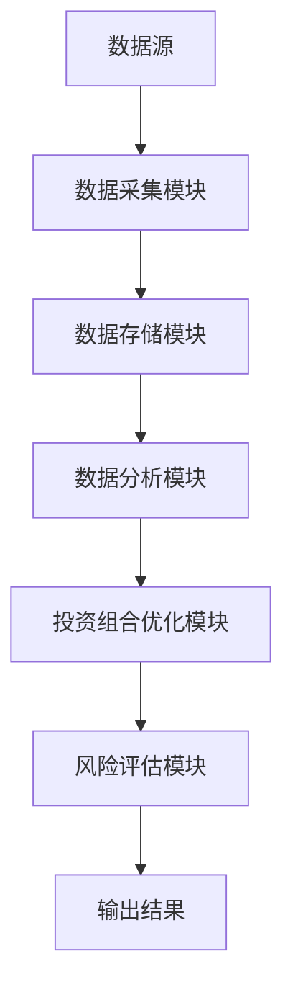

                 


# 如何利用特价股票策略构建退休投资组合

---

## 关键词：
- 特价股票
- 投资组合
- 退休投资
- 现代投资组合理论
- 算法优化
- 风险管理

---

## 摘要：
本文将详细介绍如何利用特价股票策略构建一个稳健的退休投资组合。通过分析特价股票的市场特征、投资组合优化的数学模型、系统架构设计以及实际项目实战，本文为读者提供了一套从理论到实践的完整解决方案。文章内容涵盖背景介绍、核心概念、算法原理、系统架构设计、项目实现和最佳实践等部分，帮助读者系统地理解和应用特价股票策略，实现退休投资目标。

---

# 第一部分：特价股票策略与退休投资概述

## 第1章：特价股票策略的背景与概念

### 1.1 特价股票的定义与特点
特价股票是指价格相对较低的股票，通常具有较高的股息收益率或潜在的上涨空间。它们可能是市场中的“价值股”，即价格低于其内在价值的股票。特价股票的特点包括：
- 低市盈率
- 高股息率
- 高市净率
- 股价波动性较大

### 1.2 退休投资的基本概念
退休投资是指通过投资手段为退休生活提供财务支持。退休投资的目标是实现资产的保值与增值，同时控制风险。常见的退休投资策略包括：
- 定期定额投资
- 股票投资
- 债券投资
- 组合投资

### 1.3 特价股票与退休投资的契合点
特价股票的高股息率和潜在上涨空间使其成为退休投资的理想选择。通过投资特价股票，投资者可以实现：
- 稳定的股息收入
- 资产增值
- 分散投资风险

---

## 第2章：特价股票策略的核心原理

### 2.1 投资组合构建的基本原理
投资组合构建的核心在于平衡风险与收益。现代投资组合理论（MPT）强调通过分散投资降低风险，同时优化收益。以下是投资组合构建的关键步骤：
1. 确定投资目标和风险承受能力
2. 进行资产配置
3. 选择具体的投资标的
4. 定期监控和调整

### 2.2 特价股票在投资组合中的定位
特价股票通常具有较高的风险和潜在收益，因此在投资组合中的权重需要根据投资者的风险偏好进行调整。以下是一些关键点：
- 特价股票的权重不应超过总投资组合的30%
- 特价股票应与其他资产（如债券、黄金）结合使用，以分散风险
- 特价股票的筛选应基于基本面分析和估值指标

### 2.3 特价股票策略的风险与收益特征
- **收益特征**：特价股票的潜在收益较高，尤其是在市场复苏时。
- **风险特征**：特价股票的波动性较大，且容易受到市场情绪的影响。

---

## 第3章：特价股票策略的数学模型与公式

### 3.1 投资组合优化的数学模型
现代投资组合理论（MPT）是投资组合优化的核心模型。以下是MPT的基本公式：
$$
\text{夏普比率} = \frac{E[r_p] - r_f}{\sigma_p}
$$
其中：
- $E[r_p]$ 是投资组合的期望收益
- $r_f$ 是无风险利率
- $\sigma_p$ 是投资组合的收益标准差

### 3.2 特价股票策略的风险评估公式
以下是一些常用的风险评估指标：
1. **最大回撤**：
$$
\text{最大回撤} = \max_{i} \left( \max_{j \leq i} P_j - P_i \right)
$$
其中，$P_j$ 是第$j$个时间点的价格。

2. **风险价值（VaR）**：
$$
\text{VaR} = \text{损失的金额} \times \text{置信水平}
$$

---

## 第4章：特价股票策略的系统架构设计

### 4.1 系统功能模块设计
以下是系统的功能模块设计：
- 数据采集模块：负责从市场获取特价股票数据。
- 数据分析模块：对数据进行清洗和预处理。
- 投资组合优化模块：基于数学模型生成最优投资组合。
- 风险评估模块：对投资组合进行风险评估和优化。

### 4.2 系统架构图


### 4.3 系统接口设计
系统接口设计如下：
- 数据接口：与数据源（如股票数据库）交互
- 用户接口：供用户输入参数和查看结果
- 输出接口：输出优化后的投资组合和风险评估结果

---

## 第5章：特价股票策略的项目实战

### 5.1 环境搭建与数据准备
- **环境搭建**：
  - 安装Python和相关库（如pandas、numpy、scipy）
  - 安装可视化工具（如Matplotlib、Seaborn）

- **数据准备**：
  - 从数据源获取特价股票的历史数据
  - 数据清洗和预处理

### 5.2 投资组合优化的代码实现
以下是投资组合优化的代码示例：
```python
import numpy as np
import pandas as pd
import matplotlib.pyplot as plt

# 假设data是包含股票收益率和相关系数的DataFrame
data = pd.DataFrame({
    '股票1': [0.05, 0.03, -0.02, 0.04, 0.01],
    '股票2': [0.02, 0.04, -0.03, 0.02, 0.03],
    '股票3': [-0.01, 0.03, 0.05, -0.02, 0.04]
})

# 计算协方差矩阵
cov_matrix = data.cov()

# 确定权重
weights = np.array([0.4, 0.3, 0.3])

# 计算投资组合的期望收益和风险
expected_return = np.dot(weights, data.mean())
portfolio_variance = np.dot(weights.T, np.dot(cov_matrix, weights))
portfolio_std_deviation = np.sqrt(portfolio_variance)

print("期望收益:", expected_return)
print("标准差:", portfolio_std_deviation)
```

### 5.3 项目实战总结
- **关键点**：
  - 数据的准确性和完整性
  - 模型的合理性和可解释性
  - 风险管理的重要性

---

## 第6章：最佳实践与总结

### 6.1 最佳实践
- **定期调整投资组合**：根据市场变化和个人财务状况，定期调整投资组合。
- **分散投资**：避免将所有资金投入单一股票或资产类别。
- **风险管理**：设置止损点，避免重大损失。

### 6.2 总结
通过利用特价股票策略构建退休投资组合，投资者可以在控制风险的同时，实现资产的长期增值。本文通过理论分析、数学模型和实际案例，为读者提供了一套完整的解决方案。希望读者能够结合自身情况，灵活运用这些策略，实现退休投资目标。

---

## 参考文献
1. Markowitz, H. (1952). Portfolio Selection. Journal of Finance.
2. Sharpe, W. F. (1964). The Sharpe Ratio. Journal of Portfolio Management.
3. Fama, E. F. (1970). Efficient Capital Markets: A Review of Theory and Empirical Work. Journal of Finance.

