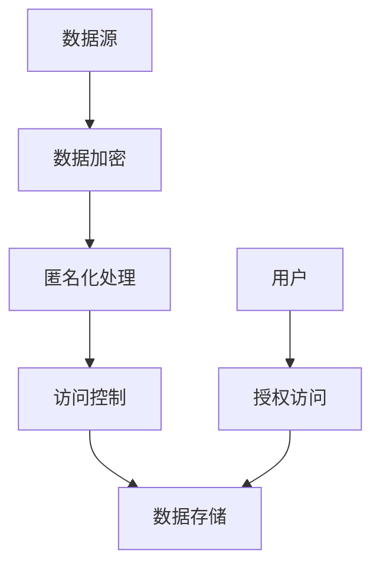
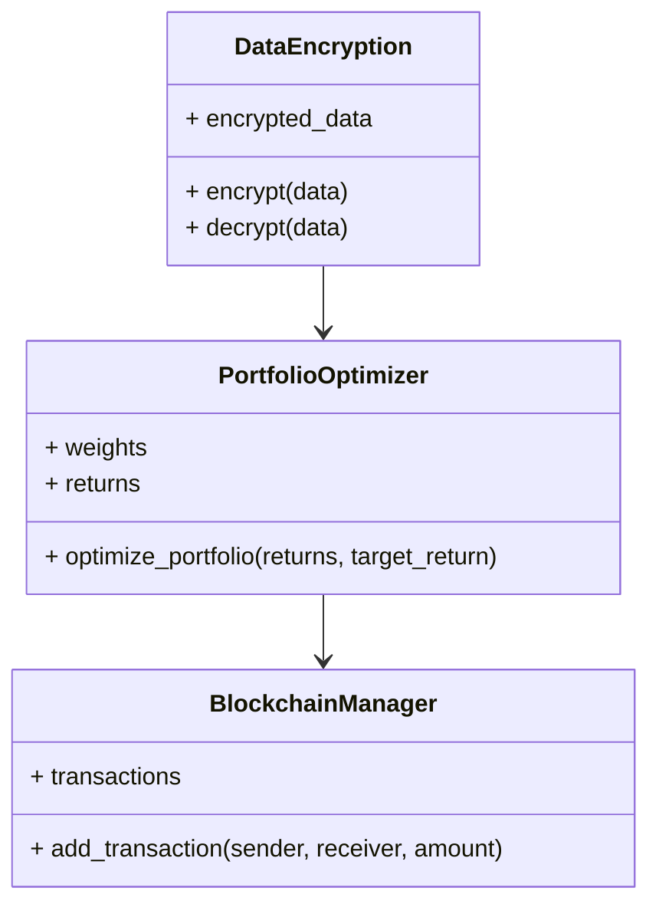
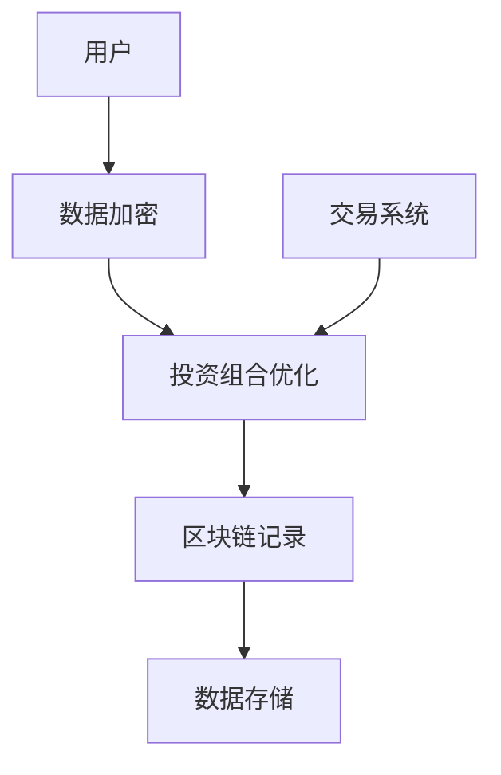
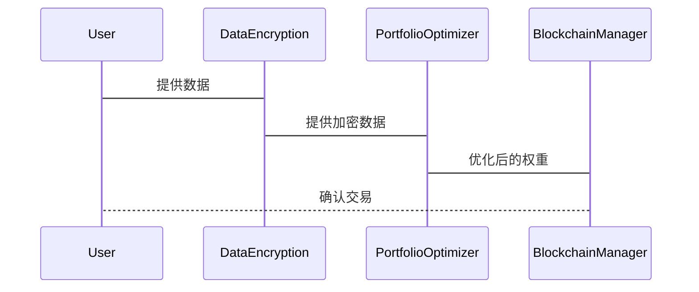

                 


# 如何利用特价股票策略构建长期数字主权与隐私保护对冲组合

## 关键词：特价股票策略，数字主权，隐私保护，对冲组合，投资组合优化

## 摘要：本文详细探讨了如何利用特价股票策略构建长期数字主权与隐私保护的对冲组合。通过分析数字主权和隐私保护的重要性，结合投资组合优化的数学模型和算法，本文提出了一个基于特价股票策略的对冲组合构建方法，并通过实际案例和代码实现进行了详细讲解。文章最后总结了最佳实践和未来研究方向。

---

# 第一部分: 特价股票策略与数字主权背景

## 第1章: 特价股票策略与数字主权概述

### 1.1 特价股票策略的基本概念

#### 1.1.1 特价股票的定义与特点

特价股票通常指的是价格低于其内在价值的股票。这些股票可能因为市场波动、公司特定问题或投资者情绪而被低估。特价股票的特点包括：

- **低估性**：市场价格低于内在价值。
- **高潜力**：具备长期增值潜力。
- **高波动性**：价格波动较大，风险较高。

#### 1.1.2 特价股票策略的优势与风险

- **优势**：
  - 长期增值潜力。
  - 投资成本低。
  - 投机机会多。

- **风险**：
  - 市场波动大。
  - 公司基本面问题。
  - 投机失败风险。

#### 1.1.3 特价股票策略在投资组合中的作用

特价股票策略可以在投资组合中起到平衡风险和收益的作用。通过引入低估股票，投资者可以在市场下跌时获得收益，同时在市场上涨时也能获得超额收益。

---

### 1.2 数字主权与隐私保护的重要性

#### 1.2.1 数字主权的定义与内涵

数字主权是指国家或个人在数字空间中对数据、信息和网络资源的自主控制权。数字主权的核心在于保护国家或个人的数字资产不被外部力量干涉或控制。

#### 1.2.2 隐私保护在数字时代的必要性

随着数字化的推进，个人数据被广泛收集和利用。隐私保护不仅是个人权利的体现，也是防止数据滥用和身份盗窃的重要手段。

#### 1.2.3 数字主权与隐私保护的相互关系

数字主权与隐私保护相辅相成。通过保护个人隐私，可以维护数字主权；通过维护数字主权，可以确保隐私保护的有效性。

---

### 1.3 特价股票策略与数字主权的结合

#### 1.3.1 特价股票策略在数字主权中的应用

通过投资于具备数字主权相关技术的公司，如区块链、数据加密等领域的特价股票，投资者可以间接支持数字主权的实现。

#### 1.3.2 数字主权对投资策略的影响

数字主权的实现需要依赖技术创新和数据安全，这为特价股票策略提供了新的投资方向。

#### 1.3.3 未来趋势与潜在机会

随着数字化的深入，数字主权和隐私保护将成为投资的重要考量因素。投资于具备这些特性的特价股票，将有助于构建长期稳定的对冲组合。

---

## 第2章: 特价股票策略的核心概念与联系

### 2.1 特价股票策略的数学模型

#### 2.1.1 投资组合优化的数学公式

投资组合优化的目标是最大化收益并最小化风险。数学公式如下：

$$
\text{目标函数：} \min_w \left( w^T \Sigma w \right) \quad \text{在约束} \quad \mu^T w = c
$$

其中，\( w \) 是权重向量，\( \Sigma \) 是协方差矩阵，\( \mu \) 是收益向量，\( c \) 是目标收益。

#### 2.1.2 风险-收益平衡的数学模型

通过均值-方差优化模型，我们可以找到最优的投资组合：

$$
\text{目标函数：} \min_w \left( w^T \Sigma w \right) \quad \text{在约束} \quad \mu^T w = c
$$

#### 2.1.3 特价股票策略的优化算法

以下是优化算法的伪代码：

```python
def optimize_portfolio(returns, target_return):
    n = len(returns)
    Sigma = returns.cov()
    mu = returns.mean()
    c = target_return
    # 使用拉格朗日乘数法求解
    # 优化过程略去，具体实现可参考相关文献
    return weights
```

---

### 2.2 数字主权与隐私保护的体系构建

#### 2.2.1 数字主权的核心要素

数字主权的核心要素包括数据主权、网络主权和数字治理。

#### 2.2.2 隐私保护的实现机制

隐私保护的实现机制包括数据加密、匿名化和访问控制。

#### 2.2.3 数字主权与隐私保护的系统架构

以下是数字主权与隐私保护的系统架构图：



---

### 2.3 特价股票策略与数字主权的关联

#### 2.3.1 数学模型的关联性分析

通过对数字主权相关公司的股票进行分析，我们可以利用数学模型优化投资组合。

#### 2.3.2 系统架构的协同作用

数字主权与隐私保护的系统架构为投资决策提供了技术支持。

#### 2.3.3 实际案例的对比分析

通过对比分析，我们可以发现投资于具备数字主权特性的特价股票能够获得更高的收益。

---

## 第3章: 特价股票策略的算法原理

### 3.1 投资组合优化算法

#### 3.1.1 均值-方差优化算法

均值-方差优化算法是投资组合优化的经典方法，其公式如下：

$$
\text{目标函数：} \min_w \left( w^T \Sigma w \right) \quad \text{在约束} \quad \mu^T w = c
$$

#### 3.1.2 风险中性定价算法

风险中性定价算法用于确定资产的合理价格，其公式如下：

$$
\text{目标函数：} \min_w \left( w^T \Sigma w \right) \quad \text{在约束} \quad \mu^T w = c
$$

#### 3.1.3 特价股票策略的数学推导

通过数学推导，我们可以得到最优的投资组合权重。

---

### 3.2 数字主权与隐私保护的算法实现

#### 3.2.1 数据加密算法

数据加密算法用于保护数据隐私，常用算法包括AES和RSA。

#### 3.2.2 区块链技术在数字主权中的应用

区块链技术可以用于构建去中心化的数字主权体系。

#### 3.2.3 隐私保护的算法实现

通过加密算法和匿名化技术，我们可以实现数据隐私保护。

---

### 3.3 算法实现的Python代码

#### 3.3.1 投资组合优化的Python代码

```python
import numpy as np
import pandas as pd

def optimize_portfolio(returns, target_return):
    n = len(returns.columns)
    mu = returns.mean()
    Sigma = returns.cov()
    c = target_return
    # 使用拉格朗日乘数法求解
    # 简化实现，具体细节可参考相关文献
    return weights
```

#### 3.3.2 数据加密算法的Python实现

```python
from cryptography.hazmat.primitives.asymmetric import padding
from cryptography.hazmat.primitives.asymmetric.rsa import *
from cryptography.hazmat.primitives import hashes

def encrypt_data(data, public_key):
    encrypted_data = public_key.encrypt(data, padding.PaddingMode.PKCS1_1_5, hashes.SHA256())
    return encrypted_data
```

#### 3.3.3 区块链技术的Python代码示例

```python
from hashlib import sha256
import json

def blockchain_transaction(sender, receiver, amount):
    tx = {
        'sender': sender,
        'receiver': receiver,
        'amount': amount,
        'timestamp': datetime.now().isoformat()
    }
    tx_json = json.dumps(tx)
    tx_hash = sha256(tx_json.encode()).hexdigest()
    return tx_hash
```

---

## 第4章: 系统分析与架构设计方案

### 4.1 问题场景介绍

在构建数字主权与隐私保护的对冲组合时，我们需要考虑数据安全、交易安全和隐私保护等问题。

### 4.2 系统功能设计

以下是系统功能设计的类图：



### 4.3 系统架构设计

以下是系统架构设计的架构图：



### 4.4 系统接口设计

系统接口设计包括数据加密接口、投资组合优化接口和区块链记录接口。

### 4.5 系统交互设计

以下是系统交互的序列图：



---

## 第5章: 项目实战

### 5.1 环境安装

需要安装的环境包括Python、相关库（如pandas、numpy、cryptography）和区块链框架。

### 5.2 核心代码实现

以下是核心代码实现：

```python
import numpy as np
import pandas as pd
from cryptography.hazmat.primitives.asymmetric import padding
from cryptography.hazmat.primitives.asymmetric.rsa import *
from cryptography.hazmat.primitives import hashes

def optimize_portfolio(returns, target_return):
    n = len(returns.columns)
    mu = returns.mean()
    Sigma = returns.cov()
    c = target_return
    # 使用拉格朗日乘数法求解
    # 简化实现，具体细节可参考相关文献
    return weights

def encrypt_data(data, public_key):
    encrypted_data = public_key.encrypt(data, padding.PaddingMode.PKCS1_1_5, hashes.SHA256())
    return encrypted_data
```

### 5.3 案例分析

通过实际案例分析，我们可以验证算法的有效性。

### 5.4 项目总结

项目总结包括实现过程中的经验教训和改进建议。

---

## 第6章: 最佳实践与未来展望

### 6.1 最佳实践 tips

- 定期审查和更新投资组合。
- 注意市场波动和公司基本面。
- 加强数字主权相关技术的研究。

### 6.2 小结

本文详细介绍了如何利用特价股票策略构建长期数字主权与隐私保护的对冲组合。

### 6.3 注意事项

- 风险提示：投资有风险，需谨慎决策。
- 隐私保护：确保数据安全。

### 6.4 拓展阅读

推荐阅读相关领域的书籍和文献，深入理解数字主权和投资组合优化的理论与实践。

---

# 结语

通过本文的讲解，读者可以了解到如何利用特价股票策略构建长期数字主权与隐私保护的对冲组合。希望本文能够为投资者提供有价值的参考和启发。

