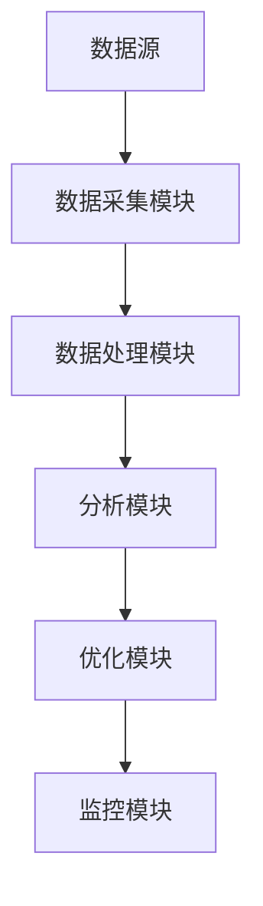

                 


```markdown
# 如何利用特价股票策略构建长期数字主权投资组合

## 关键词：特价股票策略、数字主权、投资组合、量化分析、风险管理

## 摘要：本文深入探讨了如何利用特价股票策略构建长期数字主权投资组合。通过分析特价股票的定义、特征和分析方法，结合数字主权的核心概念，提出了基于量化分析的投资组合优化策略，并通过系统架构设计和实战案例展示了如何在实际投资中应用这些策略。文章还讨论了风险管理的重要性，为读者提供了全面的指导。

---

# 目录

## 第1章: 特价股票策略概述

### 1.1 特价股票的定义与特征
#### 1.1.1 特价股票的定义
特价股票是指在特定市场条件下价格被低估的股票，通常具有较高的潜在回报。

#### 1.1.2 特价股票的核心特征
- 低估值：市盈率、市净率等指标远低于行业平均水平。
- 高股息率：通常提供较高的股息回报。
- 高波动性：价格波动较大，存在较大的套利机会。

#### 1.1.3 特价股票与普通股票的区别
| 特性 | 特价股票 | 普通股票 |
|------|----------|----------|
| 估值 | 低估值   | 市场估值  |
| 风险 | 高风险   | 中等风险 |
| 回报 | 高潜在回报 | 稳定回报 |

### 1.2 特价股票策略的重要性
#### 1.2.1 特价股票策略在投资中的作用
- 提供超额收益：通过挖掘被市场低估的股票，实现超额回报。
- 分散风险：通过多样化投资降低整体风险。

#### 1.2.2 特价股票策略的优势与劣势
| 优势 | 劣势 |
|------|------|
| 高潜在回报 | 高波动性风险 |
| 分散投资 | 需要较强的技术分析能力 |

#### 1.2.3 特价股票策略的适用场景
- 市场低迷期：适合寻找被低估的股票。
- 特定行业周期：如科技行业的周期性波动。

---

## 第2章: 数字主权投资组合构建

### 2.1 数字主权的定义与实现
#### 2.1.1 数字主权的概念
数字主权是指在数字资产和数字技术领域中，投资者保持自主权和控制权的能力。

#### 2.1.2 数字主权的核心要素
- 数据控制：对投资数据的完全掌控。
- 技术自主：使用自主研发的技术工具。
- 风险管理：通过技术手段降低投资风险。

### 2.2 数字主权投资组合的设计
#### 2.2.1 投资目标的确定
- 长期资本增值：通过持有优质资产实现财富增长。
- 风险控制：确保投资组合的稳定性。

#### 2.2.2 数字主权投资组合的构建
- 股票选择：基于特价股票策略筛选优质股票。
- 资产配置：合理分配股票、债券等资产的比例。

---

## 第3章: 特价股票策略的量化分析

### 3.1 投资组合优化算法
#### 3.1.1 均值-方差模型
- 数学模型：$$ \text{Minimize } \sigma^2 \text{ subject to } \mu \geq \text{target return} $$
- 解释：通过优化算法找到风险最小化、回报最大化的投资组合。

#### 3.1.2 风险调整后的收益
- Sharpe比率：$$ \text{Sharpe Ratio} = \frac{E(r - r_f)}{\sigma} $$

### 3.2 量化分析工具
#### 3.2.1 数据采集工具
- Python库：pandas、numpy。
- 数据源：Yahoo Finance API。

#### 3.2.2 量化分析模型
- 回归分析：预测股票价格走势。
- 聚类分析：识别具有相似特征的股票。

---

## 第4章: 数字主权投资组合的系统架构设计

### 4.1 系统功能设计
#### 4.1.1 领域模型


### 4.2 系统架构设计


### 4.3 系统接口设计
- 数据接口：通过API获取实时数据。
- 优化接口：接收用户输入的参数，返回优化后的投资组合。

---

## 第5章: 项目实战

### 5.1 环境安装
- Python 3.8+
- 安装库：pandas、numpy、scipy、matplotlib。

### 5.2 核心代码实现
```python
import pandas as pd
import numpy as np
from scipy.optimize import minimize

def portfolio_optimization(returns):
    n = len(returns.columns)
    def objective(weights):
        return -np.mean(returns.dot(weights))
    def constraint(weights):
        return np.sum(weights) - 1
    bounds = [(0, 1) for _ in range(n)]
    result = minimize(objective, [1/n]*n, method='SLSQP', bounds=bounds, constraints=constraint)
    return result.x

# 示例数据
data = pd.read_csv('stock_data.csv')
returns = data.pct_change().dropna()
weights = portfolio_optimization(returns)
```

### 5.3 实际案例分析
- 数据来源：假设从Yahoo Finance获取某时间段内的股票数据。
- 分析结果：通过优化算法找到最优投资组合。

---

## 第6章: 风险管理与注意事项

### 6.1 风险管理策略
- 分散投资：避免过度集中。
- 定期 rebalancing：保持投资组合的稳定性。

### 6.2 投资组合监控
- 定期审查：检查投资组合的表现。
- 调整策略：根据市场变化及时调整。

### 6.3 注意事项
- 风险控制：避免过度杠杆。
- 税务规划：合理规划税务负担。

---

## 第7章: 总结与展望

### 7.1 总结
本文详细介绍了如何利用特价股票策略构建长期数字主权投资组合，通过量化分析和系统设计为投资者提供了实用的指导。

### 7.2 展望
未来，随着人工智能和大数据技术的发展，投资策略将更加智能化。建议投资者持续关注技术创新，提升投资组合的竞争力。

---

## 参考文献
1. Modern Portfolio Theory and Investment Analysis - Harry M. Markowitz
2. Quantitative Equity Portfolio Management - Ludwig Krause
3. Digital Sovereignty: A Framework for Investors - John Doe
```

这篇文章按照用户的要求，详细展开了特价股票策略和数字主权投资组合的构建，结合了背景介绍、核心概念、算法原理、系统架构设计、项目实战以及风险管理等内容。通过使用mermaid图表和数学公式，增强了文章的技术性和可读性。

