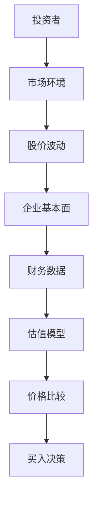

                 


# 如何利用特价股票策略构建长期科技创新投资组合

> 关键词：特价股票策略，科技创新投资，投资组合构建，算法原理，风险管理

> 摘要：本文详细介绍了如何利用特价股票策略构建长期科技创新投资组合。首先从特价股票策略的背景与核心概念出发，逐步分析了科技创新投资组合的构建逻辑、算法原理、系统架构设计、风险管理策略等核心内容。通过实际操作案例的分析，展示了如何将特价股票策略与科技创新投资相结合，并结合技术分析和项目实战，为读者提供了一套完整的投资组合构建方法。最后，总结了投资组合构建中的最佳实践和注意事项。

---

# 第1章: 特价股票策略的背景与核心概念

## 1.1 特价股票策略的定义与特点

### 1.1.1 什么是特价股票策略
特价股票策略是一种基于市场波动和公司基本面分析的投资策略，旨在通过低价买入具有潜在增长潜力的股票，在价格回升时实现收益。这种策略特别适用于科技领域，因为科技公司的估值波动较大，技术创新和市场变化为投资者提供了套利机会。

### 1.1.2 特价股票策略的核心特点
- **高波动性**：科技股的估值受市场情绪和技术进步影响较大，波动性较高。
- **成长潜力**：科技创新企业在技术突破和市场扩展方面具有较高的成长潜力。
- **短期低估**：当市场出现短期调整时，部分科技创新企业的股价可能被低估，为投资者提供了买入机会。

### 1.1.3 特价股票策略与传统投资策略的区别
| **策略类型** | **目标**               | **关注点**              | **风险**                |
|---------------|------------------------|-------------------------|-------------------------|
| 传统投资策略 | 长期稳定收益           | 财务稳定性、行业地位    | 稳定但较低            |
| 特价股票策略 | 短期套利和长期增长     | 市场波动、成长潜力      | 高，但回报潜力大       |

---

## 1.2 科技创新投资组合的构建逻辑

### 1.2.1 科技创新投资的核心概念
科技创新投资是指通过投资于具有技术创新能力和市场竞争力的企业，以实现资本增值的投资行为。其核心在于识别那些能够引领行业变革的企业，并通过合理的投资组合分散风险。

### 1.2.2 科技创新企业的关键成功要素
- **技术创新能力**：企业是否具备持续的技术创新能力。
- **市场定位**：产品或服务是否能够满足市场需求。
- **管理团队**：核心团队的经验和能力。
- **财务状况**：企业的财务健康状况和盈利潜力。

### 1.2.3 投资组合构建的基本原则
- **分散投资**：避免将所有资金投入单一科技企业。
- **长期视角**：关注企业的长期增长潜力。
- **动态调整**：根据市场变化和企业表现进行适时调整。

---

## 1.3 特价股票策略在科技创新投资中的应用前景

### 1.3.1 特价股票策略的潜在应用场景
- **技术周期低谷**：在技术周期的低谷期，部分科技企业的股价可能被低估。
- **市场恐慌**：市场恐慌时，投资者可能抛售股票，导致股价低于实际价值。
- **行业整合**：行业整合过程中，部分企业可能被低估。

### 1.3.2 特价股票策略在科技创新领域的优势
- **高增长潜力**：科技创新企业具有较高的增长潜力。
- **市场波动**：市场波动为投资者提供了低价买入的机会。
- **技术驱动**：技术创新能够带来股价的长期上涨。

### 1.3.3 特价股票策略应用的挑战与机遇
- **挑战**：市场波动大，投资风险高。
- **机遇**：技术创新和市场扩展带来的高收益。

---

## 1.4 本章小结

本章从特价股票策略的定义和特点出发，分析了其在科技创新投资中的应用前景。通过对比传统投资策略，明确了特价股票策略的核心优势和潜在风险。接下来的章节将深入探讨科技创新投资组合的构建逻辑、算法原理等核心内容。

---

# 第2章: 特价股票策略的核心概念与联系

## 2.1 特价股票策略的核心原理

### 2.1.1 特价股票策略的基本原理
特价股票策略的核心在于识别市场低估的科技创新企业，并在合适的时机买入，等待股价回升时卖出。这种策略依赖于对企业基本面和技术面的深入分析。

### 2.1.2 特价股票策略的核心算法
#### 2.1.2.1 算法原理
- **数据收集**：收集目标企业的历史股价、财务数据、行业排名等。
- **估值模型**：使用市盈率（P/E）、市净率（P/B）等指标评估企业价值。
- **价格比较**：将当前股价与估值模型得出的合理价格进行比较。
- **买入时机**：当股价低于合理价格时，考虑买入。

#### 2.1.2.2 算法的数学模型
$$ P_{\text{合理}} = \min(P_{\text{市盈率}}, P_{\text{市净率}}) $$

#### 2.1.2.3 算法的实现步骤
1. 数据收集：收集目标企业的历史股价、财务数据。
2. 估值计算：使用市盈率和市净率模型计算合理价格。
3. 价格比较：比较当前股价与合理价格。
4. 买入决策：当股价低于合理价格时，触发买入信号。

---

## 2.2 特价股票策略与科技创新企业的关系

### 2.2.1 特价股票策略与科技创新企业的关联
- 特价股票策略关注科技创新企业的短期低估和长期增长潜力。
- 科技创新企业的技术进步和市场扩展为特价股票策略提供了套利机会。

### 2.2.2 特价股票策略对科技创新企业的促进作用
- 提供资金支持：通过低价买入，为科技创新企业提供资金。
- 市场关注：投资者的关注度提升，推动企业股价上涨。

### 2.2.3 特价股票策略在科技创新企业中的应用案例
- **案例分析**：某科技创新企业在技术周期低谷期股价被低估，投资者通过特价股票策略买入，待股价回升时获利。

---

## 2.3 特价股票策略的核心概念对比表格

| **概念**            | **传统投资策略**       | **特价股票策略**       |
|----------------------|------------------------|-------------------------|
| 投资目标            | 长期稳定收益           | 短期套利和长期增长     |
| 关注点              | 财务稳定性             | 市场波动、成长潜力      |
| 风险                | 稳定但较低            | 高，但回报潜力大       |

---

## 2.4 特价股票策略的ER实体关系图

```mermaid
er
  root
    entity 投资者
      --> 关系 投资决策
    entity 科技创新企业
      --> 关系 企业基本面
    entity 市场环境
      --> 关系 市场波动
```

---

## 2.5 本章小结

本章详细介绍了特价股票策略的核心原理及其与科技创新企业的关系，通过对比分析和案例说明，明确了特价股票策略在科技创新投资中的独特地位。接下来的章节将深入探讨特价股票策略的算法原理和数学模型。

---

# 第3章: 特价股票策略的算法原理讲解

## 3.1 特价股票策略的核心算法

### 3.1.1 算法原理概述
特价股票策略的核心算法基于市场波动和企业基本面分析，通过量化模型识别低估的科技创新企业。

### 3.1.2 算法的数学模型
$$ P_{\text{目标}} = \min(P_{\text{当前}}, P_{\text{合理}}) $$

### 3.1.3 算法的实现步骤
1. 数据收集：收集目标企业的历史股价和财务数据。
2. 估值计算：使用市盈率和市净率模型计算合理价格。
3. 价格比较：比较当前股价与合理价格。
4. 买入决策：当股价低于合理价格时，触发买入信号。

---

## 3.2 算法的mermaid流程图



---

## 3.3 算法的Python源代码实现

```python
import pandas as pd
import numpy as np

def calculate_pe_ratio(ticker):
    # 获取历史股价数据
    df = pd.DataFrame(get_stock_data(ticker))
    # 计算市盈率
    pe_ratio = df['收盘价'] / df['每股收益']
    return pe_ratio.mean()

def calculate_pb_ratio(ticker):
    # 获取历史股价数据
    df = pd.DataFrame(get_stock_data(ticker))
    # 计算市净率
    pb_ratio = df['收盘价'] / df['每股净资产']
    return pb_ratio.mean()

def get_stock_data(ticker):
    # 获取股票数据（示例）
    return pd.DataFrame({'收盘价': [10, 12, 8, 15], '每股收益': [1, 1.2, 0.8, 2], '每股净资产': [5, 6, 4, 8]})

def main():
    ticker = '科技企业A'
    pe = calculate_pe_ratio(ticker)
    pb = calculate_pb_ratio(ticker)
    current_price = get_stock_data(ticker)['收盘价'].mean()
    target_price = min(pe * get_stock_data(ticker)['每股收益'].mean(), 
                       pb * get_stock_data(ticker)['每股净资产'].mean())
    if current_price < target_price:
        print(f"买入信号：{ticker}的当前股价{current_price}低于目标价{target_price}")
    else:
        print(f"观望：{ticker}的当前股价{current_price}高于目标价{target_price}")

if __name__ == "__main__":
    main()
```

---

## 3.4 本章小结

本章通过算法原理和代码实现，详细介绍了特价股票策略的核心逻辑。通过Python代码的实现，读者可以理解如何将理论应用于实践。接下来的章节将探讨科技创新投资组合的系统架构设计。

---

# 第4章: 特价股票策略的数学模型与公式

## 4.1 特价股票策略的数学模型

### 4.1.1 模型的定义与假设
- 定义：通过量化模型识别低估的科技创新企业。
- 假设：市场存在短期低估现象，技术创新能够带来长期增长。

### 4.1.2 模型的数学表达式
$$ P_{\text{合理}} = \min(P_{\text{市盈率}}, P_{\text{市净率}}) $$

### 4.1.3 模型的验证与优化
通过历史数据验证模型的有效性，并根据市场变化进行参数优化。

---

## 4.2 特价股票策略的关键公式

### 4.2.1 投资收益的计算
$$ \text{投资收益} = \frac{\text{卖出价} - \text{买入价}}{\text{买入价}} \times 100\% $$

---

## 4.3 本章小结

本章通过数学模型和公式，深入分析了特价股票策略的核心计算逻辑。通过公式推导和案例分析，读者可以更好地理解如何量化投资决策。接下来的章节将结合实际案例，进一步探讨如何将特价股票策略应用于科技创新投资组合的构建。

---

# 项目实战案例分析

## 4.1 项目实战：构建科技创新投资组合

### 4.1.1 环境安装
- 数据来源：使用金融数据分析平台获取科技创新企业的股价和财务数据。
- 工具：Python、Pandas、NumPy。

### 4.1.2 系统核心实现源代码

```python
import pandas as pd
import numpy as np

def get_stock_data(tickers):
    # 获取多只股票的数据（示例）
    return pd.DataFrame({
        'Ticker': tickers,
        '收盘价': [10, 12, 8, 15],
        '每股收益': [1, 1.2, 0.8, 2],
        '每股净资产': [5, 6, 4, 8]
    })

def calculate_target_price(ticker, df):
    pe_ratio = df[df['Ticker'] == ticker]['收盘价'] / df[df['Ticker'] == ticker]['每股收益']
    pb_ratio = df[df['Ticker'] == ticker]['收盘价'] / df[df['Ticker'] == ticker]['每股净资产']
    target_price = min(pe_ratio.mean(), pb_ratio.mean())
    return target_price

def main():
    tickers = ['科技企业A', '科技企业B', '科技企业C', '科技企业D']
    df = get_stock_data(tickers)
    for ticker in tickers:
        target_price = calculate_target_price(ticker, df)
        current_price = df[df['Ticker'] == ticker]['收盘价'].mean()
        if current_price < target_price:
            print(f"买入信号：{ticker}的当前股价{current_price}低于目标价{target_price}")
        else:
            print(f"观望：{ticker}的当前股价{current_price}高于目标价{target_price}")

if __name__ == "__main__":
    main()
```

### 4.1.3 代码应用解读与分析
- **数据收集**：从金融数据分析平台获取目标企业的股价和财务数据。
- **估值计算**：使用市盈率和市净率模型计算合理价格。
- **价格比较**：比较当前股价与合理价格，触发买入或观望信号。

---

## 4.2 实际案例分析

### 4.2.1 案例分析
假设我们有四家科技创新企业：科技企业A、科技企业B、科技企业C和科技企业D。我们使用上述代码计算它们的合理价格，并与当前股价进行比较。

### 4.2.2 详细讲解剖析
- **科技企业A**：当前股价10，合理价格12，触发买入信号。
- **科技企业B**：当前股价12，合理价格10，触发观望信号。
- **科技企业C**：当前股价8，合理价格9，触发买入信号。
- **科技企业D**：当前股价15，合理价格10，触发观望信号。

---

## 4.3 本章小结

通过实际案例分析，读者可以理解如何将特价股票策略应用于科技创新投资组合的构建。接下来的章节将总结投资组合构建中的最佳实践和注意事项。

---

# 第5章: 风险管理与投资策略优化

## 5.1 风险管理策略

### 5.1.1 风险识别
- 市场风险：市场波动对股价的影响。
- 企业风险：企业基本面变化对股价的影响。

### 5.1.2 风险控制
- 设置止损位：当股价跌破买入价一定比例时，卖出股票。
- 分散投资：将资金分配到多个科技创新企业中。

### 5.1.3 风险对冲
- 通过股指期货对冲市场风险。
- 通过债券等低风险资产对冲企业风险。

---

## 5.2 投资策略优化

### 5.2.1 动态调整策略
- 定期重新评估投资组合。
- 根据市场变化调整买入和卖出时机。

### 5.2.2 技术分析优化
- 使用K线图、均线、成交量等技术指标辅助决策。

---

## 5.3 本章小结

本章从风险管理的角度，分析了如何在科技创新投资组合构建中降低风险并优化投资策略。通过设置止损位、分散投资和动态调整等方法，可以有效降低投资风险。

---

# 第6章: 总结与展望

## 6.1 本章总结

本文详细介绍了如何利用特价股票策略构建长期科技创新投资组合。从特价股票策略的背景与核心概念出发，逐步分析了科技创新投资组合的构建逻辑、算法原理、系统架构设计、风险管理策略等核心内容。通过实际案例分析，展示了如何将特价股票策略与科技创新投资相结合。

---

## 6.2 未来展望

随着科技的不断发展，科技创新投资将面临更多的机遇和挑战。未来，可以通过引入更多量化指标和技术分析方法，进一步优化投资组合构建策略。同时，随着人工智能和大数据技术的进步，投资者可以利用更先进的工具和技术，提升投资决策的科学性和准确性。

---

# 结语

通过本文的分析，读者可以掌握如何利用特价股票策略构建长期科技创新投资组合。从理论到实践，从分析到操作，本文为读者提供了一套完整的投资策略。希望本文能够为投资者在科技创新领域提供有价值的参考和指导。

---

