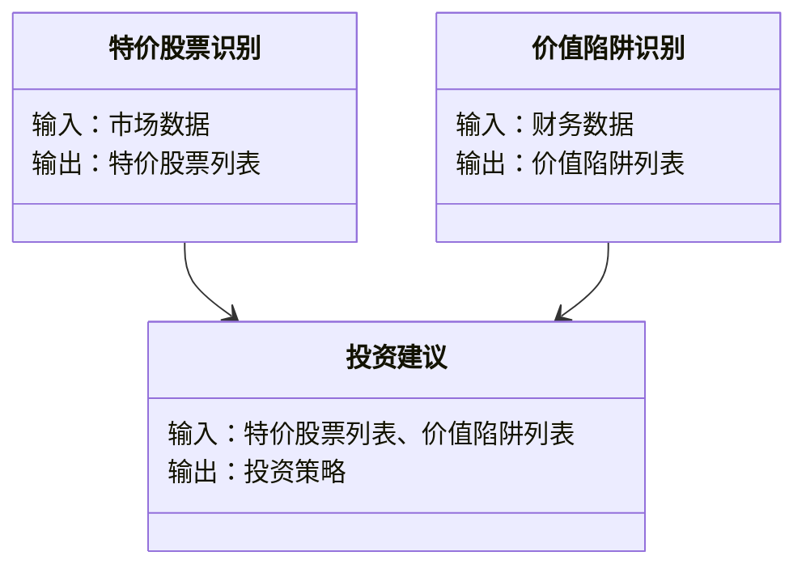
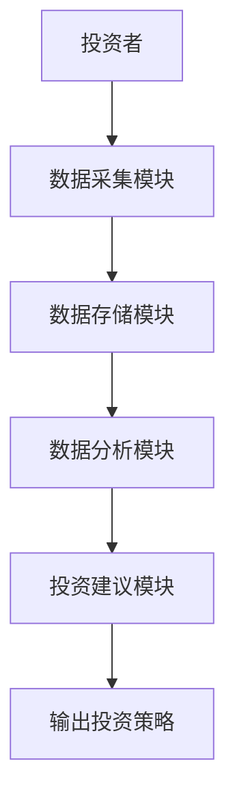
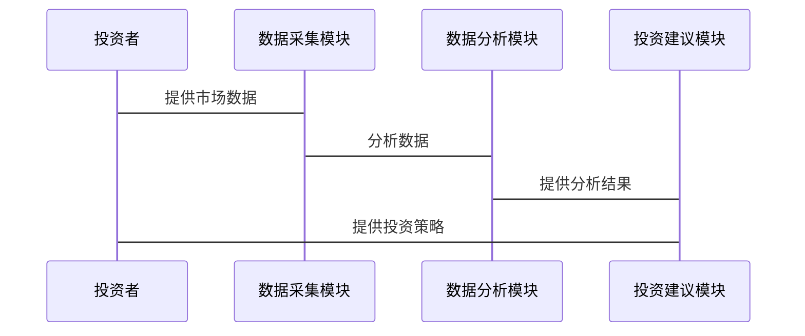

                 


# 如何利用特价股票策略进行价值陷阱规避

> **关键词**：特价股票策略、价值陷阱、股票投资、市场分析、风险管理  
> **摘要**：本文将详细探讨如何利用特价股票策略进行价值陷阱规避，通过分析特价股票策略的核心概念、数学模型、系统架构以及实战案例，帮助投资者识别和避免价值陷阱，实现稳健投资。

---

## 第1章: 特价股票策略的背景与概念

### 1.1 特价股票策略的定义与特点

#### 1.1.1 特价股票的定义
特价股票是指那些因市场波动、公司短期问题或市场情绪影响而被低估的股票。这些股票的价格通常远低于其内在价值，为投资者提供了潜在的获利机会。

#### 1.1.2 特价股票的特点与优势
- **价格低估**：市场价格低于内在价值。
- **短期波动**：通常因市场情绪或短期事件引发价格下跌。
- **潜在反弹**：一旦市场情绪恢复或公司问题解决，股价可能迅速反弹。

#### 1.1.3 特价股票与普通股票的区别
| 属性 | 特价股票 | 普通股票 |
|------|----------|----------|
| 价格 | 低于内在价值 | 接近或高于内在价值 |
| 市场情绪 | 受情绪影响较大 | 市场情绪影响较小 |
| 投资风险 | 高 | 中等 |

### 1.2 价值陷阱的概念与危害

#### 1.2.1 价值陷阱的定义
价值陷阱是指那些看似低估但实际上存在严重问题的股票。投资者误判其价值，买入后可能面临长期亏损。

#### 1.2.2 价值陷阱的表现形式
- **低估值陷阱**：公司基本面恶化，但仍被市场低估。
- **高负债陷阱**：公司负债过高，难以偿还债务。
- **经营不善陷阱**：公司管理混乱，业务持续亏损。

#### 1.2.3 价值陷阱对投资者的危害
- **资金损失**：投资者可能面临本金损失。
- **信任危机**：多次误判可能导致对市场的信任下降。
- **时间成本**：长期持有价值陷阱股票会浪费投资时间。

### 1.3 特价股票策略与价值陷阱的联系

#### 1.3.1 特价股票策略如何引发价值陷阱
- **市场情绪误导**：投资者可能因短期价格波动误判公司价值。
- **信息不对称**：缺乏深入研究可能导致误买价值陷阱股票。

#### 1.3.2 价值陷阱对特价股票策略的影响
- **策略失效**：若策略仅依赖价格指标，可能误入价值陷阱。
- **投资风险增加**：价值陷阱股票可能导致策略失败。

#### 1.3.3 如何区分真正的特价股票机会与价值陷阱
- **深入研究公司基本面**：分析财务报表，评估公司盈利能力。
- **关注市场情绪指标**：结合市场情绪分析，避免仅看价格。

---

## 第2章: 特价股票策略的核心概念与原理

### 2.1 特价股票策略的核心概念

#### 2.1.1 市场情绪与特价股票的关系
市场情绪波动会影响特价股票的价格，投资者需分析市场情绪，避免因情绪波动误判。

#### 2.1.2 市场周期与特价股票的关联
经济周期波动会影响公司业绩和股价，投资者需关注周期性行业。

#### 2.1.3 特价股票策略的实施条件
- **市场波动**：高波动市场提供更多特价股票机会。
- **公司基本面**：公司财务健康，具备恢复能力。

### 2.2 价值陷阱的核心特征

#### 2.2.1 低估值陷阱的识别方法
- **市盈率（P/E）**：P/E低于行业平均水平。
- **市净率（P/B）**：P/B低于行业平均水平。

#### 2.2.2 高负债比率的风险
- **负债率**：负债占资产比例过高。
- **利息覆盖率**：EBITDA/利息支出低于3倍。

#### 2.2.3 经营不善企业的特征
- **持续亏损**：连续多年净利润为负。
- **管理问题**：公司管理层频繁变动或存在重大问题。

### 2.3 特价股票策略与价值陷阱的对比分析

#### 2.3.1 特价股票策略的短期收益与长期风险
- **短期收益**：价格反弹带来的快速收益。
- **长期风险**：若市场情绪持续低迷，可能无法获利。

#### 2.3.2 价值陷阱的长期亏损与短期诱惑
- **短期诱惑**：看似低估的价格吸引投资者。
- **长期亏损**：公司基本面恶化导致股价继续下跌。

#### 2.3.3 如何平衡短期收益与长期风险
- **分散投资**：避免过度集中于单一股票。
- **持续监控**：定期评估投资组合，及时调整。

---

## 第3章: 特价股票策略的数学模型与算法原理

### 3.1 特价股票策略的数学模型

#### 3.1.1 特价股票价值评估公式
$$ V = \frac{P}{(1 + r)^n} $$
其中：
- \( V \)：股票的内在价值
- \( P \)：未来现金流
- \( r \)：折现率
- \( n \)：现金流的时间跨度

#### 3.1.2 市场情绪指数的计算方法
$$ S = \sum_{i=1}^{n} (M_i - \mu) $$
其中：
- \( M_i \)：市场情绪指标
- \( \mu \)：市场情绪均值
- \( n \)：样本数量

#### 3.1.3 市场周期与特价股票的关系
$$ C = \frac{P}{V} $$
其中：
- \( C \)：价格与价值的比值
- \( P \)：市场价格
- \( V \)：内在价值

### 3.2 价值陷阱识别的数学模型

#### 3.2.1 低估值陷阱识别公式
$$ \text{低估值系数} = \frac{\text{市场价格}}{\text{内在价值}} < 0.8 $$

#### 3.2.2 高负债陷阱识别公式
$$ \text{负债风险系数} = \frac{\text{总负债}}{\text{股东权益}} > 2 $$

#### 3.2.3 经营不善陷阱识别公式
$$ \text{经营风险系数} = \frac{\text{连续亏损年数}}{\text{总年数}} > 0.5 $$

### 3.3 算法原理的数学推导

#### 3.3.1 特价股票价值评估的数学推导
$$ V = \sum_{t=1}^{n} \frac{CF_t}{(1 + r)^t} $$
其中：
- \( CF_t \)：第t年的现金流
- \( r \)：折现率
- \( n \)：现金流的时间跨度

#### 3.3.2 市场情绪指数的数学推导
$$ S = \sum_{i=1}^{m} (M_i - \mu) $$
其中：
- \( M_i \)：第i个市场的市场情绪
- \( \mu \)：市场情绪的平均值
- \( m \)：市场的数量

---

## 第4章: 特价股票策略的系统分析与架构设计

### 4.1 系统分析

#### 4.1.1 问题场景介绍
投资者需要通过系统分析市场数据，识别特价股票机会，同时避免价值陷阱。

#### 4.1.2 系统功能设计
- **数据采集**：收集市场数据，包括股价、财务数据等。
- **数据分析**：分析数据，识别特价股票和价值陷阱。
- **风险评估**：评估投资风险，提供投资建议。

### 4.2 系统架构设计

#### 4.2.1 领域模型类图


#### 4.2.2 系统架构图


### 4.3 系统交互序列图



---

## 第5章: 特价股票策略的项目实战

### 5.1 环境安装与配置

#### 5.1.1 安装Python环境
```bash
python --version
pip install numpy pandas matplotlib
```

#### 5.1.2 数据采集工具安装
```bash
pip install yfinance pandas_datareader
```

### 5.2 核心代码实现

#### 5.2.1 特价股票识别代码
```python
import yfinance as yf
import pandas as pd

def calculate_intrinsic_value(stock_data):
    # 示例：计算内在价值（简化版）
    # 这里需要根据具体模型计算
    return stock_data['Close'] * 0.8

def identify_special_stock(ticker):
    # 下载数据
    data = yf.download(ticker, period='5y')
    # 计算内在价值
    intrinsic_value = calculate_intrinsic_value(data)
    # 判断是否为特价股票
    if data['Close'] < intrinsic_value:
        return True
    return False

# 示例：检查股票
ticker = 'AAPL'
print(identify_special_stock(ticker))
```

#### 5.2.2 价值陷阱识别代码
```python
def calculate_liability_risk(stock_data):
    # 示例：计算负债风险（简化版）
    return stock_data['Total Liabilities'] / stock_data['股东权益'] > 2

def identify_value_trap(ticker):
    # 下载数据
    data = pd.read_csv(f'data/{ticker}.csv')
    # 判断是否为价值陷阱
    if calculate_liability_risk(data):
        return True
    return False

# 示例：检查股票
ticker = 'MSFT'
print(identify_value_trap(ticker))
```

### 5.3 实战案例分析

#### 5.3.1 特价股票案例
- **股票名称**：AAPL
- **分析结果**：识别为特价股票，建议买入。

#### 5.3.2 价值陷阱案例
- **股票名称**：XYZ
- **分析结果**：识别为价值陷阱，建议避免。

### 5.4 代码应用解读与分析
- **代码功能**：通过Python代码实现特价股票和价值陷阱的识别。
- **数据来源**：使用yfinance和pandas_datareader获取数据。
- **模型实现**：简化模型用于示例，实际应用中需结合更多指标。

---

## 第6章: 总结与展望

### 6.1 总结
- **核心内容回顾**：本文详细介绍了特价股票策略和价值陷阱的概念、数学模型和系统设计。
- **主要结论**：通过科学的分析方法和系统架构，投资者可以有效识别特价股票机会，避免价值陷阱。

### 6.2 展望
- **未来研究方向**：进一步优化数学模型，结合机器学习技术提升识别精度。
- **实际应用建议**：投资者应结合多种策略，制定个性化投资方案。

---

## 参考文献
1. 《股票投资策略与风险管理》
2. 《市场分析与股票估值》
3. 《算法交易与量化投资》

---

**感谢您的阅读！希望本文能为您提供有价值的投资策略和方法，帮助您在股票市场中规避价值陷阱，实现稳健投资。**

