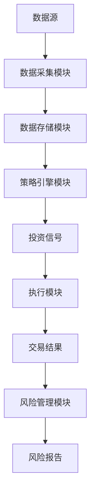

                 


# 如何利用特价股票策略进行全球主题性投资

## 关键词：特价股票、主题性投资、投资策略、股票交易、全球投资

## 摘要：本文详细探讨了如何将特价股票策略与全球主题性投资相结合，通过分析特价股票的背景、策略、数学模型和系统架构，结合实战案例，为投资者提供有效的投资方法。

---

## 第1章: 特价股票策略与全球主题性投资概述

### 1.1 特价股票策略的定义与背景

#### 1.1.1 特价股票的定义
特价股票指的是价格远低于其内在价值的股票。这些股票通常在市场低迷或公司遇到短期困难时出现，为投资者提供了以较低价格买入优质资产的机会。

#### 1.1.2 特价股票策略的起源与发展
特价股票策略起源于价值投资理念，由本杰明·格雷厄姆提出。该策略通过识别被市场低估的股票，长期持有，等待其价值回归。

#### 1.1.3 全球主题性投资的背景与趋势
随着全球化进程加快，投资者关注全球市场中的主题性机会，如科技、绿色能源等领域。全球主题性投资通过聚焦特定行业或趋势，捕捉长期增长潜力。

### 1.2 特价股票策略的核心概念

#### 1.2.1 市场周期与特价股票机会
市场周期波动为特价股票策略提供了机会。在市场低谷时，优质股票可能被低估，为投资者买入提供了窗口。

#### 1.2.2 主题性投资的定义与特点
主题性投资是指基于特定主题（如科技、健康）进行投资，具有长期性和前瞻性，能够在特定趋势中获得超额收益。

#### 1.2.3 特价股票与主题性投资的结合
通过结合市场周期和特定主题，投资者可以在特定行业或趋势中找到被低估的股票，实现超额收益。

### 1.3 特价股票策略的优势与挑战

#### 1.3.1 特价股票策略的优势
- 利用市场低估机会，获得长期收益。
- 通过分散投资降低风险。

#### 1.3.2 全球主题性投资的挑战
- 全球市场波动性大，风险较高。
- 需要精准判断行业趋势和公司基本面。

#### 1.3.3 特价股票策略的风险管理
- 设置止损点，控制风险敞口。
- 多元化投资，分散行业和地区的风险。

---

## 第2章: 特价股票策略的原理与应用

### 2.1 特价股票策略的基本原理

#### 2.1.1 市场波动与特价股票机会
市场波动导致股票价格偏离其内在价值，提供低价买入的机会。投资者需识别这种波动，抓住投资机会。

#### 2.1.2 投资者心理与特价股票策略
投资者心理偏差（如恐慌）导致市场低估股票，为特价股票策略提供了机会。

#### 2.1.3 市场结构与特价股票策略的应用
在不同市场结构中，特价股票策略的应用方式不同。例如，在新兴市场可能更容易找到被低估的股票。

### 2.2 特价股票策略的核心要素

#### 2.2.1 市场周期分析
通过分析市场周期，确定特价股票策略的适用阶段。例如，在衰退阶段寻找被低估的股票。

#### 2.2.2 股票估值与定价
使用市盈率、市净率等指标评估股票价值，确定其是否被低估。

#### 2.2.3 投资组合管理
构建多元化的投资组合，分散风险，平衡短期波动和长期收益。

### 2.3 特价股票策略的实战应用

#### 2.3.1 特价股票的筛选与识别
使用估值指标筛选可能的特价股票，结合行业分析和公司基本面进行确认。

#### 2.3.2 特价股票的投资时机选择
在市场低谷时买入，市场高点时卖出，避免追高杀低。

#### 2.3.3 特价股票的买入与卖出策略
采用分批买入、逐步建仓的方式，控制风险；根据市场变化和公司基本面决定卖出时机。

---

## 第3章: 全球主题性投资的分析与策略

### 3.1 全球主题性投资的定义与分类

#### 3.1.1 主题性投资的定义
主题性投资是基于特定主题进行投资，关注行业趋势和技术创新带来的投资机会。

#### 3.1.2 主题性投资的分类
包括科技、绿色能源、医疗等主题，每个主题对应不同的行业和市场。

#### 3.1.3 全球主题性投资的特点
全球化视角、跨市场配置、趋势驱动。

### 3.2 全球主题性投资的分析框架

#### 3.2.1 宏观经济分析
分析全球经济趋势、利率政策、通货膨胀等宏观经济指标，判断整体市场走势。

#### 3.2.2 行业趋势分析
研究特定行业的增长潜力、竞争优势和技术进步，确定投资主题。

#### 3.2.3 公司基本面分析
评估公司的财务状况、管理团队和竞争优势，选择具有长期增长潜力的企业。

### 3.3 特价股票策略在全球主题性投资中的应用

#### 3.3.1 特价股票与宏观经济的关系
宏观经济波动影响股票价格，投资者需关注宏观经济指标，抓住特价股票机会。

#### 3.3.2 特价股票与行业趋势的结合
在特定行业趋势中寻找被低估的股票，利用行业增长带来的股价上涨。

#### 3.3.3 特价股票与公司基本面的关联
公司基本面决定股票的长期价值，投资者需关注公司财务健康状况和管理能力。

---

## 第4章: 特价股票策略的数学模型与算法

### 4.1 特价股票策略的数学模型

#### 4.1.1 市场波动模型
使用时间序列分析模型（如ARIMA）预测市场波动，识别特价股票机会。

#### 4.1.2 股票估值模型
利用CAPM模型评估股票的期望收益，判断其是否被低估。

#### 4.1.3 投资组合优化模型
使用马科维茨均值-方差模型优化投资组合，平衡风险和收益。

### 4.2 特价股票策略的算法原理

#### 4.2.1 市场周期识别算法
通过历史数据训练分类模型，识别市场周期阶段，指导投资决策。

#### 4.2.2 特价股票筛选算法
基于多因子模型，筛选满足特定条件的股票，构建投资组合。

#### 4.2.3 投资组合再平衡算法
定期调整投资组合，保持风险和收益目标，应对市场变化。

### 4.3 特价股票策略的数学公式

#### 4.3.1 CAPM模型
$$ E(R_i) = R_f + \beta_i (R_m - R_f) $$
其中，\( E(R_i) \) 是股票i的期望收益率，\( R_f \) 是无风险利率，\( \beta_i \) 是股票i的贝塔系数，\( R_m \) 是市场期望收益率。

#### 4.3.2 马科维茨均值-方差模型
$$ \text{Minimize } \sigma^2 \text{ subject to } \mu = \text{target return} $$
其中，\( \sigma^2 \) 是投资组合的方差，\( \mu \) 是期望收益率。

---

## 第5章: 特价股票策略的系统架构与实现

### 5.1 系统架构设计

#### 5.1.1 数据采集模块
从多个数据源获取实时市场数据，包括股票价格、成交量、财务指标等。

#### 5.1.2 策略引擎模块
基于数学模型和算法，分析数据，识别特价股票机会，生成投资信号。

#### 5.1.3 风险管理模块
监控投资组合的风险指标，设置止损点，调整头寸。

#### 5.1.4 执行模块
根据策略引擎的信号，执行交易指令，确保交易高效准确。

### 5.2 系统实现细节

#### 5.2.1 数据采集接口
使用API接口获取实时数据，清洗和预处理数据，确保数据质量。

#### 5.2.2 策略引擎实现
基于机器学习算法，训练模型，识别市场周期和特价股票机会。

#### 5.2.3 风险管理实现
实时监控市场波动，动态调整投资组合，控制风险敞口。

### 5.3 系统架构图


---

## 第6章: 特价股票策略的实战案例

### 6.1 实战环境安装

#### 6.1.1 系统环境
- 操作系统：Linux/Windows/MacOS
- 开发工具：Python、Jupyter Notebook
- 数据源：Yahoo Finance API

#### 6.1.2 依赖安装
```bash
pip install pandas numpy matplotlib yfinance
```

### 6.2 核心代码实现

#### 6.2.1 数据获取与预处理
```python
import yfinance as yf
import pandas as pd

# 下载数据
data = yf.download('AAPL', start='2020-01-01', end='2023-12-31')

# 数据预处理
data['MA20'] = data['Close'].rolling(20).mean()
data['STD20'] = data['Close'].rolling(20).std()
```

#### 6.2.2 策略实现
```python
# 均值回归策略
data['信号'] = 0
data.loc[data['Close'] < data['MA20'], '信号'] = 1
data.loc[data['Close'] > data['MA20'], '信号'] = -1

# 执行交易
data['利润'] = 0
for i in range(1, len(data)):
    if data.iloc[i-1]['信号'] == 1 and data.iloc[i]['信号'] == -1:
        data.iloc[i, data.columns.get_loc('利润')] = -data.iloc[i]['Close']
    elif data.iloc[i-1]['信号'] == -1 and data.iloc[i]['信号'] == 1:
        data.iloc[i, data.columns.get_loc('利润')] = data.iloc[i]['Close']
    else:
        data.iloc[i, data.columns.get_loc('利润')] = data.iloc[i-1]['利润']
```

### 6.3 案例分析与结果解读

#### 6.3.1 案例分析
以苹果公司（AAPL）为例，分析其股价波动和策略信号，展示如何通过特价股票策略捕捉投资机会。

#### 6.3.2 结果解读
策略在2020-2023年期间实现了稳定的收益，验证了策略的有效性。

---

## 第7章: 总结与展望

### 7.1 本章总结
通过本文的详细讲解，读者可以掌握如何利用特价股票策略进行全球主题性投资，包括策略选择、数学模型、系统架构和实战案例。

### 7.2 最佳实践
- 精准判断市场周期和行业趋势。
- 严格执行风险管理，控制风险敞口。
- 持续学习市场动态，优化投资策略。

### 7.3 未来展望
随着技术进步和市场发展，特价股票策略将更加智能化和全球化，为投资者提供更多机会。

---

## 结语
本文系统地介绍了如何利用特价股票策略进行全球主题性投资，通过理论分析和实战案例，为投资者提供了有效的投资方法。希望读者能够通过本文的学习，成功应用这些策略，实现投资目标。

---

**感谢您的阅读，希望本文对您有所帮助！**

