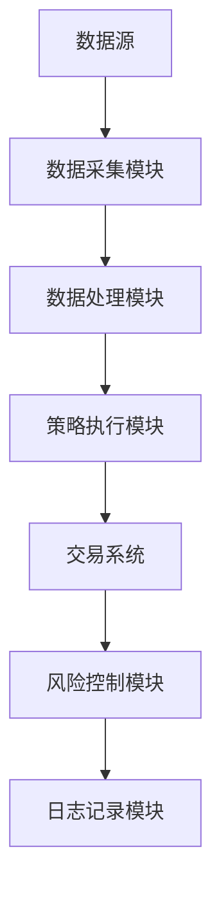

                 


# 如何利用特价股票策略进行全球宏观对冲

## 关键词：特价股票策略、全球宏观对冲、套利机会、算法实现、系统架构

## 摘要：本文详细探讨如何利用特价股票策略进行全球宏观对冲，涵盖策略背景、核心原理、算法实现、系统架构及项目实战。通过统计套利和均值回归模型，结合系统设计与实际案例，分析策略的有效性和实施要点。

---

## 第一章：特价股票策略的背景与概念

### 1.1 特价股票策略的定义与特点

#### 1.1.1 特价股票策略的定义
特价股票策略是一种利用市场价差和套利机会的投资策略，通过在不同市场或资产之间寻找价格差异，进行低风险、高收益的投资。

#### 1.1.2 特价股票策略的特点
- **套利机会**：利用市场价差进行无风险或低风险投资。
- **技术驱动**：依赖算法和数据处理，自动化执行。
- **全球化视角**：分析全球市场，寻找跨市场套利机会。

#### 1.1.3 与传统投资的区别
| 方面 | 特价股票策略 | 传统投资 |
|------|--------------|----------|
| 风险 | 低风险       | 高风险   |
| 收益 | 稳定收益     | 波动较大 |
| 操作 | 算法驱动     | 主动管理 |

### 1.2 全球宏观对冲的背景与意义

#### 1.2.1 宏观对冲的定义
宏观对冲是指通过分析宏观经济指标和市场趋势，进行多空头寸配置，以对冲系统性风险。

#### 1.2.2 全球经济环境
当前全球经济不确定性增加，各国央行政策差异导致市场波动，为套利提供了机会。

#### 1.2.3 特价股票策略的作用
利用跨市场价差，在全球经济波动中寻找收益，分散投资风险。

---

## 第二章：特价股票策略的核心原理

### 2.1 套利机会的识别与利用

#### 2.1.1 套利的基本概念
套利是利用两个或多个市场间的价格差异，以无风险或低风险的方式获利。

#### 2.1.2 市场套利机会
- **价差分析**：同一资产在不同市场或时间段的价格差异。
- **流动性分析**：高流动性市场中更容易发现套利机会。

#### 2.1.3 套利策略实施步骤
1. 识别价差。
2. 建立对冲头寸。
3. 监控并平仓。

### 2.2 市场结构分析

#### 2.2.1 市场结构类型
- **集中交易**：单一交易所。
- **多市场**：多个交易所或市场。

#### 2.2.2 流动性分析
高流动性市场支持大额交易，减少滑点风险。

#### 2.2.3 微观结构影响
订单簿深度、市场参与者行为影响套利机会。

---

## 第三章：特价股票策略的算法与数学模型

### 3.1 统计套利算法

#### 3.1.1 统计套利原理
基于资产价格的均值回归假设，寻找偏离均值的价格机会。

#### 3.1.2 常见算法
- **配对交易**：对冲两个相关资产的价差。
- **篮子套利**：利用资产组合的价差。

#### 3.1.3 实现步骤
1. 数据收集与预处理。
2. 建立价差模型。
3. 确定买卖信号。
4. 执行交易并监控。

### 3.2 均值回归模型

#### 3.2.1 均值回归原理
资产价格在长期会回归均值，套利者利用短期偏离获利。

#### 3.2.2 模型构建
$$ r_t = \alpha + \beta r_{t-1} + \epsilon_t $$

#### 3.2.3 应用实例
对某资产进行回归分析，发现价格偏离均值时介入。

---

## 第四章：系统架构与实现

### 4.1 系统架构设计

#### 4.1.1 功能模块
- **数据采集**：收集实时市场数据。
- **策略执行**：算法交易执行。
- **风险控制**：监控和管理风险。

#### 4.1.2 系统架构图


### 4.2 系统接口设计

#### 4.2.1 数据接口
- **数据获取**：从API获取市场数据。
- **数据处理**：清洗和转换数据。

#### 4.2.2 交易接口
- **下单**：发送交易指令。
- **撤单**：撤销未成交订单。

#### 4.2.3 风险控制接口
- **监控**：实时监控头寸和风险指标。
- **警戒**：触发警戒机制，通知交易员。

---

## 第五章：项目实战

### 5.1 环境安装与配置

#### 5.1.1 安装Python
```bash
python --version
pip install --upgrade pip
```

#### 5.1.2 安装库
```bash
pip install pandas numpy matplotlib
```

### 5.2 核心代码实现

#### 5.2.1 数据采集
```python
import pandas as pd
import numpy as np

def fetch_data(ticker):
    # 模拟数据获取
    data = pd.DataFrame({'price': np.random.randn(100) + 100}, index=pd.date_range('2023-01-01', periods=100))
    return data
```

#### 5.2.2 策略回测
```python
def mean_reversion_strategy(data, window=20):
    # 计算均值
    mean = data['price'].rolling(window).mean()
    # 计算标准差
    std = data['price'].rolling(window).std()
    # 生成信号
    signal = (data['price'] < mean - std) * 1 + (data['price'] > mean + std) * (-1)
    return signal
```

#### 5.2.3 风险控制
```python
def risk_management(positions, max_exposure=1e6):
    # 计算当前敞口
    current_exposure = abs(positions).sum()
    if current_exposure > max_exposure:
        # 减仓
        return positions * (max_exposure / current_exposure)
    return positions
```

### 5.3 实际案例分析

#### 5.3.1 数据获取与预处理
```python
data = fetch_data('stock ticker')
data = data.dropna()
```

#### 5.3.2 策略应用
```python
signal = mean_reversion_strategy(data)
positions = signal * data['price'].diff().cumsum()
positions = risk_management(positions)
```

#### 5.3.3 结果分析
绘制收益曲线，计算回撤、夏普比率等指标，评估策略表现。

### 5.4 项目总结

#### 5.4.1 实施经验
- 数据质量至关重要。
- 系统稳定性影响策略执行。

#### 5.4.2 优化方向
- 增强风险控制模块。
- 引入机器学习优化策略。

---

## 第六章：最佳实践与小结

### 6.1 最佳实践

- **数据源选择**：确保数据准确性和及时性。
- **系统稳定性**：保证交易系统无故障运行。
- **风险管理**：设置合理的止损和头寸限制。

### 6.2 小结

特价股票策略在全球宏观对冲中具有重要价值，通过算法和系统架构设计，投资者可以在复杂市场环境中实现稳健收益。

### 6.3 注意事项

- 避免过度杠杆，防止资金链断裂。
- 定期审查和优化策略，适应市场变化。

### 6.4 拓展阅读

- 《算法交易：像量化投资专家一样思考》
- 《Python金融计算》

---

通过以上结构，文章系统地介绍了如何利用特价股票策略进行全球宏观对冲，从理论到实践，结合算法和系统设计，为读者提供了全面的指导。

