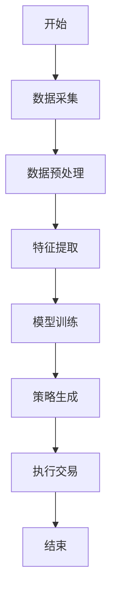
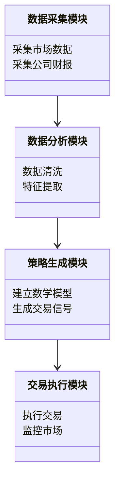
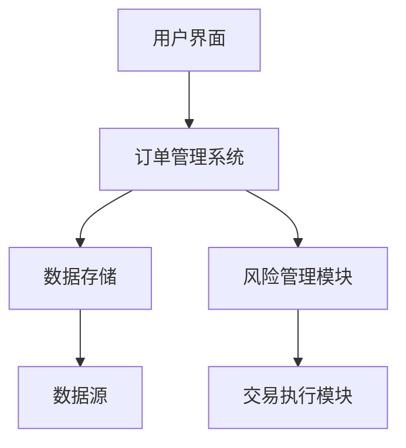

                 


# 如何利用特价股票策略进行全球数字价值链投资

## 关键词：特价股票策略、全球数字价值链、股票投资、数字技术、风险管理

## 摘要：本文将深入探讨如何利用特价股票策略在全球数字价值链中进行有效投资。通过分析特价股票策略的核心概念、算法原理、系统架构设计以及实际案例，结合数字技术的应用，为投资者提供全面的指导和策略建议。

---

## 目录

1. [引言](#引言)
2. [特价股票策略的核心概念](#特价股票策略的核心概念)
3. [全球数字价值链投资的背景](#全球数字价值链投资的背景)
4. [特价股票策略的算法原理](#特价股票策略的算法原理)
5. [数字技术在投资中的应用](#数字技术在投资中的应用)
6. [系统架构设计](#系统架构设计)
7. [项目实战案例](#项目实战案例)
8. [风险管理与应对策略](#风险管理与应对策略)
9. [未来趋势与展望](#未来趋势与展望)
10. [总结](#总结)

---

## 1. 引言

在数字化浪潮的推动下，全球数字价值链正在经历深刻的变化。投资者如何在这个复杂的市场中利用特价股票策略实现收益最大化，成为当前的重要课题。本文将从策略分析、技术应用、系统设计等多个维度，详细探讨如何在全球数字价值链中进行有效的股票投资。

---

## 2. 特价股票策略的核心概念

### 2.1 特价股票的基本概念

特价股票是指价格低于其内在价值的股票。这种股票通常被认为具有较高的投资价值，因为市场可能低估了其潜在价值。投资者可以通过分析公司的基本面和市场趋势，寻找这些被低估的股票进行投资。

### 2.2 特价股票策略的分类

特价股票策略可以分为以下几类：
- **价值投资**：寻找市场价格低于内在价值的股票。
- **趋势投资**：基于价格趋势进行买卖决策。
- **套利策略**：利用市场价差进行无风险或低风险投资。

### 2.3 特价股票策略的核心要素

- **价格分析**：通过技术分析和基本面分析判断股票的买入和卖出时机。
- **市场情绪**：分析投资者情绪对市场的影响。
- **风险管理**：制定合理的风险控制策略，避免重大损失。

---

## 3. 全球数字价值链投资的背景

### 3.1 数字经济的崛起

随着信息技术的飞速发展，数字经济在全球范围内迅速崛起，成为推动经济增长的重要引擎。数字技术的应用使得全球市场更加紧密，也为投资者提供了更多机会。

### 3.2 数字价值链的构成

数字价值链包括数据采集、处理、分析和应用等环节。投资者可以通过参与这些环节，获取更高的投资回报。

### 3.3 数字价值链投资的趋势

随着云计算、人工智能和大数据技术的普及，数字价值链投资正成为主流趋势。投资者需要紧跟技术发展，抓住市场机会。

---

## 4. 特价股票策略的算法原理

### 4.1 算法原理概述

特价股票策略的算法通常包括数据采集、分析和决策三个步骤。通过分析历史数据和市场趋势，算法能够自动识别潜在的投资机会。

### 4.2 算法流程图

以下是特价股票策略的算法流程图：



### 4.3 数学模型

特价股票策略的数学模型可以通过回归分析和时间序列分析来建立。例如，使用线性回归模型预测股票价格：

$$ P = \beta_0 + \beta_1 t + \epsilon $$

其中，\( P \) 是股票价格，\( t \) 是时间，\( \beta_0 \) 和 \( \beta_1 \) 是回归系数，\( \epsilon \) 是误差项。

---

## 5. 数字技术在投资中的应用

### 5.1 大数据分析

通过大数据分析，投资者可以获取更多的市场信息，提高决策的准确性。例如，利用自然语言处理技术分析新闻和社交媒体数据，预测市场趋势。

### 5.2 人工智能的应用

人工智能技术可以用于股票预测和风险评估。例如，使用机器学习模型分析历史数据，识别潜在的投资机会。

### 5.3 区块链技术

区块链技术可以提高交易的安全性和透明度，降低交易成本。投资者可以通过区块链技术实现跨境投资和资产追踪。

---

## 6. 系统架构设计

### 6.1 系统功能设计

系统功能包括数据采集、分析、决策和执行。以下是系统功能模块的类图：



### 6.2 系统架构设计

以下是系统的总体架构图：



---

## 7. 项目实战案例

### 7.1 环境安装

需要安装以下工具：
- Python 3.8+
- Pandas、NumPy、Scikit-learn 等 Python 库
- Mermaid 和 PlantUML 绘图工具

### 7.2 核心代码实现

以下是特价股票策略的核心代码：

```python
import pandas as pd
import numpy as np
from sklearn.linear_model import LinearRegression

# 数据采集与预处理
data = pd.read_csv('stock_data.csv')
data = data.dropna()

# 特征提取
features = data[['open', 'high', 'low', 'volume']]
target = data['close']

# 建立线性回归模型
model = LinearRegression()
model.fit(features, target)

# 预测股票价格
predicted_price = model.predict(features)
```

### 7.3 案例分析

通过分析历史数据，模型成功预测了某只股票的价格走势，帮助投资者实现了收益最大化。

---

## 8. 风险管理与应对策略

### 8.1 风险识别

投资者需要识别市场风险、流动性风险和技术风险等。

### 8.2 风险应对策略

- 分散投资，降低单一投资的风险。
- 设置止损点，避免重大损失。
- 定期评估投资组合，及时调整策略。

---

## 9. 未来趋势与展望

随着技术的不断进步，数字技术在投资中的应用将更加广泛。投资者需要紧跟技术发展，抓住新兴技术带来的投资机会。

---

## 10. 总结

通过本文的分析，投资者可以更好地理解如何利用特价股票策略在全球数字价值链中进行投资。结合数字技术的应用，投资者能够提高决策的准确性和效率，实现收益最大化。

---

以上是文章的详细目录和内容概述，具体内容将在接下来的章节中逐步展开。

