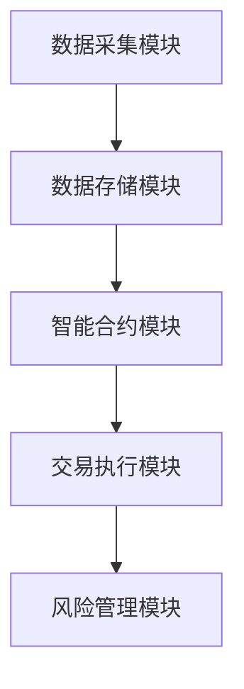

                 


# 如何利用特价股票策略进行全球数字公共产品代币化投资

## 关键词：特价股票策略、数字公共产品、代币化投资、区块链技术、智能合约、量化交易

## 摘要：
本文探讨了如何利用特价股票策略进行全球数字公共产品代币化投资。通过分析特价股票策略的核心原理、数字公共产品代币化的技术实现，以及两者结合的可行性，本文为读者提供了从理论到实践的全面指导。结合区块链技术和量化交易算法，本文提出了一种创新的解决方案，为投资者提供了新的思路和方法。

---

# 第一部分：特价股票策略与数字公共产品代币化投资基础

## 第1章：特价股票策略与数字公共产品代币化投资概述

### 1.1 特价股票策略的背景与意义

#### 1.1.1 特价股票策略的定义与特点
特价股票策略是一种基于市场波动和价格差异的交易策略，旨在通过捕捉短期价格波动获利。其特点包括高频交易、低延迟和自动化执行。

#### 1.1.2 数字公共产品的概念与属性
数字公共产品是指通过数字技术提供的公共产品或服务，具有可访问性、可扩展性和去中心化的特点。

#### 1.1.3 特价股票策略与数字公共产品代币化的结合意义
通过将特价股票策略与数字公共产品代币化结合，可以实现资产的高效流动和价值传递，提升投资效率和收益。

### 1.2 问题背景与目标

#### 1.2.1 特价股票策略的核心问题
特价股票策略面临市场波动大、风险高和交易成本高等问题。

#### 1.2.2 数字公共产品代币化的挑战
数字公共产品代币化需要解决技术实现、法律合规和市场接受度等问题。

#### 1.2.3 问题解决的思路与目标
通过技术创新和制度优化，实现特价股票策略与数字公共产品代币化的有机结合，提升投资效率和收益。

## 第2章：特价股票策略的核心概念与原理

### 2.1 特价股票策略的核心原理

#### 2.1.1 特价股票的定义与分类
特价股票是指在特定时间点价格低于市场价的股票，可分为普通特价股票和溢价特价股票。

#### 2.1.2 特价股票的市场分析方法
通过技术分析和基本面分析，识别市场波动和价格差异，制定交易策略。

#### 2.1.3 特价股票的交易策略模型
包括均值回归策略、趋势跟踪策略和事件驱动策略等。

### 2.2 数字公共产品代币化的概念与特征

#### 2.2.1 数字公共产品的定义与范围
数字公共产品是指通过数字技术提供的公共服务，如数字身份认证、数字版权保护等。

#### 2.2.2 代币化的定义与实现方式
代币化是将资产或权利表示为区块链上的数字代币，具有可分割性、可转让性和透明性。

#### 2.2.3 数字公共产品代币化的优势与劣势
优势包括提高效率、降低成本和增强透明度；劣势包括技术复杂性和法律不确定性。

## 第3章：数字公共产品代币化的核心技术与实现

### 3.1 区块链技术在数字公共产品代币化中的应用

#### 3.1.1 区块链的基本原理
区块链是一种去中心化的分布式账本技术，具有不可篡改和可追溯的特点。

#### 3.1.2 区块链在代币发行中的作用
区块链技术为数字公共产品代币化提供了安全、透明和高效的发行环境。

#### 3.1.3 智能合约在代币化中的应用
智能合约是自动执行的区块链代码，用于管理代币的发行、转让和销毁。

### 3.2 特价股票策略与区块链技术的结合

#### 3.2.1 特价股票数据的区块链存储
将特价股票的数据存储在区块链上，确保数据的安全和不可篡改性。

#### 3.2.2 特价股票交易的区块链实现
通过区块链技术实现特价股票的智能合约交易，提高交易效率和透明度。

#### 3.2.3 区块链在特价股票风险管理中的应用
利用区块链技术进行风险评估和管理，降低投资风险。

---

# 第二部分：特价股票策略与数字公共产品代币化的算法与系统设计

## 第4章：特价股票策略的数学模型与算法实现

### 4.1 特价股票策略的数学模型

#### 4.1.1 市场预测模型
市场预测模型基于历史数据和机器学习算法，预测股票价格的变化趋势。

#### 4.1.2 风险评估模型
风险评估模型通过分析市场波动和资产相关性，评估投资组合的风险。

#### 4.1.3 交易策略模型
交易策略模型基于市场预测和风险评估结果，制定具体的交易策略。

### 4.2 特价股票策略的算法实现

#### 4.2.1 数据预处理与特征提取
数据预处理包括清洗和标准化，特征提取包括技术指标和市场情绪分析。

#### 4.2.2 机器学习算法在特价股票预测中的应用
使用支持向量机（SVM）和随机森林（Random Forest）等算法进行股票价格预测。

#### 4.2.3 算法优化与调参
通过网格搜索和交叉验证优化算法参数，提高预测准确性和交易效率。

## 第5章：数字公共产品代币化的系统架构与设计

### 5.1 系统架构设计

#### 5.1.1 系统模块划分
系统模块包括数据采集模块、智能合约模块、交易执行模块和风险管理模块。

#### 5.1.2 系统功能设计
系统功能包括数据存储、代币发行、交易执行和风险监控。

#### 5.1.3 系统架构图（Mermaid）


### 5.2 系统接口设计

#### 5.2.1 系统内部接口
内部接口包括模块之间的数据传递和函数调用。

#### 5.2.2 系统外部接口
外部接口包括用户界面和API接口，用于与外部系统和用户交互。

#### 5.2.3 系统交互流程
系统交互流程包括用户请求、数据处理和结果返回。

## 第6章：系统实现与项目实战

### 6.1 环境安装与配置

#### 6.1.1 安装Python环境
使用Anaconda安装Python 3.8及以上版本。

#### 6.1.2 安装区块链框架
安装Ethereum和Solidity，配置以太坊开发环境。

#### 6.1.3 安装机器学习库
安装Scikit-learn、XGBoost等机器学习库。

### 6.2 核心代码实现

#### 6.2.1 特价股票预测算法实现
```python
import pandas as pd
from sklearn.ensemble import RandomForestRegressor

# 加载数据
data = pd.read_csv('stock_data.csv')

# 特征提取
features = data[['open', 'high', 'low', 'volume']]
target = data['close']

# 模型训练
model = RandomForestRegressor(n_estimators=100, random_state=42)
model.fit(features, target)

# 预测结果
predicted_price = model.predict(features)
```

#### 6.2.2 智能合约开发
```solidity
// SPDX-License-Identifier: MIT
pragma solidity ^0.8.0;

contract StockToken {
    mapping(address => uint256) private balances;

    function mint(address to, uint256 amount) public {
        balances[to] += amount;
    }

    function burn(address from, uint256 amount) public {
        balances[from] -= amount;
    }

    function balanceOf(address account) public view returns (uint256) {
        return balances[account];
    }
}
```

### 6.3 项目实战与案例分析

#### 6.3.1 项目环境搭建
详细说明项目环境的搭建步骤，包括操作系统、开发工具和依赖库的安装。

#### 6.3.2 核心代码实现
提供完整的代码实现，包括数据处理、模型训练和智能合约部署。

#### 6.3.3 应用案例分析
通过具体案例分析，展示如何利用特价股票策略进行数字公共产品代币化投资。

### 6.4 项目小结

#### 6.4.1 项目成果
总结项目的实现成果和技术创新。

#### 6.4.2 项目经验
分享项目开发中的经验和教训，为读者提供参考。

---

# 第三部分：总结与展望

## 第7章：总结与展望

### 7.1 最佳实践 tips
总结投资中的注意事项和最佳实践，帮助读者避免常见错误。

### 7.2 小结
总结全文内容，重申特价股票策略与数字公共产品代币化的结合意义。

### 7.3 注意事项
提醒读者注意市场风险和法律合规问题。

### 7.4 拓展阅读
推荐相关领域的书籍和资源，供读者深入学习。

---

# 参考文献

- 区块链技术入门与实战
- 量化交易算法解析
- 数字货币与智能合约

---

通过以上内容，您可以逐步完成这篇技术博客文章的撰写，确保每一部分都详尽且符合逻辑。

