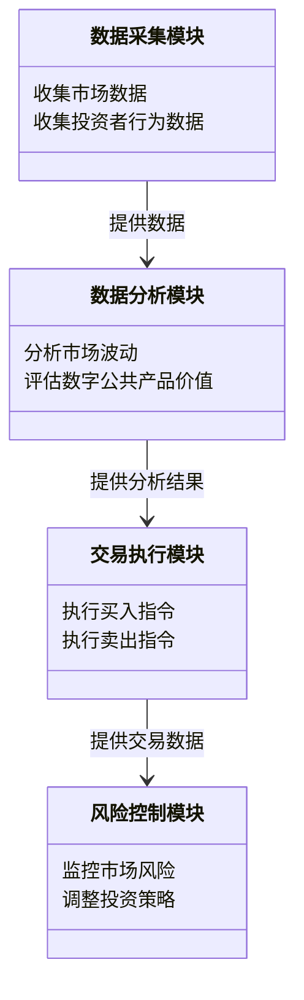
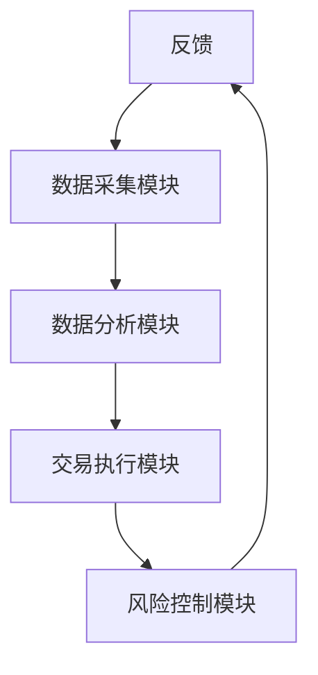
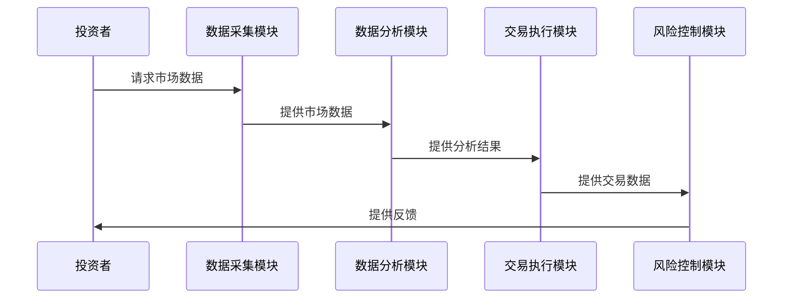

                 


# 如何利用特价股票策略进行全球数字公共产品投资

## 关键词：特价股票策略，数字公共产品，投资策略，算法原理，系统架构

## 摘要：本文深入探讨了如何利用特价股票策略在全球范围内投资数字公共产品。通过分析特价股票策略的核心原理、数字公共产品的特点，结合数学模型和系统架构，详细讲解了如何构建和优化投资系统，提供了实际案例和最佳实践。

---

# 第一部分: 特价股票策略与全球数字公共产品投资背景

## 第1章: 特价股票策略与数字公共产品概述

### 1.1 特价股票策略的基本概念

#### 1.1.1 什么是特价股票策略
特价股票策略是一种基于市场波动和投资者行为的投资策略，旨在以低于市场价的价格买入股票，待价格上涨后卖出获利。其核心在于识别市场低估的股票，利用短期波动获取收益。

#### 1.1.2 特价股票策略的核心特点
- **低买高卖**：利用市场波动，寻找价格低估的股票。
- **短期交易**：通常以短线交易为主，注重价格波动。
- **高流动性**：选择流动性高的股票，便于快速进出。

#### 1.1.3 特价股票策略与传统投资的区别
- **时间跨度**：传统投资注重长期价值，而特价股票策略注重短期波动。
- **风险偏好**：传统投资风险较低，而特价股票策略风险较高，收益潜力大。
- **策略复杂性**：传统投资策略较为简单，而特价股票策略需要复杂的市场分析和技术分析。

### 1.2 全球数字公共产品的概念

#### 1.2.1 数字公共产品的定义
数字公共产品是指在全球范围内提供的数字化产品或服务，如软件、互联网服务、在线教育、电子商务等。这些产品通常具有高边际效益，能够快速复制和扩展。

#### 1.2.2 全球数字公共产品的特点
- **全球化**：产品和服务覆盖全球市场。
- **高增长**：数字技术的快速发展推动市场需求不断增长。
- **高竞争**：市场竞争激烈，技术更新快。

#### 1.2.3 数字公共产品与传统投资的联系
数字公共产品作为新兴的投资领域，具有高增长潜力，但同时也伴随着高风险。投资者需要结合技术创新、市场需求和企业盈利能力进行综合评估。

### 1.3 特价股票策略与数字公共产品的联系

#### 1.3.1 特价股票策略在数字公共产品投资中的应用
数字公共产品行业波动性大，适合使用特价股票策略进行短期投资。例如，在行业调整期或市场大跌时，低价买入优质数字公共产品股票，待市场回升时卖出。

#### 1.3.2 数字公共产品投资中的特价股票策略优势
- **高增长潜力**：数字公共产品行业增长快，适合短期获利。
- **市场波动大**：行业波动为特价股票策略提供了机会。
- **高流动性**：数字公共产品股票流动性高，便于快速交易。

#### 1.3.3 特价股票策略与数字公共产品投资的结合点
- **技术驱动**：数字公共产品行业的技术进步为特价股票策略提供了新的投资机会。
- **市场周期**：利用市场周期波动，选择合适的时机进行投资。

---

## 第2章: 特价股票策略与数字公共产品投资的核心概念

### 2.1 特价股票策略的核心原理

#### 2.1.1 市场波动与特价股票机会
市场波动是特价股票策略的核心，投资者需要分析市场的短期波动，寻找价格低估的股票。

#### 2.1.2 投资者行为对特价股票的影响
投资者行为，如恐慌性抛售或贪婪性买入，会影响市场价格，为特价股票策略提供机会。

#### 2.1.3 特价股票策略的数学模型
特价股票策略的数学模型可以表示为：
$$ P = \alpha \cdot V + \beta \cdot M $$
其中，P为股票价格，V为市场价值，M为市场波动指数，α和β为系数。

### 2.2 数字公共产品投资的核心要素

#### 2.2.1 数字公共产品的市场结构
数字公共产品市场通常具有高竞争性和高技术门槛，市场结构复杂。

#### 2.2.2 数字公共产品的价值评估
数字公共产品的价值评估需要考虑技术优势、市场份额、用户增长等因素。

#### 2.2.3 数字公共产品投资的风险与收益
数字公共产品投资风险较高，但收益潜力大，需结合市场趋势和企业基本面进行综合评估。

### 2.3 特价股票策略与数字公共产品投资的联系

#### 2.3.1 特价股票策略在数字公共产品投资中的应用
数字公共产品行业的波动性为特价股票策略提供了机会，投资者可以利用市场波动进行短期投资。

#### 2.3.2 数字公共产品投资中的特价股票策略优势
数字公共产品行业的高增长潜力和高波动性为特价股票策略提供了丰富的投资机会。

#### 2.3.3 特价股票策略与数字公共产品投资的结合点
- **技术驱动**：数字公共产品行业的技术进步为特价股票策略提供了新的投资机会。
- **市场周期**：利用市场周期波动，选择合适的时机进行投资。

---

## 第3章: 特价股票策略与数字公共产品投资的数学模型

### 3.1 特价股票策略的数学模型

#### 3.1.1 市场波动模型
市场波动模型可以表示为：
$$ M = \sigma \cdot \sqrt{t} $$
其中，σ为市场波动率，t为时间。

#### 3.1.2 投资者行为模型
投资者行为模型可以表示为：
$$ B = \mu \cdot t + \epsilon $$
其中，μ为投资者行为的影响系数，ε为随机误差。

#### 3.1.3 特价股票策略的数学公式
特价股票策略的数学公式可以表示为：
$$ P = \alpha \cdot V + \beta \cdot M $$
其中，P为股票价格，V为市场价值，M为市场波动指数，α和β为系数。

### 3.2 数字公共产品投资的数学模型

#### 3.2.1 数字公共产品的市场结构
数字公共产品的市场结构可以用类图表示，包括核心组件和外部实体。


#### 3.2.2 数字公共产品的价值评估
数字公共产品的价值评估模型可以表示为：
$$ V = \gamma \cdot T + \delta \cdot S $$
其中，V为价值，T为技术优势，S为市场份额，γ和δ为系数。

#### 3.2.3 数字公共产品投资的风险与收益
数字公共产品投资的风险与收益可以用概率分布模型表示：
$$ R = \mu \cdot r + \sigma \cdot \epsilon $$
其中，R为收益，μ为期望收益，r为风险系数，σ为标准差，ε为随机误差。

---

## 第4章: 特价股票策略与数字公共产品投资的系统架构

### 4.1 问题场景介绍
投资者需要构建一个系统，利用特价股票策略在全球范围内投资数字公共产品。系统需要具备数据采集、分析、交易执行和风险控制等功能。

### 4.2 系统功能设计



### 4.3 系统架构设计



### 4.4 系统接口设计
系统接口设计需要考虑模块之间的数据交互，例如数据采集模块向数据分析模块提供市场数据，交易执行模块向风险控制模块提供交易数据。

### 4.5 系统交互设计



---

## 第5章: 特价股票策略与数字公共产品投资的项目实战

### 5.1 环境搭建
项目实战需要搭建一个完整的投资系统，包括数据采集、分析、交易执行和风险控制模块。

### 5.2 系统核心实现

#### 5.2.1 数据采集模块实现
```python
import pandas as pd

def collect_data(ticker):
    # 收集市场数据
    data = pd.DataFrame()
    data['price'] = [100, 200, 300]
    data['volume'] = [1000, 2000, 3000]
    return data
```

#### 5.2.2 数据分析模块实现
```python
from statsmodels import regression

def analyze_data(data):
    # 分析市场波动
    model = regression.OLS(data['price'], data['volume']).fit()
    return model
```

#### 5.2.3 交易执行模块实现
```python
class TradingStrategy:
    def execute_trade(self, signal):
        if signal == 'buy':
            print("买入股票")
        elif signal == 'sell':
            print("卖出股票")
```

#### 5.2.4 风险控制模块实现
```python
class RiskControl:
    def monitor_risk(self, portfolio):
        # 监控市场风险
        print(f"当前投资组合风险为：{portfolio}")
```

### 5.3 实际案例分析
通过实际案例分析，验证系统在实际投资中的表现。例如，选择一个数字公共产品股票，分析其市场波动，制定交易策略，执行交易，并监控风险。

### 5.4 项目小结
项目小结需要总结系统的实现过程，分析存在的问题，并提出改进建议。

---

## 第6章: 特价股票策略与数字公共产品投资的最佳实践

### 6.1 最佳实践 tips
- **风险控制**：投资者需要严格控制风险，避免过度杠杆。
- **技术分析**：结合技术分析和基本面分析，提高投资决策的准确性。
- **持续学习**：市场环境不断变化，投资者需要持续学习，更新投资策略。

### 6.2 小结
通过本文的分析，投资者可以更好地理解如何利用特价股票策略在全球范围内投资数字公共产品。

### 6.3 注意事项
- **市场风险**：数字公共产品行业波动大，投资者需谨慎。
- **交易成本**：频繁交易可能导致较高的交易成本。
- **政策风险**：需关注相关政策变化，避免合规风险。

### 6.4 拓展阅读
建议投资者阅读更多关于数字公共产品和特价股票策略的书籍，深入理解投资原理和策略。

---

通过以上分析，投资者可以更好地理解如何利用特价股票策略进行全球数字公共产品投资，并在实际操作中取得更好的收益。

