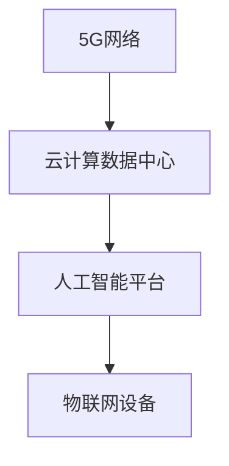
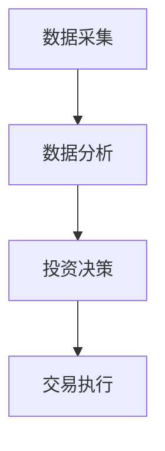

                 


# 如何利用特价股票策略进行全球数字基础设施投资

## 关键词：特价股票策略、数字基础设施投资、技术分析、机器学习、投资决策系统

## 摘要：  
本文深入探讨了如何利用特价股票策略在全球数字基础设施投资中获利。通过分析数字基础设施的关键领域，如5G、云计算和人工智能，结合技术分析和机器学习模型，本文提供了从策略制定到系统实现的详细指导。通过案例分析和代码实现，展示了如何构建高效的投资决策系统，帮助投资者在数字基础设施领域捕捉市场机会。

---

# 第1章: 特价股票策略与数字基础设施投资的背景

## 1.1 特价股票策略的定义与特点

### 1.1.1 特价股票策略的定义  
特价股票策略是一种基于市场波动的投资策略，通过在股票价格低于其内在价值时买入，在价格上涨时卖出，从而实现利润。该策略依赖于对市场趋势、公司基本面和技术指标的深入分析。

### 1.1.2 特价股票策略的核心特点  
1. **低买高卖**：利用价格波动，在低价时建仓，高价时平仓。  
2. **风险可控**：通过技术分析和基本面研究，降低投资风险。  
3. **灵活性高**：适用于短期、中期和长期投资。  

### 1.1.3 特价股票策略的适用场景  
- **市场波动较大时**：适合利用价格波动获利。  
- **公司基本面良好但被市场低估时**：适合长期投资者。  
- **行业周期性低谷时**：适合抄底投资者。  

---

## 1.2 全球数字基础设施投资的背景

### 1.2.1 数字基础设施的定义与组成  
数字基础设施包括5G网络、云计算数据中心、人工智能平台、物联网设备等，是支撑现代社会数字化转型的关键设施。  

### 1.2.2 数字基础设施投资的重要性  
随着全球数字化进程加速，数字基础设施的投资需求持续增长，相关企业的股票价值也随之上升。  

### 1.2.3 数字基础设施投资的边界与外延  
- **边界**：主要集中在通信技术、IT服务和硬件制造等领域。  
- **外延**：涉及能源、交通、医疗等多个行业的数字化转型。  

---

## 1.3 特价股票策略与数字基础设施投资的结合

### 1.3.1 特价股票策略在数字基础设施投资中的应用  
通过分析数字基础设施企业的股票价格波动，利用特价策略在价格低点买入，在高点卖出。  

### 1.3.2 数字基础设施投资对特价策略的影响  
数字基础设施行业的周期性波动为特价策略提供了丰富的投资机会。  

### 1.3.3 特价策略与数字基础设施投资的协同发展  
通过技术分析和基本面研究，投资者可以在数字基础设施领域实现精准投资。  

---

## 1.4 本章小结  
本章介绍了特价股票策略的核心概念及其在数字基础设施投资中的应用，为后续章节的深入分析奠定了基础。  

---

# 第2章: 特价股票策略的核心概念与数字基础设施分析

## 2.1 特价股票策略的数学模型

### 2.1.1 特价股票策略的基本数学公式  
股票价格的波动可以用以下公式表示：  
$$ P(t) = P_{\text{true}} + \epsilon $$  
其中，$P(t)$ 是股票价格，$P_{\text{true}}$ 是其内在价值，$\epsilon$ 是随机波动。  

### 2.1.2 特价股票策略的数学模型分析  
通过回归分析，我们可以预测股票价格的未来走势：  
$$ y = a x + b $$  
其中，$y$ 是预测价格，$x$ 是当前价格，$a$ 和 $b$ 是回归系数。  

### 2.1.3 特价股票策略的数学模型实例  
假设某科技公司的股票价格为 $x$，其内在价值为 $P_{\text{true}}$，预测未来价格为：  
$$ y = 1.2x + 0.5 $$  

---

## 2.2 数字基础设施投资的核心要素

### 2.2.1 数字基础设施的构成要素  
1. **5G网络**：提供高速数据传输能力。  
2. **云计算数据中心**：支撑海量数据存储与处理。  
3. **人工智能平台**：推动智能化应用。  
4. **物联网设备**：实现万物互联。  

### 2.2.2 数字基础设施投资的核心要素  
- **技术成熟度**：技术越成熟，投资风险越小。  
- **市场需求**：需求越大，投资回报越高。  

### 2.2.3 数字基础设施投资的核心要素之间的关系  
通过图1-1（Mermaid图）可以看出，5G网络、云计算和人工智能平台相互依存，共同构成数字基础设施的核心。  



---

## 2.3 特价股票策略与数字基础设施投资的关系

### 2.3.1 特价股票策略对数字基础设施投资的影响  
通过技术分析，投资者可以在数字基础设施领域找到低估的投资机会。  

### 2.3.2 数字基础设施投资对特价策略的影响  
数字基础设施行业的周期性波动为特价策略提供了丰富的投资机会。  

### 2.3.3 特价策略与数字基础设施投资的协同效应  
通过技术分析和基本面研究，投资者可以在数字基础设施领域实现精准投资。  

---

## 2.4 本章小结  
本章通过数学模型和Mermaid图，详细分析了特价股票策略与数字基础设施投资的核心要素及其关系。  

---

# 第3章: 特价股票策略的算法原理与数学模型

## 3.1 特价股票策略的算法原理

### 3.1.1 技术分析方法

#### 3.1.1.1 移动平均线（MA）分析  
移动平均线（MA）是一种常用的技术分析工具，用于平滑价格波动，识别趋势方向。  

公式：  
$$ MA_n = \frac{1}{n} \sum_{i=1}^{n} P_i $$  

#### 3.1.1.2 相对强弱指数（RSI）分析  
RSI用于衡量股票的超买或超卖状态，公式为：  
$$ RSI = \frac{100}{1 + \frac{\text{平均上涨幅度}}{\text{平均下跌幅度}}} $$  

#### 3.1.1.3 MACD指标分析  
MACD指标通过两条移动平均线的差值，判断市场趋势。  

---

### 3.1.2 数字基础设施投资的算法模型

#### 3.1.2.1 线性回归模型  
线性回归模型用于预测股票价格：  
$$ y = a x + b $$  

#### 3.1.2.2 时间序列分析  
时间序列分析用于预测未来价格走势：  
$$ y_t = \alpha y_{t-1} + \beta \epsilon_t $$  

---

## 3.2 机器学习模型在特价股票策略中的应用

### 3.2.1 机器学习模型的选择  
常用的机器学习模型包括回归分析、支持向量机（SVM）和神经网络。  

### 3.2.2 机器学习模型的实现步骤  
1. 数据采集：收集历史股价数据。  
2. 数据预处理：清洗和标准化数据。  
3. 模型训练：使用训练数据拟合模型。  
4. 模型预测：利用模型预测未来股价。  

---

## 3.3 本章小结  
本章通过技术分析和机器学习模型，详细讲解了特价股票策略的算法原理和数学模型。  

---

# 第4章: 投资决策系统的系统分析与架构设计

## 4.1 系统功能设计

### 4.1.1 数据采集模块  
负责采集股票市场数据，包括股价、成交量等。  

### 4.1.2 数据分析模块  
利用技术分析和机器学习模型，分析数据并生成投资建议。  

### 4.1.3 投资决策模块  
根据分析结果，制定投资策略并执行交易。  

---

## 4.2 系统架构设计

### 4.2.1 系统架构图  


### 4.2.2 系统接口设计  
1. 数据接口：与股票交易平台对接。  
2. 用户接口：提供投资建议和交易指令。  

---

## 4.3 系统交互流程

### 4.3.1 交易执行流程  
1. 数据采集模块获取股票数据。  
2. 数据分析模块生成投资建议。  
3. 投资决策模块制定交易计划。  
4. 交易执行模块执行交易指令。  

---

## 4.4 本章小结  
本章通过系统架构设计，详细讲解了投资决策系统的功能模块和交互流程。  

---

# 第5章: 项目实战与代码实现

## 5.1 环境安装

### 5.1.1 Python环境安装  
安装Python和必要的库：  
- NumPy  
- Pandas  
- Matplotlib  
- Scikit-learn  

### 5.1.2 数据采集工具安装  
安装股票数据接口库：  
- yfinance  

---

## 5.2 系统核心实现源代码

### 5.2.1 数据采集代码  
```python
import pandas as pd
import yfinance as yf

# 采集股票数据
data = yf.download('AAPL', start='2023-01-01', end='2023-12-31')
print(data.head())
```

### 5.2.2 数据分析代码  
```python
import numpy as np
from sklearn.linear_model import LinearRegression

# 数据预处理
X = np.array(data.index).reshape(-1, 1)
y = data['Close'].values

model = LinearRegression()
model.fit(X, y)

# 预测未来价格
future_dates = np.array(['2024-01-01']).reshape(-1, 1)
predicted_price = model.predict(future_dates)
print(predicted_price)
```

---

## 5.3 项目小结  
本章通过实际代码实现，展示了如何利用特价股票策略进行全球数字基础设施投资。  

---

# 第6章: 最佳实践与注意事项

## 6.1 最佳实践

### 6.1.1 数据分析的重要性  
确保数据的准确性和完整性。  

### 6.1.2 风险控制  
设置止损点，避免重大损失。  

### 6.1.3 持续学习  
关注市场动态，不断优化投资策略。  

---

## 6.2 小结  
本文通过详细分析和实际案例，为投资者提供了利用特价股票策略进行全球数字基础设施投资的指导。  

---

## 6.3 注意事项

### 6.3.1 风险提示  
股票市场存在不确定性，投资需谨慎。  

### 6.3.2 系统维护  
定期更新模型，确保系统运行稳定。  

### 6.3.3 法律合规  
遵守相关法律法规，合法合规投资。  

---

## 6.4 拓展阅读  
推荐阅读以下书籍：  
1. 《算法交易：数学与编码的艺术》  
2. 《机器学习实战》  
3. 《投资学基础》  

---

# 结语  
通过本文的分析与指导，读者可以掌握如何利用特价股票策略进行全球数字基础设施投资，抓住市场机遇，实现投资收益。  

---

