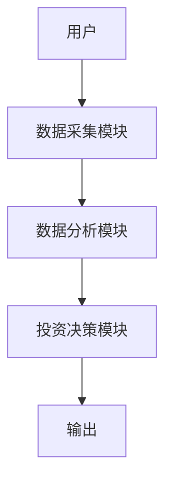

                 


# 如何利用特价股票策略进行全球资产配置

> 关键词：特价股票策略，全球资产配置，股票投资，风险管理，股票分析

> 摘要：本文详细探讨了如何利用特价股票策略在全球范围内进行资产配置，分析了特价股票的定义、分类、定价机制，以及如何通过基本面和技术面分析、数学模型等方法选择合适的特价股票。文章还结合实际案例，介绍了如何构建投资组合、管理系统和风险管理策略，帮助投资者在全球市场中实现稳健的投资回报。

---

# 第一部分: 特价股票策略与全球资产配置基础

---

## 第1章: 特价股票策略的背景与概念

### 1.1 特价股票策略的定义与特点

#### 1.1.1 什么是特价股票

特价股票（Cheap Stocks）是指价格相对较低的股票，通常是指市盈率（P/E Ratio）、市净率（P/B Ratio）等估值指标低于市场平均水平的股票。这些股票可能因为市场情绪、行业周期或其他外部因素而被低估。

- **定义**：特价股票是指价格低于其内在价值的股票，投资者可以通过买入并持有这些股票，等待其价格回归合理价值时卖出，从而获得超额收益。

- **特点**：
  - 价格低，风险相对较低。
  - 市盈率、市净率等估值指标低于市场平均水平。
  - 通常出现在周期性行业或被市场忽视的领域。

#### 1.1.2 特价股票的分类与特点

特价股票可以根据不同的标准进行分类，常见的分类方式包括：

1. **按行业分类**：
   - 周期性行业：如能源、原材料、工业等行业的股票可能因为行业周期而出现特价。
2. **按市场分类**：
   - 成熟市场中的低价股。
   - 新兴市场中的低价股。
3. **按公司规模分类**：
   - 大盘股：如苹果、微软等大公司股票价格较高，但有时也会出现特价。
   - 中小盘股：通常更容易出现特价，因为这些股票的关注度较低，市场流动性较低。

#### 1.1.3 特价股票与普通股票的区别

| 属性           | 特价股票              | 普通股票              |
|----------------|----------------------|----------------------|
| 价格           | 较低                 | 较高                 |
| 市盈率         | 低于市场平均水平     | 接近或高于市场平均水平 |
| 市净率         | 低于市场平均水平     | 接近或高于市场平均水平 |
| 市场关注度     | 较低                 | 较高                 |
| 投资风险       | 较低                 | 较高                 |
| 投资机会       | 高                  | 中等                 |

---

### 1.2 特价股票策略的背景与现状

#### 1.2.1 全球股票市场的概况

全球股票市场可以分为成熟市场和新兴市场。成熟市场如美国、欧洲等，股票市场波动较小，而新兴市场如中国、印度等，股票市场波动较大，但增长潜力更大。

- **成熟市场**：股票市场波动较小，但增长潜力有限。
- **新兴市场**：股票市场波动较大，但增长潜力更大。

#### 1.2.2 特价股票市场的特点

- **价格波动大**：由于市场关注度低，特价股票的价格波动较大。
- **流动性低**：交易量小，买卖价差大。
- **市场参与者少**：机构投资者较少参与，多为个人投资者。

#### 1.2.3 特价股票策略的现状与趋势

- **现状**：随着全球化进程的加快，投资者越来越关注全球资产配置，特价股票策略逐渐受到重视。
- **趋势**：随着技术的进步，投资者可以通过大数据分析和算法交易更高效地发现特价股票。

---

### 1.3 特价股票策略的全球资产配置意义

#### 1.3.1 全球资产配置的基本概念

全球资产配置是指将投资组合分散在不同的国家和资产类别中，以降低风险并提高收益。

- **分散风险**：通过投资不同国家和资产类别，降低单一市场的风险。
- **提高收益**：通过投资高增长地区，提高整体收益。

#### 1.3.2 特价股票在资产配置中的作用

- **降低整体投资风险**：通过投资不同国家的特价股票，分散市场风险。
- **提高收益潜力**：新兴市场的特价股票增长潜力更大。

#### 1.3.3 特价股票策略的优势与局限性

- **优势**：
  - 成本低：特价股票的价格较低，适合中小投资者。
  - 潜力大：新兴市场的特价股票增长潜力大。
- **局限性**：
  - 流动性差：部分特价股票流动性较低，难以快速买卖。
  - 风险高：新兴市场的波动较大。

---

## 第2章: 特价股票策略的核心概念与原理

### 2.1 特价股票的定价机制

#### 2.1.1 股票定价的基本原理

股票价格由市场供需决定，但最终反映的是公司的内在价值。

- **内在价值**：公司未来现金流的现值。
- **市场价值**：市场供需决定的价格。

#### 2.1.2 市场供需对股票价格的影响

- **需求增加**：买方增加，价格上升。
- **供给增加**：卖方增加，价格下降。

#### 2.1.3 公司基本面与股票价格的关系

- **基本面分析**：通过公司财务报表分析公司的盈利能力、成长性和财务健康状况。
- **技术分析**：通过股票价格和成交量的变化预测未来价格走势。

---

### 2.2 特价股票策略的数学模型

#### 2.2.1 股票价值的评估公式

股票的内在价值可以用以下公式计算：

$$
\text{内在价值} = \frac{\text{未来现金流}}{\text{贴现率}}
$$

#### 2.2.2 市盈率与市净率的计算

- **市盈率（P/E Ratio）**：
$$
\text{P/E} = \frac{\text{股价}}{\text{每股收益}}
$$

- **市净率（P/B Ratio）**：
$$
\text{P/B} = \frac{\text{股价}}{\text{每股净资产}}
$$

#### 2.2.3 股票收益与风险的数学模型

- **夏普比率**：
$$
\text{夏普比率} = \frac{\text{超额收益}}{\text{收益的标准差}}
$$

---

### 2.3 特价股票策略的实施步骤

#### 2.3.1 确定投资目标与风险偏好

- **投资目标**：明确投资收益目标和时间 horizon。
- **风险偏好**：根据自身风险承受能力选择合适的投资策略。

#### 2.3.2 数据收集与分析

- **数据收集**：收集全球市场的股票数据，包括市盈率、市净率、股息率等。
- **数据分析**：使用数据分析工具对数据进行清洗、处理和建模。

#### 2.3.3 策略制定与实施

- **策略制定**：根据分析结果制定投资策略。
- **策略实施**：根据策略进行买入、卖出操作。

---

## 第3章: 特价股票策略的分析方法

### 3.1 基于基本面的分析

#### 3.1.1 公司财务指标分析

- **盈利能力**：净利润率、ROE（净资产收益率）。
- **成长性**：收入增长率、净利润增长率。
- **财务健康状况**：资产负债率、流动比率。

#### 3.1.2 行业分析与竞争地位评估

- **行业分析**：行业周期、竞争格局。
- **竞争地位**：公司在行业中的地位，如是否是龙头企业。

#### 3.1.3 财务报表分析方法

- **利润表分析**：分析收入和利润的变化。
- **资产负债表分析**：分析资产、负债和所有者权益的变化。
- **现金流量表分析**：分析现金流入和流出的情况。

---

### 3.2 基于技术面的分析

#### 3.2.1 股票价格走势分析

- **趋势分析**：分析股票价格的长期趋势。
- **支撑与阻力**：分析价格的支撑位和阻力位。

#### 3.2.2 技术指标的应用

- **移动平均线（MA）**：短期、中期、长期移动平均线。
- **相对强弱指数（RSI）**：衡量股票超买或超卖状态。

#### 3.2.3 K线图与成交量分析

- **K线图**：分析股票价格的波动情况。
- **成交量**：分析交易量的变化，判断价格走势的强度。

---

## 第4章: 全球资产配置的系统分析与架构设计

### 4.1 系统功能设计

#### 4.1.1 数据采集模块

- **功能**：从全球各大交易所采集股票数据。
- **输入**：股票代码、时间范围。
- **输出**：股票价格、成交量等数据。

#### 4.1.2 数据分析模块

- **功能**：对股票数据进行清洗、处理和建模。
- **输入**：原始数据。
- **输出**：分析结果，如市盈率、市净率等。

#### 4.1.3 投资决策模块

- **功能**：根据分析结果制定投资策略。
- **输入**：分析结果。
- **输出**：买入、卖出信号。

---

### 4.2 系统架构设计

#### 4.2.1 系统架构图



---

## 第5章: 项目实战与案例分析

### 5.1 项目环境安装

- **工具安装**：安装Python、Pandas、Matplotlib等工具。
- **数据源**：使用Yahoo Finance API获取股票数据。

### 5.2 核心代码实现

#### 5.2.1 数据采集代码

```python
import pandas as pd
import yfinance as yf

def get_stock_data(ticker, start_date, end_date):
    data = yf.download(ticker, start=start_date, end=end_date)
    return data
```

---

### 5.3 实际案例分析

#### 5.3.1 案例：投资苹果公司

- **分析过程**：
  - 数据采集：获取苹果公司过去一年的股价数据。
  - 数据分析：计算市盈率、市净率等指标。
  - 投资决策：根据分析结果制定投资策略。

#### 5.3.2 分析结果解读

- **市盈率**：苹果公司的市盈率低于市场平均水平，说明股价可能被低估。
- **市净率**：苹果公司的市净率也低于市场平均水平。

---

## 第6章: 最佳实践与注意事项

### 6.1 投资策略优化

- **分散投资**：不要将所有资金投入单一股票或行业。
- **定期调整**：根据市场变化定期调整投资组合。

### 6.2 风险管理

- **止损策略**：设定止损点，避免亏损过大。
- **仓位管理**：合理分配资金，避免过度集中。

---

## 第7章: 总结与展望

### 7.1 总结

- **核心观点**：通过利用特价股票策略进行全球资产配置，投资者可以在分散风险的同时，抓住高增长地区的投资机会。
- **主要结论**：特价股票策略是一种有效的投资策略，但需要结合基本面和技术面分析，制定合理的投资策略。

### 7.2 展望

- **未来趋势**：随着技术的进步，大数据分析和人工智能在股票投资中的应用将越来越广泛。
- **研究方向**：未来的研究可以集中在如何利用大数据和人工智能优化特价股票策略，提高投资收益。

---

## 参考文献

1. 书籍：《投资学》
2. 网站：Yahoo Finance
3. 研究报告：全球股票市场分析报告

---

## 致谢

感谢读者的耐心阅读，希望本文能为您提供有价值的投资策略和方法。

---

# 结语

通过本文的详细讲解，您可以掌握如何利用特价股票策略进行全球资产配置。希望本文的内容对您在股票投资和资产配置方面有所帮助。

