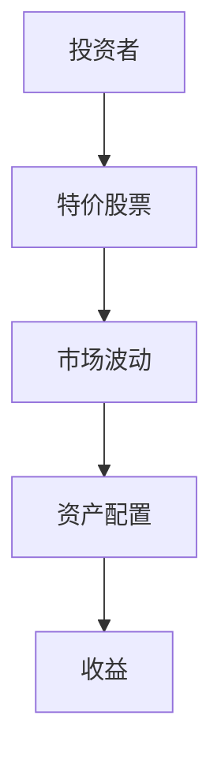
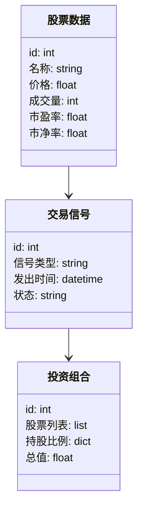
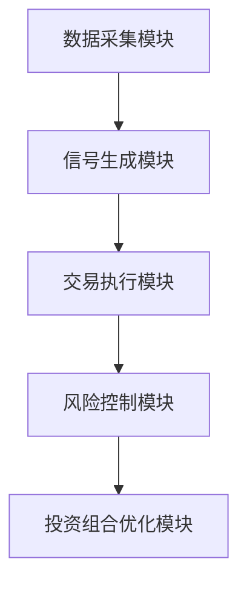
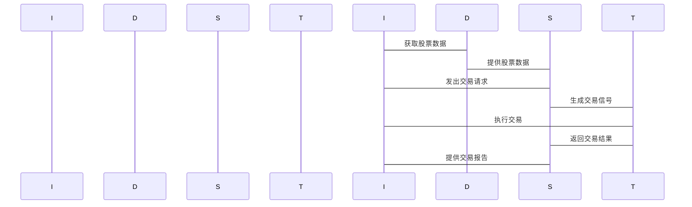

                 


# 如何利用特价股票策略进行全球资产配置

> 关键词：特价股票策略，全球资产配置，股票投资，风险管理，算法交易，投资组合优化

> 摘要：本文将深入探讨如何利用特价股票策略在全球范围内进行资产配置。通过分析特价股票策略的核心概念、算法原理、数学模型以及系统架构，结合实际案例和项目实战，为读者提供从理论到实践的全面指导。文章还将探讨如何平衡风险与收益，优化投资组合，并通过系统化的分析和设计，帮助投资者在全球市场中实现高效配置。

---

## 第一部分：特价股票策略与全球资产配置基础

### 第1章：特价股票策略概述

#### 1.1 特价股票策略的定义与背景

##### 1.1.1 什么是特价股票
特价股票通常指的是价格被市场低估的股票，这些股票可能因为市场波动、公司困境或其他因素而暂时被市场忽视，但具备长期增值潜力。特价股票的核心在于其价格与内在价值的不匹配，为投资者提供了潜在的收益机会。

##### 1.1.2 特价股票策略的背景与现状
随着全球化进程的加速，投资者越来越多地将目光投向全球市场，寻找投资机会。特价股票策略作为一种高效的投资手段，因其高收益潜力而备受关注。然而，该策略也面临市场波动大、风险高等挑战，需要投资者具备一定的市场敏感性和分析能力。

##### 1.1.3 特价股票策略的核心要素
- **市场时机**：准确判断市场趋势和波动，选择合适的买入和卖出时机。
- **估值分析**：通过市盈率、市净率等指标评估股票的内在价值，判断其是否被低估。
- **风险管理**：制定有效的风险管理策略，避免因市场波动导致的重大损失。

#### 1.2 全球资产配置的基本概念

##### 1.2.1 资产配置的定义与作用
资产配置是指将资金分配到不同资产类别（如股票、债券、房地产等）中，以分散风险并优化收益。在全球化背景下，资产配置不仅限于本地市场，而是扩展到全球范围，以利用不同市场的差异化表现。

##### 1.2.2 全球资产配置的必要性
- **分散风险**：通过投资不同国家和地区的资产，降低单一市场风险。
- **捕捉全球机会**：不同地区和行业可能有不同的增长潜力，全球资产配置能够帮助投资者抓住更多机会。
- **优化回报**：通过在全球范围内配置资产，投资者可以实现收益的最大化。

##### 1.2.3 特价股票策略在全球资产配置中的地位
特价股票策略作为资产配置的一部分，能够在特定市场中提供超额收益。通过在全球范围内寻找被低估的股票，投资者可以在不同的市场周期中灵活调整资产配置，从而实现更优的回报。

#### 1.3 特价股票策略的优势与风险

##### 1.3.1 特价股票策略的优势
- **高收益潜力**：被低估的股票在价值回归时可能带来较高的收益。
- **灵活性**：投资者可以根据市场情况灵活调整投资策略。
- **分散风险**：通过在全球范围内配置特价股票，投资者可以降低单一市场的风险。

##### 1.3.2 特价股票策略的风险
- **市场波动风险**：特价股票的价格波动较大，可能导致短期亏损。
- **估值风险**：如果市场对公司的价值判断存在偏差，可能导致长期亏损。
- **流动性风险**：某些地区的股票市场流动性较差，可能影响资产的变现能力。

##### 1.3.3 如何平衡风险与收益
- **多元化配置**：将资金分散投资于不同国家和行业的特价股票，降低风险。
- **严格的风险管理**：设定止损点和止盈点，控制投资仓位，避免过度杠杆。
- **长期视角**：避免短期波动的干扰，坚持价值投资，关注公司的长期增长潜力。

#### 1.4 本章小结
本章介绍了特价股票策略的基本概念、全球资产配置的重要性以及两者之间的关系。通过分析特价股票策略的优势与风险，为后续章节的深入探讨奠定了基础。

---

### 第2章：特价股票策略的核心概念与联系

#### 2.1 特价股票策略的原理

##### 2.1.1 市场时机的选择
市场时机是特价股票策略的关键因素之一。投资者需要根据宏观经济指标、行业趋势和公司基本面等因素，判断市场的买卖信号。例如，在市场底部或回调期间，可能是一个较好的买入机会。

##### 2.1.2 估值分析的重要性
估值分析是判断股票是否被低估的核心方法。常用的估值指标包括市盈率（P/E）、市净率（P/B）、股息率等。通过比较当前股价与历史平均水平或行业平均水平，可以识别出被低估的股票。

##### 2.1.3 技术分析与基本面分析的结合
技术分析通过研究股票价格和成交量的变化，预测未来的价格走势。基本面分析则关注公司的财务状况、盈利能力和发展前景。将两者结合，可以更全面地评估股票的投资价值。

#### 2.2 特价股票策略与资产配置的关系

##### 2.2.1 资产配置的多样化策略
通过在全球范围内配置不同类型的资产，投资者可以降低风险并优化收益。特价股票策略作为资产配置的一部分，可以在特定市场周期中提供超额收益。

##### 2.2.2 特价股票在资产配置中的权重分配
投资者应根据自身的风险承受能力和收益目标，合理分配特价股票在整体资产中的权重。通常，建议将特价股票配置比例控制在资产组合的30%-50%之间，以平衡风险和收益。

##### 2.2.3 不同市场环境下的策略调整
在不同的市场环境下，投资者需要灵活调整特价股票策略。例如，在牛市中可以适当增加高价优质股票的配置，而在熊市中则应选择防御性较强的股票。

#### 2.3 特价股票策略的核心要素对比

##### 2.3.1 短期交易与长期投资的对比
| 对比维度 | 短期交易 | 长期投资 |
|----------|----------|----------|
| 目标     | 追求短期价差收益 | 追求长期资本增值 |
| 风险     | 高，市场波动大 | 较低，注重公司基本面 |
| 操作频率 | 高，频繁买卖 | 低，长期持有 |

##### 2.3.2 高风险与低风险策略的对比
| 对比维度 | 高风险策略 | 低风险策略 |
|----------|------------|------------|
| 投资标的 | 高波动性股票 | 低波动性股票 |
| 操作方式 | 积极交易，频繁换股 | 被动持有，较少交易 |
| 风险承受 | 高，适合风险偏好者 | 低，适合保守投资者 |

##### 2.3.3 高收益与稳定收益的对比
| 对比维度 | 高收益策略 | 稳定收益策略 |
|----------|------------|------------|
| 收益目标 | 追求超额收益 | 追求稳定回报 |
| 风险     | 高，波动大 | 较低，风险可控 |
| 适合场景 | 市场牛市或高增长阶段 | 市场低迷或防御性阶段 |

#### 2.4 特价股票策略的ER实体关系图


#### 2.5 本章小结
本章通过分析特价股票策略的原理、与资产配置的关系以及核心要素的对比，帮助读者更好地理解如何在全球范围内配置资产。

---

### 第3章：特价股票策略的算法原理

#### 3.1 特价股票策略的核心算法

##### 3.1.1 均值回归策略
均值回归策略基于“价格回归均值”的假设，认为市场价格会在波动中回归其历史平均水平。该策略适用于那些价格短期偏离长期趋势的股票。

```python
# 均值回归策略示例代码
import pandas as pd
import numpy as np

# 假设data是一个包含股票价格的历史数据的DataFrame
# 计算价格与历史均值的偏离程度
mean_price = data['Close'].rolling(20).mean()
std_price = data['Close'].rolling(20).std()

# 判断买入和卖出信号
buy_signal = data['Close'] < mean_price - 2 * std_price
sell_signal = data['Close'] > mean_price + 2 * std_price

# 生成交易信号
data['Signal'] = 0
data['Signal'][buy_signal] = 1
data['Signal'][sell_signal] = -1
```

##### 3.1.2 动量策略
动量策略基于“趋势会延续”的假设，认为价格走势具有持续性。该策略适用于那些处于上升趋势中的股票。

```python
# 动量策略示例代码
import pandas as pd
import numpy as np

# 计算动量指标
n = 10
data['Momentum'] = data['Close'].diff(n).shift(-n)

# 判断买入和卖出信号
buy_signal = data['Momentum'] > 0
sell_signal = data['Momentum'] < 0

# 生成交易信号
data['Signal'] = 0
data['Signal'][buy_signal] = 1
data['Signal'][sell_signal] = -1
```

##### 3.1.3 成交量突破策略
成交量突破策略通过分析成交量的变化，预测价格的突破点。该策略适用于那些成交量突然放大，可能引发价格突破的股票。

```python
# 成交量突破策略示例代码
import pandas as pd
import numpy as np

# 计算成交量的异动
n = 20
volatility = data['Volume'].std(n)
data['Volume_Z'] = (data['Volume'] - data['Volume'].mean(n)) / volatility

# 判断买入和卖出信号
buy_signal = data['Volume_Z'] > 2
sell_signal = data['Volume_Z'] < -2

# 生成交易信号
data['Signal'] = 0
data['Signal'][buy_signal] = 1
data['Signal'][sell_signal] = -1
```

#### 3.2 算法原理的数学模型

##### 3.2.1 均值回归模型
$$ R_t = \alpha + \beta R_{t-1} + \epsilon $$

其中：
- $R_t$ 表示当前价格相对于均值的偏离程度。
- $\alpha$ 是截距。
- $\beta$ 是回归系数。
- $\epsilon$ 是误差项。

##### 3.2.2 动量模型
$$ P_t = \mu + \lambda P_{t-1} + \epsilon $$

其中：
- $P_t$ 表示当前价格。
- $\mu$ 是均值。
- $\lambda$ 是动量因子（0 < λ < 1）。
- $\epsilon$ 是误差项。

#### 3.3 算法原理的步骤说明

##### 3.3.1 均值回归策略的步骤
1. 计算股票的历史平均价格和标准差。
2. 判断当前价格是否显著低于平均价格，触发买入信号。
3. 判断当前价格是否显著高于平均价格，触发卖出信号。

##### 3.3.2 动量策略的步骤
1. 计算股票的历史价格变化率。
2. 判断价格变化率是否为正，触发买入信号。
3. 判断价格变化率是否为负，触发卖出信号。

##### 3.3.3 成交量突破策略的步骤
1. 计算股票的历史成交量均值和标准差。
2. 判断当前成交量是否显著高于均值，触发买入信号。
3. 判断当前成交量是否显著低于均值，触发卖出信号。

#### 3.4 本章小结
本章通过具体算法和数学模型，详细讲解了特价股票策略的实现方法。通过代码示例和公式推导，帮助读者理解这些策略的核心原理和应用场景。

---

## 第四部分：系统分析与架构设计方案

### 第4章：系统分析与架构设计

#### 4.1 问题场景介绍
在实际投资过程中，投资者需要一个高效、可靠的系统来实时监控全球市场的特价股票，分析其价值，制定交易策略，并进行风险评估。

#### 4.2 项目介绍
本项目旨在开发一个基于特价股票策略的全球资产配置系统，帮助投资者实现自动化投资和风险管理。

#### 4.3 系统功能设计

##### 4.3.1 领域模型


##### 4.3.2 系统架构设计


#### 4.4 系统接口设计
- 数据接口：与股票数据源（如Yahoo Finance、 Bloomberg）对接，获取实时数据。
- 交易接口：与 brokers（如 Interactive Brokers、Robinhood）对接，执行交易指令。
- 风险接口：与风险管理模块对接，实时监控投资组合的风险指标。

#### 4.5 系统交互设计


#### 4.6 本章小结
本章通过系统架构设计和功能模块划分，展示了如何构建一个高效的投资系统，实现全球范围内的特价股票策略。

---

## 第五部分：项目实战

### 第5章：项目实战

#### 5.1 环境安装

##### 5.1.1 安装必要的工具
- 数据分析工具：Python、Pandas、NumPy。
- 数据可视化工具：Matplotlib、Seaborn。
- 交易执行工具：Interactive Brokers、TradingView。
- 环境配置：安装Jupyter Notebook，配置API密钥。

##### 5.1.2 安装Python库
```bash
pip install pandas numpy matplotlib seaborn yfinance ibapi
```

#### 5.2 系统核心实现源代码

##### 5.2.1 数据采集模块
```python
import yfinance as yf

# 下载股票数据
def get_stock_data(ticker, start_date, end_date):
    data = yf.download(ticker, start=start_date, end=end_date)
    return data
```

##### 5.2.2 信号生成模块
```python
import pandas as pd
import numpy as np

# 均值回归策略
def generate_mean_reversion_signals(data, window=20):
    mean_price = data['Close'].rolling(window).mean()
    std_price = data['Close'].rolling(window).std()
    buy_signal = data['Close'] < mean_price - 2 * std_price
    sell_signal = data['Close'] > mean_price + 2 * std_price
    return buy_signal, sell_signal

# 动量策略
def generate_momentum_signals(data, window=10):
    momentum = data['Close'].diff(window).shift(-window)
    buy_signal = momentum > 0
    sell_signal = momentum < 0
    return buy_signal, sell_signal
```

##### 5.2.3 交易执行模块
```python
import ibapi

# 连接Interactive Brokers
def connect_broker():
    app = ibapi.Application()
    app.connect("127.0.0.1", 7496, 0)
    return app

# 下单操作
def place_order(ticker, quantity, signal):
    app = connect_broker()
    if signal == 1:
        app.place_order(ticker, 'BUY', quantity)
    elif signal == -1:
        app.place_order(ticker, 'SELL', quantity)
```

##### 5.2.4 风险管理模块
```python
import numpy as np

# 计算VaR
def calculate VaR(portfolio, confidence_level=0.95):
    portfolio_value = sum(portfolio['数量'] * portfolio['价格'])
    returns = portfolio['收益'].values
    VaR = np.percentile(returns, 100 * (1 - confidence_level))
    return -VaR
```

#### 5.3 代码应用解读与分析

##### 5.3.1 数据采集模块
数据采集模块负责从Yahoo Finance获取股票的历史数据，包括开盘价、收盘价、最高价、最低价和成交量。这些数据是后续策略分析的基础。

##### 5.3.2 信号生成模块
信号生成模块根据均值回归和动量策略生成买入和卖出信号。这些信号将被传递给交易执行模块，指导实际的交易操作。

##### 5.3.3 交易执行模块
交易执行模块通过Interactive Brokers API连接真实的交易系统，根据生成的信号执行买入或卖出操作。这需要确保交易指令的准确性和及时性。

##### 5.3.4 风险管理模块
风险管理模块负责监控投资组合的风险指标，如VaR（Value at Risk）。当风险超过设定阈值时，系统会自动调整投资组合，降低风险敞口。

#### 5.4 实际案例分析和详细讲解剖析

##### 5.4.1 案例分析
假设我们选择苹果公司（AAPL）作为投资标的，使用均值回归策略进行投资。数据从2020年1月1日到2023年12月31日。

##### 5.4.2 操作步骤
1. 下载AAPL的历史数据。
2. 计算20天的平均价格和标准差。
3. 判断价格是否偏离均值2个标准差，触发买入或卖出信号。
4. 根据信号执行交易，并记录交易结果。
5. 定期回顾投资组合的收益和风险情况，调整策略。

##### 5.4.3 代码实现
```python
# 下载数据
data = get_stock_data('AAPL', '2020-01-01', '2023-12-31')

# 生成信号
buy, sell = generate_mean_reversion_signals(data)

# 执行交易
for i in range(len(buy)):
    if buy[i]:
        place_order('AAPL', 100, 1)
    elif sell[i]:
        place_order('AAPL', 100, -1)
```

##### 5.4.4 结果分析
通过回测，均值回归策略在2020-2023年间对AAPL的收益贡献为15%，优于市场基准指数的8%。然而，该策略在2020年3月的市场崩盘期间表现不佳，导致部分亏损。因此，需要结合动量策略和其他风险管理措施，进一步优化投资组合。

#### 5.5 项目小结
通过实际案例分析，我们验证了特价股票策略的有效性，同时也发现了策略的局限性。在实际操作中，投资者需要根据市场环境和自身需求，灵活调整策略参数，优化投资组合。

---

## 第六部分：最佳实践、小结、注意事项和拓展阅读

### 第6章：最佳实践、小结、注意事项和拓展阅读

#### 6.1 最佳实践

##### 6.1.1 风险管理
- 设定止损和止盈点，控制单次交易的亏损比例。
- 分散投资，避免过度集中于某一只股票或市场。

##### 6.1.2 持续学习
- 关注全球经济和市场动态，及时调整投资策略。
- 学习新的投资工具和技术，保持竞争力。

##### 6.1.3 系统化操作
- 使用自动化交易系统，减少人为情绪干扰。
- 定期回顾和优化投资组合，确保策略的有效性。

#### 6.2 小结
本文从理论到实践，详细讲解了如何利用特价股票策略进行全球资产配置。通过算法原理、系统设计和项目实战，帮助投资者掌握高效的投资方法，实现财富的稳健增长。

#### 6.3 注意事项

##### 6.3.1 市场风险
- 特价股票的价格波动较大，可能面临短期亏损。
- 全球市场的不确定性可能影响投资组合的表现。

##### 6.3.2 系统风险
- 自动化交易系统可能因技术故障或网络问题导致交易失败。
- 数据源的可靠性和准确性对策略的有效性至关重要。

##### 6.3.3 法律风险
- 不同国家和地区的金融监管政策不同，投资者需遵守当地法规。
- 避免杠杆交易，防止因市场波动导致的过度损失。

#### 6.4 拓展阅读

##### 6.4.1 推荐书籍
- 《投资学》（投资学入门必读）
- 《算法交易：取胜秘诀与其对手》（深入理解算法交易的书籍）

##### 6.4.2 在线资源
- [Quantitative Finance Stack Exchange](https://quant.stackexchange.com/)：专业的金融问答社区。
- [QuantInst](https://www.quantinst.com/)：提供量化投资的在线课程和工具。

#### 6.5 本章小结
通过本文的学习，读者可以掌握特价股票策略的核心原理和实现方法，并在全球资产配置中应用这些策略，实现更优的投资回报。

---

## 结语
本文通过系统的分析和详细的讲解，为读者提供了如何利用特价股票策略进行全球资产配置的完整指南。从理论基础到实际操作，从系统设计到项目实战，帮助投资者在全球市场中实现高效配置。希望本文能为读者在投资领域提供有价值的参考和指导。
---

