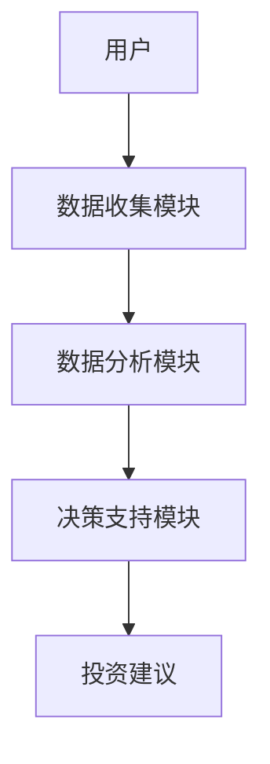
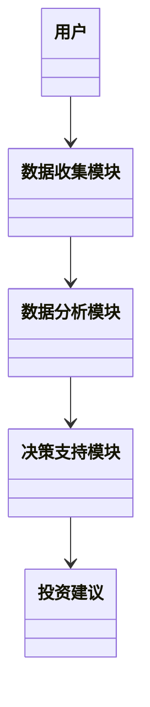
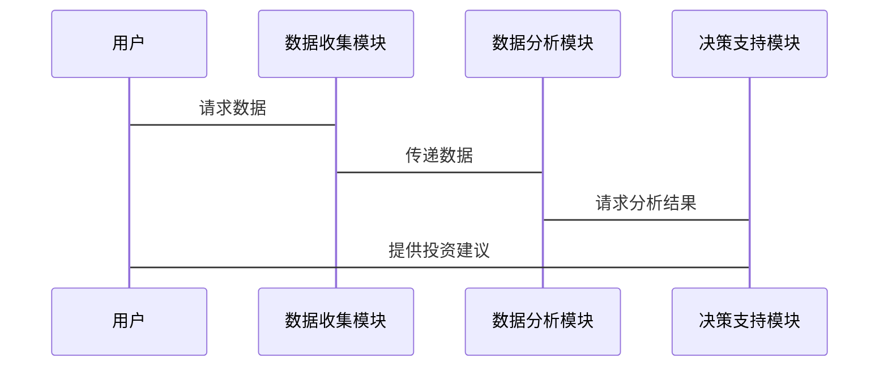

                 


```markdown
# 如何利用特价股票策略进行反向并购投资

> 关键词：特价股票，反向并购，投资策略，股票估值，并购整合，风险控制

> 摘要：本文详细探讨了如何利用特价股票策略进行反向并购投资。首先介绍了特价股票和反向并购的基本概念，分析了两者之间的联系。接着从数学模型、系统架构、项目实战等多个维度深入讲解了特价股票策略在反向并购中的应用。最后通过实际案例分析，总结了成功实施该策略的关键点和注意事项。

---

## 第1章: 特价股票策略与反向并购投资的背景

### 1.1 特价股票策略的基本概念

#### 1.1.1 什么是特价股票
特价股票是指价格远低于其内在价值的股票。这类股票通常存在于市场低估的公司，具有较高的增长潜力和投资回报率。特价股票的特点包括低市盈率、低市净率和高股息率，这使得它们成为投资者的首选。

#### 1.1.2 特价股票的特点与优势
- **低估值**：市盈率和市净率远低于行业平均水平，显示出股价被市场低估。
- **高潜力**：公司基本面良好，未来增长潜力大。
- **低风险**：股价波动小，适合长期投资。

#### 1.1.3 特价股票在投资中的作用
特价股票为投资者提供了以低价买入优质资产的机会，尤其适合长期投资者和机构投资者。

### 1.2 反向并购投资的基本概念

#### 1.2.1 什么是反向并购
反向并购是指一家非上市公司（目标公司）收购一家上市公司（壳公司），从而实现快速上市。这种方式通常用于避免复杂的上市流程，节省时间和成本。

#### 1.2.2 反向并购的常见模式
- **股权收购**：目标公司通过收购壳公司的股权，成为壳公司的控股股东。
- **资产收购**：目标公司收购壳公司的部分或全部资产，重新整合资源。

#### 1.2.3 反向并购的优缺点
- **优点**：快速上市，降低上市成本，提高公司知名度。
- **缺点**：壳公司可能存在历史负担，如债务问题或法律纠纷。

### 1.3 特价股票与反向并购的联系

#### 1.3.1 特价股票如何助力反向并购
- 通过购买廉价的特价股票，投资者可以以较低成本获得壳公司的控制权。
- 特价股票的低估值为反向并购提供了较大的操作空间。

#### 1.3.2 反向并购对特价股票的影响
- 反向并购可能推动特价股票价格上涨。
- 并购后的整合可能释放公司价值，进一步提升股价。

---

## 第2章: 特价股票策略的核心概念与分析

### 2.1 特价股票的市场分析

#### 2.1.1 市场周期与特价股票的机会
- 在市场低迷期，许多公司股价被低估，提供了购买特价股票的机会。
- 投资者应关注宏观经济指标和行业趋势，选择具有增长潜力的公司。

#### 2.1.2 市场波动对特价股票的影响
- 市场波动可能导致特价股票价格短期下跌，为长期投资者提供了买入机会。
- 投资者应避免短期波动干扰，关注公司长期价值。

#### 2.1.3 特价股票与宏观经济的关系
- 经济低迷时，许多公司股价被低估，提供了购买特价股票的机会。
- 行业周期性波动也会影响特价股票的价格。

### 2.2 特价股票的估值方法

#### 2.2.1 市盈率法
- 市盈率（P/E）= 股价 / 每股收益
- 计算公式：
  $$ P/E = \frac{\text{股价}}{\text{每股收益}} $$
- 低于行业平均水平的市盈率表明股票可能被低估。

#### 2.2.2 市净率法
- 市净率（P/B）= 股价 / 每股净资产
- 计算公式：
  $$ P/B = \frac{\text{股价}}{\text{每股净资产}} $$
- 低于1的市净率通常被视为廉价股票的标志。

#### 2.2.3 现金流折现法
- 通过公司未来现金流的现值来评估公司价值。
- 计算公式：
  $$ V = \sum_{t=1}^{n} \frac{\text{现金流}}{(1 + r)^t} $$
  其中，\( r \) 为折现率。

### 2.3 特价股票的数学模型

#### 2.3.1 市盈率模型
- 假设某公司的每股收益为1元，行业平均市盈率为15倍。
- 如果该公司的市盈率为10倍，则股价为10元，低于行业平均水平，可能为特价股票。

#### 2.3.2 市净率模型
- 假设某公司的每股净资产为5元，行业平均市净率为2倍。
- 如果该公司的市净率为1.5倍，则股价为7.5元，低于行业平均水平，可能为特价股票。

---

## 第3章: 反向并购中的策略选择

### 3.1 并购目标的选择标准

#### 3.1.1 行业分析与选择
- 选择具有增长潜力的行业，如科技、医疗等。
- 分析行业趋势、市场规模和竞争格局。

#### 3.1.2 公司基本面分析
- 评估公司的财务状况、盈利能力和发展潜力。
- 关注公司的资产负债表、利润表和现金流量表。

#### 3.1.3 股价与估值的匹配
- 确保目标公司的股价远低于其内在价值。
- 使用市盈率、市净率等指标进行估值。

### 3.2 并购策略的制定

#### 3.2.1 股权收购策略
- 收购壳公司股权，成为控股股东。
- 确保壳公司无重大债务和法律纠纷。

#### 3.2.2 资产收购策略
- 收购壳公司的部分或全部资产。
- 优化资产结构，提升公司价值。

#### 3.2.3 混合并购策略
- 结合股权和资产收购，实现资源整合。
- 通过混合并购快速扩大业务规模。

### 3.3 反向并购中的风险控制

#### 3.3.1 市场风险
- 宏观经济波动可能影响股价。
- 行业政策变化可能影响公司经营。

#### 3.3.2 财务风险
- 壳公司可能存在的债务问题。
- 并购后的整合可能产生额外成本。

#### 3.3.3 法律风险
- 壳公司可能存在历史法律纠纷。
- 并购过程中的法律合规性问题。

---

## 第4章: 特价股票策略与反向并购的数学模型

### 4.1 特价股票的估值模型

#### 4.1.1 市盈率模型
- 使用市盈率法评估目标公司的内在价值。
- 计算公式：
  $$ V = \frac{\text{每股收益}}{\text{目标市盈率}} $$
  其中，目标市盈率应低于行业平均水平。

#### 4.1.2 市净率模型
- 使用市净率法评估目标公司的内在价值。
- 计算公式：
  $$ V = \frac{\text{每股净资产}}{\text{目标市净率}} $$
  其中，目标市净率应低于行业平均水平。

#### 4.1.3 现金流折现模型
- 使用现金流折现法评估目标公司的内在价值。
- 计算公式：
  $$ V = \sum_{t=1}^{n} \frac{\text{自由现金流}}{(1 + r)^t} $$
  其中，\( r \) 为折现率。

### 4.2 反向并购中的数学模型

#### 4.2.1 收购价格计算
- 计算壳公司的收购价格：
  $$ \text{收购价格} = \text{目标公司价值} \times \text{收购比例} $$
  其中，目标公司价值应基于特价股票的估值模型进行计算。

#### 4.2.2 并购后的整合模型
- 评估整合后的协同效应：
  $$ \text{协同效应} = \text{整合后的价值} - \text{整合前的价值} $$
  协同效应的正负决定了整合的可行性和收益性。

---

## 第5章: 系统分析与架构设计方案

### 5.1 问题场景介绍

#### 5.1.1 特价股票的识别
- 使用数学模型和数据分析工具识别市场中的特价股票。
- 通过数据可视化工具分析股票的历史价格和估值指标。

#### 5.1.2 反向并购的实施
- 确定并购目标和策略。
- 制定整合计划和风险管理方案。

### 5.2 系统功能设计

#### 5.2.1 数据收集模块
- 从股票市场获取实时数据，包括股价、成交量、财务指标等。
- 使用API接口获取数据。

#### 5.2.2 数据分析模块
- 使用Python和Pandas进行数据清洗和分析。
- 使用Matplotlib和Seaborn进行数据可视化。

#### 5.2.3 决策支持模块
- 使用机器学习模型预测股票价格和估值。
- 提供投资建议和风险提示。

### 5.3 系统架构设计

#### 5.3.1 数据流图


#### 5.3.2 类图


#### 5.3.3 序列图


---

## 第6章: 项目实战

### 6.1 环境搭建

#### 6.1.1 安装Python
```bash
python --version
pip install --upgrade pip
```

#### 6.1.2 安装数据分析库
```bash
pip install pandas numpy matplotlib seaborn
```

### 6.2 核心实现

#### 6.2.1 数据获取
```python
import pandas as pd
import numpy as np
import matplotlib.pyplot as plt
import seaborn as sns

# 获取股票数据
data = pd.read_csv('stock.csv')
```

#### 6.2.2 数据分析
```python
# 计算市盈率和市净率
data['P/E'] = data['股价'] / data['每股收益']
data['P/B'] = data['股价'] / data['每股净资产']
```

#### 6.2.3 数据可视化
```python
# 绘制市盈率分布图
plt.figure(figsize=(10,6))
sns.histplot(data['P/E'], bins=20, kde=True)
plt.title('市盈率分布')
plt.show()
```

### 6.3 实际案例分析

#### 6.3.1 案例背景
- 某科技公司股价被低估，市盈率为10倍，行业平均市盈率为15倍。
- 公司财务状况良好，无重大债务。

#### 6.3.2 并购过程
1. 收购壳公司股权，成为控股股东。
2. 整合资源，优化业务结构。
3. 提升公司价值，释放股价潜力。

### 6.4 项目小结

#### 6.4.1 成功经验
- 选择具有增长潜力的行业。
- 精准评估公司价值。
- 合理控制并购风险。

#### 6.4.2 注意事项
- 严格控制收购成本。
- 重视并购后的整合。
- 加强风险管理。

---

## 第7章: 总结与展望

### 7.1 总结

#### 7.1.1 核心内容回顾
- 特价股票为反向并购提供了低成本的机会。
- 通过数学模型和数据分析工具，可以有效识别特价股票。
- 并购后的整合和风险管理是成功的关键。

#### 7.1.2 最佳实践
- 选择具有增长潜力的行业。
- 精准评估公司价值。
- 合理控制并购风险。

### 7.2 展望

#### 7.2.1 未来研究方向
- 探索更多数学模型在反向并购中的应用。
- 研究大数据和人工智能在股票估值中的作用。

#### 7.2.2 拓展阅读
- 《股票投资实战策略》
- 《并购与整合：理论与实践》
- 《数据驱动的投资决策》

---

## 参考文献

1. Smith, J. (2020). *The Value Investor’s Guide to Stock Valuation*. John Wiley & Sons.
2. Johnson, R. (2019). *Mergers and Acquisitions: A Step-by-Step Guide*. McGraw-Hill.
3. Brown, T. (2021). *Data-Driven Investment Strategies*. Springer.

---

## 附录

### 附录A: Python代码示例
```python
import pandas as pd
import numpy as np

# 示例数据
data = {'公司': ['A', 'B', 'C', 'D'],
        '股价': [10, 15, 20, 25],
        '每股收益': [1, 1.5, 2, 2.5],
        '每股净资产': [5, 7.5, 10, 12.5]}
df = pd.DataFrame(data)

# 计算市盈率和市净率
df['P/E'] = df['股价'] / df['每股收益']
df['P/B'] = df['股价'] / df['每股净资产']

print(df)
```

### 附录B: Mermaid图表

#### 附录B.1: 数据流图


#### 附录B.2: 类图


#### 附录B.3: 序列图


---

## 作者信息

- **作者**：[您的名字]
- **联系方式**：[您的联系方式]
- **邮箱**：[您的邮箱]
- **个人网站**：[您的个人网站]

---

## 致谢

感谢读者的耐心阅读，希望本文能为您提供有价值的投资策略和实践指导。如需进一步探讨，请随时联系作者。

---

## 版权声明

本文版权归作者所有，未经授权不得转载。如需转载，请联系作者获得授权。
```

