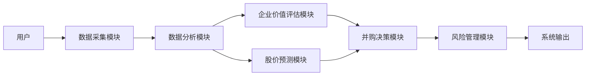

                 

# 如何利用特价股票策略进行反向并购投资

## 关键词：反向并购、特价股票、投资策略、企业价值、并购案例、数学模型

## 摘要：本文深入探讨了如何利用特价股票策略进行反向并购投资，从背景介绍到数学模型构建，再到系统设计和项目实战，详细分析了特价股票策略在反向并购中的应用。通过实际案例和公式推导，展示了如何通过特价股票策略优化企业价值和投资回报。

---

# 第一部分：反向并购与特价股票策略的背景与基础

## 第1章：反向并购与特价股票策略概述

### 1.1 反向并购的基本概念

#### 1.1.1 反向并购的定义与特点
反向并购是指一家上市公司通过收购一家非上市公司（目标公司）的股权，使目标公司成为上市公司的子公司或母公司，并将目标公司的资产或业务注入上市公司，以实现业务扩展或转型。其特点是快速获取资源、技术和市场，同时避免首次公开募股（IPO）的高成本和复杂性。

#### 1.1.2 特价股票策略的定义与特点
特价股票策略是指投资者在市场中寻找价格被低估的股票，通过购买这些股票进行投资，期望在市场恢复或公司业绩改善时获得超额收益。其特点是高风险、高回报，需要对市场和公司基本面有深刻理解。

#### 1.1.3 反向并购与特价股票策略的联系与区别
反向并购通常涉及上市公司的股票作为支付工具，而特价股票策略关注的是低价股票的投资机会。两者的联系在于反向并购可以通过特价股票策略优化支付结构，降低成本；区别在于前者是企业战略行为，后者是投资策略。

### 1.2 反向并购的背景与重要性
#### 1.2.1 反向并购的历史发展
反向并购起源于20世纪80年代，随着并购市场的兴起，逐渐成为企业扩张的重要手段。近年来，随着资本市场的波动，反向并购因其高效性受到更多关注。

#### 1.2.2 特价股票策略在反向并购中的作用
在反向并购中，特价股票策略常用于支付对价，降低现金支出，同时利用股价波动的机会。例如，当上市公司股价低迷时，目标公司可能以较低的股价获得更多的股份，降低整体并购成本。

#### 1.2.3 反向并购与资本市场的互动关系
反向并购与资本市场密切相关，股价波动直接影响并购成本和收益。通过特价股票策略，企业可以在市场低迷时进行战略性布局，利用低价股票优势。

### 1.3 反向并购的适用场景与边界
#### 1.3.1 反向并购的适用行业与企业类型
适用于需要快速扩张或转型的企业，特别是那些希望通过并购获取新技术、新市场的公司。例如，科技公司通过反向并购快速获得技术团队。

#### 1.3.2 特价股票策略的适用条件与限制
适用于市场低迷时期，目标公司估值被低估的情况。限制包括市场波动大、股价恢复不确定性高。

#### 1.3.3 反向并购与正常并购的对比分析
反向并购通常以上市公司为主体，利用其股价作为支付工具，而正常并购则由非上市公司发起，使用现金或资产支付。前者灵活性高，后者风险较低。

## 1.4 本章小结
本章介绍了反向并购和特价股票策略的基本概念，分析了它们的联系与区别，并探讨了反向并购的背景和重要性。通过对比，明确了特价股票策略在反向并购中的独特作用。

---

# 第二部分：特价股票策略的核心概念与联系

## 第2章：特价股票策略的核心原理

### 2.1 特价股票策略的原理分析
#### 2.1.1 特价股票的定义与分类
特价股票包括周期性股票、困境股票和成长型股票，投资者根据公司基本面和技术分析选择投资标的。

#### 2.1.2 特价股票策略的基本原理
通过分析市场周期和公司财务状况，寻找价格低于内在价值的股票，长期持有等待价值回归。

#### 2.1.3 特价股票策略的核心要素
包括估值模型、市场分析和风险评估，投资者需综合考虑多种因素。

### 2.2 特价股票策略与反向并购的结合
#### 2.2.1 反向并购中使用特价股票策略的目的
降低并购成本，优化资本结构，提升并购后的整合效率。

#### 2.2.2 特价股票策略在反向并购中的具体应用
例如，目标公司以低于市场价的股票作为支付工具，减少现金支出，提高并购灵活性。

#### 2.2.3 反向并购与特价股票策略的优缺点对比
优点：成本低、风险分散；缺点：股价波动大，整合难度高。

### 2.3 特价股票策略与企业价值的关系
#### 2.3.1 企业价值的定义与影响因素
企业价值是公司整体价值的评估，包括资产、负债和未来现金流。

#### 2.3.2 特价股票策略对企业价值的影响
通过低价收购，提升企业市场地位和盈利能力，优化资本结构。

#### 2.3.3 反向并购中企业价值的评估方法
使用DCF模型、可比公司分析和杠杆收购模型，综合评估目标公司价值。

### 2.4 本章小结
本章深入分析了特价股票策略的核心原理，探讨了其在反向并购中的应用，并通过对比分析，明确了策略的优缺点。

---

# 第三部分：特价股票策略的数学模型与算法原理

## 第3章：特价股票策略的数学模型

### 3.1 特价股票策略的核心公式
#### 3.1.1 企业价值评估公式
$$ 企业价值 = 现金流量的现值 + 资产的公允价值 - 短期负债 $$

#### 3.1.2 股票价格预测公式
$$ P = \alpha \times E + \beta \times (R_m - R_f) + \gamma $$
其中，P为股票价格，E为盈余，R_m为市场收益率，R_f为无风险收益率。

#### 3.1.3 并购收益计算公式
$$ 并购收益 = (收购后的企业价值 - 收购成本) \times 股权比例 $$

### 3.2 反向并购中的数学模型应用
#### 3.2.1 企业价值评估模型
使用DCF模型评估目标公司未来现金流，计算其企业价值。

#### 3.2.2 股票价格波动模型
基于时间序列分析，预测股价短期波动，指导并购时机选择。

#### 3.2.3 并购风险评估模型
通过VaR模型评估并购过程中的市场风险，制定风险对冲策略。

### 3.3 算法原理与流程图
#### 3.3.1 算法原理
反向并购中，特价股票策略的应用涉及对企业价值的评估、股价预测和风险评估，通过数学模型优化并购决策。

#### 3.3.2 算法流程图

### 3.4 本章小结
本章通过数学模型分析了特价股票策略在反向并购中的应用，构建了企业价值评估、股价预测和风险评估模型，为并购决策提供科学依据。

---

# 第四部分：反向并购与特价股票策略的系统分析与架构设计

## 第4章：系统分析与架构设计方案

### 4.1 系统功能设计
#### 4.1.1 系统功能模块划分
- 数据采集模块：收集市场数据和公司信息
- 数据分析模块：评估企业价值、预测股价
- 并购决策模块：优化并购方案
- 风险管理模块：评估并购风险

#### 4.1.2 系统功能流程图

#### 4.1.3 系统功能实现的关键点
- 数据源的准确性和及时性
- 分析模型的科学性和适用性
- 并购方案的优化策略

### 4.2 系统架构设计
#### 4.2.1 系统架构图

#### 4.2.2 系统功能流程图

#### 4.2.3 系统接口设计
- 数据接口：与数据源（如金融数据库）对接
- 用户接口：提供数据输入和结果展示
- 内部接口：模块之间的数据传递

### 4.3 本章小结
本章详细设计了支持特价股票策略的系统架构，通过模块划分和流程设计，展示了如何将数学模型应用于实际系统中，优化反向并购决策。

---

# 第五部分：反向并购与特价股票策略的项目实战

## 第5章：项目实战分析

### 5.1 项目背景与目标
#### 5.1.1 项目背景
假设某上市公司A计划通过反向并购进入新的市场领域，寻找合适的目标公司B，利用特价股票策略优化并购成本。

#### 5.1.2 项目目标
通过分析目标公司B的估值和股价走势，设计并购方案，评估并购后的整合效果。

### 5.2 项目实施步骤
#### 5.2.1 数据收集与初步分析
收集公司B的财务数据、市场数据，分析其股价走势和行业地位。

#### 5.2.2 企业价值评估
使用DCF模型计算公司B的企业价值，确定其内在价值。

#### 5.2.3 并购方案设计
确定以特价股票支付部分对价，计算股价波动对并购成本的影响。

#### 5.2.4 风险评估与对冲
通过VaR模型评估并购风险，制定风险对冲策略。

### 5.3 项目案例分析
#### 5.3.1 实际案例选择
以某上市公司为例，分析其反向并购过程中的特价股票策略应用。

#### 5.3.2 案例分析与解读
详细分析并购前后的股价变化、企业价值变化，总结策略的有效性。

#### 5.3.3 案例中的经验与教训
总结成功经验，分析可能的风险点，提出改进建议。

### 5.4 项目小结
通过实际案例分析，验证了特价股票策略在反向并购中的有效性，展示了如何通过数学模型优化并购决策。

---

# 第六部分：总结与展望

## 第6章：总结与展望

### 6.1 本章总结
本文系统探讨了如何利用特价股票策略进行反向并购投资，从理论分析到数学建模，再到系统设计和项目实战，全面展示了策略的应用过程。

### 6.2 本章小结
通过本文的分析，读者可以深入了解特价股票策略在反向并购中的重要作用，掌握数学模型的应用方法，为实际投资决策提供参考。

### 6.3 最佳实践 tips
- 在选择目标公司时，注重基本面分析和市场趋势
- 合理设计并购方案，降低并购风险
- 定期监控股价波动，及时调整投资策略

### 6.4 未来展望
未来，随着人工智能和大数据技术的发展，特价股票策略在反向并购中的应用将更加智能化和精准化，值得进一步研究和探索。

---

# 结语

通过本文的系统分析和实际案例，读者可以全面理解如何利用特价股票策略进行反向并购投资。希望本文能为投资者和企业提供有价值的参考，帮助他们在复杂多变的市场中制定科学的并购策略。

