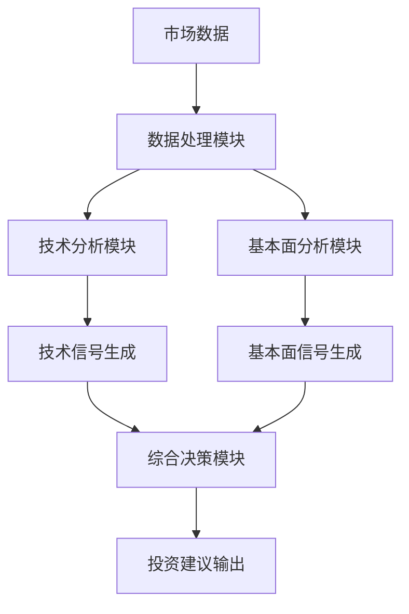

                 


# 如何利用特价股票策略进行反周期投资

> 关键词：特价股票、反周期投资、技术分析、基本面分析、投资策略、市场周期、风险管理

> 摘要：本文详细探讨了如何利用特价股票策略进行反周期投资，结合技术分析和基本面分析，介绍了识别特价股票的方法、制定投资策略的步骤，以及风险管理的重要性。通过实际案例分析和系统设计，帮助投资者在市场低迷时期抓住投资机会，实现稳健收益。

---

# 目录

1. [特价股票策略与反周期投资基础](#特價股票策略與反周期投資基礎)
2. [特价股票的识别与选择](#特價股票的識別與選擇)
3. [反周期投资策略的制定](#反周期投資策略的制定)
4. [系统分析与架构设计](#系統分析與架構設計)
5. [项目实战与案例分析](#專案實戰與案例分析)
6. [风险管理与最佳实践](#風險管理與最佳實踐)
7. [总结与展望](#總結與展望)

---

## 1. 特价股票策略与反周期投资基础

### 1.1 特价股票的定义与特征

#### 1.1.1 特价股票的定义

特价股票是指在市场低迷或经济不景气时期，价格被市场低估的股票。这些股票通常具有较高的安全边际，适合在市场底部阶段买入。

#### 1.1.2 特价股票的特征

| 特性 | 描述 |
|------|------|
| 低估值 | PE、PB等估值指标低于行业平均水平 |
| 高股息率 | 相对于市场平均水平，股息率较高 |
| 弱势行业龙头 | 在行业低谷期，龙头企业更具抗风险能力 |
| 基本面改善 | 公司财务状况逐步改善，业绩预期向好 |

### 1.2 反周期投资的定义与特点

#### 1.2.1 反周期投资的定义

反周期投资是指在经济周期的低谷期进行投资，利用市场的低估和恐慌情绪，捕捉被市场忽视的投资机会。

#### 1.2.2 反周期投资的核心特征

| 特性 | 描述 |
|------|------|
| 抗跌性 | 在市场下跌时表现相对稳定 |
| 低相关性 | 与其他资产类别相关性较低，分散风险 |
| 逆向思维 | 在市场恐慌时买入，在市场疯狂时卖出 |

---

## 2. 特价股票的识别与选择

### 2.1 特价股票的识别标准

#### 2.1.1 技术分析法

使用技术分析工具识别特价股票，例如通过K线图分析股票的价格走势是否处于超卖状态。

```mermaid
chart BT
    A[开始] --> B[市场底部识别]
    B --> C[技术指标分析]
    C --> D[确认特价股票]
    D --> E[结束]
```

#### 2.1.2 基本面分析法

通过财务指标分析公司的盈利能力、成长性和抗风险能力，寻找被市场低估的股票。

#### 2.1.3 综合法

结合技术分析和基本面分析，筛选出符合市场底部特征且估值合理的股票。

---

## 3. 反周期投资策略的制定

### 3.1 投资策略的核心要素

#### 3.1.1 市场周期分析

通过分析经济周期，判断当前市场所处的阶段，确定是否处于底部区域。

#### 3.1.2 投资组合构建

根据市场情况调整投资组合，增加对特价股票的配置比例，降低组合波动性。

---

## 4. 系统分析与架构设计

### 4.1 投资决策系统架构



### 4.2 核心算法实现

#### 4.2.1 市场底部识别算法

```python
def is_market_bottom(prices, window=20):
    # 计算相对强弱指数(RSI)
    rsi = calculate_rsi(prices, window)
    # 如果RSI低于30，可能处于超卖状态
    if rsi < 30:
        return True
    else:
        return False
```

---

## 5. 项目实战与案例分析

### 5.1 案例分析

#### 5.1.1 实际案例

假设某公司股票价格在近期下跌，市盈率（PE）为10，低于行业平均水平15，且公司最近财报显示净利润同比增长10%。根据上述标准，该股票可能被视为特价股票。

#### 5.1.2 技术实现

编写代码分析股票价格数据，计算技术指标如RSI和MACD，判断是否符合特价股票的条件。

---

## 6. 风险管理与最佳实践

### 6.1 风险管理策略

#### 6.1.1 分散投资

将资金分散投资于多个特价股票，降低单一股票风险。

#### 6.1.2 设置止损点

在投资组合中设定止损点，避免亏损过大。

---

## 7. 总结与展望

### 7.1 总结

通过本文的分析，读者可以了解如何利用特价股票策略进行反周期投资，掌握识别特价股票的方法和制定投资策略的步骤。

### 7.2 展望

未来，随着人工智能和大数据技术的发展，反周期投资策略将更加精准和高效。投资者可以利用这些新技术进一步优化投资决策，提升投资收益。

