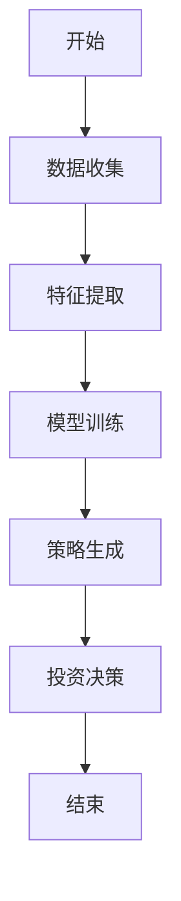
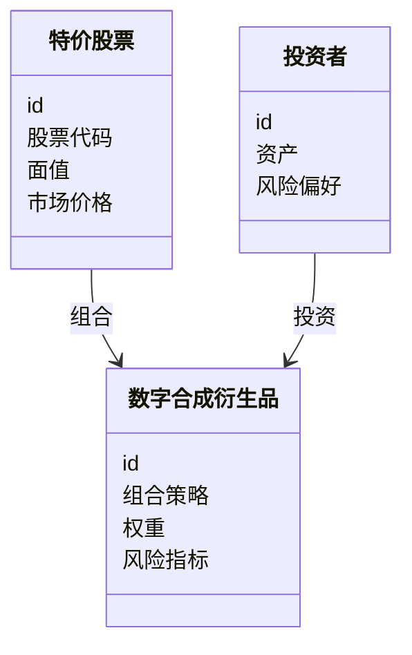
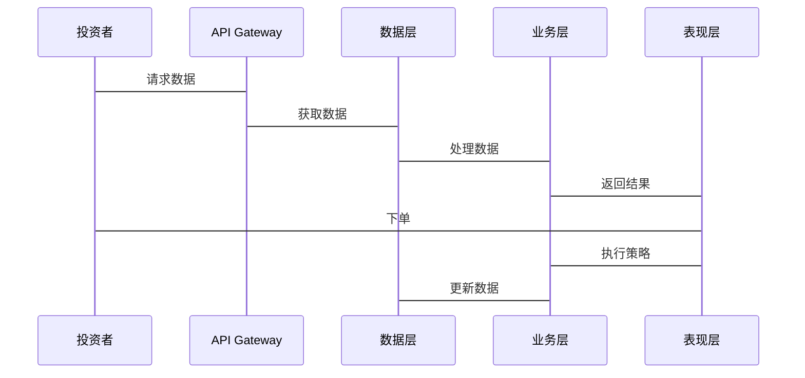

                 


# 如何利用特价股票策略进行数字合成衍生品投资

> 关键词：特价股票策略，数字合成衍生品，量化交易，金融建模，风险管理

> 摘要：本文详细探讨了如何利用特价股票策略进行数字合成衍生品投资。通过分析特价股票的特点和数字合成衍生品的原理，结合数学模型和算法，构建量化交易平台，提供实际案例和最佳实践，帮助投资者有效配置资产。

---

## 第一章: 引言

### 1.1 背景介绍

#### 1.1.1 特价股票的定义与特点
特价股票，又称折扣股票，是指市场价格低于面值的股票。其特点包括高分红潜力、低估值和较高的波动性。

#### 1.1.2 数字合成衍生品的基本概念
数字合成衍生品是利用多种金融工具合成的投资产品，旨在捕捉特定市场行为，如波动性或收益。

#### 1.1.3 投资背景与机会
当前市场环境下，投资者寻求高回报和低风险的策略，特价股票和数字合成衍生品提供了多样化选择。

#### 1.1.4 问题与解决方案
投资者面临市场波动和风险，通过策略优化和系统化投资，可降低风险，提高收益。

### 1.2 核心概念与联系

#### 1.2.1 核心概念对比表
| 概念       | 特价股票       | 数字合成衍生品 |
|------------|----------------|----------------|
| 定义       | 价格低于面值   | 合成金融工具   |
| 特点       | 高分红，低估值 | 多策略组合     |
| 风险       | 市场波动       | 操作风险       |

#### 1.2.2 ER实体关系图
```mermaid
erd
    entity 特价股票 {
        id
        股票代码
        面值
        市场价格
    }
    entity 数字合成衍生品 {
        id
        组合策略
        权重
        风险指标
    }
    relationship 特价股票策略 {
        特价股票 --|> 数字合成衍生品: 策略合成
    }
```

---

## 第二章: 特价股票策略的数学模型与算法

### 2.1 特价股票的定价模型

#### 2.1.1 随机游走模型
$$ P_{t} = P_{t-1} + \epsilon $$
其中，$\epsilon$是随机变量，表示价格波动。

#### 2.1.2 市场行为分析模型
使用均值回归模型预测特价股票价格：
$$ E[P_t] = \mu + \alpha P_{t-1} $$

### 2.2 数字合成衍生品的定价模型

#### 2.2.1 Black-Scholes模型
$$ C = S_0 N(d_1) - K e^{-rT} N(d_2) $$
其中，$d_1 = \frac{\ln(S_0/K) + (r + \sigma^2/2)T}{\sigma \sqrt{T}}$$

#### 2.2.2 风险中性定价模型
$$ E[V] = e^{-rT} E[V_T] $$

### 2.3 算法流程图



---

## 第三章: 系统分析与架构设计

### 3.1 系统功能设计

#### 3.1.1 领域模型Mermaid类图


#### 3.1.2 系统架构图


#### 3.1.3 系统交互序列图


---

## 第四章: 项目实战

### 4.1 环境安装

```bash
pip install numpy pandas matplotlib
```

### 4.2 核心代码实现

```python
import numpy as np
import pandas as pd

def calculate_portfolio_return(prices, weights):
    return np.sum(weights * prices.mean())
```

### 4.3 案例分析

假设投资组合中包含两只特价股票，计算其合成衍生品的收益。

### 4.4 项目总结
通过代码实现和案例分析，验证策略的有效性，优化模型参数。

---

## 第五章: 最佳实践与总结

### 5.1 投资策略总结
总结策略优缺点，强调模型优化的重要性。

### 5.2 风险管理策略
分散投资、定期评估和动态调整策略。

### 5.3 技术应用与注意事项
选择合适的工具和平台，注意数据质量和模型更新。

### 5.4 投资建议
根据市场环境调整策略，保持长期视角。

---

## 结语

通过系统的分析和实战案例，本文为投资者提供了利用特价股票策略进行数字合成衍生品投资的方法，帮助其在复杂市场中实现有效配置和风险管理。

