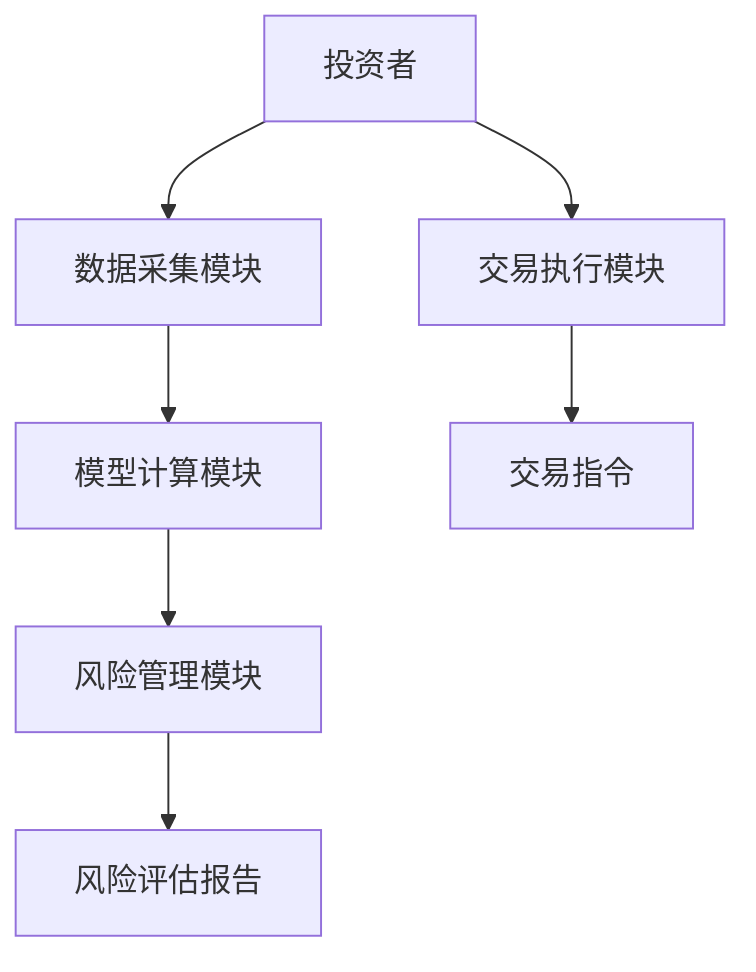

                 


# 如何利用特价股票策略进行数字合成资产投资

**关键词**：特价股票策略、数字合成资产、投资策略、风险管理、数学模型

**摘要**：本文将详细探讨如何利用特价股票策略进行数字合成资产投资。通过分析特价股票策略的核心概念、数字合成资产的构建方法，结合数学模型和算法优化，提供一套系统化的投资策略。文章内容涵盖背景介绍、核心概念、算法原理、系统架构设计、项目实战及最佳实践，旨在帮助读者全面理解并掌握利用特价股票策略进行数字合成资产投资的方法。

---

## 第一部分: 特价股票策略与数字合成资产投资背景介绍

### 第1章: 特价股票策略概述

#### 1.1 特价股票策略的基本概念

##### 1.1.1 什么是特价股票
特价股票是指在特定时间段内价格低于其内在价值或市场公允价值的股票。通常，这些股票可能暂时被市场低估，或因市场波动、公司特定事件等因素导致价格下跌。投资者通过识别这些特价股票，可以在低价时买入，期望在价格回升时卖出获利。

##### 1.1.2 特价股票的分类与特点
特价股票可以根据市场状况、行业特性、公司基本面等进行分类。以下是几种常见的分类方式：
1. **市场周期性特价股票**：在市场低迷时期，许多股票价格被低估，投资者可以利用市场周期性波动进行投资。
2. **行业特价股票**：某些行业在特定时期（如经济衰退或政策变化）可能面临价格低估的情况。
3. **基本面特价股票**：公司财务状况良好，但因市场短期波动导致股价下跌，这种股票被称为基本面特价股票。

特价股票的特点包括：
- 价格低估
- 高潜在回报
- 风险较高（需谨慎选择）

##### 1.1.3 特价股票投资的基本原则
1. **长期投资视角**：避免短期市场波动影响，关注公司长期价值。
2. **分散投资**：通过投资多只特价股票分散风险。
3. **基本面分析**：结合财务报表、行业地位、管理团队等因素进行分析。

---

#### 1.2 数字合成资产的概念与特点

##### 1.2.1 数字合成资产的定义
数字合成资产是指通过算法将多种资产（如股票、债券、期货等）按照特定规则组合而成的虚拟资产。它利用技术手段将分散的资产进行优化组合，以实现特定的投资目标（如最大化收益、最小化风险）。

##### 1.2.2 数字合成资产的类型
数字合成资产可以根据组合方式、投资目标、风险偏好等进行分类：
1. **收益型合成资产**：以追求稳定收益为目标，适合风险偏好较低的投资者。
2. **风险对冲型合成资产**：用于对冲特定资产或市场的风险，如利用期货对冲股票市场波动。
3. **成长型合成资产**：通过组合高增长潜力的资产，追求长期资本增值。

##### 1.2.3 数字合成资产的优势与劣势
优势：
- **风险分散**：通过组合多种资产，降低单一资产的风险。
- **收益优化**：通过科学的组合策略，提升整体收益。
- **灵活性高**：可以根据市场变化快速调整资产配置。

劣势：
- **复杂性高**：需要专业的知识和技能进行设计和管理。
- **流动性风险**：部分合成资产可能面临流动性不足的问题。

---

### 第2章: 特价股票策略与数字合成资产的关系

#### 2.1 特价股票策略在数字合成资产中的作用

##### 2.1.1 特价股票作为数字合成资产的基础
特价股票是数字合成资产的重要组成部分。通过识别和投资特价股票，投资者可以利用其低估的价格优势，构建具有高收益潜力的合成资产组合。

##### 2.1.2 特价股票策略对数字合成资产的影响
- **提升收益潜力**：通过选择低估的特价股票，数字合成资产可以在市场回升时获得超额收益。
- **优化风险控制**：利用特价股票的多样性和分散性，降低合成资产的整体风险。

#### 2.2 数字合成资产对特价股票策略的优化

##### 2.2.1 数字合成资产如何提升特价股票投资效率
通过算法优化和自动化交易，数字合成资产能够快速识别特价股票投资机会，提升投资效率。

##### 2.2.2 数字合成资产如何降低投资风险
通过组合多只特价股票，并结合其他资产（如债券、期货等），数字合成资产可以有效分散风险，降低单一资产波动带来的影响。

---

## 第二部分: 特价股票策略与数字合成资产的核心概念

### 第3章: 特价股票策略的数学模型

#### 3.1 特价股票价格预测模型

##### 3.1.1 时间序列分析模型
时间序列分析是一种常用的股票价格预测方法。通过分析历史价格数据，预测未来价格走势。

##### 3.1.2 机器学习预测模型
利用机器学习算法（如随机森林、神经网络等）对股票价格进行预测，能够捕捉复杂市场特征。

##### 3.1.3 模型的优缺点对比
| 模型类型 | 优点 | 缺点 |
|---------|------|------|
| 时间序列分析 | 简单易懂，适合短期预测 | 需要大量历史数据，预测精度有限 |
| 机器学习 | 高精度，能够捕捉非线性关系 | 计算复杂，需要大量数据 |

---

#### 3.2 数字合成资产的组合优化模型

##### 3.2.1 资产组合优化的基本原理
通过数学优化方法，将多种资产按照特定权重组合，以实现收益与风险的最佳平衡。

##### 3.2.2 数学公式与优化算法
优化目标：最大化收益，最小化风险。

$$
\text{最大化 } \sum_{i=1}^{n} w_i r_i - \lambda \sum_{i=1}^{n} w_i^2 \sigma_i^2
$$

其中，\( w_i \) 为资产 \( i \) 的权重，\( r_i \) 为资产 \( i \) 的预期收益率，\( \sigma_i \) 为资产 \( i \) 的波动率，\( \lambda \) 为风险厌恶系数。

优化算法：使用拉格朗日乘数法或遗传算法进行求解。

---

## 第4章: 数字合成资产的实体关系图

#### 4.1 实体关系图的构建
使用 Mermaid 绘制实体关系图，展示数字合成资产的核心要素。

```mermaid
erDiagram
    actor 投资者
    actor 市场数据源
    actor 风险管理系统
    actor 交易执行系统
    class 股票
    class 债券
    class 期货
    class 合成资产
    class 投资组合
    class 风险评估报告
    class 交易指令
    投资者 --> 股票
    投资者 --> 债券
    投资者 --> 期货
    股票 --> 合成资产
    债券 --> 合成资产
    期货 --> 合成资产
    合成资产 --> 投资组合
    投资组合 --> 风险评估报告
    风险管理系统 --> 风险评估报告
    交易执行系统 --> 交易指令
```

---

## 第5章: 数字合成资产的系统架构设计

#### 5.1 系统功能设计

##### 5.1.1 用户需求分析
- 投资者需要实时监控特价股票价格。
- 投资者需要生成数字合成资产的投资组合。
- 投资者需要查看风险评估报告。

##### 5.1.2 系统功能模块划分
- 数据采集模块
- 模型计算模块
- 风险管理模块
- 交易执行模块

---

#### 5.2 系统架构设计

##### 5.2.1 系统架构图
使用 Mermaid 绘制系统架构图。



---

#### 5.3 系统接口设计

##### 5.3.1 API 接口
- 数据接口：从市场数据源获取股票、债券、期货价格数据。
- 计算接口：调用优化算法生成投资组合。
- 交易接口：发送交易指令到交易系统。

---

## 第6章: 数字合成资产的项目实战

#### 6.1 环境安装

##### 6.1.1 安装 Python 环境
```bash
pip install numpy pandas scikit-learn
```

##### 6.1.2 安装 Mermaid 工具
```bash
npm install -g mermaid-cli
```

---

#### 6.2 核心代码实现

##### 6.2.1 特价股票价格预测代码
```python
import numpy as np
import pandas as pd
from sklearn.ensemble import RandomForestRegressor

# 数据加载
data = pd.read_csv('stock_prices.csv')

# 特征工程
features = data[['open', 'high', 'low', 'volume']]
target = data['close']

# 模型训练
model = RandomForestRegressor()
model.fit(features, target)

# 预测
predicted_price = model.predict(features)
```

##### 6.2.2 数字合成资产组合优化代码
```python
import numpy as np
from scipy.optimize import minimize

# 定义目标函数
def portfolio_variance(weights, covariance_matrix):
    return np.dot(weights.T, np.dot(covariance_matrix, weights))

# 约束条件
def constraints(weights):
    return np.sum(weights) - 1

# 最优化问题
weights = np.array([1.0/3, 1.0/3, 1.0/3])
covariance_matrix = np.array([[0.2, 0.1, 0.05],
                               [0.1, 0.3, 0.08],
                               [0.05, 0.08, 0.2]])

result = minimize(portfolio_variance, weights, args=(covariance_matrix,), 
                 method='SLSQP', constraints={'type': 'eq', 'fun': constraints})
```

---

## 第三部分: 特价股票策略与数字合成资产的投资实战与总结

### 第7章: 项目实战

#### 7.1 实际案例分析
以某科技公司为例，分析其股价波动情况，构建数字合成资产投资组合。

#### 7.2 投资组合分析
根据优化模型生成的投资组合，分析其收益和风险表现。

---

### 第8章: 总结与展望

#### 8.1 总结
- 特价股票策略是数字合成资产投资的重要组成部分。
- 通过数学模型和算法优化，可以显著提升投资效果。
- 数字合成资产的投资需要结合市场环境和风险管理。

#### 8.2 展望
- 进一步优化算法，提升预测精度。
- 探索更多资产类别，丰富合成资产组合。
- 结合人工智能技术，实现自动化投资。

---

## 第四部分: 最佳实践与注意事项

### 第9章: 最佳实践

#### 9.1 投资策略
- 分散投资，避免过度集中。
- 定期调整投资组合，适应市场变化。

#### 9.2 风险管理
- 设置止损点，控制单次投资风险。
- 定期评估风险，及时调整投资策略。

---

### 第10章: 注意事项

#### 10.1 风险提示
- 投资有风险，需谨慎操作。
- 市场波动可能导致投资损失。

#### 10.2 合规性提示
- 遵守相关法律法规，避免非法投资行为。

---

### 第11章: 拓展阅读

#### 11.1 推荐书籍
- 《股票投资实战》
- 《量化投资：算法与策略》

#### 11.2 推荐博客
- 量化投资论坛
- 金融科技博客

---

通过本文的详细讲解，读者可以系统地了解如何利用特价股票策略进行数字合成资产投资。从理论到实践，从算法到系统设计，文章全面覆盖了相关内容，帮助读者掌握这一投资策略的核心方法和实际应用。

