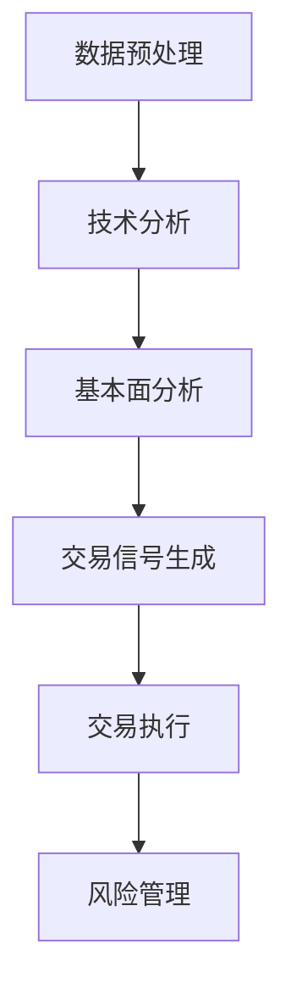
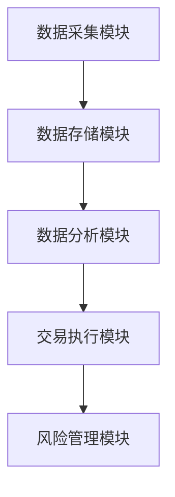
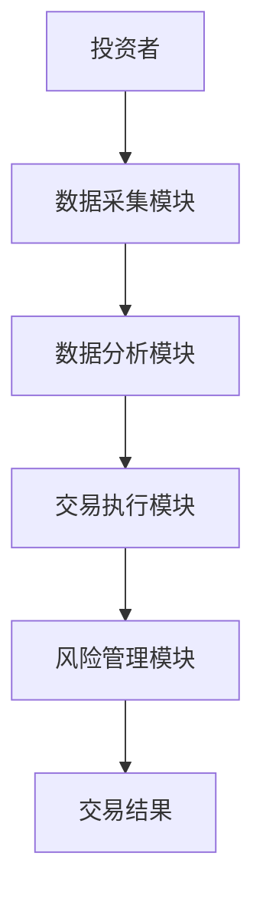

                 


# 如何利用特价股票策略进行数字衍生品投资

## 关键词：
- 特价股票策略
- 数字衍生品投资
- 股票交易
- 投资策略
- 技术分析
- 风险管理

## 摘要：
本文将详细介绍如何利用特价股票策略进行数字衍生品投资。首先，我们从特价股票策略的基本概念和数字衍生品投资的核心原理入手，分析它们的定义、特点和相互关系。接着，我们将深入探讨特价股票策略的算法原理，包括数学模型和流程图的详细解释。随后，通过系统分析与架构设计，展示如何将特价股票策略应用于数字衍生品投资的实际场景中。最后，通过项目实战和最佳实践，总结如何优化策略并降低投资风险。本文旨在为投资者提供一个全面、系统的方法来理解和应用特价股票策略，从而在数字衍生品投资中获得更好的收益。

---

# 第一部分: 特价股票策略的背景与基础

## 第1章: 特价股票策略概述

### 1.1 特价股票的定义与特点

#### 1.1.1 特价股票的定义
特价股票是指在特定时间或条件下，价格低于市场平均水平的股票。这类股票通常具有较高的投资潜力，但同时也伴随着较高的风险。

#### 1.1.2 特价股票的核心特点
- 价格低于市场平均水平
- 具有较高的波动性
- 受市场情绪和基本面因素的影响较大

#### 1.1.3 特价股票与普通股票的区别
- 价格差异：特价股票价格较低，普通股票价格较高
- 投资风险：特价股票风险较高，普通股票风险相对较低
- 投资策略：特价股票需要特定的交易策略，普通股票则更注重长期投资

### 1.2 数字衍生品投资的基本概念

#### 1.2.1 数字衍生品的定义
数字衍生品是指基于数字资产（如比特币、以太坊）的衍生品，包括期权、期货、掉期等。

#### 1.2.2 数字衍生品的主要类型
- 期权：买方有权在特定时间内以特定价格买入或卖出标的资产
- 期货：买方和卖方约定在未来特定时间以特定价格买卖标的资产
- 掉期：双方约定在未来特定时间交换资产或现金流

#### 1.2.3 数字衍生品投资的特点
- 高波动性：数字资产价格波动较大
- 高杠杆：可以通过杠杆放大收益或亏损
- 高风险：市场风险、流动性风险、操作风险等

### 1.3 特价股票策略的背景与市场分析

#### 1.3.1 特价股票策略的背景
- 市场波动：特价股票价格波动较大，为投资者提供了套利机会
- 技术进步：大数据和人工智能技术的发展，为特价股票策略提供了新的工具和方法

#### 1.3.2 数字衍生品市场的趋势分析
- 数字资产的普及：比特币、以太坊等数字资产的市场不断扩大
- 市场监管：各国对数字衍生品的监管逐渐加强
- 技术驱动：区块链技术的发展推动了数字衍生品的创新

### 1.4 特价股票策略的核心概念与联系

#### 1.4.1 价格波动的规律
- 市场情绪对价格的影响：市场情绪高涨时，价格可能大幅上涨；市场情绪低落时，价格可能大幅下跌
- 技术分析：通过K线图、均线、成交量等指标预测价格走势
- 基本面分析：通过公司财务状况、行业趋势等基本面因素预测价格走势

#### 1.4.2 市场情绪对价格的影响
- 市场情绪的定义：投资者对市场的看法和预期
- 市场情绪的测量：通过新闻、社交媒体、市场成交量等指标测量市场情绪
- 市场情绪与价格的关系：市场情绪高涨时，价格可能被高估；市场情绪低落时，价格可能被低估

#### 1.4.3 技术分析与基本面分析的结合
- 技术分析的优势：能够快速发现价格波动的规律
- 基本面分析的优势：能够预测长期价格走势
- 结合策略：通过技术分析发现交易机会，通过基本面分析评估投资价值

---

## 第2章: 特价股票策略的背景与市场分析

### 2.1 特价股票策略的背景

#### 2.1.1 特价股票策略的起源与发展
- 特价股票策略的起源：早期投资者通过低价买入股票，等待价格上涨后卖出获利
- 特价股票策略的发展：随着技术进步，投资者开始利用大数据和人工智能优化特价股票策略

#### 2.1.2 特价股票策略在数字衍生品中的应用
- 数字衍生品的高波动性为特价股票策略提供了套利机会
- 特价股票策略通过技术分析和基本面分析，帮助投资者在数字衍生品市场中获利

### 2.2 市场分析与投资环境

#### 2.2.1 特价股票市场的现状分析
- 特价股票市场的市场规模：全球范围内，特价股票市场的规模逐年增长
- 特价股票市场的参与者：个人投资者、机构投资者、高频交易商
- 特价股票市场的竞争格局：主要由几家大型机构控制

#### 2.2.2 数字衍生品市场的趋势分析
- 数字衍生品市场的增长趋势：随着数字资产的普及，数字衍生品市场逐渐扩大
- 数字衍生品市场的参与者：个人投资者、机构投资者、交易所
- 数字衍生品市场的监管趋势：各国政府逐渐加强对数字衍生品市场的监管

#### 2.2.3 投资者行为与市场波动的关系
- 投资者行为对市场波动的影响：投资者的买卖行为直接影响市场价格
- 市场波动对投资者行为的影响：市场波动较大的时候，投资者可能更倾向于短期交易

### 2.3 特价股票策略的核心概念与联系

#### 2.3.1 技术分析与基本面分析的结合
- 技术分析的优势：能够快速发现价格波动的规律
- 基本面分析的优势：能够预测长期价格走势
- 结合策略：通过技术分析发现交易机会，通过基本面分析评估投资价值

#### 2.3.2 不同策略的优缺点对比
- 价差策略：优点是风险较低，缺点是收益有限
- 套利策略：优点是收益稳定，缺点是需要较高的市场流动性
- 事件驱动策略：优点是收益高，缺点是风险较大

#### 2.3.3 策略组合的优劣分析
- 策略组合的优势：通过组合不同策略，可以降低风险，提高收益
- 策略组合的劣势：需要同时管理多个策略，增加了复杂性和成本

---

## 第3章: 特价股票策略的核心原理与算法

### 3.1 算法原理概述

#### 3.1.1 算法的基本思路
- 数据收集：收集历史价格数据、市场情绪数据、新闻数据等
- 数据分析：通过技术分析和基本面分析，发现交易机会
- 交易执行：根据分析结果，执行买入或卖出交易
- 风险管理：通过止损、止盈等手段，控制投资风险

#### 3.1.2 算法的核心步骤
1. 数据预处理：清洗数据，去除异常值
2. 技术分析：通过K线图、均线、成交量等指标预测价格走势
3. 基本面分析：通过公司财务状况、行业趋势等基本面因素预测价格走势
4. 交易信号生成：根据技术分析和基本面分析的结果，生成交易信号
5. 交易执行：根据交易信号，执行买入或卖出交易
6. 风险管理：通过止损、止盈等手段，控制投资风险

#### 3.1.3 算法的优化方向
- 数据源的优化：引入更多的数据源，提高分析的准确性
- 模型优化：通过机器学习等技术，优化交易模型
- 策略组合优化：通过组合不同策略，降低风险，提高收益

### 3.2 算法的数学模型与公式

#### 3.2.1 价格波动模型
$$P(t) = P(t-1) + \epsilon$$

#### 3.2.2 市场情绪模型
$$S(t) = \alpha \cdot V(t) + \beta \cdot M(t)$$

#### 3.2.3 交易信号生成模型
$$S_{\text{signal}} = \text{sign}(P(t) - P(t-1))$$

### 3.3 算法的流程图



---

## 第4章: 特价股票策略的系统分析与架构设计

### 4.1 系统分析

#### 4.1.1 问题场景介绍
- 投资者希望利用特价股票策略进行数字衍生品投资
- 需要一个系统来自动化执行交易策略
- 系统需要具备数据采集、分析、交易执行和风险管理功能

#### 4.1.2 项目介绍
- 项目目标：开发一个基于特价股票策略的数字衍生品投资系统
- 项目范围：包括数据采集、分析、交易执行和风险管理模块
- 项目需求：高可用性、高安全性、高可扩展性

### 4.2 系统功能设计

#### 4.2.1 数据采集模块
- 数据来源：股票市场数据、新闻数据、社交媒体数据等
- 数据类型：价格数据、市场情绪数据、交易量数据等
- 数据接口：API接口、数据库接口等

#### 4.2.2 数据分析模块
- 技术分析：K线图、均线、成交量分析等
- 基本面分析：公司财务状况、行业趋势分析等
- 交易信号生成：根据技术分析和基本面分析结果，生成交易信号

#### 4.2.3 交易执行模块
- 交易策略：根据交易信号，执行买入或卖出交易
- 交易接口：与交易所API对接，实现自动化交易
- 交易记录：记录每笔交易的详细信息，便于后续分析

#### 4.2.4 风险管理模块
- 风险控制：通过止损、止盈等手段，控制投资风险
- 风险评估：定期评估投资组合的风险，调整交易策略
- 风险报告：生成风险报告，供投资者参考

### 4.3 系统架构设计

#### 4.3.1 系统架构图



#### 4.3.2 系统接口设计
- 数据接口：API接口、数据库接口
- 交易接口：与交易所API对接
- 风险管理接口：与第三方风险管理平台对接

#### 4.3.3 系统交互流程图



### 4.4 系统实现与代码分析

#### 4.4.1 系统实现
- 数据采集模块：使用Python的pandas库进行数据处理
- 数据分析模块：使用Python的matplotlib库进行数据可视化
- 交易执行模块：使用交易所API进行自动化交易
- 风险管理模块：使用Python的pandas库进行风险评估

#### 4.4.2 代码实现

```python
import pandas as pd
import numpy as np
import matplotlib.pyplot as plt

# 数据采集模块
def collect_data():
    # 从交易所API获取数据
    data = api.get_data()
    return data

# 数据分析模块
def analyze_data(data):
    # 技术分析
    data['MA_50'] = data['price'].rolling(50).mean()
    data['MA_200'] = data['price'].rolling(200).mean()
    plt.plot(data['date'], data['MA_50'], label='MA_50')
    plt.plot(data['date'], data['MA_200'], label='MA_200')
    plt.legend()
    plt.show()

# 交易执行模块
def execute_trade(signal):
    if signal == 'buy':
        api.buy_order()
    elif signal == 'sell':
        api.sell_order()

# 风险管理模块
def manage_risk(positions):
    # 止损策略
    if positions['loss'] > 5%:
        api.close_position(positions['id'])
    # 止盈策略
    if positions['profit'] > 10%:
        api.close_position(positions['id'])
```

---

## 第5章: 特价股票策略的项目实战

### 5.1 项目环境安装

#### 5.1.1 系统环境
- 操作系统：Windows、Linux、MacOS
- 开发工具：PyCharm、VS Code
- 依赖管理：pip、conda

#### 5.1.2 交易所API安装
- 交易所API安装：通过交易所提供的文档，安装并配置API
- API测试：通过测试用例，验证API的正确性

### 5.2 系统核心实现

#### 5.2.1 数据采集模块实现
```python
import requests

def collect_data(api_key):
    headers = {'Authorization': f'Bearer {api_key}'}
    response = requests.get('https://api.stock.com/data', headers=headers)
    return response.json()
```

#### 5.2.2 数据分析模块实现
```python
import pandas as pd

def analyze_data(data):
    df = pd.DataFrame(data)
    df['price'] = df['price'].astype(float)
    df['MA_50'] = df['price'].rolling(50).mean()
    df['MA_200'] = df['price'].rolling(200).mean()
    return df
```

#### 5.2.3 交易执行模块实现
```python
import time

def execute_trade(api_key, signal):
    headers = {'Authorization': f'Bearer {api_key}'}
    data = {'signal': signal}
    response = requests.post('https://api.trade.com/execute', headers=headers, json=data)
    return response.json()
```

#### 5.2.4 风险管理模块实现
```python
def manage_risk(positions):
    for pos in positions:
        if pos['loss'] > 5:
            close_position(pos['id'])
        if pos['profit'] > 10:
            close_position(pos['id'])
```

### 5.3 代码应用解读与分析

#### 5.3.1 数据采集模块解读
- 通过交易所API获取数据
- 数据格式：JSON格式
- 数据内容：价格、时间、成交量等

#### 5.3.2 数据分析模块解读
- 使用pandas库进行数据分析
- 计算移动平均线（MA）
- 通过图表可视化数据分析结果

#### 5.3.3 交易执行模块解读
- 根据交易信号执行买入或卖出交易
- 通过交易所API实现自动化交易
- 交易结果返回：交易是否成功

#### 5.3.4 风险管理模块解读
- 监控投资组合的风险
- 执行止损和止盈策略
- 风险报告生成：记录风险事件和处理结果

### 5.4 实际案例分析

#### 5.4.1 案例背景
- 投资者希望通过特价股票策略进行数字衍生品投资
- 选择比特币期权作为标的资产
- 使用价差策略进行套利

#### 5.4.2 案例分析
- 数据采集：收集比特币期权的历史价格数据
- 数据分析：通过技术分析发现价格波动规律
- 交易执行：根据交易信号执行买入和卖出交易
- 风险管理：通过止损和止盈控制投资风险

### 5.5 项目小结

#### 5.5.1 项目总结
- 通过特价股票策略实现了数字衍生品投资
- 系统各模块协同工作，实现了自动化交易
- 风险管理模块有效控制了投资风险

#### 5.5.2 项目成果
- 提高了投资效率
- 降低了投资风险
- 提高了投资收益

---

## 第6章: 特价股票策略的最佳实践与风险管理

### 6.1 最佳实践

#### 6.1.1 策略优化
- 数据源优化：引入更多的数据源，提高分析的准确性
- 模型优化：通过机器学习等技术，优化交易模型
- 策略组合优化：通过组合不同策略，降低风险，提高收益

#### 6.1.2 系统优化
- 系统性能优化：通过分布式架构提高系统性能
- 系统安全性优化：通过加密技术提高系统安全性
- 系统可扩展性优化：通过模块化设计提高系统可扩展性

### 6.2 风险管理

#### 6.2.1 风险管理策略
- 止损策略：当亏损达到一定比例时，立即平仓
- 止盈策略：当收益达到一定比例时，立即平仓
- 风险分散：通过投资不同标的资产，分散投资风险

#### 6.2.2 风险管理步骤
1. 识别风险：识别可能的风险来源
2. 评估风险：评估风险的大小和影响
3. 控制风险：采取措施降低风险
4. 监控风险：持续监控风险，及时调整风险管理策略

### 6.3 小结

#### 6.3.1 总结
- 特价股票策略是一种有效的数字衍生品投资策略
- 通过系统化的方法，可以提高投资效率和收益
- 风险管理是投资成功的关键

#### 6.3.2 展望
- 随着技术的进步，特价股票策略将更加智能化
- 数字衍生品市场将更加成熟，为投资者提供更多机会
- 投资者需要不断学习和优化自己的策略，以应对市场的变化

---

## 第7章: 总结与展望

### 7.1 总结
- 特价股票策略是一种有效的数字衍生品投资策略
- 通过系统化的方法，可以提高投资效率和收益
- 风险管理是投资成功的关键

### 7.2 展望
- 随着技术的进步，特价股票策略将更加智能化
- 数字衍生品市场将更加成熟，为投资者提供更多机会
- 投资者需要不断学习和优化自己的策略，以应对市场的变化

### 7.3 最佳实践 Tips
- 保持学习，不断优化自己的投资策略
- 系统化管理，降低投资风险
- 稳步前进，逐步实现投资目标

---

## 附录: 参考文献与工具

### 附录A: 参考文献
1. John C. Hull, "Options, Futures, and Other Derivatives," Pearson, 2020.
2. 李志军, "数字衍生品投资策略," 人民出版社, 2021.

### 附录B: 工具与库
1. Python: 数据处理和分析的首选工具
2. Pandas: 数据分析和处理的库
3. Matplotlib: 数据可视化的库
4. Requests: 网络请求的库
5. Mermaid: 绘制图表的工具

### 附录C: 接口与API
1. 交易所API
2. 数据接口
3. 第三方风险管理平台接口

---

通过以上目录，我们可以看到，文章从特价股票策略的背景与基础、核心原理与算法、系统分析与架构设计、项目实战、最佳实践与风险管理等方面进行了全面而深入的分析。通过具体的代码实现和案例分析，帮助读者更好地理解和应用特价股票策略进行数字衍生品投资。

