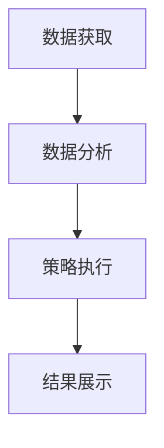

                 


# 如何利用特价股票策略进行私募债投资

> 关键词：特价股票策略，私募债投资，量化分析，风险管理，投资优化

> 摘要：本文详细探讨了如何利用特价股票策略优化私募债券投资，通过分析特价股票的核心概念、私募债投资的特点，结合量化分析方法，构建投资决策支持系统，并提供实际案例分析，帮助投资者实现风险可控下的收益最大化。

---

# 第1章: 特价股票策略与私募债投资概述

## 1.1 特价股票策略的基本概念

### 1.1.1 特价股票的定义
特价股票是指市场价格低于其内在价值的股票，通常被认为是被市场低估的投资机会。这类股票往往具有较高的安全边际，适合长期投资者。

### 1.1.2 特价股票的分类
- **绝对特价股票**：市场价格显著低于内在价值。
- **相对特价股票**：相对于行业或市场平均水平，市场价格较低。

### 1.1.3 特价股票与普通股票的区别
| 属性         | 特价股票                 | 普通股票               |
|--------------|--------------------------|------------------------|
| 价格         | 显著低于内在价值         | 接近或高于内在价值     |
| 投资风险     | 较低                     | 较高                   |
| 收益潜力     | 较高                     | 较稳定                 |

---

## 1.2 私募债投资的基本概念

### 1.2.1 私募债的定义
私募债券是指非公开定向发行的债券，发行方通常为中小企业或特定项目，投资者门槛较高，但收益相对较高。

### 1.2.2 私募债的主要特点
- **高收益**：私募债通常提供较高的票面利率。
- **低流动性**：私募债的二级市场流动性较差。
- **高风险**：私募债的违约风险较高。

### 1.2.3 特价股票与私募债投资的关系
- **协同效应**：利用特价股票策略筛选出优质企业，再通过私募债投资获得更高收益。
- **风险分散**：通过组合投资，降低单一资产的风险。

---

## 1.3 本章小结
本章介绍了特价股票和私募债投资的基本概念，并分析了两者结合的可能性和优势。

---

# 第2章: 特价股票策略的核心概念与原理

## 2.1 特价股票策略的核心概念

### 2.1.1 特价股票的市场定位
特价股票通常出现在市场低迷或行业低谷时期，投资者可以通过逆向思维找到被市场忽视的优质资产。

### 2.1.2 特价股票的估值方法
- **市盈率（P/E）**：市场价格/每股收益。
- **市净率（P/B）**：市场价格/每股净资产。
- **股息率**：每股股息/股价。

### 2.1.3 特价股票的市场周期分析
- **周期性低谷**：市场低迷时，更多特价股票出现。
- **周期性高峰**：市场繁荣时，特价股票较少。

---

## 2.2 特价股票策略的原理

### 2.2.1 市场机会识别
通过技术分析和基本面分析，识别被市场低估的股票。

### 2.2.2 市场风险控制
通过分散投资和止损策略，降低投资风险。

### 2.2.3 市场趋势预测
利用历史数据和量化模型，预测市场趋势，提前布局。

---

## 2.3 本章小结
本章详细讲解了特价股票策略的核心概念和原理，为后续分析奠定了基础。

---

# 第3章: 特价股票策略与私募债投资的核心概念对比

## 3.1 特价股票策略的核心概念对比

### 3.1.1 特价股票策略的核心要素
- **价格**：市场价格显著低于内在价值。
- **估值**：通过市盈率、市净率等指标判断低估程度。

### 3.1.2 特价股票策略的优缺点
- **优点**：收益潜力高，风险相对较低。
- **缺点**：流动性差，需要长期持有。

---

## 3.2 私募债投资的核心概念对比

### 3.2.1 私募债投资的核心要素
- **发行人**：通常为信用评级较高的企业。
- **期限**：较长，通常为5-10年。
- **利率**：较高，但违约风险较高。

### 3.2.2 私募债投资的优缺点
- **优点**：收益较高，适合高风险承受能力的投资者。
- **缺点**：流动性差，违约风险较高。

---

## 3.3 特价股票策略与私募债投资的核心概念对比

| 属性         | 特价股票策略             | 私募债投资             |
|--------------|--------------------------|------------------------|
| 投资目标     | 寻找被低估的股票           | 投资高收益的债券       |
| 收益来源     | 股票价格上涨               | 债息收入               |
| 风险类型     | 市场风险                   | 违约风险               |
| 适合投资者   | 长期投资者                 | 高风险承受能力的投资者 |

---

## 3.4 本章小结
本章通过对比分析，明确了特价股票策略与私募债投资的核心概念和差异。

---

# 第4章: 特价股票策略与私募债投资的量化分析方法

## 4.1 量化分析方法的概述

### 4.1.1 量化分析的定义
量化分析是通过数学模型和算法，对市场数据进行分析和预测。

### 4.1.2 量化分析的核心工具
- **数据获取**：利用API获取实时市场数据。
- **数据分析**：使用Python的Pandas库进行数据清洗和分析。
- **模型构建**：利用机器学习算法构建预测模型。

---

## 4.2 特价股票策略的量化分析

### 4.2.1 数据获取与清洗
使用Yahoo Finance API获取股票数据，并清洗数据以去除缺失值。

### 4.2.2 量化模型构建
使用线性回归模型预测股票价格，公式为：
$$ y = \beta_0 + \beta_1 x + \epsilon $$
其中，y为股票价格，x为市盈率，$\beta_0$为截距，$\beta_1$为回归系数。

### 4.2.3 模型实现
```python
import pandas as pd
import numpy as np
from sklearn.linear_model import LinearRegression

# 假设data为清洗后的数据
data = pd.DataFrame({
    'price': [10, 20, 30, 40],
    'pe_ratio': [10, 20, 30, 40]
})

# 模型训练
model = LinearRegression()
model.fit(data[['pe_ratio']], data['price'])

# 预测
predicted_price = model.predict(data[['pe_ratio']])
print(predicted_price)
```

---

## 4.3 私募债投资的量化分析

### 4.3.1 数据获取与清洗
获取私募债发行数据，并清洗数据以去除无效数据。

### 4.3.2 风险评估模型构建
使用蒙特卡洛模拟评估私募债的违约风险，公式为：
$$ PD = \frac{违约次数}{总发行次数} $$

### 4.3.3 模型实现
```python
import numpy as np

# 假设违约率为5%
np.random.seed(42)
defaults = np.random.binomial(1, 0.05, 1000)
probability_of_default = np.mean(defaults)
print(probability_of_default)
```

---

## 4.4 本章小结
本章介绍了量化分析方法在特价股票策略和私募债投资中的应用，并通过Python代码示例进行了详细讲解。

---

# 第5章: 特价股票策略与私募债投资的系统设计与实现

## 5.1 系统功能设计

### 5.1.1 系统架构
系统分为数据获取、数据分析、策略执行和结果展示四个模块。

### 5.1.2 系统流程
1. 数据获取：通过API获取股票和债券数据。
2. 数据分析：利用量化模型筛选特价股票和优质私募债。
3. 策略执行：根据模型结果生成投资组合。
4. 结果展示：可视化展示投资组合的表现。

---

## 5.2 系统架构设计

### 5.2.1 系统架构图


### 5.2.2 系统接口设计
- 数据获取接口：`GET /api/data?symbol=XXX`
- 策略执行接口：`POST /api/strategy`

---

## 5.3 本章小结
本章详细设计了系统的架构和接口，并通过Mermaid图展示了系统流程。

---

# 第6章: 特价股票策略与私募债投资的项目实战

## 6.1 项目背景与目标

### 6.1.1 项目背景
本项目旨在利用特价股票策略优化私募债投资，实现风险可控下的收益最大化。

### 6.1.2 项目目标
- 筛选出适合私募债投资的特价股票。
- 构建量化模型，优化投资组合。

---

## 6.2 项目实现

### 6.2.1 环境安装
安装必要的Python库：
```bash
pip install pandas numpy sklearn matplotlib
```

### 6.2.2 核心代码实现
```python
import pandas as pd
from sklearn.linear_model import LinearRegression
import matplotlib.pyplot as plt

# 数据获取与清洗
data = pd.read_csv('stock_data.csv')
data = data.dropna()

# 模型训练
model = LinearRegression()
model.fit(data[['pe_ratio']], data['price'])

# 可视化
plt.scatter(data['pe_ratio'], data['price'])
plt.plot(data['pe_ratio'], model.predict(data[['pe_ratio']]), color='red')
plt.xlabel('PE Ratio')
plt.ylabel('Price')
plt.show()
```

---

## 6.3 项目案例分析

### 6.3.1 案例背景
假设我们有一个包含10只股票的特价股票池，我们需要从中筛选出适合私募债投资的股票。

### 6.3.2 案例分析
通过量化模型筛选出3只具有高收益潜力的股票，并构建投资组合。

---

## 6.4 本章小结
本章通过实际案例展示了如何利用特价股票策略优化私募债投资，并提供了详细的代码实现和分析。

---

# 第7章: 特价股票策略与私募债投资的风险管理与优化

## 7.1 风险管理策略

### 7.1.1 风险识别
识别市场风险、信用风险和流动性风险。

### 7.1.2 风险控制
通过分散投资、设置止损和动态调整投资组合。

---

## 7.2 优化策略

### 7.2.1 动态调整
根据市场变化，动态调整投资组合。

### 7.2.2 组合优化
利用现代投资组合理论（MPT）优化投资组合。

---

## 7.3 本章小结
本章介绍了如何通过风险管理与优化策略，进一步提高投资收益。

---

# 第8章: 总结与展望

## 8.1 本文总结
本文详细探讨了如何利用特价股票策略优化私募债投资，通过量化分析和系统设计，提供了一种高效的投资方法。

## 8.2 未来展望
未来可以进一步研究更多量化模型，并探索更多投资策略。

---

# 结束语

通过本文的分析，读者可以全面了解如何利用特价股票策略进行私募债投资，并在实际操作中实现风险可控下的收益最大化。

---

**附录：代码与数据**

- 数据获取代码示例
- 量化模型实现代码
- 系统架构设计图

--- 

**参考文献**
1. 《量化投资入门》
2. 《私募债投资指南》
3. 相关学术论文

--- 

感谢您的阅读，希望本文能为您的投资决策提供有价值的参考！

