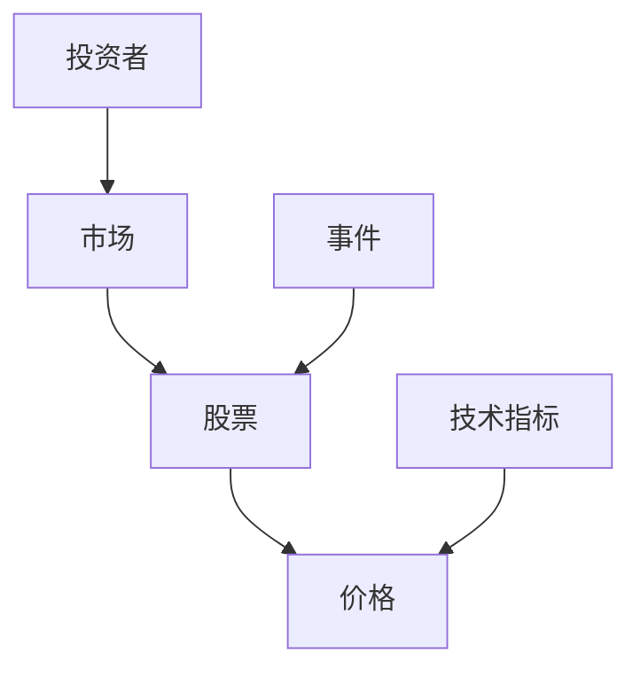
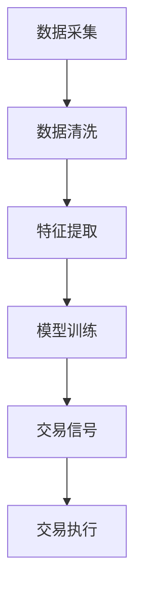
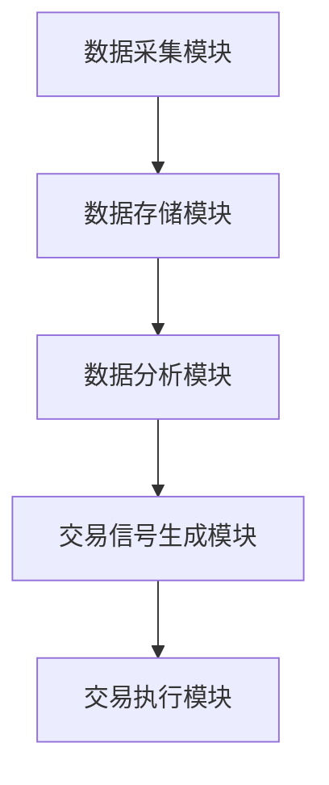
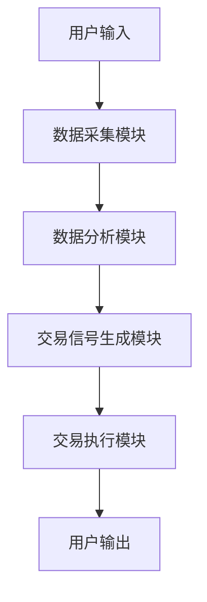

                 


# 如何利用特价股票策略进行系统性创新机会捕捉

## 关键词
特价股票策略、系统性创新、机会捕捉、股票投资、算法优化、市场分析、技术应用

## 摘要
本文深入探讨如何利用特价股票策略进行系统性创新机会捕捉。首先，我们介绍了特价股票策略的背景、核心概念和类型。接着，分析了策略的算法原理，包括数据采集、分析方法和交易策略设计。然后，详细阐述了系统分析与架构设计，包括项目介绍、功能设计、架构图和接口设计。最后，通过实战案例展示了如何在实际中应用这些策略，并总结了最佳实践经验和注意事项。

---

## 目录

1. [背景介绍](#背景介绍)
2. [核心概念](#核心概念)
3. [算法原理](#算法原理)
4. [系统分析与架构设计](#系统分析与架构设计)
5. [项目实战](#项目实战)
6. [最佳实践](#最佳实践)

---

## 第1章：背景介绍

### 1.1 特价股票策略的背景与现状

#### 1.1.1 特价股票的定义与特点
特价股票是指价格低于其内在价值的股票，通常具有较高的潜在收益。其特点包括低价、高波动性和较高的投资回报潜力。

#### 1.1.2 特价股票策略的历史演变
从早期的折扣股票到现代的量化交易，特价股票策略经历了从简单套利到复杂算法的演变。

#### 1.1.3 特价股票策略的创新机会
随着市场数据的丰富和技术的进步，利用算法和大数据分析进行特价股票策略优化成为可能。

---

## 第2章：核心概念

### 2.1 特价股票策略的核心要素

#### 2.1.1 市场机制与价格波动
市场机制影响股票价格波动，投资者行为和市场情绪是关键因素。

#### 2.1.2 投资者行为与市场情绪
投资者行为影响市场情绪，进而影响股票价格。理性与非理性行为的对比是关键。

#### 2.1.3 特价股票策略的关键变量
包括价格、成交量、市场情绪和市场深度等因素。

### 2.2 特价股票策略的类型与分类

#### 2.2.1 市场套利策略
利用市场价差进行套利，如跨市场套利和跨期套利。

#### 2.2.2 事件驱动策略
基于公司事件（如并购、重组）进行投资。

#### 2.2.3 技术分析策略
通过技术指标和图表分析预测价格走势。

### 2.3 核心概念对比表

| 策略类型    | 核心要素             | 适用场景                   |
|-------------|----------------------|---------------------------|
| 套利策略     | 市场价差、无风险套利   | 跨市场、跨期               |
| 事件驱动     | 公司事件、基本面分析   | 并购、重组                 |
| 技术分析     | 技术指标、价格走势   | 市场波动、趋势预测         |

### 2.4 实体关系图



---

## 第3章：算法原理

### 3.1 数据采集与预处理

#### 3.1.1 数据来源
包括股票市场数据、新闻数据和社交媒体数据。

#### 3.1.2 数据清洗
处理缺失值和异常值，确保数据质量。

#### 3.1.3 数据特征提取
提取关键特征，如价格、成交量和市场情绪。

### 3.2 特价股票策略的算法实现

#### 3.2.1 价格预测模型
使用线性回归和时间序列模型进行预测。

#### 3.2.2 市场情绪分析
通过自然语言处理分析新闻和社交媒体，评估市场情绪。

#### 3.2.3 交易信号生成
基于模型预测和市场情绪生成交易信号。

### 3.3 算法流程图



### 3.4 核心算法代码

```python
import pandas as pd
import numpy as np
from sklearn.linear_model import LinearRegression

# 数据加载与预处理
data = pd.read_csv('stock_data.csv')
data = data.dropna()  # 删除缺失值
data['label'] = np.where(data['close'].shift(-1) > data['close'], 1, -1)  # 标签生成

# 特征提取
features = data[['open', 'high', 'low', 'volume']]
labels = data['label']

# 模型训练
model = LinearRegression()
model.fit(features, labels)

# 交易信号生成
def generate_signals(data, model):
    signals = []
    for i in range(len(data)):
        features = data[['open', 'high', 'low', 'volume']].iloc[i].values.reshape(1, -1)
        prediction = model.predict(features)
        if prediction[0] == 1:
            signals.append(1)
        else:
            signals.append(-1)
    return signals

signals = generate_signals(data, model)
```

---

## 第4章：系统分析与架构设计

### 4.1 项目介绍

#### 4.1.1 项目目标
构建一个基于特价股票策略的自动化交易系统。

#### 4.1.2 项目范围
涵盖数据采集、分析、信号生成和交易执行。

### 4.2 系统功能设计

#### 4.2.1 数据采集模块
负责采集股票市场数据和新闻数据。

#### 4.2.2 数据分析模块
包括数据清洗、特征提取和模型训练。

#### 4.2.3 交易执行模块
根据交易信号执行买入或卖出操作。

### 4.3 系统架构设计



### 4.4 接口与交互设计

#### 4.4.1 数据接口
API接口用于数据交互。

#### 4.4.2 用户界面
提供可视化界面，展示交易信号和执行结果。

### 4.5 系统交互流程图



---

## 第5章：项目实战

### 5.1 环境安装

#### 5.1.1 安装依赖
安装Python、Pandas、Scikit-learn和相关库。

### 5.2 核心代码实现

```python
import pandas as pd
from sklearn.linear_model import LinearRegression
import requests

# 数据采集
def fetch_stock_data(ticker):
    url = f'https://api.example.com/stock/{ticker}'
    response = requests.get(url)
    return pd.DataFrame(response.json())

# 数据清洗与特征提取
def preprocess_data(data):
    data = data.dropna()
    data['label'] = np.where(data['close'].shift(-1) > data['close'], 1, -1)
    return data

# 模型训练
def train_model(data):
    features = data[['open', 'high', 'low', 'volume']]
    labels = data['label']
    model = LinearRegression()
    model.fit(features, labels)
    return model

# 交易信号生成
def generate_signals(data, model):
    signals = []
    for i in range(len(data)):
        features = data[['open', 'high', 'low', 'volume']].iloc[i].values.reshape(1, -1)
        prediction = model.predict(features)
        if prediction[0] == 1:
            signals.append(1)
        else:
            signals.append(-1)
    return signals

# 交易执行
def execute_trades(signals, data):
    positions = []
    for i in range(len(signals)):
        if signals[i] == 1:
            positions.append('long')
        else:
            positions.append('short')
    return positions

# 主程序
def main():
    ticker = 'AAPL'
    data = fetch_stock_data(ticker)
    data = preprocess_data(data)
    model = train_model(data)
    signals = generate_signals(data, model)
    positions = execute_trades(signals, data)
    print(positions)

if __name__ == '__main__':
    main()
```

### 5.3 案例分析与详细解读

#### 5.3.1 案例背景
选择一个具体的股票，如苹果公司（AAPL），进行分析。

#### 5.3.2 数据处理与模型训练
展示数据预处理和模型训练的具体步骤。

#### 5.3.3 交易信号与执行结果
展示生成的交易信号和实际交易结果，分析策略的有效性。

---

## 第6章：最佳实践

### 6.1 小结
总结特价股票策略的核心要素和系统性创新的关键点。

### 6.2 注意事项
包括市场风险、模型局限性和策略调整建议。

### 6.3 拓展阅读
推荐相关书籍和论文，进一步深入学习。

---

## 结论

通过系统性分析和算法优化，特价股票策略能够在复杂市场环境中捕捉创新机会。结合技术与市场分析，投资者可以制定有效的策略，实现长期收益。

