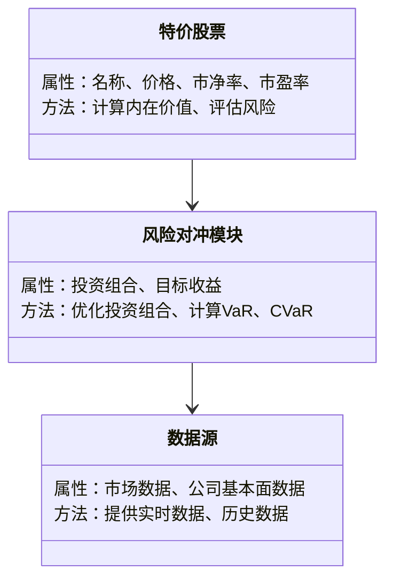
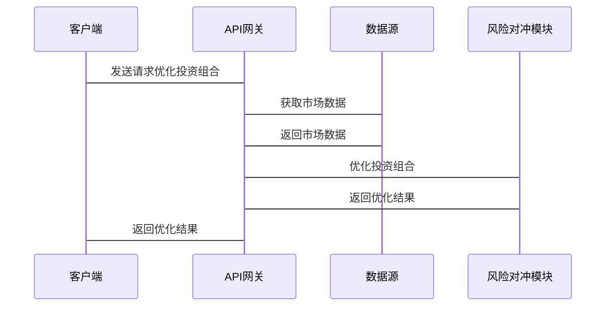

                 


# 如何利用特价股票策略进行系统性创新风险对冲

> 关键词：特价股票、风险对冲、系统性创新、投资组合优化、风险管理、金融创新

> 摘要：本文详细探讨如何利用特价股票策略进行系统性创新风险对冲。通过分析特价股票的核心概念、数学模型、系统架构及实际案例，本文为投资者提供了一套从理论到实践的解决方案，帮助他们在复杂多变的金融市场中优化投资组合，降低系统性风险。

---

# 第一部分：特价股票策略与风险对冲基础

## 第1章：特价股票策略概述

### 1.1 特价股票的定义与特点

#### 1.1.1 什么是特价股票
特价股票是指市场价格显著低于其内在价值的股票。这类股票通常被认为具有较高的投资潜力，因为它们可能被市场低估，未来有较大的上涨空间。

#### 1.1.2 特价股票的市场定位
特价股票通常出现在以下几种情况：
- 市场低迷时期，投资者情绪低落，导致股票价格被低估。
- 公司暂时遇到困境，但具有较好的基本面，未来有可能扭亏为盈。
- 周期性行业中的股票，在行业低谷期价格被压低。

#### 1.1.3 特价股票的投资机会与风险
- **投资机会**：特价股票可能带来较高的资本增值机会，尤其是在市场复苏或公司基本面改善时。
- **投资风险**：特价股票往往伴随着较高的波动性和不确定性，投资者可能面临较大的本金损失风险。

### 1.2 风险对冲的基本概念

#### 1.2.1 风险对冲的定义
风险对冲是指通过投资于相关资产或衍生工具，来抵消投资组合中的系统性风险。其目的是在不放弃预期收益的情况下，降低整体风险。

#### 1.2.2 系统性风险与非系统性风险
- **系统性风险**：影响整个市场的风险，如经济衰退、市场崩盘等。
- **非系统性风险**：影响单个资产或小部分资产的风险，如公司管理问题、行业政策变化等。

#### 1.2.3 风险对冲的常见方法
- 使用衍生工具（如期货、期权）进行对冲。
- 构建多元化的投资组合以分散风险。
- 通过资产配置优化投资组合的风险收益比。

---

## 第2章：系统性创新风险对冲的背景与意义

### 2.1 当前金融市场的风险环境

#### 2.1.1 全球化背景下的金融市场波动
全球化的加深导致金融市场高度关联，任何局部的经济波动都可能迅速蔓延至全球，加剧系统性风险。

#### 2.1.2 系统性风险的加剧因素
- 金融机构的杠杆率过高。
- 衍生工具的复杂化和滥用。
- 监管不足或监管套利。

#### 2.1.3 投资者对风险对冲的需求
随着市场波动加剧，投资者越来越重视风险对冲，以保护投资组合免受系统性风险的影响。

### 2.2 创新在风险管理中的作用

#### 2.2.1 创新如何降低系统性风险
- 创新的风险管理工具（如智能算法、大数据分析）能够更准确地识别和对冲风险。
- 创新的市场结构（如高频交易、算法交易）提高了市场的流动性和效率。

#### 2.2.2 系统性创新在风险对冲中的应用
- 利用大数据分析预测市场趋势，优化投资组合。
- 通过机器学习算法实时监控市场风险，及时调整对冲策略。

#### 2.2.3 创新对投资组合优化的贡献
- 创新的资产配置方法（如因子投资）提高了投资组合的风险调整后收益。
- 创新的交易策略（如统计套利）能够在不同资产之间捕捉定价错误，实现风险对冲。

---

# 第二部分：特价股票策略的核心概念与数学模型

## 第3章：特价股票策略的核心原理

### 3.1 特价股票的定价模型

#### 3.1.1 基于市净率的定价方法
市净率（P/B）是股票价格与每股净资产的比率。当市净率低于1时，股票可能被视为低估。

$$ P/B < 1 $$

#### 3.1.2 市盈率与股票价值的关系
市盈率（P/E）是股票价格与每股收益的比率。低市盈率可能意味着股票被低估。

$$ P/E < 市场平均P/E $$

#### 3.1.3 股票内在价值的计算公式
股票的内在价值可以通过现金流折现模型（DCF）进行估算：

$$ V = \sum_{t=1}^{\infty} \frac{CF_t}{(1+r)^t} $$

其中，\( CF_t \) 是第 \( t \) 年的现金流，\( r \) 是折现率。

### 3.2 风险对冲的数学模型

#### 3.2.1 现代投资组合理论（MPT）
MPT通过优化投资组合的收益与风险比来实现风险对冲。

$$ \text{最小化} \quad \sigma_p^2 $$
$$ \text{在约束条件下} \quad E[r_p] \geq \text{目标收益} $$

其中，\( \sigma_p \) 是投资组合的波动率，\( E[r_p] \) 是投资组合的期望收益。

#### 3.2.2 威险价值（VaR）与预期短缺风险（CVaR）
VaR是在一定置信水平下，投资组合可能遭受的最大损失。
CVaR是VaR的延伸，考虑了超过VaR的损失部分。

$$ \text{VaR}(\alpha) = \min_{p} \text{使得} \quad P(L \leq p) \geq \alpha $$
$$ \text{CVaR}(\alpha) = \frac{1}{\alpha} \int_{0}^{\alpha} L \, dP(L) $$

#### 3.2.3 风险对冲的优化算法
通过优化算法（如均值-方差优化）构建最优投资组合。

$$ \min \quad \sigma_p^2 $$
$$ \text{subject to} \quad E[r_p] = \text{目标收益} $$

---

## 第4章：特价股票策略与风险对冲的结合

### 4.1 特价股票在投资组合中的作用

#### 4.1.1 投资组合的构建与优化
通过引入特价股票，优化投资组合的风险收益比。

$$ \text{优化目标} = \min \quad \sigma_p^2 $$
$$ \text{约束条件} = E[r_p] = \text{目标收益}, \quad \sum w_i = 1 $$

其中，\( w_i \) 是各个资产的权重。

#### 4.1.2 特价股票的风险收益比分析
通过分析特价股票的夏普比率（Sharpe Ratio）来评估其风险调整后收益。

$$ \text{夏普比率} = \frac{E[r_p - r_f]}{\sigma_p} $$

其中，\( r_f \) 是无风险利率。

#### 4.1.3 投资组合的分散化效应
通过持有多种特价股票，分散化非系统性风险。

---

### 4.2 系统性创新在风险对冲中的应用

#### 4.2.1 创新工具的选择与评估
使用大数据分析和机器学习模型筛选特价股票，提高选股效率。

#### 4.2.2 技术创新对风险对冲的贡献
- 利用算法交易快速捕捉市场机会。
- 通过实时数据分析优化风险对冲策略。

#### 4.2.3 创新对投资组合优化的贡献
- 利用智能算法动态调整投资组合，实时对冲系统性风险。
- 通过因子投资策略，捕捉市场中被低估的资产。

---

# 第三部分：系统性创新风险对冲的系统架构与实现

## 第5章：系统架构设计

### 5.1 问题场景介绍
在金融市场中，投资者需要实时监控市场动态，快速做出决策以应对系统性风险。

### 5.2 系统功能设计

#### 5.2.1 领域模型（mermaid 类图）


#### 5.2.2 系统架构设计（mermaid 架构图）


#### 5.2.3 系统接口设计
- 数据接口：提供市场数据和公司基本面数据。
- 计算接口：提供风险对冲模块的API，用于优化投资组合。

#### 5.2.4 系统交互（mermaid 序列图）


---

## 第6章：项目实战与应用

### 6.1 环境安装
- 安装Python、Pandas、NumPy、Matplotlib、Scikit-learn等库。
- 安装Jupyter Notebook用于数据分析和可视化。

### 6.2 核心代码实现

#### 6.2.1 特价股票筛选
```python
import pandas as pd

# 数据加载
df = pd.read_csv('stock_data.csv')

# 筛选特价股票（假设市净率<1）
cheap_stocks = df[df['P/B'] < 1]
```

#### 6.2.2 投资组合优化
```python
from cvxopt import solvers, matrix

# 定义优化问题
# 目标函数：minimize 0.5 * w^T Sigma w
# 约束条件：sum(w) = 1, w >= 0

# 矩阵构建
Sigma = ...  # 风险矩阵
c = matrix(0, (n, 1))

# 解决优化问题
sol = solvers.qp(Sigma, c)
w = sol['x']
```

### 6.3 实际案例分析

#### 6.3.1 案例背景
假设在2020年新冠疫情期间，许多股票价格被大幅压低，其中一些股票被视为特价股票。

#### 6.3.2 数据分析
分析这些股票的市盈率、市净率等指标，筛选出具有较高投资价值的股票。

#### 6.3.3 投资组合优化
通过优化算法构建投资组合，将部分资金投资于特价股票，以对冲系统性风险。

---

## 第7章：最佳实践与小结

### 7.1 小结
通过系统性创新，投资者可以更有效地利用特价股票策略进行风险对冲。关键在于结合先进的技术工具和创新的金融方法，构建优化的投资组合。

### 7.2 注意事项
- 风险对冲并不能完全消除风险，只能降低整体风险。
- 投资者需定期监控和调整投资组合，以应对市场变化。
- 使用复杂的算法和工具时，需确保数据的准确性和模型的合理性。

### 7.3 拓展阅读
- 建议读者进一步学习现代投资组合理论和风险管理技术。
- 关注金融市场中的新技术和新工具，如区块链、人工智能在金融中的应用。

---

通过以上步骤，投资者可以系统性地利用特价股票策略进行风险对冲，同时通过创新优化投资组合，实现稳健的投资收益。

