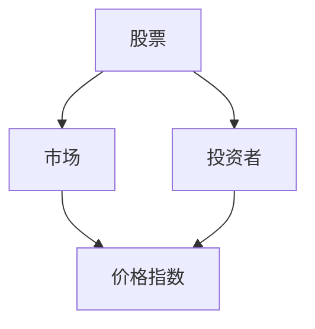
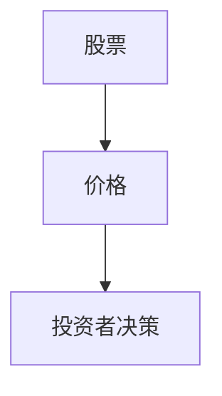
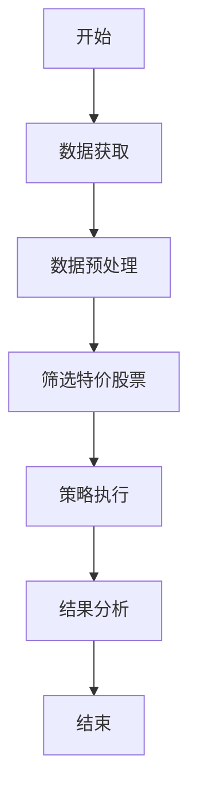
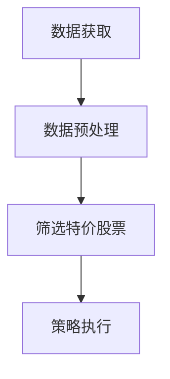
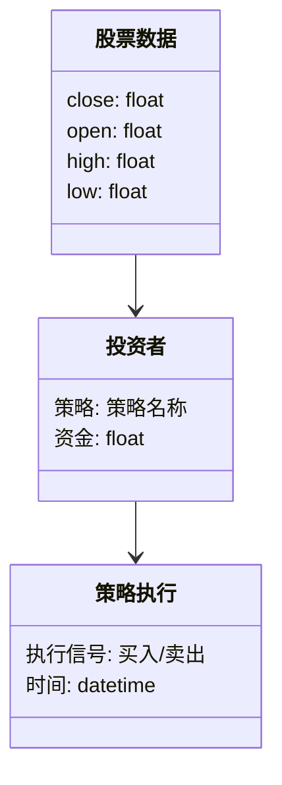
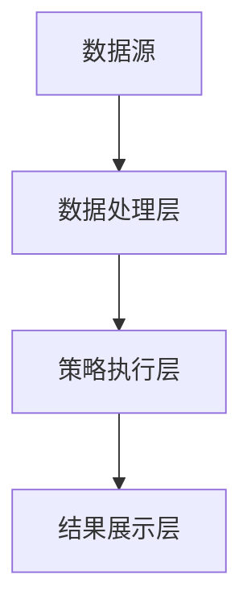

                 


# 如何利用特价股票策略进行系统性数字创新机会捕捉

> 关键词：特价股票策略，数字创新机会，系统性分析，算法设计，量化投资

> 摘要：本文详细探讨了如何利用特价股票策略进行系统性数字创新机会捕捉。通过分析特价股票策略的核心概念、算法原理、系统架构以及项目实战，结合数学模型、Mermaid图和Python代码示例，帮助读者全面理解并掌握如何在股票投资中捕捉数字创新机会。

---

## 第一部分: 特价股票策略的背景与核心概念

### 第1章: 特价股票策略的定义与优势

#### 1.1 特价股票策略的定义

##### 1.1.1 特价股票的定义与特征

特价股票是指在特定时间段内价格低于市场平均水平的股票。其主要特征包括：

- **低估值**：股票价格相对于其内在价值被低估。
- **高波动性**：价格波动较大，存在短期套利机会。
- **周期性**：通常在市场低迷或特定行业不景气时出现。

##### 1.1.2 特价股票策略的核心优势

- **高收益潜力**：通过捕捉低价股票的反弹或上涨机会，实现超额收益。
- **低门槛**：适合中小投资者，无需大量资金即可参与。
- **灵活性**：可以根据市场变化快速调整策略。

##### 1.1.3 特价股票策略的适用场景与边界

- **适用场景**：市场低迷、行业周期性低谷、突发事件导致股价短期下跌。
- **边界**：避免投资于基本面恶化、管理层问题或流动性不足的股票。

#### 1.2 特价股票策略与传统投资策略的对比

##### 1.2.1 传统股票投资策略的局限性

- **信息不对称**：普通投资者难以获取内幕信息。
- **情绪化决策**：容易受到市场情绪影响，导致非理性投资。
- **高门槛**：需要大量资金和专业知识。

##### 1.2.2 特价股票策略的独特性与创新性

- **独特性**：通过量化分析和系统性筛选，精准捕捉低价股票机会。
- **创新性**：结合数学模型和算法，实现自动化、智能化的投资决策。

##### 1.2.3 特价股票策略与其他量化策略的差异

- **差异性**：其他量化策略如均值回归、动量策略等，而特价股票策略更注重价格的绝对值。

---

### 第2章: 特价股票策略的核心概念与联系

#### 2.1 特价股票策略的数学模型与公式

##### 2.1.1 特价股票策略的数学表达式

特价股票策略的核心公式为：

$$ \text{买入价} = \text{当前股价} \times (1 - \text{折扣率}) $$

其中，折扣率反映了股票价格的低估程度。

##### 2.1.2 相关数学公式的详细推导

假设市场平均价格为 $P_{\text{avg}}$，某股票价格为 $P$，则折扣率定义为：

$$ \text{折扣率} = \frac{P}{P_{\text{avg}}} $$

当折扣率低于一定阈值时，股票被视为特价股票。

##### 2.1.3 公式应用的示例与解释

假设市场平均价格为 $100，某股票价格为 $80，则折扣率为 $80/100=0.8$，即8折。如果阈值为0.85，则该股票被视为特价股票。

#### 2.2 特价股票策略的ER实体关系图

##### 2.2.1 实体关系图的构建与分析

以下是特价股票策略的实体关系图：



##### 2.2.2 实体关系图的 Mermaid 流程图展示



---

## 第二部分: 特价股票策略的算法原理

### 第3章: 特价股票策略的算法实现

#### 3.1 特价股票策略的算法流程

##### 3.1.1 算法的整体流程图



##### 3.1.2 算法的详细步骤说明

1. **数据获取**：收集目标股票的历史价格数据。
2. **数据预处理**：清洗数据，处理缺失值和异常值。
3. **筛选特价股票**：根据折扣率公式筛选出符合条件的股票。
4. **策略执行**：根据筛选结果生成买入或卖出信号。
5. **结果分析**：评估策略的收益和风险。

##### 3.1.3 算法的 Mermaid 流程图展示



#### 3.2 特价股票策略的Python实现

##### 3.2.1 环境安装与配置

```bash
pip install pandas numpy matplotlib
```

##### 3.2.2 核心算法代码实现

```python
import pandas as pd
import numpy as np

# 假设df为股票数据，包含'close'列
def is_discount_stock(df, threshold=0.85):
    market_avg = df['close'].mean()
    discount_stocks = df[df['close'] < threshold * market_avg]
    return discount_stocks

# 示例数据
data = {'close': [100, 90, 80, 110, 120]}
df = pd.DataFrame(data)
result = is_discount_stock(df)
print(result)
```

##### 3.2.3 代码的功能解读与优化建议

- **功能解读**：上述代码通过计算市场平均价格，筛选出价格低于阈值的股票。
- **优化建议**：可以加入更多的筛选条件，如市盈率、市净率等。

---

## 第三部分: 特价股票策略的系统架构与设计

### 第4章: 特价股票策略的系统分析

#### 4.1 系统功能设计

##### 4.1.1 领域模型的 Mermaid 类图展示



#### 4.2 系统架构设计

##### 4.2.1 系统架构图



---

## 第四部分: 项目实战

### 第5章: 特价股票策略的项目实战

#### 5.1 环境安装与代码实现

##### 5.1.1 环境安装

```bash
pip install pandas numpy matplotlib
```

##### 5.1.2 核心代码实现

```python
import pandas as pd
import numpy as np

def calculate_discount_stocks(data, threshold=0.85):
    market_avg = np.mean(data['close'])
    discount_stocks = data[data['close'] < threshold * market_avg]
    return discount_stocks

# 示例数据
data = {'close': [100, 90, 80, 110, 120]}
df = pd.DataFrame(data)
result = calculate_discount_stocks(df)
print(result)
```

#### 5.2 案例分析与代码解读

##### 5.2.1 案例分析

假设市场平均价格为 $100，阈值为 $85，则 $80 的股票被视为特价股票。

##### 5.2.2 代码解读

- **数据获取**：从数据源获取股票价格数据。
- **数据预处理**：计算市场平均价格。
- **筛选特价股票**：根据折扣率公式筛选出符合条件的股票。
- **结果展示**：输出筛选结果。

---

## 第五部分: 最佳实践与小结

### 第6章: 特价股票策略的最佳实践

#### 6.1 小结

- 特价股票策略通过量化分析和系统性筛选，帮助投资者捕捉低价股票的反弹机会。
- 结合数学模型和算法，实现自动化、智能化的投资决策。

#### 6.2 注意事项

- **风险控制**：避免过度杠杆和集中投资。
- **模型优化**：定期更新模型，适应市场变化。
- **情绪管理**：避免情绪化决策，坚持系统性投资。

#### 6.3 拓展阅读

- 推荐阅读《算法交易：pra

