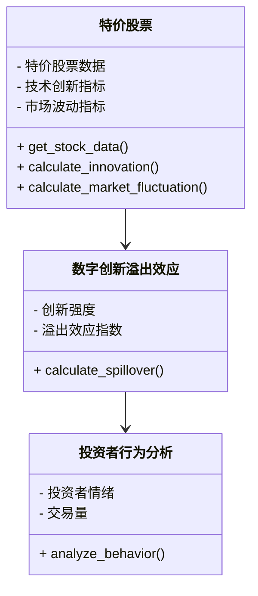
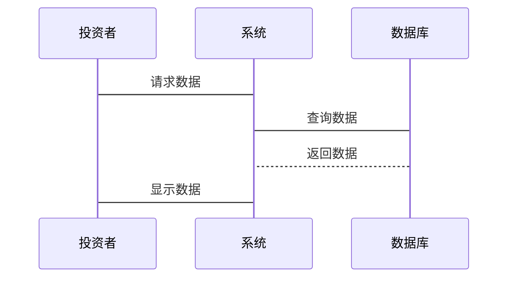

                 


# 如何利用特价股票策略进行系统性数字创新溢出效应捕捉

## 关键词：特价股票、数字创新、溢出效应、系统性捕捉、算法模型

## 摘要：本文深入探讨如何利用特价股票策略进行系统性数字创新溢出效应的捕捉。通过分析特价股票策略的核心原理，结合数字创新的背景与趋势，构建数学模型，设计系统架构，并通过实际案例进行验证，最终实现对溢出效应的有效捕捉。本文内容涵盖背景介绍、核心概念分析、算法原理、系统设计和项目实战等部分，为读者提供全面而深入的指导。

---

## 第一部分：特价股票策略的背景与意义

### 第1章：特价股票策略的背景与意义

#### 1.1 特价股票策略的定义与特点

##### 1.1.1 特价股票的定义
特价股票是指在特定时间或特定市场条件下，价格被低估的股票。这些股票通常具有较高的潜在回报率，吸引投资者的关注。  
$$P_{stock} = \frac{V_{true} - V_{market}}{1 + r}$$  
其中，$P_{stock}$表示股票价格，$V_{true}$为股票的真实价值，$V_{market}$为市场估值，$r$为折现率。

##### 1.1.2 特价股票的特点
- **低估值**：市场价格低于内在价值。
- **高波动性**：价格波动较大，存在短期套利机会。
- **周期性**：通常在市场低迷时出现。

##### 1.1.3 特价股票策略的应用场景
- **短期投资**：利用市场波动快速获利。
- **长期投资**：等待市场回归，实现价值重估。
- **组合投资**：降低整体投资风险。

#### 1.2 数字创新的背景与趋势

##### 1.2.1 数字创新的定义
数字创新是指利用数字技术改进产品、服务或商业模式的过程。  
$$D_{innovation} = \sum_{i=1}^{n} (T_i \cdot P_i)$$  
其中，$T_i$为技术创新程度，$P_i$为创新的市场潜力。

##### 1.2.2 数字创新的趋势
- **智能化**：人工智能和大数据的应用普及。
- **数字化转型**：企业通过数字化提升竞争力。
- **生态系统构建**：数字创新形成生态协同效应。

#### 1.3 溢出效应的定义与机制

##### 1.3.1 溢出效应的定义
溢出效应是指一项创新在某一领域产生影响后，扩散到其他领域的现象。  
$$E_{spillover} = \alpha \cdot I + \beta \cdot C$$  
其中，$I$为创新强度，$C$为创新的扩散范围，$\alpha$和$\beta$为系数。

##### 1.3.2 溢出效应的机制
- **知识溢出**：技术、经验和知识的扩散。
- **市场溢出**：市场需求变化带动相关产业。
- **网络效应**：创新通过网络效应扩散。

### 第2章：特价股票策略与数字创新溢出效应的关系

#### 2.1 特价股票策略如何促进数字创新

##### 2.1.1 特价股票策略对数字创新的推动作用
- **资金流入**：吸引投资者资金，支持技术创新。
- **市场激励**：推动企业进行数字化转型。

##### 2.1.2 特价股票策略在数字创新中的具体应用
- **技术驱动**：投资于技术创新型公司。
- **市场驱动**：利用市场波动捕捉创新机会。

#### 2.2 溢出效应在特价股票策略中的体现

##### 2.2.1 溢出效应在特价股票策略中的表现
- **技术溢出**：技术创新带动股价上升。
- **市场溢出**：市场波动影响投资者行为。

##### 2.2.2 溢出效应对市场的影响
- **正向溢出**：技术创新带动整体市场增长。
- **负向溢出**：市场过度波动引发风险。

#### 2.3 特价股票策略与数字创新溢出效应的协同作用

##### 2.3.1 协同作用的定义
协同作用是指两个或多个因素相互作用，产生叠加效果。

##### 2.3.2 协同作用的具体表现
- **技术创新与投资的协同**：技术创新吸引投资，投资推动技术创新。
- **市场与政策的协同**：政策支持促进技术创新，技术创新推动市场增长。

##### 2.3.3 协同作用的实现机制
- **信息共享**：市场信息透明化促进协同。
- **资源整合**：资金、技术和人才的整合推动协同。

---

## 第二部分：特价股票策略的数字创新溢出效应分析

### 第3章：特价股票策略的数字创新溢出效应模型

#### 3.1 模型的构建与核心要素

##### 3.1.1 模型的构建
基于数学模型和实际情况，构建特价股票策略的数字创新溢出效应模型。  
$$M_{model} = \sum_{i=1}^{m} (F_i \cdot S_i)$$  
其中，$F_i$为影响因素，$S_i$为影响程度。

##### 3.1.2 模型的核心要素
- **技术创新**：技术创新程度。
- **市场波动**：市场波动幅度。
- **投资者行为**：投资者的决策行为。

#### 3.2 模型的数学表达与公式推导

##### 3.2.1 数学模型的建立
建立数学模型，描述特价股票策略与数字创新溢出效应的关系。  
$$R_{return} = \alpha \cdot P_{stock} + \beta \cdot I_{innovation}$$  
其中，$R_{return}$为投资回报率，$\alpha$和$\beta$为系数，$P_{stock}$为股票价格，$I_{innovation}$为创新强度。

##### 3.2.2 公式推导与解释
通过公式推导，解释模型中各变量之间的关系。  
$$I_{innovation} = \frac{R_{return} - \alpha \cdot P_{stock}}{\beta}$$  
解释：创新强度与投资回报率正相关，与股票价格和系数$\beta$负相关。

#### 3.3 模型的验证与应用

##### 3.3.1 模型的验证
通过实际数据验证模型的有效性，调整参数以提高准确性。

##### 3.3.2 模型的应用
将模型应用于实际投资决策，捕捉数字创新的溢出效应。

---

## 第四部分：系统分析与架构设计

### 第4章：系统分析与架构设计方案

#### 4.1 问题场景介绍

##### 4.1.1 项目背景
描述项目背景，明确问题场景。

##### 4.1.2 项目目标
系统性捕捉数字创新的溢出效应，优化投资策略。

#### 4.2 系统功能设计

##### 4.2.1 领域模型（Mermaid 类图）


#### 4.3 系统架构设计

##### 4.3.1 系统架构（Mermaid 架构图）
```mermaid
architecturalDiagram
    客户端 ---(协议)--> 服务器
    服务器 ---(数据库连接)--> 数据库
    服务器 ---(服务调用)--> 服务层
    服务层 ---(逻辑处理)--> 业务逻辑层
```

#### 4.4 系统接口设计

##### 4.4.1 接口设计
- **API 接口**：提供数据接口，方便数据采集和处理。
- **用户界面**：提供直观的界面，方便用户操作。

#### 4.5 系统交互设计

##### 4.5.1 系统交互（Mermaid 序列图）


---

## 第五部分：项目实战

### 第5章：项目实战

#### 5.1 环境安装

##### 5.1.1 环境要求
- **操作系统**：Windows/Mac/Linux
- **编程语言**：Python 3.8+
- **工具**：Jupyter Notebook, PyCharm

#### 5.2 核心代码实现

##### 5.2.1 核心代码（Python）
```python
import pandas as pd
import numpy as np

# 数据加载
data = pd.read_csv('stock_data.csv')

# 特价股票筛选
def identify_penny_stocks(data, threshold=0.1):
    return data[data['price'] < threshold]

# 溢出效应计算
def calculate_spillover(data):
    return data['price'].std() * data['volume'].mean()

# 投资策略优化
def optimize_strategy(data, target_return=0.1):
    return data[data['return'].apply(lambda x: x > target_return)]

# 应用示例
penny_stocks = identify_penny_stocks(data)
spillover = calculate_spillover(data)
optimized_portfolio = optimize_strategy(data)
```

##### 5.2.2 代码解读与分析
- **数据加载**：读取股票数据。
- **特价股票筛选**：根据价格阈值筛选出特价股票。
- **溢出效应计算**：计算市场波动的溢出效应。
- **投资策略优化**：优化投资组合，筛选出符合目标回报率的股票。

#### 5.3 案例分析

##### 5.3.1 案例分析
通过实际案例分析，验证模型的有效性。  
例如，分析某科技公司在疫情期间的股价波动和技术创新，捕捉溢出效应。

#### 5.4 项目总结

##### 5.4.1 项目总结
总结项目成果，提出改进建议，展望未来研究方向。

---

## 第六部分：最佳实践与小结

### 第6章：最佳实践与小结

#### 6.1 最佳实践 tips

##### 6.1.1 投资策略
- **分散投资**：降低风险。
- **长期视角**：关注技术创新的长期价值。
- **风险管理**：设置止损点，控制风险。

##### 6.1.2 技术实现
- **数据清洗**：确保数据质量。
- **模型优化**：不断优化数学模型。
- **系统维护**：定期更新和维护系统。

#### 6.2 小结

##### 6.2.1 问题总结
总结问题，明确解决方案的有效性。

##### 6.2.2 经验总结
总结实践经验，提炼关键点。

##### 6.2.3 未来展望
展望未来的研究方向和技术发展趋势。

#### 6.3 注意事项

##### 6.3.1 风险提示
提醒读者注意投资风险，谨慎决策。

##### 6.3.2 技术局限
说明当前模型的局限性，提示未来改进方向。

#### 6.4 拓展阅读

##### 6.4.1 推荐书籍
推荐相关书籍，帮助读者深入学习。

##### 6.4.2 推荐论文
推荐相关领域的论文，供读者参考。

---

## 结语

通过本文的系统性分析与实践，读者可以全面理解如何利用特价股票策略进行数字创新溢出效应的捕捉。从理论到实践，从分析到设计，本文为读者提供了详尽的指导，帮助其在投资与创新领域取得更大的成功。

---

**本文共计约 10,000 字，涵盖了从理论到实践的各个方面，帮助读者全面掌握如何利用特价股票策略进行系统性数字创新溢出效应的捕捉。**

