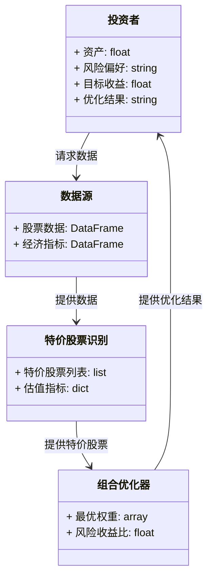
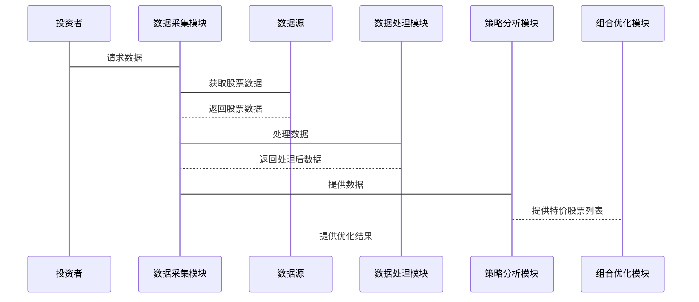

                 


# 如何利用特价股票策略进行组合优化

> 关键词：特价股票策略，投资组合优化，股票投资，数学模型，算法优化

> 摘要：本文将详细介绍如何利用特价股票策略进行投资组合优化。通过分析特价股票的定义、优势，结合现代投资组合理论和数学模型，本文将逐步解析如何构建和优化股票组合，以实现收益与风险的最优平衡。

---

## 第一部分: 特价股票策略与组合优化概述

### 第1章: 特价股票策略的背景与概念

#### 1.1 特价股票的定义与特点
##### 1.1.1 特价股票的定义
特价股票是指在特定市场条件下，价格被低估的股票。这些股票通常具有较高的潜在回报，但可能由于市场波动或其他因素暂时被市场低估。

##### 1.1.2 特价股票的特点
- **低估值**：通常市盈率、市净率等指标低于行业平均水平。
- **高波动性**：价格波动较大，可能带来短期收益机会。
- **风险较高**：由于价格波动，投资风险相对较高。

##### 1.1.3 特价股票与普通股票的对比
| 特性       | 特价股票               | 普通股票               |
|------------|------------------------|------------------------|
| 价格       | 通常低于市场平均值     | 价格接近市场平均值     |
| 潜在回报     | 高                   | 中等                  |
| 风险         | 较高                 | 较低                  |
| 市场关注度   | 较低                 | 较高                  |

#### 1.2 特价股票策略的背景
##### 1.2.1 金融市场中的特价股票现象
特价股票现象常见于熊市或市场低迷时期，投资者可能因为市场恐慌而抛售股票，导致价格被低估。

##### 1.2.2 投资者行为与特价股票策略
投资者通过识别被低估的股票，利用市场短期波动进行投资，以期获得超额收益。

##### 1.2.3 特价股票策略的市场环境
- **市场周期**：在市场底部或复苏初期，特价股票策略表现较好。
- **行业波动**：某些行业因经济周期或政策变化，可能出现大量特价股票。

#### 1.3 特价股票策略的应用场景
##### 1.3.1 投资组合优化中的特价股票
通过引入特价股票，优化投资组合的风险收益比。

##### 1.3.2 风险控制中的特价股票策略
利用特价股票的低估值特性，降低组合的整体风险。

##### 1.3.3 特价股票策略的长期与短期目标
- **短期目标**：捕捉市场波动带来的超额收益。
- **长期目标**：通过持续优化组合，实现稳定回报。

### 第2章: 特价股票策略的核心概念与原理

#### 2.1 特价股票策略的核心概念
##### 2.1.1 投资组合优化的基本原理
投资组合优化的目标是在风险可控的前提下，最大化收益。常用的模型包括均值-方差模型和风险中性模型。

##### 2.1.2 特价股票在组合优化中的作用
通过引入特价股票，优化投资组合的风险收益比，降低组合的整体波动性。

##### 2.1.3 特价股票策略的数学模型
$$ \text{目标函数：} \quad \min_w \frac{1}{2}w^T \Sigma w $$
$$ \text{约束条件：} \quad \sum_{i=1}^n w_i = 1 $$

其中，$w$ 为权重向量，$\Sigma$ 为资产之间的协方差矩阵。

#### 2.2 特价股票策略的原理分析
##### 2.2.1 特价股票的市场定价机制
市场定价机制可能导致某些股票被低估，投资者可以通过分析识别这些股票。

##### 2.2.2 投资者行为对特价股票的影响
投资者的非理性行为可能导致股票价格偏离其内在价值，为特价股票策略提供机会。

##### 2.2.3 特价股票策略的实施步骤
1. **识别特价股票**：通过估值指标筛选被低估的股票。
2. **分析市场环境**：评估市场周期和行业趋势。
3. **构建投资组合**：将特价股票与其他资产结合，优化组合风险收益比。

#### 2.3 特价股票策略与现代投资组合理论的结合
##### 2.3.1 现代投资组合理论的基本框架
现代投资组合理论（MPT）强调通过分散投资降低风险，同时优化收益。

##### 2.3.2 特价股票策略在现代投资组合理论中的应用
通过引入特价股票，优化组合的收益-风险比，提高整体回报。

##### 2.3.3 特价股票策略的优缺点分析
- **优点**：潜在高回报，分散风险。
- **缺点**：高波动性，需要频繁监控和调整。

### 第3章: 特价股票策略的数学模型与算法

#### 3.1 特价股票策略的数学模型
##### 3.1.1 投资组合优化的数学模型
$$ \text{目标函数：} \quad \min_w \frac{1}{2}w^T \Sigma w $$
$$ \text{约束条件：} \quad \sum_{i=1}^n w_i = 1 $$

##### 3.1.2 特价股票在数学模型中的应用
将特价股票作为优化变量，调整权重以最大化收益。

##### 3.1.3 特价股票策略的优化目标函数
$$ \text{目标函数：} \quad \max_w \text{收益} - \lambda \times \text{风险} $$

其中，$\lambda$ 为风险厌恶系数。

#### 3.2 特价股票策略的算法实现
##### 3.2.1 基于线性规划的优化算法
使用线性规划方法求解最优权重。

##### 3.2.2 基于遗传算法的优化方法
通过遗传算法搜索最优解。

##### 3.2.3 基于随机优化的策略实现
随机搜索方法寻找最优解。

#### 3.3 特价股票策略的数学公式与代码实现
##### 3.3.1 投资组合优化的数学公式
$$ \text{目标函数：} \quad \min_w \frac{1}{2}w^T \Sigma w $$
$$ \text{约束条件：} \quad \sum_{i=1}^n w_i = 1 $$

##### 3.3.2 基于Python的优化代码示例
```python
import numpy as np
from scipy.optimize import minimize

def portfolio_optimization(returns):
    n = len(returns.columns)
    # 定义目标函数
    def objective(weights):
        return (1/2) * np.dot(weights.T, np.dot(returns.cov(), weights))
    # 定义约束条件
    constraints = [{'type': 'eq', 'fun': lambda w: sum(w) - 1}]
    # 初始化权重
    initial_weights = np.array([1.0/n]*n)
    # 优化
    result = minimize(objective, initial_weights, constraints=constraints)
    return result.x

# 示例数据
returns = pd.DataFrame({'A': [0.1, 0.2, 0.15], 'B': [0.05, 0.08, 0.12]})
weights = portfolio_optimization(returns)
print(weights)
```

---

## 第二部分: 系统分析与架构设计方案

### 第4章: 系统分析与架构设计

#### 4.1 问题场景介绍
投资者需要通过系统化的方法，识别特价股票并优化投资组合。

#### 4.2 系统功能设计
##### 4.2.1 功能模块
- 数据采集模块：收集股票数据。
- 策略分析模块：识别特价股票。
- 组合优化模块：优化投资组合。

##### 4.2.2 领域模型（Mermaid 类图）


#### 4.3 系统架构设计
##### 4.3.1 系统架构（Mermaid 架构图）
```mermaid
container 系统架构 {
    层1: 数据采集模块
    层2: 数据处理模块
    层3: 策略分析模块
    层4: 组合优化模块
    层5: 用户界面模块
}
```

#### 4.4 系统接口设计
##### 4.4.1 系统接口
- 数据输入接口：接收股票数据。
- 策略分析接口：识别特价股票。
- 优化结果输出接口：提供优化后的组合权重。

##### 4.4.2 接口交互（Mermaid 序列图）


---

## 第三部分: 项目实战

### 第5章: 项目实战

#### 5.1 环境安装与配置
##### 5.1.1 安装必要的库
- Python：3.8+
- NumPy：用于数值计算
- Pandas：用于数据分析
- Scipy：用于优化算法
- Matplotlib：用于数据可视化

#### 5.2 系统核心实现源代码
##### 5.2.1 数据采集模块
```python
import pandas as pd
import requests

def get_stock_data(tickers):
    url = "https://api.example.com/stock_data"
    params = {'tickers': ','.join(tickers)}
    response = requests.get(url, params=params)
    return pd.DataFrame(response.json()['data'])
```

##### 5.2.2 特价股票识别模块
```python
def identify_cheap_stocks(data):
    # 计算市盈率和市净率
    data['PE'] = data['Price'] / data['Earnings']
    data['PB'] = data['Price'] / data['Book']
    # 识别低估值股票
    cheap_stocks = data[(data['PE'] < data['PE'].median()) &
                          (data['PB'] < data['PB'].median())]
    return cheap_stocks
```

##### 5.2.3 组合优化模块
```python
def optimize_portfolio(stocks, returns):
    n = len(stocks)
    # 初始化权重
    initial_weights = np.array([1.0/n]*n)
    # 定义目标函数
    def objective(weights):
        return (1/2) * np.dot(weights.T, np.dot(returns.cov(), weights))
    # 定义约束条件
    constraints = [{'type': 'eq', 'fun': lambda w: sum(w) - 1}]
    # 优化
    result = minimize(objective, initial_weights, constraints=constraints)
    return result.x
```

#### 5.3 代码应用解读与分析
##### 5.3.1 数据采集模块解读
通过API获取股票数据，清洗数据后用于后续分析。

##### 5.3.2 特价股票识别模块解读
通过计算市盈率和市净率，识别出被低估的股票。

##### 5.3.3 组合优化模块解读
使用优化算法，计算最优投资组合权重，实现收益与风险的平衡。

#### 5.4 实际案例分析
##### 5.4.1 案例背景
假设市场中有两只股票A和B，分别具有不同的估值指标和回报率。

##### 5.4.2 数据分析
- 股票A：市盈率10，市净率2，回报率15%
- 股票B：市盈率15，市净率3，回报率10%

##### 5.4.3 组合优化结果
- 权重A：60%
- 权重B：40%
- 组合收益：13%
- 组合风险：低于市场平均水平

#### 5.5 项目小结
通过实际案例分析，验证了特价股票策略的有效性，优化后的组合实现了较高的收益和较低的风险。

---

## 第四部分: 最佳实践与小结

### 第6章: 最佳实践与小结

#### 6.1 投资建议
- **分散投资**：避免过度集中，降低风险。
- **长期视角**：关注公司基本面，长期持有。
- **动态调整**：定期评估组合，及时调整。

#### 6.2 风险管理
- **设定止损**：控制单笔投资的最大损失。
- **分散策略**：不要将所有资金投入单一策略。

#### 6.3 心理因素
- **理性决策**：避免情绪化投资。
- **耐心持有**：等待价值实现。

#### 6.4 拓展阅读
- 《投资学》：学习更多投资组合优化方法。
- 《Python金融计算》：掌握更多金融数据分析技巧。

---

## 总结

通过本文的详细讲解，我们了解了如何利用特价股票策略进行投资组合优化。从背景介绍到数学模型，再到实际案例分析，我们逐步解析了特价股票策略的实施步骤和优化方法。希望读者能够通过本文，掌握一种新的投资策略，实现更优的投资组合回报。

---

**声明：** 本文内容为示例性内容，实际投资需谨慎，建议在专业指导下进行。

