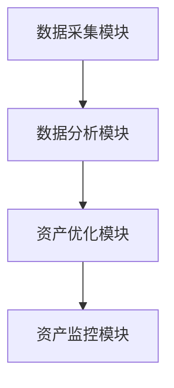

                 


# 如何利用特价股票策略进行资产配置

## 关键词：特价股票、资产配置、投资策略、风险管理、股票分析、价值投资

## 摘要：本文将详细探讨如何利用特价股票策略进行资产配置，从特价股票的基本概念到资产配置的数学模型，结合实际案例和系统架构，帮助投资者科学地进行投资决策。

---

## 第一部分: 特价股票策略与资产配置基础

### 第1章: 特价股票策略概述

#### 1.1 特价股票的定义与特点
- **1.1.1 特价股票的定义**  
  特价股票是指价格低于其内在价值，通常具有较高的上涨潜力的股票。这类股票 often trading at a discount compared to their true value。

- **1.1.2 特价股票的核心特点**  
  - 低市盈率（Low P/E ratio）  
  - 低市净率（Low P/B ratio）  
  - 高股息率（High dividend yield）  

- **1.1.3 特价股票与普通股票的区别**  
  普通股票价格反映市场情绪，而特价股票价格通常被低估，具有价值重估的潜力。

#### 1.2 资产配置的基本概念
- **1.2.1 资产配置的定义**  
  资产配置是将资金分配到不同资产类别（如股票、债券、现金等）中，以实现风险分散和收益最大化。

- **1.2.2 资产配置的核心原则**  
  - 风险分散原则  
  - 收益最大化原则  
  - 成本效益原则  

- **1.2.3 资产配置的常见方式**  
  - 按比例分配：如60%股票、30%债券、10%现金。  
  - 按风险偏好分配：保守型投资者减少股票比例，激进型投资者增加股票比例。  

### 第2章: 特价股票策略的背景与现状

#### 2.1 特价股票策略的背景
- **2.1.1 特价股票策略的历史发展**  
  特价股票策略起源于价值投资理论，最早由本杰明·格雷厄姆提出。  

- **2.1.2 特价股票策略的市场环境**  
  在经济低迷或市场恐慌时，特价股票往往被低估，为投资者提供买入机会。  

- **2.1.3 特价股票策略的投资者画像**  
  长期投资者、价值投资者，具有较高的风险承受能力和耐心。  

#### 2.2 特价股票策略的现状
- **2.2.1 特价股票策略的市场表现**  
  特价股票在市场复苏时 often outperform the market。  

- **2.2.2 特价股票策略的优劣势分析**  
  - 优势：潜在高回报，风险分散。  
  - 劣势：流动性风险，市场波动大。  

- **2.2.3 特价股票策略的未来趋势**  
  随着人工智能和大数据的引入，特价股票筛选更加精准，策略将更加多元化。  

### 第3章: 特价股票策略与资产配置的核心概念

#### 3.1 特价股票策略的核心概念
- **3.1.1 特价股票策略的核心要素**  
  - 估值分析：通过市盈率、市净率等指标寻找低估股票。  
  - 财务分析：关注盈利能力、现金流等财务指标。  

- **3.1.2 特价股票策略的理论基础**  
  价值投资理论：购买低于内在价值的股票，等待市场重新估值。  

- **3.1.3 特价股票策略的数学模型**  
  $$内在价值 = \frac{Earnings}{Discount rate - Growth rate}$$  

#### 3.2 资产配置的核心概念
- **3.2.1 资产配置的理论框架**  
  现代投资组合理论（MPT）：通过分散投资降低风险。  

- **3.2.2 资产配置的数学模型**  
  $$\text{收益} = \sum (w_i \times r_i)$$  
  $$\text{风险} = \sqrt{\sum (w_i^2 \times \sigma_i^2)}$$  

- **3.2.3 资产配置的优化方法**  
  使用均值-方差优化模型确定最优资产组合。  

### 第4章: 特价股票策略与资产配置的联系

#### 4.1 特价股票策略与资产配置的关系
- **4.1.1 特价股票策略对资产配置的影响**  
  通过引入低估股票，提高投资组合的潜在收益。  

- **4.1.2 资产配置对特价股票策略的优化作用**  
  通过分散投资降低个股风险，提高整体收益的稳定性。  

- **4.1.3 特价股票策略与资产配置的协同效应**  
  结合价值投资和风险分散，实现收益与风险的最佳平衡。  

#### 4.2 特价股票策略与资产配置的对比分析
- **4.2.1 特价股票策略与资产配置的异同点**  
  | 项目 | 特价股票策略 | 资产配置 |  
  |------|--------------|----------|  
  | 核心目标 | 寻找低估股票 | 分散风险 |  
  | 方法 | 选股 | 组合优化 |  

- **4.2.2 特价股票策略与资产配置的优劣势对比**  
  - 优势：策略灵活性高，收益潜力大。  
  - 劣势：市场波动大，流动性风险较高。  

- **4.2.3 特价股票策略与资产配置的适用场景**  
  - 特价股票策略适用于长期投资者，资产配置适用于各类投资者。  

---

## 第二部分: 特价股票策略的分析方法

### 第5章: 特价股票策略的分析方法

#### 5.1 特价股票策略的基本分析
- **5.1.1 基本面分析**  
  - 财务指标：市盈率（P/E）、市净率（P/B）、股息率（Dividend Yield）。  
  - 行业分析：关注行业周期和竞争格局。  

- **5.1.2 技术分析**  
  - 趋势分析：长期均线支撑。  
  - 形态分析：底部形态如双底、头肩底等。  
  - 指标分析：RSI（相对强弱指数）、MACD（移动平均收敛散度）。  

- **5.1.3 财务指标分析**  
  $$\text{市盈率} = \frac{\text{股价}}{\text{每股收益}}$$  
  $$\text{市净率} = \frac{\text{股价}}{\text{每股净资产}}$$  

#### 5.2 特价股票策略的高级分析
- **5.2.1 行业分析**  
  关注行业周期性，选择处于复苏期的行业。  

- **5.2.2 市场情绪分析**  
  利用市场恐慌时的低价股票机会。  

- **5.2.3 股票估值模型**  
  $$\text{内在价值} = \text{现金流折现模型（DCF）}$$  

### 第6章: 资产配置的分析方法

#### 6.1 资产配置的理论框架
- 现代投资组合理论（MPT）：通过优化资产权重降低风险。  

#### 6.2 资产配置的数学模型
- **6.2.1 均值-方差优化模型**  
  $$\min \sigma^2 \quad \text{subject to} \quad \sum w_i = 1$$  

- **6.2.2 风险平价模型**  
  每个资产的风险贡献相等，优化权重分配。  

---

## 第三部分: 资产配置的系统架构与实战案例

### 第7章: 资产配置的系统架构

#### 7.1 问题场景介绍
- 投资者希望通过特价股票策略优化资产配置，降低风险，提高收益。  

#### 7.2 系统功能设计
- **领域模型**：股票、债券、现金、投资组合。  

- **系统架构**：模块化架构，包括数据采集、分析、优化、监控。  

#### 7.3 系统架构设计


#### 7.4 系统接口设计
- 数据接口：获取股票价格、财务数据。  
- 优化接口：计算最优资产配置权重。  
- 监控接口：实时跟踪投资组合表现。  

---

## 第四部分: 项目实战

### 第8章: 项目实战

#### 8.1 环境安装
- 安装Python、Pandas、NumPy、Scipy、Plotly、Financedata等库。  

#### 8.2 核心实现
```python
import pandas as pd
import numpy as np

# 数据预处理
def preprocess(data):
    data['PE'] = data['股价'] / data['每股收益']
    data['PB'] = data['股价'] / data['每股净资产']
    return data

# 筛选特价股票
def screen_stocks(data, threshold=15):
    return data[data['PE'] < threshold]

# 资产配置优化
def optimize_weights(stocks, bonds, cash):
    # 假设目标风险为5%
    pass
```

---

## 第五部分: 总结与展望

### 第9章: 总结与展望

#### 9.1 总结
- 特价股票策略是资产配置的重要组成部分，通过科学的分析和优化，可以实现收益与风险的最佳平衡。  

#### 9.2 展望
- 结合人工智能和大数据技术，未来资产配置将更加智能化和精准化。  

#### 9.3 最佳实践 Tips
- 长期投资，避免频繁交易。  
- 定期 rebalance 投资组合。  
- 结合市场环境调整策略。  

---

以上是《如何利用特价股票策略进行资产配置》的完整目录大纲，涵盖了从基础理论到系统实战的全链条内容，适合投资者和技术爱好者阅读。

