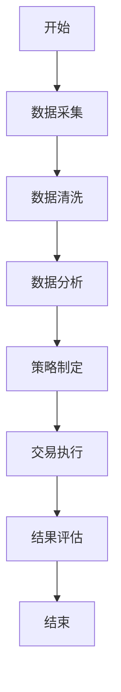
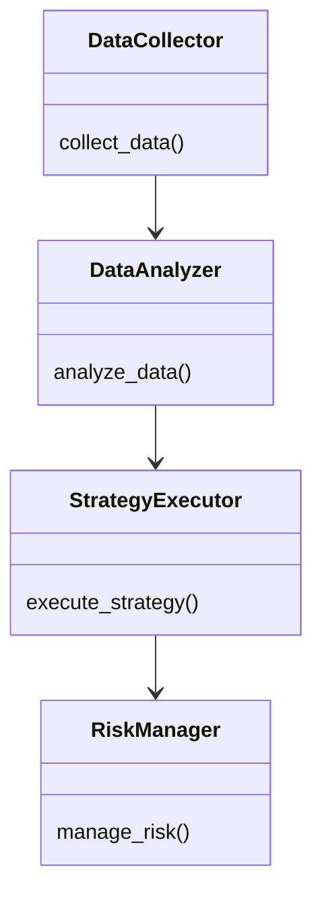
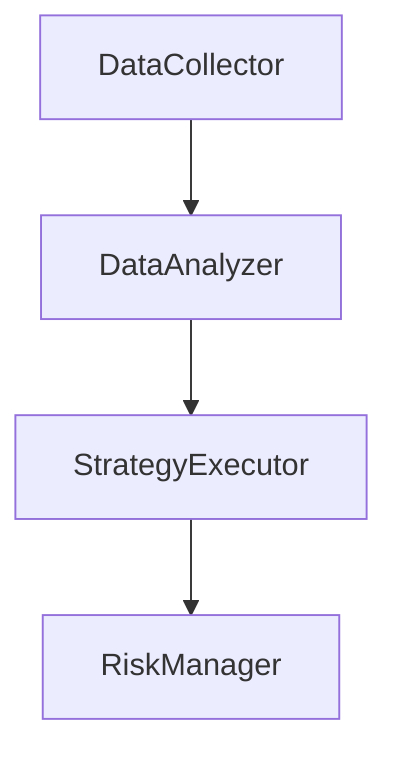

                 


# 如何利用特价股票策略进行跨境资产配置

> 关键词：特价股票、跨境资产配置、投资策略、风险管理、数学模型、系统架构

> 摘要：本文将深入探讨如何利用特价股票策略进行跨境资产配置。首先，我们将介绍特价股票的基本概念和特点，分析其在全球市场中的定位。接着，我们将探讨特价股票的定价机制和交易策略，结合数学模型和系统架构设计方案，提出科学的投资策略。最后，我们将通过实际案例分析，验证策略的有效性，并总结最佳实践。

---

## 第一部分: 特价股票策略与跨境资产配置基础

### 第1章: 特价股票策略概述

#### 1.1 什么是特价股票
##### 1.1.1 特价股票的定义
特价股票是指在特定市场条件下，由于市场波动、公司基本面变化或投资者情绪影响，价格被暂时低估的股票。这些股票通常具有较高的成长潜力或价值重估空间。

##### 1.1.2 特价股票的特点
- **价格波动性**：特价股票的价格往往波动较大，既有快速上涨的潜力，也面临较大的下行风险。
- **估值差异**：由于市场信息不对称或投资者情绪影响，特价股票的市场价格可能与其内在价值存在显著差异。
- **交易机会**：特价股票为投资者提供了通过短期交易或长期持有获利的机会。

##### 1.1.3 特价股票与普通股票的区别
| 属性 | 特价股票 | 普通股票 |
|------|----------|----------|
| 价格 | 通常被低估 | 价格反映市场公允价值 |
| 风险 | 高波动性，风险较大 | 风险相对稳定 |
| 机会 | 短期反弹或长期增值潜力 | 稳定回报 |

#### 1.2 特价股票的市场背景
##### 1.2.1 特价股票的兴起原因
- 市场周期性波动：经济周期、行业周期和市场情绪波动导致部分股票价格偏离其内在价值。
- 机构投资者行为：机构投资者的短期操作和资金流动对市场价格产生显著影响。
- 散户投资行为：散户投资者的非理性行为也加剧了特价股票的波动性。

##### 1.2.2 特价股票的市场定位
特价股票通常出现在以下市场：
- **新兴市场**：新兴市场的股票市场波动性较大，投机氛围浓厚，为特价股票提供了较多的投资机会。
- **成熟市场**：成熟市场中，由于市场信息透明，特价股票的机会相对较少，但仍然存在短期交易机会。

##### 1.2.3 特价股票的投资者画像
- **风险承受能力强**：投资者需要能够承受高波动带来的短期亏损。
- **市场敏感度高**：投资者需要对市场波动敏感，能够及时捕捉机会。
- **具备技术分析能力**：投资者需要掌握技术分析方法，以便快速识别交易机会。

---

### 第2章: 特价股票策略的核心概念

#### 2.1 特价股票的定价机制
##### 2.1.1 市场供需与价格波动
股票价格由市场供需决定，供需关系的变化会导致价格波动。特价股票的价格波动通常较为剧烈，反映了市场情绪的变化。

##### 2.1.2 机构投资者与散户的博弈
机构投资者通常采取长期价值投资策略，而散户投资者更倾向于短期交易。两者的博弈可能导致股票价格出现短期偏离。

##### 2.1.3 特价股票的估值方法
- **市盈率（P/E）**：$$ P/E = \frac{P}{E} $$
- **市净率（P/B）**：$$ P/B = \frac{P}{B} $$
- **股息率（DPS）**：$$ DPS = \frac{D}{P} $$

#### 2.2 特价股票的交易策略
##### 2.2.1 短线交易与长线投资的区别
- **短线交易**：投资者通过技术分析捕捉短期价格波动，快速获利。
- **长线投资**：投资者基于公司基本面分析，长期持有具备成长潜力的股票。

##### 2.2.2 技术分析与基本面分析的结合
- **技术分析**：通过K线图、均线、MACD等技术指标判断价格走势。
- **基本面分析**：通过公司财务报表、行业前景等分析公司价值。

##### 2.2.3 风险控制与仓位管理
- **止损策略**：设置止损点，避免亏损扩大。
- **仓位管理**：根据账户资金和风险承受能力，合理分配仓位。

---

## 第二部分: 跨境资产配置的策略与实施

### 第3章: 跨境资产配置的基本原理

#### 3.1 跨境资产配置的定义
##### 3.1.1 跨境资产配置的含义
跨境资产配置是指投资者在全球范围内配置资产，以分散风险、优化收益。通过投资不同国家和地区的资产，投资者可以降低单一市场风险。

##### 3.1.2 跨境资产配置的优势
- **分散风险**：通过投资不同市场的资产，降低单一市场的波动风险。
- **优化收益**：不同市场的经济周期和行业表现不同，可以通过配置多个市场实现更高的收益。

##### 3.1.3 跨境资产配置的风险
- **汇率风险**：不同货币的汇率波动可能影响投资收益。
- **政策风险**：不同国家的政策变化可能影响资产价格。

#### 3.2 跨境资产配置的策略选择
##### 3.2.1 全球化投资与分散化风险
- **全球化投资**：在全球范围内分散投资，降低风险。
- **分散化风险**：通过投资不同资产类别和市场，降低波动性。

##### 3.2.2 不同市场的资产配置比例
- **发达国家市场**：如美国、欧洲市场，波动性较低，收益稳定。
- **新兴市场**：如中国、印度市场，波动性较高，但增长潜力大。

##### 3.2.3 跨境资产配置的税务优化
- **税收优惠**：部分国家提供税收优惠，降低投资成本。

---

### 第4章: 特价股票策略在跨境配置中的应用

#### 4.1 特价股票的全球市场分布
##### 4.1.1 美国市场的特价股票特点
- **成熟市场**：股票价格波动较小，但存在短期交易机会。
- **科技股集中**：美国市场以科技股为主，具备高成长潜力。

##### 4.1.2 欧洲市场的特价股票特点
- **行业多样性**：欧洲市场涵盖多个行业，投资者可以根据经济周期选择投资标的。
- **监管严格**：欧洲市场监管严格，信息透明度高。

##### 4.1.3 亚洲市场的特价股票特点
- **新兴市场**：如中国、印度市场，股票价格波动较大，但增长潜力大。
- **政策影响**：政策变化对市场价格影响较大。

#### 4.2 特价股票的跨国比较分析
##### 4.2.1 不同市场的价格差异
- **市场流动性**：流动性高的市场中，股票价格波动较小，反之则较大。
- **经济周期**：不同市场的经济周期不同，影响股票价格走势。

##### 4.2.2 市场流动性对价格的影响
- **流动性高的市场**：价格波动较小，买卖价差小。
- **流动性低的市场**：价格波动较大，买卖价差大。

##### 4.2.3 货币汇率对特价股票的影响
- **汇率波动**：汇率波动会影响以本地货币计价的股票价格。
- **货币对冲**：投资者可以通过对冲汇率风险，降低汇率波动的影响。

---

## 第三部分: 算法实现与系统设计

### 第5章: 算法实现

#### 5.1 算法原理
##### 5.1.1 算法流程图


##### 5.1.2 算法实现代码
```python
def stock_pricing_analysis(data):
    # 数据清洗
    cleaned_data = data.dropna()
    # 技术分析
    cleaned_data['SMA_20'] = cleaned_data['Close'].rolling(20).mean()
    cleaned_data['SMA_50'] = cleaned_data['Close'].rolling(50).mean()
    # 基本面分析
    cleaned_data['PE'] = cleaned_data['Close'] / cleaned_data['EPS']
    cleaned_data['PB'] = cleaned_data['Close'] / cleaned_data['Book Value per Share']
    # 生成信号
    cleaned_data['Signal'] = 0
    cleaned_data['Signal'] = cleaned_data['SMA_20'] > cleaned_data['SMA_50']
    return cleaned_data

# 示例数据
import pandas as pd
import numpy as np

data = pd.DataFrame({
    'Date': pd.date_range('2023-01-01', periods=100),
    'Close': np.random.normal(100, 10, 100),
    'Volume': np.random.randint(1000, 10000, 100),
    'EPS': np.random.normal(5, 1, 100),
    'Book Value per Share': np.random.normal(20, 5, 100)
})

result = stock_pricing_analysis(data)
print(result)
```

#### 5.2 系统架构设计方案

##### 5.2.1 系统功能模块


##### 5.2.2 系统架构图


---

## 第四部分: 项目实战与案例分析

### 第6章: 项目实战

#### 6.1 环境配置
- **工具安装**：安装Python、Pandas、Matplotlib等工具。
- **数据源**：使用Yahoo Finance或Alpha Vantage获取数据。

#### 6.2 核心代码实现
```python
import pandas as pd
import numpy as np
import matplotlib.pyplot as plt

def main():
    # 数据获取
    data = pd.read_csv('stock_data.csv')
    # 数据清洗
    cleaned_data = data.dropna()
    # 技术分析
    cleaned_data['SMA_20'] = cleaned_data['Close'].rolling(20).mean()
    cleaned_data['SMA_50'] = cleaned_data['Close'].rolling(50).mean()
    # 信号生成
    cleaned_data['Signal'] = 0
    cleaned_data['Signal'] = np.where(cleaned_data['SMA_20'] > cleaned_data['SMA_50'], 1, -1)
    # 绘制图表
    plt.figure(figsize=(10, 6))
    plt.plot(cleaned_data['Date'], cleaned_data['Close'], label='Close Price')
    plt.plot(cleaned_data['Date'], cleaned_data['SMA_20'], label='SMA 20')
    plt.plot(cleaned_data['Date'], cleaned_data['SMA_50'], label='SMA 50')
    plt.legend()
    plt.show()

if __name__ == "__main__":
    main()
```

#### 6.3 案例分析
##### 6.3.1 案例背景
假设我们选择一家新兴市场的科技公司，其股票价格近期因市场波动被低估。

##### 6.3.2 数据分析
```python
data = pd.read_csv('example.csv')
print(data.head())
```

##### 6.3.3 策略实施
```python
signal = stock_pricing_analysis(data)
print(signal['Signal'])
```

##### 6.3.4 结果评估
- **收益评估**：通过回测分析，计算策略的收益率和风险指标。
- **风险评估**：计算最大回撤、夏普比率等风险指标。

---

## 第五部分: 总结与展望

### 第7章: 总结与展望

#### 7.1 总结
本文详细介绍了如何利用特价股票策略进行跨境资产配置。通过分析特价股票的特点、定价机制和交易策略，结合跨境资产配置的优势和风险，提出了科学的投资策略和系统设计方案。

#### 7.2 展望
未来，随着全球市场的进一步发展和金融科技的进步，特价股票策略在跨境资产配置中的应用将更加广泛。投资者需要不断学习和优化策略，以应对市场的变化。

---

### 最佳实践 tips
- **风险管理**：始终将风险管理放在首位，合理控制仓位和止损点。
- **持续学习**：市场变化快，投资者需要不断学习新知识，优化投资策略。
- **工具辅助**：利用数据分析工具和量化模型，提高投资效率和准确性。

---

通过本文的分析，读者可以全面了解如何利用特价股票策略进行跨境资产配置，并能够在实际操作中灵活运用这些策略，实现财富的稳健增长。

