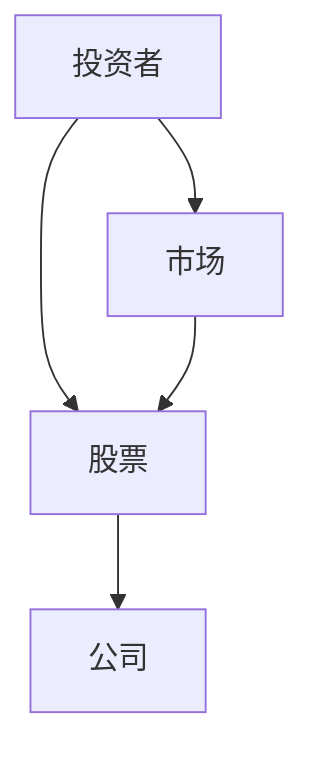
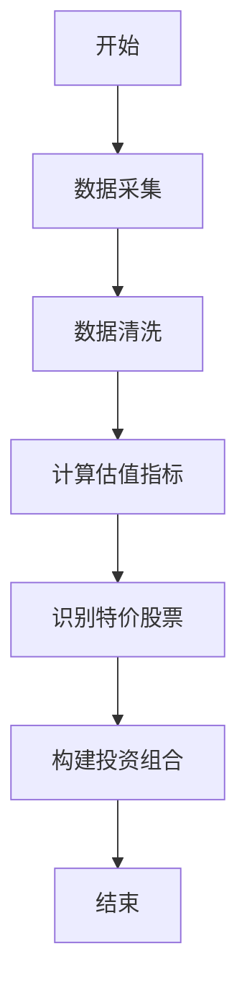
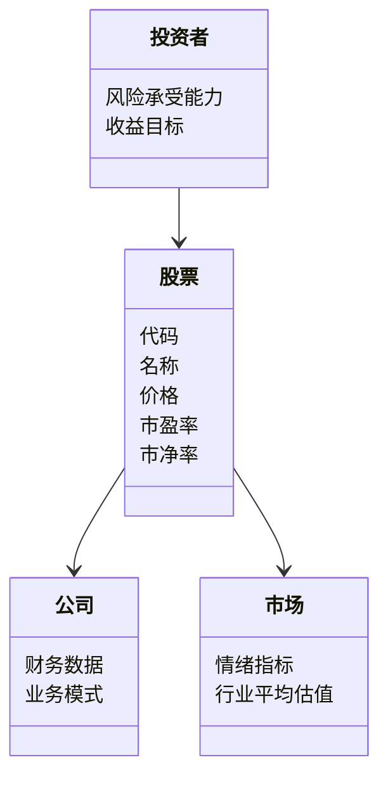
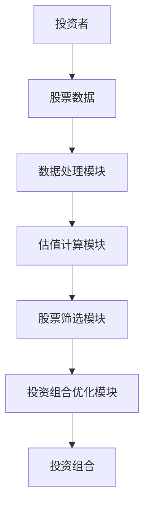
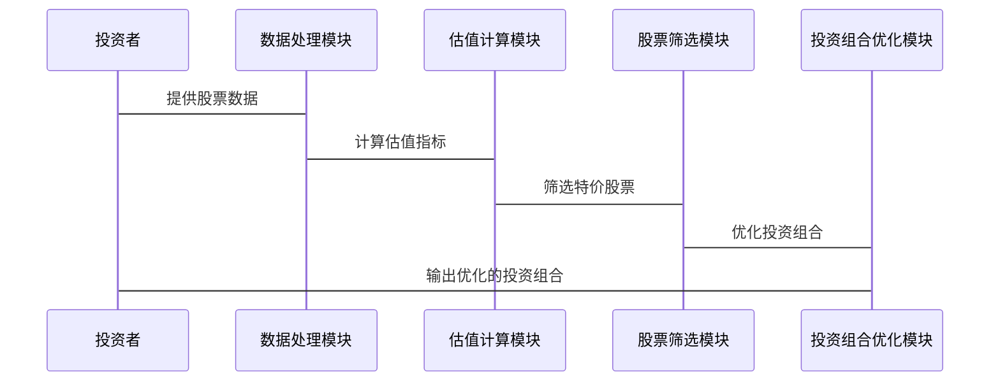

                 


# 如何利用特价股票策略进行逆向产业投资

> 关键词：逆向投资、特价股票、产业投资、股票分析、投资策略、市场分析、风险管理

> 摘要：逆向投资是一种在市场低迷时买入，在市场繁荣时卖出的投资策略。特价股票是指那些价格被低估的股票，可以通过逆向投资策略进行识别和投资。本文将详细分析逆向投资的核心概念、特价股票的识别方法、投资组合的构建逻辑，以及如何通过系统架构和项目实战来实现逆向产业投资。通过本文，读者可以掌握逆向投资的基本原理和实际操作方法。

---

## 第一部分: 逆向投资与特价股票概述

### 第1章: 逆向投资与特价股票概述

#### 1.1 逆向投资的基本概念

##### 1.1.1 逆向投资的定义与特点
逆向投资是一种与市场情绪相反的投资策略，强调在市场低迷时买入，市场繁荣时卖出。其核心理念是“别人恐惧时我贪婪，别人贪婪时我恐惧”。逆向投资的特点包括：
- **逆周期性**：投资决策与市场周期相反。
- **价值发现**：寻找被市场低估的投资标的。
- **长期视角**：注重长期收益，而非短期波动。

##### 1.1.2 特价股票的定义与分类
特价股票是指那些市场价格低于其内在价值的股票。其分类包括：
- **绝对便宜的股票**：价格远低于内在价值。
- **相对便宜的股票**：价格低于同行业平均水平。
- **周期性便宜的股票**：在特定周期内价格被低估。

##### 1.1.3 逆向投资与特价股票的关系
逆向投资的核心在于识别特价股票。通过分析市场情绪和估值指标，投资者可以找到那些被市场忽视或低估的股票，从而实现超额收益。

#### 1.2 逆向投资的背景与现状

##### 1.2.1 逆向投资的历史发展
逆向投资的概念可以追溯到本杰明·格雷厄姆的价值投资理论。20世纪以来，逆向投资在金融市场上逐渐发展，成为一种重要的投资策略。

##### 1.2.2 特价股票市场的现状分析
当前市场中，特价股票主要集中在周期性行业、困境企业或市场忽视的领域。随着市场波动加剧，特价股票的投资机会也越来越多。

##### 1.2.3 逆向投资在现代金融中的地位
逆向投资已成为机构投资者和散户投资者的重要策略之一。特别是在市场波动较大的情况下，逆向投资能够帮助投资者规避风险，获取超额收益。

#### 1.3 逆向投资的核心理念

##### 1.3.1 市场情绪与逆向思维
逆向投资的核心在于分析市场情绪。当市场恐慌时，投资者容易低估股票的价值，从而提供逆向投资的机会。

##### 1.3.2 特价股票的投资价值
特价股票的内在价值被市场低估，具有较高的投资价值。通过深入分析公司基本面，投资者可以发现这些被市场忽视的机会。

##### 1.3.3 逆向投资的长期收益潜力
逆向投资注重长期价值，能够在市场复苏时获得较高的收益。通过分散投资和风险控制，逆向投资能够实现稳定的投资回报。

---

## 第2章: 逆向投资的核心概念与联系

### 2.1 核心概念原理

#### 2.1.1 逆向投资的原理分析
逆向投资的原理在于市场情绪的非理性。当市场恐慌时，投资者往往过度卖出，导致股票价格低于其内在价值。逆向投资者通过识别这种非理性行为，能够在市场底部买入，获得超额收益。

#### 2.1.2 特价股票的识别标准
识别特价股票的关键在于分析公司的基本面和市场估值。常用的指标包括市盈率（P/E）、市净率（P/B）、股息率等。

#### 2.1.3 投资组合的构建逻辑
逆向投资的投资组合构建逻辑包括：
1. **筛选特价股票**：通过估值指标筛选出被低估的股票。
2. **分析公司基本面**：深入了解公司的财务状况和行业地位。
3. **分散投资**：通过分散投资降低风险。

### 2.2 核心概念属性对比

#### 2.2.1 特价股票与正常股票的对比
| 特性 | 特价股票 | 正常股票 |
|------|----------|-----------|
| 市场估值 | 低于内在价值 | 接近或高于内在价值 |
| 投资风险 | 较高 | 较低 |
| 投资机会 | 潜在收益高 | 收益稳定 |

#### 2.2.2 逆向投资与其他投资策略的对比
| 策略 | 逆向投资 | 常规投资 |
|------|----------|-----------|
| 投资时机 | 市场低迷时买入 | 市场稳定时买入 |
| 风险承受 | 高 | 中等 |
| 收益潜力 | 高 | 中等 |

#### 2.2.3 投资组合风险与收益的对比
| 风险 | 逆向投资组合 | 常规投资组合 |
|------|----------------|---------------|
| 短期波动风险 | 高 | 低 |
| 长期收益风险 | 低 | 高 |

### 2.3 ER实体关系图


---

## 第3章: 逆向投资算法原理

### 3.1 算法原理概述

#### 3.1.1 逆向投资的核心算法
逆向投资的核心算法包括：
1. **数据采集**：获取股票的市场数据和公司基本面数据。
2. **估值计算**：通过市盈率、市净率等指标计算股票的内在价值。
3. **筛选特价股票**：根据估值指标筛选出被低估的股票。
4. **构建投资组合**：根据风险承受能力和收益目标构建投资组合。

#### 3.1.2 特价股票识别的数学模型
特价股票识别的数学模型包括：
- 市盈率模型：P/E < 行业平均市盈率。
- 市净率模型：P/B < 行业平均市净率。
- 股息率模型：股息率 > 行业平均股息率。

#### 3.1.3 投资组合优化的算法框架
投资组合优化的算法框架包括：
1. **风险评估**：评估每只股票的风险。
2. **收益评估**：评估每只股票的收益潜力。
3. **优化组合**：根据风险和收益目标优化投资组合。

### 3.2 算法流程图


### 3.3 算法实现代码

#### 3.3.1 数据采集与清洗
```python
import pandas as pd
import requests

# 数据采集
url = 'https://example.com/stock_data'
response = requests.get(url)
data = response.json()

# 数据清洗
df = pd.DataFrame(data)
df = df.dropna()
```

#### 3.3.2 估值指标计算
```python
def calculate_pe(stock_data):
    return stock_data['price'] / stock_data['eps']

def calculate_pb(stock_data):
    return stock_data['price'] / stock_data['book_value']
```

#### 3.3.3 特价股票识别
```python
def identify_cheap_stocks(df, pe_threshold=15, pb_threshold=2):
    cheap Stocks = df[(df['pe'] < pe_threshold) & (df['pb'] < pb_threshold)]
    return cheap_stocks
```

#### 3.3.4 投资组合优化
```python
import numpy as np

def optimize_portfolio(returns, risks, target_return):
    # 简单优化：选择风险最低且收益达到目标的股票
    filtered_stocks = [r for r in zip(returns, risks) if r[0] >= target_return]
    optimized_portfolio = filtered_stocks[:5]  # 假设选择前5只股票
    return optimized_portfolio
```

---

## 第4章: 逆向投资系统分析与架构设计

### 4.1 系统分析

#### 4.1.1 问题场景介绍
逆向投资系统需要解决的问题包括：
- 如何高效地采集和处理股票数据。
- 如何准确地识别特价股票。
- 如何优化投资组合以实现收益目标。

#### 4.1.2 项目介绍
逆向投资系统是一个用于识别特价股票并构建投资组合的自动化系统。该系统包括数据采集、数据清洗、估值计算、股票筛选和投资组合优化等功能。

### 4.2 系统功能设计

#### 4.2.1 领域模型


#### 4.2.2 系统架构设计


#### 4.2.3 系统接口设计
系统接口设计包括：
- 数据接口：从数据源获取股票数据。
- 用户接口：接收投资者的输入参数。
- 输出接口：输出优化的投资组合。

#### 4.2.4 系统交互设计


---

## 第5章: 逆向投资项目实战

### 5.1 环境安装

#### 5.1.1 数据采集工具
安装必要的数据采集工具，如`requests`、`pandas`等。

#### 5.1.2 数据分析工具
安装数据分析工具，如`numpy`、`scipy`等。

#### 5.1.3 可视化工具
安装可视化工具，如`matplotlib`、`seaborn`等。

### 5.2 系统核心实现源代码

#### 5.2.1 数据采集与清洗
```python
import pandas as pd
import requests

def fetch_stock_data(ticker):
    url = f'https://example.com/stock_data/{ticker}'
    response = requests.get(url)
    data = response.json()
    df = pd.DataFrame(data)
    df = df.dropna()
    return df
```

#### 5.2.2 估值指标计算
```python
def calculate_pe(df):
    df['pe'] = df['price'] / df['eps']
    return df

def calculate_pb(df):
    df['pb'] = df['price'] / df['book_value']
    return df
```

#### 5.2.3 特价股票识别
```python
def identify_cheap_stocks(df, pe_threshold=15, pb_threshold=2):
    df['is_cheap'] = (df['pe'] < pe_threshold) & (df['pb'] < pb_threshold)
    return df[df['is_cheap']]
```

#### 5.2.4 投资组合优化
```python
def optimize_portfolio(stocks, target_return=0.1):
    # 筛选收益达到目标的股票
    filtered_stocks = stocks[stocks['return'] >= target_return]
    # 选择前5只股票
    selected_stocks = filtered_stocks.head(5)
    return selected_stocks
```

### 5.3 代码应用解读与分析
通过上述代码，投资者可以实现逆向投资的整个流程，包括数据采集、估值计算、股票筛选和投资组合优化。代码简单易懂，适用于实际投资操作。

### 5.4 实际案例分析

#### 5.4.1 案例背景介绍
假设当前市场低迷，投资者希望寻找被低估的股票进行投资。

#### 5.4.2 数据采集与分析
通过数据采集工具获取相关股票的市场数据和公司基本面数据。

#### 5.4.3 投资组合优化
根据估值指标筛选出被低估的股票，并根据风险承受能力和收益目标构建投资组合。

#### 5.4.4 投资效果监控
定期监控投资组合的表现，根据市场变化调整投资策略。

### 5.5 项目小结
通过实际案例分析，投资者可以更好地理解逆向投资的核心思想和实际操作方法。通过代码实现，投资者可以高效地进行逆向投资，实现超额收益。

---

## 第6章: 逆向投资的最佳实践与小结

### 6.1 最佳实践

#### 6.1.1 投资策略
- 定期审视投资组合，根据市场变化调整投资策略。
- 保持分散投资，降低投资风险。
- 选择具有强大财务状况和良好管理团队的公司。

#### 6.1.2 风险管理
- 设定止损点，避免重大损失。
- 分散投资，降低集中风险。
- 定期评估市场情绪，避免盲目跟风。

### 6.2 小结
逆向投资是一种有效的投资策略，通过识别特价股票，投资者可以在市场底部买入，市场顶部卖出，实现超额收益。通过系统的分析和实际的案例，投资者可以更好地理解逆向投资的核心思想和操作方法。

### 6.3 注意事项
- 逆向投资需要耐心和纪律，避免被市场情绪左右。
- 投资者需要具备扎实的金融知识和分析能力。
- 投资过程中需要不断学习和调整，适应市场变化。

### 6.4 拓展阅读
- 《价值投资： Buffett 股票投资策略》
- 《逆向思考：成功人士的思维模式》
- 《投资学：从入门到精通》

---

通过本文，读者可以全面了解逆向投资的核心思想和实际操作方法。从理论到实践，从概念到代码，本文为投资者提供了完整的逆向投资解决方案。希望读者能够通过本文掌握逆向投资的精髓，在投资实践中实现超额收益。

