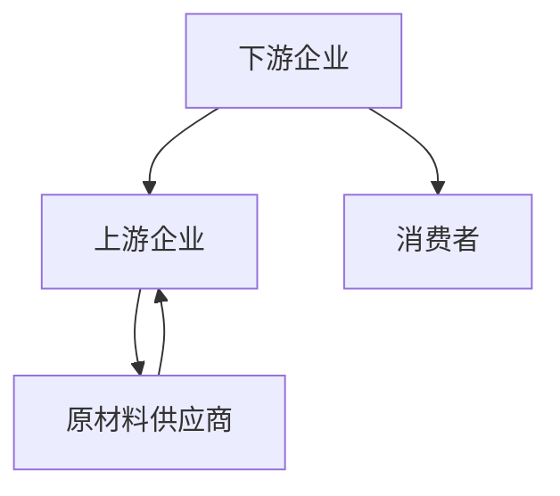

                 

# 如何利用特价股票策略进行逆向产业链投资

> 关键词：逆向投资，特价股票，产业链分析，投资策略，风险管理，系统架构

> 摘要：本文详细探讨了如何利用特价股票策略进行逆向产业链投资。通过分析特价股票的定义、逆向投资的逻辑、产业链分析的方法以及实际投资案例，本文为投资者提供了从下游到上游的产业链投资策略。文章还结合了数学模型、系统架构和风险管理等多方面的内容，帮助投资者更好地理解和应用逆向投资策略。

---

## 目录

1. **特价股票策略与逆向投资基础**
   - 1.1 特价股票的定义与分类
   - 1.2 逆向投资的定义与特点
   - 1.3 逆向投资与产业链的关系

2. **逆向产业链投资的逻辑与方法**
   - 2.1 逆向投资的逻辑框架
   - 2.2 产业链分析的核心步骤
   - 2.3 特价股票策略的应用方法

3. **特价股票的筛选与分析方法**
   - 3.1 特价股票的筛选标准
   - 3.2 产业链上下游的关系分析
   - 3.3 特价股票的估值模型

4. **逆向产业链投资的系统分析与架构设计**
   - 4.1 逆向投资的系统分析框架
   - 4.2 产业链的实体关系图
   - 4.3 系统架构设计与实现

5. **逆向投资的实际案例分析**
   - 5.1 特价股票案例分析
   - 5.2 逆向产业链投资的实战经验
   - 5.3 案例总结与经验分享

6. **逆向投资的风险管理与控制**
   - 6.1 逆向投资中的风险因素
   - 6.2 风险管理的策略与方法
   - 6.3 心理因素对投资的影响

7. **逆向投资的未来趋势与机会**
   - 7.1 逆向投资的未来发展方向
   - 7.2 新兴产业中的投资机会
   - 7.3 逆向策略在科技领域的应用

8. **总结与展望**
   - 8.1 本文的核心观点总结
   - 8.2 对未来投资策略的展望
   - 8.3 给投资者的建议与鼓励

---

## 正文

### 第1章: 特价股票策略与逆向投资基础

#### 1.1 特价股票的定义与分类
- **特价股票的定义**: 特价股票是指那些市场价格低于其内在价值，具有潜在上涨空间的股票。这些股票通常被市场低估，具有较高的投资价值。
- **特价股票的分类**:
  - 周期性特价股票: 受经济周期影响较大的股票，如能源、材料等行业。
  - 价值型特价股票: 市场价格远低于其内在价值的股票。
  - 成长型特价股票: 具有较高成长潜力，但当前市场价格被低估的股票。
- **特价股票的市场特征**: 市场价格与内在价值的偏离，通常出现在市场恐慌或行业低迷时期。

#### 1.2 逆向投资的定义与特点
- **逆向投资的定义**: 逆向投资是指在市场低迷或恐慌时期，买入被市场低估的资产，而在市场繁荣时期，卖出高估的资产。
- **逆向投资的特点**:
  - 非常态性: 投资者需要在市场恐慌时保持冷静，做出反直觉的决策。
  - 逆周期性: 逆向投资通常在经济周期的低谷期进行。
  - 长期性: 逆向投资需要耐心等待市场回归理性，实现价值重估。

#### 1.3 逆向投资与产业链的关系
- **逆向投资的核心逻辑**: 从下游企业的困境中寻找上游企业的投资机会。
- **产业链分析的重要性**: 通过分析产业链上下游的关系，找到被市场低估的上游企业，这些企业通常在行业低迷时更具投资价值。
- **特价股票在逆向投资中的作用**: 特价股票通常是那些上游企业股票，这些股票的价格被市场低估，具有较高的投资潜力。

### 第2章: 逆向产业链投资的逻辑与方法

#### 2.1 逆向投资的逻辑框架
- **从下游到上游的逻辑**: 通过分析下游企业的困境，寻找上游企业的投资机会。
- **上游企业的核心竞争力**: 上游企业通常具有较高的行业壁垒，能够在行业低迷时保持稳定盈利。
- **产业链上下游的关系**: 下游企业的困境可能导致上游企业股价被低估，而上游企业的复苏将带动整个产业链的复苏。

#### 2.2 产业链分析的核心步骤
1. **确定目标行业**: 选择具有周期性波动的行业，如能源、材料、汽车等。
2. **分析下游企业**: 通过分析下游企业的财务状况和市场表现，判断行业是否处于低迷期。
3. **寻找上游机会**: 通过分析上游企业的市场地位、财务状况和估值，寻找被低估的上游企业。
4. **构建投资组合**: 根据分析结果，构建逆向投资组合，分散投资风险。

#### 2.3 特价股票策略的应用方法
- **特价股票的筛选标准**: 市场价格低于内在价值，具有较高的股息率或ROE。
- **产业链分析的方法**: 通过分析产业链上下游的关系，判断上游企业的投资价值。
- **投资策略**: 在行业低迷时买入上游企业的特价股票，等待行业复苏后卖出获利。

### 第3章: 特价股票的筛选与分析方法

#### 3.1 特价股票的筛选标准
- **市盈率（P/E）**: 市盈率低于行业平均水平的股票。
- **市净率（P/B）**: 市净率低于行业平均水平的股票。
- **股息率**: 股息率较高且稳定的股票。
- **ROE（净资产收益率）**: ROE较高的企业通常具有较高的盈利能力。

#### 3.2 产业链上下游的关系分析
- **下游企业的困境**: 下游企业的需求下降可能导致上游企业的产品价格下降，但上游企业的成本优势使其能够在低价情况下保持盈利。
- **上游企业的竞争优势**: 上游企业通常具有较高的行业壁垒，能够在行业低迷时保持稳定盈利。

#### 3.3 特价股票的估值模型
- **市盈率模型**: 市盈率 = 股价 / 每股收益。
- **市净率模型**: 市净率 = 股价 / 每股净资产。
- **现金流折现模型**: 企业价值 = 现金流的现值。

### 第4章: 逆向产业链投资的系统分析与架构设计

#### 4.1 逆向投资的系统分析框架
- **系统分析的核心目标**: 找到被市场低估的上游企业，构建逆向投资组合。
- **系统分析的步骤**:
  1. **市场分析**: 分析行业周期，确定目标行业。
  2. **产业链分析**: 分析产业链上下游的关系，确定上游企业的投资价值。
  3. **股票筛选**: 根据筛选标准，筛选出符合条件的特价股票。
  4. **投资组合构建**: 根据分析结果，构建逆向投资组合。

#### 4.2 产业链的实体关系图

#### 4.3 系统架构设计与实现
- **系统架构设计**: 构建一个基于逆向投资策略的股票筛选系统，包括数据采集、分析、筛选和投资组合构建四个模块。
- **系统实现**: 使用Python编写股票筛选脚本，结合数据接口获取实时数据，进行分析和筛选。

### 第5章: 逆向投资的实际案例分析

#### 5.1 特价股票案例分析
- **案例背景**: 某能源行业下游企业需求下降，导致上游企业股价被低估。
- **分析过程**: 通过产业链分析，筛选出上游企业的特价股票，分析其估值和竞争优势。
- **投资结果**: 在行业复苏时，上游企业股价上涨，实现投资收益。

#### 5.2 逆向投资的实战经验
- **实战经验**: 在市场恐慌时，保持冷静，耐心等待市场回归理性。
- **实际操作**: 根据逆向投资策略，筛选出符合条件的特价股票，构建投资组合。

#### 5.3 案例总结与经验分享
- **总结**: 逆向投资需要耐心和纪律，避免被市场情绪左右。
- **经验分享**: 在实际操作中，要注重风险控制，分散投资，避免过度集中。

### 第6章: 逆向投资的风险管理与控制

#### 6.1 逆向投资中的风险因素
- **市场风险**: 市场波动可能导致股价大幅波动。
- **行业风险**: 行业低迷可能导致上游企业业绩下滑。
- **个股风险**: 特价股票可能因公司内部问题导致股价下跌。

#### 6.2 风险管理的策略与方法
- **分散投资**: 通过投资多个行业和公司，分散风险。
- **止损策略**: 设定止损点，避免亏损过大。
- **长期持有**: 长期持有被低估的股票，等待市场回归理性。

#### 6.3 心理因素对投资的影响
- **情绪化决策**: 投资者容易因市场恐慌而做出错误决策。
- **耐心与纪律**: 逆向投资需要耐心等待市场复苏，避免频繁交易。

### 第7章: 逆向投资的未来趋势与机会

#### 7.1 逆向投资的未来发展方向
- **科技领域**: 在科技领域寻找被低估的上游企业，如半导体、电子设备等。
- **新能源领域**: 新能源行业具有较高的成长潜力，逆向投资机会较多。

#### 7.2 新兴产业中的投资机会
- **人工智能**: 人工智能行业具有较高的成长潜力，但当前市场价格可能被低估。
- **生物科技**: 生物科技行业具有较高的创新潜力，但当前市场价格可能被低估。

#### 7.3 逆向策略在科技领域的应用
- **科技企业的周期性**: 科技企业通常具有较强的周期性，逆向投资机会较多。
- **科技企业的估值**: 通过分析科技企业的估值，寻找被低估的股票。

### 第8章: 总结与展望

#### 8.1 本文的核心观点总结
- 逆向投资是一种有效的投资策略，通过分析产业链上下游的关系，寻找被低估的上游企业。
- 特价股票是逆向投资的重要工具，通过筛选和分析，找到具有投资价值的股票。

#### 8.2 对未来投资策略的展望
- **科技与新兴产业**: 随着科技的发展，新兴产业将提供更多的逆向投资机会。
- **全球化与国际化**: 逆向投资需要关注全球市场，寻找被低估的股票。

#### 8.3 给投资者的建议与鼓励
- **保持耐心**: 逆向投资需要耐心等待市场复苏，避免急于求成。
- **注重学习**: 不断学习投资知识，提高分析能力。
- **风险管理**: 重视风险管理，避免过度集中投资。

---

**总结**: 逆向投资是一种有效的投资策略，通过分析产业链上下游的关系，寻找被低估的上游企业。特价股票是逆向投资的重要工具，通过筛选和分析，找到具有投资价值的股票。希望本文能为投资者提供有价值的参考，帮助他们在逆向投资中获得成功。

