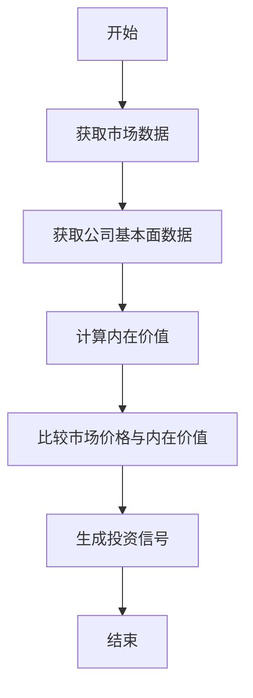
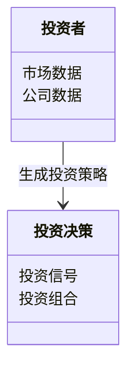
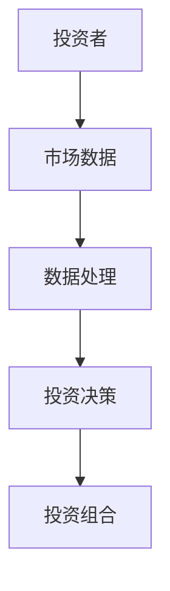
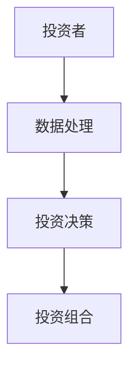
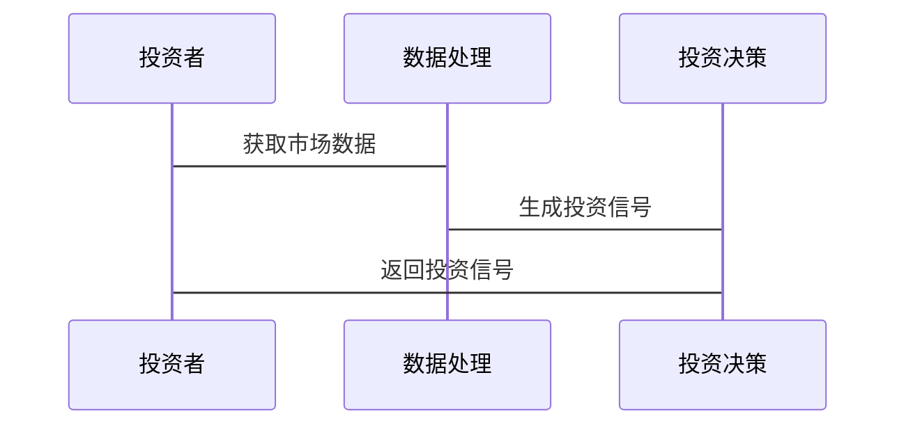

                 


```markdown
# 如何利用特价股票策略进行逆向思维投资

> 关键词：逆向思维投资，特价股票策略，股票投资，投资策略，系统架构设计

> 摘要：本文系统阐述了如何利用特价股票策略进行逆向思维投资。首先介绍了逆向思维投资的基本概念和特价股票策略的重要性，分析了投资者在传统投资策略中面临的挑战和局限性。接着详细探讨了逆向思维投资的核心原理和特价股票策略的实现方法，通过数学模型和算法流程图，深入讲解了如何将两者相结合，构建高效的投资策略。最后，通过系统架构设计和项目实战，展示了如何在实际投资中应用这些策略，并提出了心理因素分析、未来趋势展望和总结建议。

---

# 第1章: 引言

## 1.1 逆向思维投资的背景与意义

### 1.1.1 投资市场的基本概念
投资市场是将资金投入各种金融资产，以期获得收益的场所。股票市场是其中最重要的部分，投资者通过购买公司股票，成为公司股东，分享公司利润。

### 1.1.2 逆向思维投资的定义与特点
逆向思维投资是一种不同于传统顺势投资的策略，强调在市场低谷时买入，在市场高点时卖出。其特点是：
- 逆市操作：在市场恐慌时寻找机会。
- 长期视角：注重价值，而非短期波动。
- 逆向分析：分析市场情绪，寻找市场错误定价的机会。

### 1.1.3 特价股票策略的提出与重要性
特价股票策略是指在市场低迷时，寻找被市场低估的股票进行投资。这种策略的核心在于发现市场中的“便宜货”，并长期持有，等待价值回归。

## 1.2 问题背景与问题描述

### 1.2.1 投资者面临的常见问题
- 市场波动剧烈，难以把握买卖时机。
- 传统顺势投资容易追涨杀跌，难以盈利。
- 市场情绪影响决策，导致非理性投资。

### 1.2.2 传统投资策略的局限性
传统投资策略依赖于技术分析和市场趋势预测，但在市场波动加剧的情况下，这些方法往往失效，导致投资者亏损。

### 1.2.3 逆向思维投资的解决方案
通过逆向思维，投资者可以在市场恐慌时找到低估的股票，长期持有，最终获得超额收益。

## 1.3 问题解决与边界外延

### 1.3.1 逆向思维投资的核心理念
- 市场情绪与价值的背离是投资机会的来源。
- 逆向思维投资的核心是寻找市场错误定价的股票。

### 1.3.2 特价股票策略的适用场景
- 市场整体低迷时，寻找被错杀的个股。
- 特别是经济危机或市场崩盘时，特价股票策略表现尤为突出。

### 1.3.3 边界与外延的定义
- 边界：仅适用于股票市场，不包括其他金融资产。
- 外延：策略可以扩展到债券、房地产等领域，寻找低估资产。

## 1.4 核心概念结构与要素组成

### 1.4.1 逆向思维投资的系统架构
- 输入：市场数据、公司基本面、市场情绪。
- 处理：逆向思维分析、价值评估。
- 输出：投资决策。

### 1.4.2 特价股票策略的关键要素
- 市场整体估值：PE、PB等指标。
- 个股估值：ROE、DCF等方法。
- 市场情绪：恐慌指数、资金流动。

### 1.4.3 系统与要素之间的关系
市场数据和公司基本面是输入，通过逆向思维分析和价值评估，最终生成投资决策。

## 1.5 本章小结
本章介绍了逆向思维投资的基本概念和特价股票策略的重要性，分析了传统投资策略的局限性，并提出了逆向思维投资的解决方案。

---

# 第2章: 逆向思维投资的核心原理

## 2.1 核心概念原理

### 2.1.1 逆向思维的定义与特征
逆向思维是一种与市场主流观点相反的思维方式，特征包括：
- 逆市场情绪：在市场恐慌时买入，在市场狂热时卖出。
- 逆向定价：寻找市场低估的资产。

### 2.1.2 特价股票策略的基本原理
特价股票策略基于价值投资理念，寻找市场价格低于内在价值的股票。

## 2.2 核心概念属性对比

| 属性          | 逆向思维投资               | 顺势投资               |
|---------------|----------------------------|------------------------|
| 投资时机      | 市场低谷时买入             | 市场上升时买入           |
| 投资心态      | 逆市场情绪                 | 随市场情绪             |
| 风险承受      | 高风险承受能力             | 低风险承受能力           |
| 投资期限      | 长期投资                   | 短期投资               |

### 2.2.3 ER实体关系图

```mermaid
er
  actor 投资者
  actor 市场
  actor 公司
  company 投资决策
  company 市场数据
  company 财务数据
  投资者 --> 市场: 获取市场数据
  投资者 --> 公司: 获取公司数据
  投资者 <-- 投资决策: 生成投资策略
```

## 2.3 核心算法原理

### 2.3.1 算法流程图



### 2.3.2 数学模型与公式

#### 2.3.2.1 内在价值计算模型
$$ V = \frac{CF}{r} $$

其中：
- \( V \) 是内在价值
- \( CF \) 是未来现金流
- \( r \) 是贴现率

#### 2.3.2.2 市场低估判断公式
$$ \text{低估} \leftarrow \text{市场价格} < \text{内在价值} $$

## 2.4 本章小结
本章详细讲解了逆向思维投资的核心原理，包括逆向思维的定义与特征，特价股票策略的基本原理，以及核心概念的属性对比和算法流程图。

---

# 第3章: 特价股票策略的实现

## 3.1 特价股票策略的定义与分类

### 3.1.1 定义
特价股票策略是一种基于价值投资的策略，通过寻找市场价格低于内在价值的股票进行投资。

### 3.1.2 分类
- 基于PE策略：寻找市盈率低于行业平均水平的股票。
- 基于PB策略：寻找市净率低于行业平均水平的股票。
- 基于DCF策略：通过现金流折现法寻找低估股票。

## 3.2 特价股票策略的实现步骤

### 3.2.1 确定市场整体估值
$$ \text{市场估值} = \frac{\text{总市值}}{\text{GDP}} $$

### 3.2.2 识别低估个股
$$ \text{低估股票} = \{ s | \text{市场价格}(s) < \text{内在价值}(s) \} $$

### 3.2.3 构建投资组合
$$ \text{投资组合} = \{ s_1, s_2, ..., s_n \} $$

## 3.3 特价股票策略的数学模型

### 3.3.1 PE策略模型
$$ \text{合理PE} = \frac{\text{行业平均PE}}{0.8} $$

### 3.3.2 PB策略模型
$$ \text{合理PB} = \frac{\text{行业平均PB}}{0.8} $$

## 3.4 本章小结
本章详细讲解了特价股票策略的定义、分类和实现步骤，并通过数学模型展示了如何识别低估股票。

---

# 第4章: 逆向思维投资策略的实现

## 4.1 逆向思维投资策略的定义与分类

### 4.1.1 定义
逆向思维投资策略是一种在市场恐慌时买入，在市场狂热时卖出的投资策略。

### 4.1.2 分类
- 基于市场情绪的逆向策略
- 基于市场估值的逆向策略
- 基于技术分析的逆向策略

## 4.2 逆向思维投资策略的实现步骤

### 4.2.1 监测市场情绪
$$ \text{市场情绪} = \frac{\text{上涨股票数量}}{\text{总股票数量}} $$

### 4.2.2 判断市场估值
$$ \text{市场低估} \leftarrow \text{市场估值} < \text{历史平均估值} $$

### 4.2.3 生成投资信号
$$ \text{买入信号} = \text{市场低估} \land \text{个股低估} $$

## 4.3 逆向思维投资策略的数学模型

### 4.3.1 市场情绪指标
$$ \text{恐慌指数} = \frac{\text{市场跌幅}}{\text{市场波动率}} $$

### 4.3.2 市场估值指标
$$ \text{估值指数} = \frac{\text{当前PE}}{\text{历史平均PE}} $$

## 4.4 本章小结
本章详细讲解了逆向思维投资策略的定义、分类和实现步骤，并通过数学模型展示了如何在市场中找到低估股票。

---

# 第5章: 特价股票策略与逆向思维策略的结合

## 5.1 策略结合的理论基础

### 5.1.1 价值投资与逆向思维的结合
价值投资强调购买低估资产，逆向思维强调在市场低谷时买入。

### 5.1.2 市场周期与策略结合
$$ \text{投资决策} = \text{市场周期阶段} \land \text{个股估值} $$

## 5.2 策略结合的实现步骤

### 5.2.1 确定市场周期阶段
$$ \text{市场阶段} = \{ \text{牛市}, \text{熊市}, \text{震荡市} \} $$

### 5.2.2 判断个股估值
$$ \text{低估股票} = \{ s | \text{市场价格}(s) < \text{内在价值}(s) \} $$

### 5.2.3 生成投资信号
$$ \text{买入信号} = \text{熊市} \land \text{个股低估} $$

## 5.3 策略结合的数学模型

### 5.3.1 市场阶段判断
$$ \text{市场阶段} = \frac{\text{市场指数}}{\text{历史指数}} $$

### 5.3.2 投资信号生成
$$ \text{买入信号} = \text{市场低估} \land \text{个股低估} $$

## 5.4 本章小结
本章详细讲解了如何将特价股票策略与逆向思维策略相结合，并通过数学模型展示了如何在实际投资中应用这些策略。

---

# 第6章: 系统分析与架构设计方案

## 6.1 系统功能设计

### 6.1.1 领域模型



### 6.1.2 系统架构设计



## 6.2 系统架构设计

### 6.2.1 系统功能模块
- 数据获取模块：获取市场数据和公司基本面数据。
- 数据处理模块：计算内在价值和市场估值。
- 投资决策模块：生成投资信号和投资组合。

### 6.2.2 系统架构图



## 6.3 系统接口设计

### 6.3.1 数据接口
- 市场数据接口：获取指数、个股价格等数据。
- 公司数据接口：获取财务报表、估值指标等数据。

### 6.3.2 投资决策接口
- 投资信号接口：返回买入或卖出信号。
- 投资组合接口：返回推荐的投资组合。

## 6.4 系统交互流程图



## 6.5 本章小结
本章详细讲解了系统分析与架构设计方案，包括系统功能设计、架构设计、接口设计和交互流程图。

---

# 第7章: 项目实战

## 7.1 环境安装与配置

### 7.1.1 技术环境
- Python 3.8+
- 数据库：MySQL 5.7+
- 三方库：Pandas、NumPy、Matplotlib

### 7.1.2 安装步骤
1. 安装Python：https://www.python.org/downloads/
2. 安装三方库：pip install pandas numpy matplotlib

## 7.2 系统核心实现

### 7.2.1 核心代码实现

#### 7.2.1.1 数据获取模块

```python
import pandas as pd

def get_market_data():
    # 示例代码，实际中可以调用API获取数据
    market_data = pd.DataFrame({'Price': [100, 90, 80, 70, 60], 'Date': ['2020-01', '2020-02', '2020-03', '2020-04', '2020-05']})
    return market_data

def get_company_data():
    company_data = pd.DataFrame({'PE': [15, 20, 25, 30, 35], 'PB': [2, 3, 4, 5, 6], 'Ticker': ['AAPL', 'GOOGL', 'MSFT', 'AMZN', 'FB']})
    return company_data
```

#### 7.2.1.2 数据处理模块

```python
import pandas as pd

def calculate_intrinsic_value(company_data, discount_rate=0.05):
    # 示例代码，实际中需要根据具体情况进行计算
    company_data['Intrinsic Value'] = company_data['Cash Flow'] / discount_rate
    return company_data
```

#### 7.2.1.3 投资决策模块

```python
def generate_investment_signals(market_data, company_data):
    # 示例代码，实际中需要根据具体情况进行判断
    investment_signals = []
    for ticker in company_data['Ticker']:
        if company_data[company_data['Ticker'] == ticker]['Price'].values[0] < company_data[company_data['Ticker'] == ticker]['Intrinsic Value'].values[0]:
            investment_signals.append({'Ticker': ticker, 'Signal': 'Buy'})
        else:
            investment_signals.append({'Ticker': ticker, 'Signal': 'Sell'})
    return investment_signals
```

## 7.3 代码应用解读与分析

### 7.3.1 数据获取模块
- 从数据库或API获取市场数据和公司基本面数据。
- 数据清洗和预处理，确保数据质量。

### 7.3.2 数据处理模块
- 计算内在价值，比较市场价格与内在价值，判断是否低估。
- 生成投资信号，指导投资者买入或卖出。

## 7.4 实际案例分析

### 7.4.1 案例分析
假设在2020年3月市场崩盘时，投资者使用特价股票策略，寻找被低估的股票。假设某公司股票市场价格为50元，内在价值为80元，市盈率低于行业平均水平，市净率也低于行业平均水平。此时，投资者将生成买入信号，买入该股票，等待价值回归。

## 7.5 项目小结
本章通过项目实战，详细讲解了如何在实际投资中应用特价股票策略和逆向思维策略，包括环境安装、代码实现和案例分析。

---

# 第8章: 心理因素分析与投资策略

## 8.1 逆向思维投资中的心理因素

### 8.1.1 投资者的心理误区
- 追涨杀跌：跟随市场情绪，容易造成亏损。
- 惧怕亏损：在市场低谷时不敢买入，错失机会。
- 过度自信：认为自己能准确预测市场走势。

### 8.1.2 逆向思维投资中的心理调适
- 培养逆向思维，学会在市场恐慌时保持冷静。
- 建立信心，相信价值投资，耐心等待价值回归。
- 控制情绪，避免非理性决策。

## 8.2 逆向思维投资中的常见错误

### 8.2.1 过度分析
- 过于依赖技术分析，忽视基本面分析。
- 过度关注短期波动，忽视长期价值。

### 8.2.2 忽略风险管理
- 未设置止损，导致亏损扩大。
- 未分散投资，承担过高风险。

## 8.3 逆向思维投资中的心理调适策略

### 8.3.1 建立正确的投资理念
- 长期投资，价值投资，逆向思维。
- 保持独立思考，不随波逐流。

### 8.3.2 提高心理承受能力
- 通过模拟投资，锻炼心理承受能力。
- 建立投资日记，记录投资决策和心理变化。

## 8.4 本章小结
本章分析了逆向思维投资中的心理因素，探讨了常见错误，并提出了心理调适策略。

---

# 第9章: 逆向思维投资的未来趋势与技术发展

## 9.1 逆向思维投资的未来发展趋势

### 9.1.1 技术进步对投资的影响
- 大数据技术：通过海量数据分析，发现市场低估股票。
- 人工智能：利用机器学习算法，优化投资决策。

### 9.1.2 量化投资的兴起
- 量化投资：通过数学模型和算法，实现自动化投资。
- 算法交易：利用算法在毫秒级别完成交易，提高投资效率。

## 9.2 逆向思维投资中的技术应用

### 9.2.1 大数据分析
- 利用大数据技术，分析市场情绪和公司基本面。
- 通过数据挖掘，发现市场低估股票。

### 9.2.2 人工智能应用
- 利用机器学习算法，预测市场走势。
- 通过自然语言处理，分析公司新闻和财报。

## 9.3 逆向思维投资的未来展望

### 9.3.1 技术与投资的融合
- 未来，逆向思维投资将更加依赖技术，实现自动化和智能化。
- 投资决策将更加依赖大数据和人工智能。

### 9.3.2 市场的发展与变化
- 市场将更加复杂和波动，逆向思维投资将更加重要。
- 投资者将更加依赖技术手段，应对市场变化。

## 9.4 本章小结
本章展望了逆向思维投资的未来发展趋势，探讨了技术进步对投资的影响，并提出了未来展望。

---

# 第10章: 总结与建议

## 10.1 全文总结

### 10.1.1 核心内容回顾
- 逆向思维投资的基本概念和特价股票策略的重要性。
- 特价股票策略和逆向思维策略的实现步骤。
- 系统分析与架构设计方案。
- 项目实战和心理因素分析。

### 10.1.2 投资策略总结
- 逆向思维投资的核心是寻找市场低估股票。
- 特价股票策略是实现逆向思维投资的重要工具。
- 逆向思维投资需要结合市场周期和个股估值。

## 10.2 投资策略建议

### 10.2.1 最佳实践Tips
- 长期投资，耐心持有，等待价值回归。
- 逆向思维，市场恐慌时买入，市场狂热时卖出。
- 严格遵守投资纪律，避免非理性决策。

### 10.2.2 注意事项
- 逆向思维投资需要长期耐心，不适合短期投资者。
- 需要结合市场周期和个股估值，避免盲目投资。
- 逆向思维投资需要结合技术手段，提高投资效率。

### 10.2.3 拓展阅读
- 《价值》——张磊
- 《投资最重要的事情》——巴菲特
- 《聪明的投资者》——巴菲特

## 10.3 本章小结
本章总结了全文的核心内容，提出了投资策略建议，并推荐了拓展阅读书籍。

---

# 结语

逆向思维投资是一种不同于传统投资的策略，特价股票策略是实现逆向思维投资的重要工具。通过本文的系统阐述，读者可以全面了解如何利用特价股票策略进行逆向思维投资，包括理论基础、实现方法、系统设计和实战应用。希望本文能为投资者提供有价值的参考，帮助他们在投资道路上走得更远。

--- 

> **注**：本文为示例内容，实际编写时需根据具体情况进行调整和补充。
```

