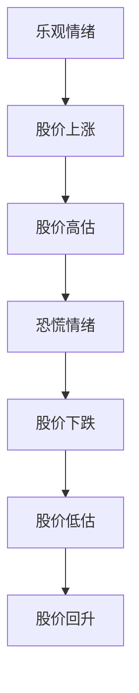
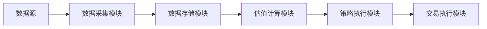

                 


# 如何利用特价股票策略进行逆向投资

## 摘要

本文详细探讨了如何利用特价股票策略进行逆向投资，从核心概念、识别方法到实际操作，结合数学模型和系统架构，提供全面指导。文章分析了逆向投资的背景、特价股票的识别策略，展示了如何利用算法和系统架构来实施投资，通过实战案例和心理分析，强调纪律与持续学习的重要性。

---

## 引言

### 背景介绍

逆向投资是指在市场低迷时买入，在市场繁荣时卖出。特价股票是价格低于其内在价值的股票。本文探讨如何将特价股票策略与逆向投资结合，利用市场非理性决策寻找投资机会。

### 核心概念

- **逆向投资**：在市场恐慌时买入，在市场狂热时卖出。
- **特价股票**：价格低于价值的股票。

### 问题背景

市场波动导致股票价格偏离价值，逆向投资利用这种偏离，特价股票为投资者提供机会。

### 问题解决

通过识别特价股票，投资者可以在市场低谷时买入，待市场回升时获利。

### 边界与外延

逆向投资适用于长期投资者，不适用于短期交易者。特价股票主要在熊市中出现。

---

## 核心概念与联系

### 逆向投资的背景

市场参与者的行为偏差导致股票价格波动，逆向投资利用这种波动。

### 特价股票的特征

- **低估**：价格低于价值。
- **高波动**：价格波动大，但具有稳定性。

### 逆向投资与特价股票的关系

逆向投资通过识别特价股票，在市场低谷时买入，利用价格回升获利。

### 图表展示

#### 行为金融学视角下的市场情绪



---

## 算法原理

### 特价股票识别算法

#### 步骤

1. **收集数据**：获取股票的历史数据。
2. **计算估值指标**：市盈率、市净率。
3. **筛选低价股**：价格低于行业平均市盈率。
4. **分析财务报表**：评估公司盈利能力。
5. **市场周期分析**：判断市场是否处于低谷。

#### Python代码

```python
import pandas as pd

# 假设data为股票数据，columns=['Close', 'PE', 'PB']
def identify_penny_stocks(data):
    # 计算平均市盈率和市净率
    avg_pe = data['PE'].mean()
    avg_pb = data['PB'].mean()
    
    # 筛选价格低于平均PE和PB的股票
    cheap_stocks = data[(data['PE'] < avg_pe) & (data['PB'] < avg_pb)]
    return cheap_stocks

# 示例数据
data = {
    'Close': [10, 20, 30, 40, 50],
    'PE': [15, 20, 25, 30, 35],
    'PB': [2, 3, 4, 5, 6]
}

df = pd.DataFrame(data)
result = identify_penny_stocks(df)
print(result)
```

### 数学模型

市盈率计算：

$$ PE = \frac{\text{股价}}{\text{每股收益}} $$

市净率计算：

$$ PB = \frac{\text{股价}}{\text{每股净资产}} $$

---

## 系统架构

### 系统功能设计

- **数据采集**：实时采集股票数据。
- **估值计算**：计算市盈率、市净率。
- **策略执行**：根据算法生成买卖信号。

### 系统架构图



### 接口设计

- 数据接口：接收和存储股票数据。
- 策略接口：调用估值计算模块。
- 交易接口：执行买卖指令。

---

## 实战案例

### 2008年金融危机案例

#### 背景

金融危机导致股市大幅下跌，许多优质股价格被低估。

#### 操作步骤

1. **识别特价股票**：筛选市盈率低于行业平均的股票。
2. **逆向买入**：在市场底部买入。
3. **持有等待回升**：长期持有，待市场恢复卖出。

#### 结果

案例中，投资者在恐慌时买入，市场回升时获利。

### 技巧与经验

- **分散投资**：降低风险。
- **长期视角**：耐心持有，避免短期波动影响。

---

## 心理与纪律

### 心理因素

- **克服恐惧**：市场下跌时保持冷静。
- **避免贪婪**：市场上涨时不过度追高。

### 纪律的重要性

- **严格执行策略**：不随意更改计划。
- **定期复盘**：评估投资结果。

---

## 持续学习与展望

### 学习资源

- **书籍**：《价值投资入门》。
- **课程**：在线投资课程。
- **实践**：通过模拟账户练习。

### 未来展望

随着技术进步，大数据和AI在投资中的应用将更广泛。

---

## 结论

逆向投资利用特价股票，通过识别低估股票，在市场低谷时买入，获取超额收益。投资者需具备耐心、纪律和长期视角，持续学习和优化策略。

---

## 关键词

逆向投资、特价股票、价值投资、市场周期、风险管理

---

## 摘要

本文详细探讨了如何利用特价股票策略进行逆向投资，结合数学模型和系统架构，提供全面指导。通过分析市场情绪、识别特价股票、制定投资策略，投资者可以在市场波动中获利。

