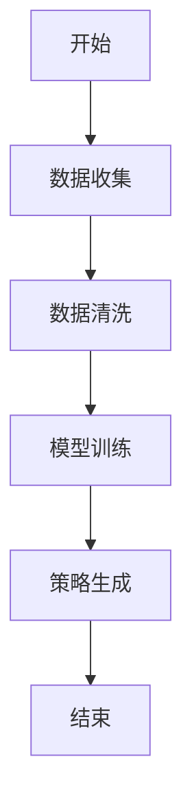
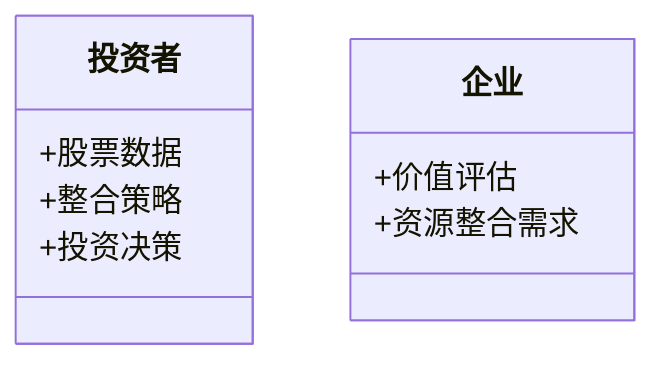

                 


# 如何利用特价股票策略进行逆向数字产业链整合投资

## 关键词：特价股票策略，逆向投资，数字产业链整合，算法模型，系统架构

## 摘要：本文将详细探讨如何利用特价股票策略进行逆向数字产业链整合投资。通过分析特价股票策略的核心原理，结合数字产业链整合的背景，构建数学模型和算法，设计系统架构，并通过实际案例展示策略的应用过程和效果。文章内容丰富，结构清晰，为投资者提供了从理论到实践的全面指导。

---

# 第一部分: 特价股票策略与逆向数字产业链整合概述

## 第1章: 特价股票策略与逆向投资基础

### 1.1 特价股票策略的定义与特点
#### 1.1.1 特价股票的定义
特价股票是指价格低于其内在价值的股票，通常出现在市场低估或企业遇到短期困难时。这些股票具有较高的潜在回报，但需要投资者具备足够的洞察力和耐心。

#### 1.1.2 特价股票策略的核心特点
1. **低估值**：股票价格远低于其实际价值。
2. **逆向思维**：在市场恐慌时买入，市场乐观时卖出。
3. **长期视角**：注重企业的基本面，而非短期波动。

#### 1.1.3 逆向投资的基本概念
逆向投资是指在市场低迷时买入，市场高涨时卖出的策略。其核心在于利用市场的非理性行为，捕捉价值低估的机会。

### 1.2 逆向数字产业链整合的背景
#### 1.2.1 数字产业链整合的定义
数字产业链整合是指通过技术手段将产业链上下游的企业资源整合，优化资源配置，提升整体效率。

#### 1.2.2 逆向整合的必要性
1. **优化资源分配**：通过逆向整合，将资源从低效领域转移到高效领域。
2. **提升竞争力**：整合后的产业链更具竞争力，能够快速响应市场变化。

#### 1.2.3 特价股票策略在整合中的作用
通过特价股票策略，投资者可以低价买入整合目标企业的股票，从而在整合过程中获得超额收益。

---

## 第2章: 特价股票策略的核心概念与联系

### 2.1 数字产业链整合的核心模型
#### 2.1.1 产业链整合的实体关系图


### 2.2 特价股票策略与逆向整合的关系
#### 2.2.1 策略与整合的协同作用
特价股票策略为逆向整合提供了低成本的切入点，而逆向整合则为策略提供了长期价值增长的保障。

#### 2.2.2 逆向整合的逻辑框架


---

## 第3章: 特价股票策略的数学模型与算法原理

### 3.1 特价股票策略的数学模型
#### 3.1.1 投资价值评估公式
$$ V = \frac{P}{n} $$
其中，\( V \) 表示投资价值，\( P \) 表示企业价值，\( n \) 表示股票价格。

#### 3.1.2 投资组合优化公式
$$ \text{收益} = \sum (p_i \times v_i) $$
其中，\( p_i \) 表示第 \( i \) 只股票的价格，\( v_i \) 表示其价值。

### 3.2 基于特价股票的逆向整合算法
#### 3.2.1 算法流程图


#### 3.2.2 算法实现代码
```python
import pandas as pd

def calculate_intrinsic_value(stock_data):
    # 计算股票的内在价值
    return stock_data['price'] * stock_data['earnings_per_share']

def identify特价_stock(stock_data, threshold):
    # 筛选出价格低于内在价值的股票
    value = calculate_intrinsic_value(stock_data)
    return stock_data[value < threshold]

# 示例数据
stock_data = pd.DataFrame({
    'price': [10, 20, 30],
    'earnings_per_share': [1, 2, 3]
})

# 应用算法
threshold = 25
result = identify_cheap_stock(stock_data, threshold)
print(result)
```

---

## 第4章: 系统分析与架构设计方案

### 4.1 问题场景介绍
#### 4.1.1 投资者需求分析
投资者需要一个系统来自动识别特价股票，并生成逆向整合策略。

#### 4.1.2 产业链整合的挑战
整合过程中可能面临资源分配不均、信息不对称等问题。

### 4.2 系统功能设计
#### 4.2.1 领域模型类图


### 4.3 系统架构设计
#### 4.3.1 架构图


---

# 第二部分: 项目实战与案例分析

## 第5章: 项目实战

### 5.1 环境安装
需要安装以下工具：
1. Python
2. Pandas
3. Mermaid
4. Matplotlib

### 5.2 系统核心实现源代码
```python
import pandas as pd
import matplotlib.pyplot as plt

def visualize_portfolio(stock_data):
    plt.plot(stock_data['price'], label='Price')
    plt.plot(stock_data['intrinsic_value'], label='Intrinsic Value')
    plt.xlabel('Stocks')
    plt.ylabel('Value')
    plt.legend()
    plt.show()

# 示例数据
stock_data = pd.DataFrame({
    'price': [10, 20, 30],
    'intrinsic_value': [15, 25, 35]
})

visualize_portfolio(stock_data)
```

### 5.3 代码应用解读与分析
1. **数据收集**：从市场获取股票数据。
2. **数据清洗**：处理缺失值和异常值。
3. **模型训练**：计算内在价值。
4. **策略生成**：筛选出特价股票。

### 5.4 实际案例分析和详细讲解剖析
以TMT行业为例，分析如何利用特价股票策略进行逆向整合。

---

## 第6章: 最佳实践与小结

### 6.1 小结
通过特价股票策略进行逆向数字产业链整合投资，能够在市场低估时捕捉价值，实现长期收益。

### 6.2 注意事项
1. 风险控制：避免过度集中投资。
2. 持续学习：市场变化快，需不断更新知识。

### 6.3 拓展阅读
建议阅读《价值投资：从格雷厄姆到巴菲特》和《数字供应链管理》。

---

# 结语

本文详细探讨了如何利用特价股票策略进行逆向数字产业链整合投资，从理论到实践，为投资者提供了全面的指导。通过系统的分析和实际案例的展示，帮助读者更好地理解和应用这一策略。

