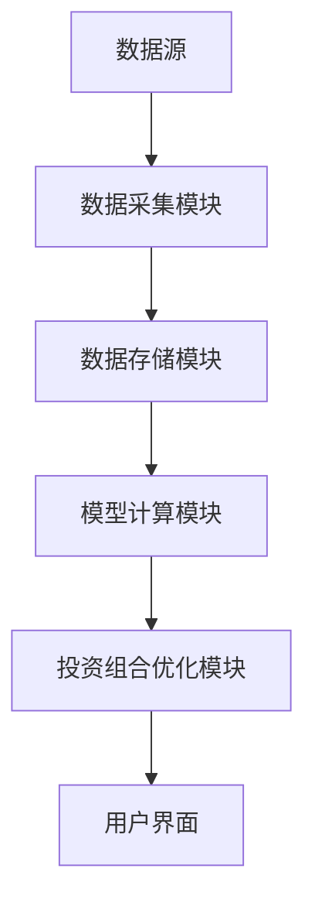
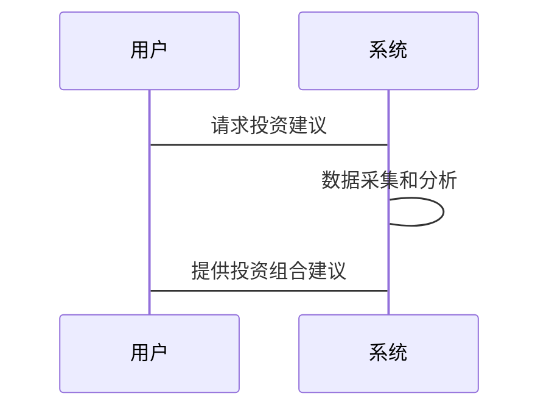

                 


# 如何利用特价股票策略进行逆周期资产配置

**关键词：特价股票、逆周期投资、资产配置、风险管理、数学模型**

**摘要：**  
逆周期投资是一种在经济周期低谷期寻找被低估资产的投资策略。特价股票作为一类价格低于其内在价值的股票，非常适合用于逆周期资产配置。本文将详细探讨如何利用特价股票策略进行逆周期投资，包括策略定义、核心概念、数学模型、系统架构设计、项目实战及最佳实践等内容。

---

# 第一部分: 特价股票策略与逆周期资产配置概述

## 第1章: 特价股票策略的定义与背景

### 1.1 特价股票策略的定义

#### 1.1.1 特价股票的定义
特价股票是指市场价格低于其内在价值的股票。这种股票通常出现在市场低迷或公司短期遇到困难时，但具备长期增长潜力。

#### 1.1.2 特价股票的特征
- 低市盈率（P/E）：市盈率低于行业平均水平。
- 低市净率（P/B）：市净率低于行业平均水平。
- 高股息率：股息率高于行业平均水平。

#### 1.1.3 特价股票与普通股票的区别
| 特性 | 特价股票 | 普通股票 |
|------|----------|----------|
| 市盈率 | 低于行业均值 | 接近或高于行业均值 |
| 市净率 | 低于行业均值 | 接近或高于行业均值 |
| 股息率 | 高于行业均值 | 低于或接近行业均值 |

### 1.2 逆周期资产配置的背景

#### 1.2.1 逆周期投资的定义
逆周期投资是指在经济周期低谷期（如经济衰退或市场下跌）进行投资，以利用市场的低估状态，获取未来收益。

#### 1.2.2 逆周期投资的必要性
- **分散风险**：通过投资抗跌资产降低整体投资组合的波动性。
- **低位布局**：在市场低点买入优质资产，等待市场回升时获利。
- **价值发现**：逆周期投资通常能以更低的价格买入高潜力资产。

#### 1.2.3 逆周期投资与经济周期的关系
经济周期分为四个阶段：繁荣、衰退、萧条和复苏。逆周期投资主要在衰退和萧条阶段进行，以抓住市场低估的机会。

### 1.3 特价股票策略与逆周期投资的结合

#### 1.3.1 特价股票策略在逆周期投资中的作用
- **价值发现**：利用特价股票的低估值特性，寻找被市场忽视的优质公司。
- **分散风险**：通过投资多种特价股票，降低单一股票的风险。

#### 1.3.2 逆周期投资中使用特价股票策略的优势
- **低成本买入**：在市场低迷时，以更低的价格买入优质股票。
- **高收益潜力**：随着市场复苏，特价股票的价值回归带来收益。

#### 1.3.3 特价股票策略在不同经济周期中的应用
| 经济周期阶段 | 特价股票策略应用 |
|--------------|----------------|
| 繁荣期 | 适度配置，避免过度投资 |
| 衰退期 | 增加配置，寻找被低估股票 |
| 萧条期 | 大胆布局，集中投资优质特价股票 |
| 复苏期 | 逐步卖出，锁定收益 |

## 第2章: 特价股票策略的核心概念

### 2.1 特价股票的识别标准

#### 2.1.1 市盈率（P/E）分析
市盈率=股价/每股收益。低市盈率（低于行业均值）通常意味着股票被低估。

#### 2.1.2 市净率（P/B）分析
市净率=股价/每股净资产。低市净率（低于行业均值）通常意味着股票被低估。

#### 2.1.3 股息率分析
股息率=（股息/股价）×100%。高股息率通常意味着股票具有较高的分红能力，且价格可能被低估。

### 2.2 逆周期投资的核心策略

#### 2.2.1 避险资产的选择
在逆周期投资中，选择避险资产（如黄金、债券）作为投资组合的一部分，以降低整体风险。

#### 2.2.2 价值型投资策略
价值型投资策略注重寻找市场价格低于内在价值的股票，适合逆周期投资。

#### 2.2.3 抗跌性股票的筛选
抗跌性股票是指在市场下跌时，跌幅相对较小的股票，通常具有较高的质量和稳定性。

### 2.3 特价股票与逆周期投资的联系

#### 2.3.1 特价股票在经济衰退中的表现
在经济衰退期间，许多优质公司由于市场恐慌被低估，此时是投资特价股票的好时机。

#### 2.3.2 逆周期投资中特价股票的配置比例
建议在经济衰退期间，将投资组合的30%-50%配置为特价股票，其余配置为避险资产。

#### 2.3.3 特价股票策略的风险管理
- **分散投资**：避免过度集中于某一只股票。
- **长期持有**：逆周期投资需要耐心，等待市场复苏。
- **定期调整**：根据市场变化，定期审视投资组合，进行必要的调整。

---

# 第二部分: 特价股票策略的数学模型与算法原理

## 第3章: 特价股票识别的数学模型

### 3.1 特价股票识别的指标体系

#### 3.1.1 市盈率模型
$$ P/E = \frac{\text{股价}}{\text{每股收益}} $$

#### 3.1.2 市净率模型
$$ P/B = \frac{\text{股价}}{\text{每股净资产}} $$

#### 3.1.3 股息率模型
$$ \text{股息率} = \frac{\text{股息}}{\text{股价}} \times 100\% $$

### 3.2 特价股票识别的综合评估模型

#### 3.2.1 综合评分模型
$$ \text{综合评分} = 0.4 \times (1/\text{P/E}) + 0.3 \times (1/\text{P/B}) + 0.3 \times \text{股息率} $$

#### 3.2.2 多因素回归模型
$$ \text{股价} = \beta_0 + \beta_1 \times \text{P/E} + \beta_2 \times \text{P/B} + \beta_3 \times \text{股息率} + \epsilon $$

#### 3.2.3 聚类分析模型
使用K-means算法将股票分为几类，选择聚类中心附近的低价股票作为特价股票。

### 3.3 特价股票识别的算法实现

```python
import pandas as pd
import numpy as np

def identify_penny_stocks(data, threshold):
    # 计算市盈率、市净率和股息率
    data['PE'] = data['股价'] / data['每股收益']
    data['PB'] = data['股价'] / data['每股净资产']
    data['股息率'] = (data['股息'] / data['股价']) * 100
    
    # 筛选低于阈值的股票
    data['是否特价股票'] = (data['PE'] < threshold['PE']) & (data['PB'] < threshold['PB']) & (data['股息率'] > threshold['股息率'])
    
    return data[data['是否特价股票']]
```

---

## 第4章: 逆周期投资策略的算法原理

### 4.1 逆周期投资策略的算法流程

#### 4.1.1 数据收集与预处理
- 收集历史价格、财务数据和市场指标。
- 去除缺失值和异常值。

#### 4.1.2 策略筛选
- 使用数学模型筛选特价股票。
- 确定投资组合的配置比例。

#### 4.1.3 风险管理
- 设置止损点。
- 定期重新平衡投资组合。

### 4.2 逆周期投资策略的数学模型

#### 4.2.1 投资组合优化模型
$$ \text{收益} = \sum_{i=1}^{n} w_i \times r_i $$
$$ \text{风险} = \sum_{i=1}^{n} \sum_{j=1}^{n} w_i w_j \sigma_i \sigma_j $$

其中，\( w_i \) 是第i只股票的权重，\( r_i \) 是第i只股票的预期收益率，\( \sigma_i \) 是第i只股票的收益率标准差。

#### 4.2.2 风险调整后的收益模型
$$ \text{夏普比率} = \frac{\text{收益} - \text{无风险利率}}{\text{收益标准差}} $$

---

# 第三部分: 系统分析与架构设计

## 第5章: 逆周期投资系统架构设计

### 5.1 项目介绍
开发一个基于特价股票策略的逆周期投资系统，帮助投资者在经济衰退期进行资产配置。

### 5.2 系统功能设计

#### 5.2.1 数据采集模块
- 从金融数据源获取股票数据。
- 数据清洗和预处理。

#### 5.2.2 模型计算模块
- 计算市盈率、市净率和股息率。
- 筛选特价股票。

#### 5.2.3 投资组合优化模块
- 确定投资组合的配置比例。
- 生成投资建议。

### 5.3 系统架构设计



### 5.4 接口设计
- 数据接口：与金融数据源对接。
- 用户接口：提供数据可视化和投资建议。

### 5.5 交互流程



---

## 第6章: 项目实战

### 6.1 环境安装
- 安装Python和必要的库（如Pandas、NumPy、Plotly）。

### 6.2 核心代码实现

```python
import pandas as pd
import numpy as np

# 数据加载
data = pd.read_csv('股票数据.csv')

# 筛选特价股票
threshold = {'PE': 15, 'PB': 2, '股息率': 5}
selected_stocks = identify_penny_stocks(data, threshold)

# 投资组合优化
selected_stocks.to_csv('特价股票列表.csv', index=False)
```

### 6.3 案例分析
分析2020年新冠疫情后的市场，筛选特价股票并配置投资组合，验证策略的有效性。

### 6.4 项目小结
总结项目实现的关键点和遇到的问题，提出改进建议。

---

## 第7章: 最佳实践

### 7.1 小结
总结全文，强调特价股票策略在逆周期投资中的重要性。

### 7.2 注意事项
- 避免过度集中投资。
- 定期审视和调整投资组合。
- 保持长期投资心态。

### 7.3 拓展阅读
推荐相关书籍和资源，供读者深入学习。

---

# 第四部分: 结语

逆周期投资是一种长期有效的策略，而特价股票策略为其提供了有力的工具。通过科学的数学模型和系统架构设计，投资者可以更好地识别特价股票，优化投资组合，实现稳健的收益。希望本文能为读者在逆周期投资中提供有价值的指导。

---

通过以上步骤，我们可以系统地了解和应用特价股票策略进行逆周期资产配置，从而在经济低迷时期抓住投资机会，实现财富增长。

